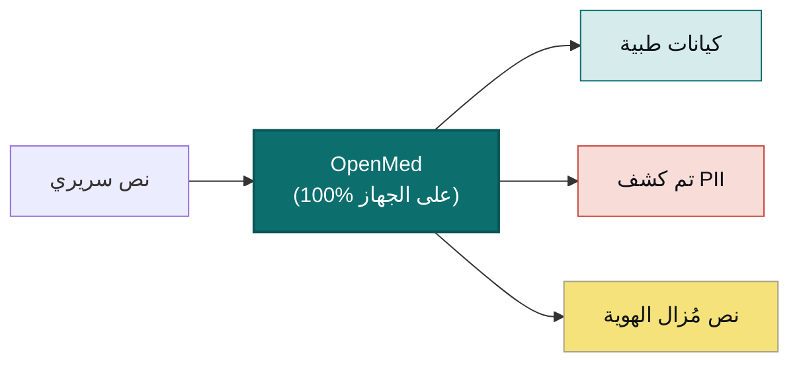

<div align="center">


<h3>بياناتك. نموذجك. عتادك.</h3>

<p><b>حوِّل النص السريري إلى رؤى منظَّمة ومجرَّدة من الهوية، دون رفع أي شيء.</b><br/>
يستخرج OpenMed الكيانات الطبية الحيوية ويزيل أكثر من 55 نوعًا من معرّفات الهوية الشخصية (PHI) بالكامل على العتاد الذي تتحكم به، بحيث لا تغادر بياناتك الجهاز أبدًا. وتعمل النماذج المفتوحة نفسها، وعددها أكثر من 2,000 نموذج، من الهاتف إلى خادم GPU، دون اتصال بالكامل: على iOS وiPadOS عبر OpenMedKit، وعلى Android عبر ONNX، وعلى معالجات CPU العادية، وApple Silicon، وبطاقات NVIDIA GPU، وفي المتصفح. بدون سحابة. بدون ارتباط بمورّد. وبدون خروج بيانات المريض من شبكتك.</p>

<p>
  <a href="https://pypi.org/project/openmed/"></a>
  <a href="https://www.python.org/downloads/"></a>
  <a href="https://huggingface.co/OpenMed"></a>
  <a href="https://arxiv.org/abs/2508.01630"></a>
  <a href="LICENSE"></a>
  <a href="https://github.com/maziyarpanahi/openmed/stargazers"></a>
</p>

<p>
  <a href="swift/OpenMedKit"></a>
  <a href="docs/mlx-backend.md"></a>
  <a href="docs/swift-openmedkit.md"></a>
  <a href="https://openmed.life/docs"></a>
</p>

<p>
  <b>2,000+ نموذج</b> &nbsp;·&nbsp; <b>15 لغة PII</b> &nbsp;·&nbsp; <b>600+ نقطة تحقق PII</b> &nbsp;·&nbsp; <b>100% على الجهاز</b> &nbsp;·&nbsp; <b>Apache-2.0</b>
</p>

<p>
  <a href="README.md">English</a> ·
  <a href="README.zh-CN.md">简体中文</a> ·
  <a href="README.es.md">Español</a> ·
  <a href="README.fr.md">Français</a> ·
  <a href="README.de.md">Deutsch</a> ·
  <a href="README.it.md">Italiano</a> ·
  <a href="README.pt.md">Português</a> ·
  <a href="README.nl.md">Nederlands</a> ·
  <b>العربية</b> ·
  <a href="README.hi.md">हिन्दी</a> ·
  <a href="README.te.md">తెలుగు</a> ·
  <a href="README.ja.md">日本語</a> ·
  <a href="README.tr.md">Türkçe</a> ·
  <a href="README.fa.md">فارسی</a>
</p>

</div>

---

<div dir="rtl">

## شاهده أثناء العمل

</div>

<div align="center">
  
  <br/>
  <sub><b>إزالة معرّفات الهوية في الوقت الفعلي</b>: يقوم Nemotron Privacy Filter بإخفاء الأسماء والعناوين والمعرّفات وبيانات الفوترة من تقرير خروج سريري، بالكامل على الجهاز. <i>(جميع القيم المعروضة اصطناعية.)</i></sub>
</div>

---

<div dir="rtl">

## مثال في 30 ثانية

</div>

```python
from openmed import analyze_text

result = analyze_text(
    "Patient started on imatinib for chronic myeloid leukemia.",
    model_name="disease_detection_superclinical",
)

for entity in result.entities:
    print(f"{entity.label:<12} {entity.text:<28} {entity.confidence:.2f}")
# DISEASE      chronic myeloid leukemia     0.98
# DRUG         imatinib                     0.95
```

<div dir="rtl">

نموذج NER سريري حديث يعمل محليًا، بدون مفتاح API، وبدون أي اتصال شبكي.

</div>

---

<div dir="rtl">

## لماذا OpenMed؟

|                                       |       **OpenMed**        |  واجهات برمجة طبية سحابية  |
| ------------------------------------- | :----------------------: | :-----------------------: |
| يعمل على جهازك/خوادمك                  |            ✅            |            ❌             |
| بيانات المريض تغادر شبكتك              |        **أبدًا**         |     تُرسل إلى المورّد       |
| التكلفة                               |  مجاني ومفتوح المصدر      |   تسعير لكل طلب            |
| نماذج طبية متخصصة                      |          2,000+          |          محدودة           |
| اللغات                                |           12+            |          متفاوتة          |
| دون اتصال / معزول (air-gapped)         |            ✅            |            ❌             |
| تسريع Apple Silicon (MLX)             |            ✅            |          غير متاح         |
| تطبيقات iOS / macOS أصلية              |    ✅ عبر OpenMedKit      |            ❌             |
| الارتباط بمورّد                        |    لا يوجد: Apache-2.0   |            نعم            |

- **نماذج متخصصة**: أكثر من 2,000 نموذج طبي حيوي وسريري منتقى، يتفوق كثير منها على الحلول الاحتكارية.
- **إزالة هوية متوافقة مع HIPAA**: جميع معرّفات Safe Harbor الثمانية عشر، ودمج ذكي للكيانات، وبدائل وهمية تحافظ على التنسيق.
- **يعمل في كل مكان**: CPU وCUDA وApple Silicon (MLX)، وبشكل أصلي في تطبيقات iOS/macOS عبر OpenMedKit.
- **نشر بسطر واحد**: واجهة Python، خدمة REST عبر Docker، أو مسارات معالجة دفعية.
- **بدون ارتباط**: Apache-2.0، بنيتك التحتية، بياناتك.

</div>

---

<div dir="rtl">

## على الجهاز، على Apple: Swift وMLX وiOS

صُمِّم OpenMed ليعمل حيث توجد بياناتك بالفعل. على عتاد Apple يتسارع باستخدام **MLX**، ويصل مباشرةً إلى تطبيقات
iPhone وiPad وMac عبر **[OpenMedKit](swift/OpenMedKit)**، بحيث يجري كشف PII والاستخراج السريري دون اتصال
بالكامل، على الجهاز نفسه.

</div>

```swift
// Add OpenMedKit to your app
dependencies: [
    .package(url: "https://github.com/maziyarpanahi/openmed.git", from: "1.9.1"),
]
```

<div dir="rtl">

- **زمن تشغيل MLX** لتصنيف رموز PII، وعائلة Privacy Filter، ومهام zero-shot التجريبية لعائلة GLiNER، مع مسار احتياطي عبر CoreML.
- **اسم نموذج واحد، كل المنصات**: على العتاد غير التابع لـ Apple، تعود أسماء نماذج MLX تلقائيًا إلى نقطة تحقق PyTorch المقابلة.
- **Python على Apple Silicon** أيضًا: `pip install --upgrade "openmed[mlx]"`.

الأدلة: [خلفية MLX](docs/mlx-backend.md) · [OpenMedKit (Swift)](docs/swift-openmedkit.md) · [تصدير CoreML](docs/coreml-export.md)

</div>

---

<div dir="rtl">

## كيف يعمل

</div>



---

<div dir="rtl">

## البدء السريع

</div>

```bash
# Core + Hugging Face runtime (Linux, macOS, Windows; CPU or CUDA)
pip install --upgrade "openmed[hf]"

# Add the REST service
pip install --upgrade "openmed[hf,service]"

# Apple Silicon acceleration (MLX)
pip install --upgrade "openmed[mlx]"
```

<table>
<tr>
<td width="33%" valign="top">

**واجهة Python**

```python
from openmed import analyze_text

analyze_text(
  "Patient received 75mg "
  "clopidogrel for NSTEMI.",
  model_name=
  "pharma_detection_superclinical",
)
```

</td>
<td width="33%" valign="top">

**خدمة REST**

```bash
uvicorn openmed.service.app:app \
  --host 0.0.0.0 --port 8080
```

`GET /health`
`POST /analyze`
`POST /pii/extract`
`POST /pii/deidentify`

</td>
<td width="33%" valign="top">

**دفعي**

```python
from openmed import BatchProcessor

p = BatchProcessor(
  model_name=
  "disease_detection_superclinical",
  group_entities=True,
)
p.process_texts([...])
```

</td>
</tr>
</table>

<div dir="rtl">

**دون اتصال / معزول؟** وجِّه `model_name` (أو `model_id`) إلى دليل محلي، وسيحمّله OpenMed محليًا دون الاتصال بـ Hugging Face Hub:

</div>

```python
from openmed import OpenMedConfig, analyze_text

result = analyze_text(
    "Patient presents with chronic myeloid leukemia and Type 2 diabetes.",
    model_id="./models/OpenMed-NER-DiseaseDetect-SuperClinical-434M",
    config=OpenMedConfig(device="cpu"),
)
```

---

<div dir="rtl">

## النماذج

سجل منتقى من نماذج NER الطبية المتخصصة، تصفّح [الكتالوج الكامل](https://openmed.life/docs/model-registry).

</div>

| النموذج | التخصص | أنواع الكيانات | الحجم |
|---------|--------|----------------|-------|
| `disease_detection_superclinical` | الأمراض والحالات | DISEASE, CONDITION, DIAGNOSIS | 434M |
| `pharma_detection_superclinical`  | الأدوية والعلاجات | DRUG, MEDICATION, TREATMENT   | 434M |
| `pii_superclinical_large`     | PII وإزالة الهوية | NAME, DATE, SSN, PHONE, EMAIL, ADDRESS | 434M |
| `anatomy_detection_electramed`    | التشريح وأجزاء الجسم | ANATOMY, ORGAN, BODY_PART     | 109M |
| `gene_detection_genecorpus`       | الجينات والبروتينات | GENE, PROTEIN                 | 109M |

---

<div dir="rtl">

## الخصوصية: كشف PII وإزالة الهوية

</div>

```python
from openmed import extract_pii, deidentify

text = "Patient: John Doe, DOB: 01/15/1970, SSN: 123-45-6789"

# Extract PII with smart merging (prevents tokenization fragmentation)
result = extract_pii(text, model_name="pii_superclinical_large", use_smart_merging=True)

# De-identify with the method you need
deidentify(text, method="mask")     # [NAME], [DATE]
deidentify(text, method="replace")  # Faker-backed, locale-aware, format-preserving fakes
deidentify(text, method="hash")     # Cryptographic hashing
deidentify(text, method="shift_dates", date_shift_days=180)
```

<div dir="rtl">

- **الدمج الذكي للكيانات** يبقي `01/15/1970` كاملاً بدلاً من تجزئته.
- **تمويه قائم على Faker** مع موفّرين مخصّصين لمعرّفات سريرية (CPF، CNPJ، BSN، NIR، Codice Fiscale، NIE، Aadhaar، Steuer-ID، NPI).
- **HIPAA**: جميع معرّفات Safe Harbor الثمانية عشر، مع عتبات ثقة قابلة للضبط.

[دفتر PII الكامل](examples/notebooks/PII_Detection_Complete_Guide.ipynb) · [الدمج الذكي](docs/pii-smart-merging.md) · [إخفاء الهوية](docs/anonymization.md)

</div>

<details>
<summary><b>عائلة Privacy Filter</b>: ثلاث عائلات نماذج على معمارية OpenAI Privacy Filter</summary>

<br/>

<div dir="rtl">

شِفرة النموذج واحدة (محوّل Sparse-MoE بأسلوب gpt-oss مع انتباه محلي، ورموز sink، وRoPE+YaRN، وتجزئة tiktoken `o200k_base`)؛ تختلف بيانات التدريب فقط. تمرّ جميعها عبر **نفس** واجهة `extract_pii()` / `deidentify()`، يتغيّر فقط الوسيط `model_name=`.

</div>

| المتغيّر | PyTorch (CPU + CUDA) | MLX (Apple Silicon) | MLX 8-bit |
| --- | --- | --- | --- |
| **OpenAI Privacy Filter** | [`openai/privacy-filter`](https://huggingface.co/openai/privacy-filter) | [`OpenMed/privacy-filter-mlx`](https://huggingface.co/OpenMed/privacy-filter-mlx) | [`…-mlx-8bit`](https://huggingface.co/OpenMed/privacy-filter-mlx-8bit) |
| **Nemotron-PII fine-tune** | [`OpenMed/privacy-filter-nemotron`](https://huggingface.co/OpenMed/privacy-filter-nemotron) | [`…-nemotron-mlx`](https://huggingface.co/OpenMed/privacy-filter-nemotron-mlx) | [`…-nemotron-mlx-8bit`](https://huggingface.co/OpenMed/privacy-filter-nemotron-mlx-8bit) |
| **OpenMed Multilingual** | [`OpenMed/privacy-filter-multilingual`](https://huggingface.co/OpenMed/privacy-filter-multilingual) | [`…-multilingual-mlx`](https://huggingface.co/OpenMed/privacy-filter-multilingual-mlx) | [`…-multilingual-mlx-8bit`](https://huggingface.co/OpenMed/privacy-filter-multilingual-mlx-8bit) |

```python
from openmed import extract_pii

text = "Patient Sarah Connor (DOB: 03/15/1985) at MRN 4471882."

extract_pii(text, model_name="openai/privacy-filter")              # PyTorch baseline
extract_pii(text, model_name="OpenMed/privacy-filter-nemotron")    # same code, different weights
extract_pii(text, model_name="OpenMed/privacy-filter-mlx")         # Apple Silicon (MLX)
```

<div dir="rtl">

على المضيفات غير العاملة بـ Apple Silicon، تُستبدل أسماء نماذج MLX تلقائيًا بنقطة تحقق PyTorch المقابلة (مع تحذير لمرة واحدة): اكتب اسم نموذج واحد، وشغّله في أي مكان. راجع [معمارية Privacy Filter وتوجيه الخلفية](docs/anonymization.md#privacy-filter-family).

</div>

</details>

---

<div dir="rtl">

## PII متعدد اللغات (12 لغة)

الاستخراج وإزالة الهوية في `en`، `fr`، `de`، `it`، `es`، `nl`، `hi`، `te`، `pt`، `ar`، `ja` و`tr`، **600+ نقطة تحقق PII** إجمالاً.

</div>

```bash
python -c "from openmed import extract_pii; print([(e.label, e.text) for e in extract_pii('Dr. Pedro Almeida, CPF: 123.456.789-09, email: pedro@hospital.pt', lang='pt').entities])"
```

<details>
<summary>عرض أمثلة لكل لغة (البرتغالية، الهولندية، الهندية، العربية، اليابانية، التركية)</summary>

<br/>

```python
from openmed import extract_pii

portuguese = extract_pii("Paciente: Pedro Almeida, CPF: 123.456.789-09, telefone: +351 912 345 678", lang="pt", use_smart_merging=True)
dutch      = extract_pii("Patiënt: Eva de Vries, BSN: 123456782, telefoon: +31 6 12345678", lang="nl", use_smart_merging=True)
hindi      = extract_pii("रोगी: अनीता शर्मा, फोन: +91 9876543210, पता: नई दिल्ली 110001", lang="hi", use_smart_merging=True)
arabic     = extract_pii("المريضة ليلى حسن، الهاتف +20 10 1234 5678، الرقم القومي 29801011234567.", lang="ar", use_smart_merging=True)
japanese   = extract_pii("患者 佐藤 花子、電話 +81 90 1234 5678、マイナンバー 1234 5678 9012.", lang="ja", use_smart_merging=True)
turkish    = extract_pii("Hasta Ayşe Yılmaz, telefon +90 532 123 45 67, TCKN 10000000146.", lang="tr", use_smart_merging=True)

for r in (portuguese, dutch, hindi, arabic, japanese, turkish):
    print([(e.label, e.text) for e in r.entities])
```

</details>

---

<div dir="rtl">

## REST API

خدمة FastAPI صديقة لـ Docker، مع التحقق من الطلبات، والتحميل المسبق لخط أنابيب مشترك، وأغلفة أخطاء موحّدة.

</div>

```bash
pip install --upgrade "openmed[hf,service]"
uvicorn openmed.service.app:app --host 0.0.0.0 --port 8080

# or with Docker
docker build -t openmed:local .
docker run --rm -p 8080:8080 -e OPENMED_PROFILE=prod openmed:local
```

```bash
curl -X POST http://127.0.0.1:8080/pii/extract \
  -H "Content-Type: application/json" \
  -d '{"text":"Paciente: Maria Garcia, DNI: 12345678Z","lang":"es"}'
```

<div dir="rtl">

راجع [دليل خدمة REST الكامل](docs/rest-service.md).

</div>

---

<div dir="rtl">

## التوثيق

الأدلة الكاملة على **[openmed.life/docs](https://openmed.life/docs/)**.

</div>

| | | |
|---|---|---|
| [البدء](https://openmed.life/docs/) | [تحليل النص](https://openmed.life/docs/analyze-text) | [سجل النماذج](https://openmed.life/docs/model-registry) |
| [دليل كشف PII](examples/notebooks/PII_Detection_Complete_Guide.ipynb) | [إخفاء الهوية](docs/anonymization.md) | [المعالجة الدفعية](https://openmed.life/docs/batch-processing) |
| [ملفات الإعداد](https://openmed.life/docs/profiles) | [خدمة REST](docs/rest-service.md) | [خلفية MLX](docs/mlx-backend.md) |

---

<div dir="rtl">

## تعرّف على التميمة


حارس OpenMed قطة فارسية كثيفة الفرو في هيئة **ابن سينا (Avicenna)** الصغير، الطبيب الفارسي العظيم الذي ظل
كتابه «القانون في الطب» المرجع الطبي القياسي في العالم نحو 600 عام. يحرس كتاب المعرفة الطبية المفتوح، بلوحة
ألوان مستوحاة من **الفيروز الفارسي (fīrūza)**: حارس محلي أولاً لأكثر بياناتك خصوصية.

<br clear="right"/>

</div>

---

<div dir="rtl">

## المساهمة

المساهمات مُرحَّب بها: تقارير الأخطاء وطلبات الميزات وطلبات السحب (PR).

- [افتح مشكلة (issue)](https://github.com/maziyarpanahi/openmed/issues)
- **الترجمات مُرحَّب بها**: ساعد في إكمال ملفات README بلغات أخرى المرتبطة في مبدّل اللغات بالأعلى.

## شكر وتقدير

يعتمد OpenMed على أعمال مفتوحة المصدر ممتازة: شكر خاص لـ **OpenAI** (معمارية [Privacy Filter](https://huggingface.co/openai/privacy-filter))، و**NVIDIA** (مجموعة بيانات [Nemotron PII](https://huggingface.co/datasets/nvidia/Nemotron-PII-v1))، و**Hugging Face** (`transformers` ومنظومة النماذج)، و**Apple** ([MLX](https://github.com/ml-explore/mlx))، ومشرفي **[Faker](https://faker.readthedocs.io/)**.

## الترخيص

صادر بموجب [ترخيص Apache-2.0](LICENSE).

## الاستشهاد

إذا كان OpenMed مفيدًا في بحثك، فيرجى الاستشهاد به:

</div>

```bibtex
@misc{panahi2025openmedneropensourcedomainadapted,
      title={OpenMed NER: Open-Source, Domain-Adapted State-of-the-Art Transformers for Biomedical NER Across 12 Public Datasets},
      author={Maziyar Panahi},
      year={2025},
      eprint={2508.01630},
      archivePrefix={arXiv},
      primaryClass={cs.CL},
      url={https://arxiv.org/abs/2508.01630},
}
```

---

<div dir="rtl">

## سجل النجوم

إذا كان OpenMed مفيدًا لك، فإن نجمة تساعد الآخرين على اكتشافه.

</div>

<a href="https://star-history.com/#maziyarpanahi/openmed&Date">
  
</a>

---

<div align="center">

صُنع بواسطة فريق OpenMed

<a href="https://openmed.life">الموقع</a> ·
<a href="https://openmed.life/docs">التوثيق</a> ·
<a href="https://x.com/openmed_ai">X / تويتر</a> ·
<a href="https://www.linkedin.com/company/openmed-ai/">LinkedIn</a>

</div>
