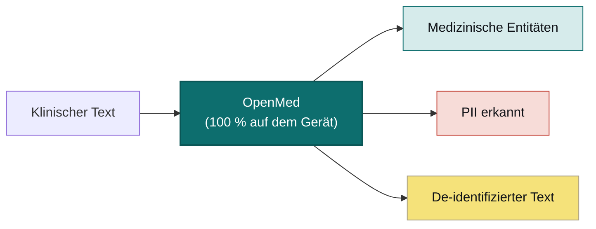

<div align="center">


<h3>Deine Daten. Dein Modell. Deine Hardware.</h3>

<p><b>Verwandeln Sie klinischen Text in strukturierte, de-identifizierte Erkenntnisse – ohne dass etwas hochgeladen wird.</b><br/>
OpenMed extrahiert biomedizinische Entitäten und entfernt über 55 PHI-Typen vollständig auf der von Ihnen kontrollierten Hardware, sodass Ihre Daten das Gerät niemals verlassen. Dieselben 2.000+ offenen Modelle laufen vom Smartphone bis zum GPU-Server, vollständig offline – iOS und iPadOS über OpenMedKit, Android über ONNX, gewöhnliche CPUs, Apple Silicon, NVIDIA GPUs und der Browser. Keine Cloud. Kein Vendor-Lock-in. Keine Patientendaten, die Ihr Netzwerk verlassen.</p>

<p>
  <a href="https://pypi.org/project/openmed/"></a>
  <a href="https://www.python.org/downloads/"></a>
  <a href="https://huggingface.co/OpenMed"></a>
  <a href="https://arxiv.org/abs/2508.01630"></a>
  <a href="LICENSE"></a>
  <a href="https://github.com/maziyarpanahi/openmed/stargazers"></a>
</p>

<p>
  <a href="swift/OpenMedKit"></a>
  <a href="docs/mlx-backend.md"></a>
  <a href="docs/swift-openmedkit.md"></a>
  <a href="https://openmed.life/docs"></a>
</p>

<p>
  <b>2.000+ Modelle</b> &nbsp;·&nbsp; <b>15 PII-Sprachen</b> &nbsp;·&nbsp; <b>600+ PII-Checkpoints</b> &nbsp;·&nbsp; <b>100 % auf dem Gerät</b> &nbsp;·&nbsp; <b>Apache-2.0</b>
</p>

<p>
  <a href="README.md">English</a> ·
  <a href="README.zh-CN.md">简体中文</a> ·
  <a href="README.es.md">Español</a> ·
  <a href="README.fr.md">Français</a> ·
  <b>Deutsch</b> ·
  <a href="README.it.md">Italiano</a> ·
  <a href="README.pt.md">Português</a> ·
  <a href="README.nl.md">Nederlands</a> ·
  <a href="README.ar.md">العربية</a> ·
  <a href="README.hi.md">हिन्दी</a> ·
  <a href="README.te.md">తెలుగు</a> ·
  <a href="README.ja.md">日本語</a> ·
  <a href="README.tr.md">Türkçe</a> ·
  <a href="README.fa.md">فارسی</a>
</p>

</div>

---

## In Aktion

<div align="center">
  
  <br/>
  <sub><b>PII-De-Identifikation in Echtzeit</b>: Der Nemotron Privacy Filter schwärzt Namen, Adressen, IDs und Abrechnungsdaten aus einem klinischen Entlassungsbericht, vollständig auf dem Gerät. <i>(Alle gezeigten Werte sind synthetisch.)</i></sub>
</div>

---

## Beispiel in 30 Sekunden

```python
from openmed import analyze_text

result = analyze_text(
    "Patient started on imatinib for chronic myeloid leukemia.",
    model_name="disease_detection_superclinical",
)

for entity in result.entities:
    print(f"{entity.label:<12} {entity.text:<28} {entity.confidence:.2f}")
# DISEASE      chronic myeloid leukemia     0.98
# DRUG         imatinib                     0.95
```

Ein hochmodernes klinisches NER-Modell, das lokal läuft: kein API-Schlüssel, kein Netzwerkaufruf.

---

## Warum OpenMed?

|                                       |       **OpenMed**        |    Cloud-Medizin-APIs     |
| ------------------------------------- | :----------------------: | :-----------------------: |
| Läuft auf deinem Gerät/deinen Servern |            ✅            |            ❌             |
| Patientendaten verlassen dein Netzwerk |        **Nie**          |  An den Anbieter gesendet  |
| Kosten                                |  Kostenlos & Open Source |   Abrechnung pro Aufruf    |
| Spezialisierte medizinische Modelle   |          2.000+          |          Begrenzt         |
| Sprachen                              |           12+            |       Unterschiedlich     |
| Offline / air-gapped                  |            ✅            |            ❌             |
| Apple-Silicon-Beschleunigung (MLX)    |            ✅            |             ❌             |
| Native iOS-/macOS-Apps                |    ✅ via OpenMedKit     |            ❌             |
| Anbieterbindung                       |    Keine, Apache-2.0    |            Ja             |

- **Spezialisierte Modelle**: über 2.000 kuratierte biomedizinische und klinische Modelle, von denen viele proprietäre Lösungen übertreffen.
- **HIPAA-konforme De-Identifikation**: alle 18 Safe-Harbor-Identifikatoren, intelligentes Entity-Merging und formaterhaltende Fake-Ersetzungen.
- **Läuft überall**: CPU, CUDA, Apple Silicon (MLX) und nativ in iOS-/macOS-Apps via OpenMedKit.
- **Bereitstellung in einer Zeile**: Python-API, dockerisierter REST-Dienst oder Batch-Pipelines.
- **Keine Bindung**: Apache-2.0, deine Infrastruktur, deine Daten.

---

## Auf dem Gerät, auf Apple: Swift, MLX & iOS

OpenMed ist dafür gebaut, dort zu laufen, wo deine Daten bereits leben. Auf Apple-Hardware beschleunigt es mit
**MLX** und gelangt über **[OpenMedKit](swift/OpenMedKit)** direkt in iPhone-, iPad- und Mac-Apps, sodass
PII-Erkennung und klinische Extraktion vollständig offline, auf dem Gerät, stattfinden.

```swift
// Add OpenMedKit to your app
dependencies: [
    .package(url: "https://github.com/maziyarpanahi/openmed.git", branch: "master"),
]
```

- **MLX-Runtime** für PII-Token-Klassifikation, die Privacy-Filter-Familie und experimentelle Zero-Shot-Aufgaben der GLiNER-Familie, mit CoreML-Fallback.
- **Ein Modellname, jede Plattform**: Auf Nicht-Apple-Hardware greifen MLX-Modellnamen automatisch auf den passenden PyTorch-Checkpoint zurück.
- **Python auf Apple Silicon** ebenfalls: `pip install --upgrade "openmed[mlx]"`.

Anleitungen: [MLX-Backend](docs/mlx-backend.md) · [OpenMedKit (Swift)](docs/swift-openmedkit.md) · [CoreML-Export](docs/coreml-export.md)

---

## So funktioniert es



---

## Schnellstart

```bash
# Core + Hugging Face runtime (Linux, macOS, Windows; CPU or CUDA)
pip install --upgrade "openmed[hf]"

# Add the REST service
pip install --upgrade "openmed[hf,service]"

# Apple Silicon acceleration (MLX)
pip install --upgrade "openmed[mlx]"
```

<table>
<tr>
<td width="33%" valign="top">

**Python-API**

```python
from openmed import analyze_text

analyze_text(
  "Patient received 75mg "
  "clopidogrel for NSTEMI.",
  model_name=
  "pharma_detection_superclinical",
)
```

</td>
<td width="33%" valign="top">

**REST-Dienst**

```bash
uvicorn openmed.service.app:app \
  --host 0.0.0.0 --port 8080
```

`GET /health`
`POST /analyze`
`POST /pii/extract`
`POST /pii/deidentify`

</td>
<td width="33%" valign="top">

**Batch**

```python
from openmed import BatchProcessor

p = BatchProcessor(
  model_name=
  "disease_detection_superclinical",
  group_entities=True,
)
p.process_texts([...])
```

</td>
</tr>
</table>

**Offline / air-gapped?** Verweise `model_name` (oder `model_id`) auf ein lokales Verzeichnis, und OpenMed lädt es, ohne den Hugging Face Hub zu kontaktieren:

```python
from openmed import OpenMedConfig, analyze_text

result = analyze_text(
    "Patient presents with chronic myeloid leukemia and Type 2 diabetes.",
    model_id="./models/OpenMed-NER-DiseaseDetect-SuperClinical-434M",
    config=OpenMedConfig(device="cpu"),
)
```

---

## Modelle

Ein kuratiertes Registry spezialisierter medizinischer NER-Modelle. Durchstöbere den [vollständigen Katalog](https://openmed.life/docs/model-registry).

| Modell | Spezialisierung | Entitätstypen | Größe |
|--------|-----------------|---------------|-------|
| `disease_detection_superclinical` | Krankheiten & Befunde | DISEASE, CONDITION, DIAGNOSIS | 434M |
| `pharma_detection_superclinical`  | Arzneimittel & Medikation | DRUG, MEDICATION, TREATMENT   | 434M |
| `pii_superclinical_large`     | PII & De-Identifikation | NAME, DATE, SSN, PHONE, EMAIL, ADDRESS | 434M |
| `anatomy_detection_electramed`    | Anatomie & Körperteile | ANATOMY, ORGAN, BODY_PART     | 109M |
| `gene_detection_genecorpus`       | Gene & Proteine | GENE, PROTEIN                 | 109M |

---

## Datenschutz: PII-Erkennung & De-Identifikation

```python
from openmed import extract_pii, deidentify

text = "Patient: John Doe, DOB: 01/15/1970, SSN: 123-45-6789"

# Extract PII with smart merging (prevents tokenization fragmentation)
result = extract_pii(text, model_name="pii_superclinical_large", use_smart_merging=True)

# De-identify with the method you need
deidentify(text, method="mask")     # [NAME], [DATE]
deidentify(text, method="replace")  # Faker-backed, locale-aware, format-preserving fakes
deidentify(text, method="hash")     # Cryptographic hashing
deidentify(text, method="shift_dates", date_shift_days=180)
```

- **Intelligentes Entity-Merging** hält `01/15/1970` zusammen, statt es zu fragmentieren.
- **Faker-basierte Verschleierung** mit benutzerdefinierten Anbietern für klinische IDs (CPF, CNPJ, BSN, NIR, Codice Fiscale, NIE, Aadhaar, Steuer-ID, NPI).
- **HIPAA**: alle 18 Safe-Harbor-Identifikatoren, mit konfigurierbaren Konfidenzschwellen.

[Vollständiges PII-Notebook](examples/notebooks/PII_Detection_Complete_Guide.ipynb) · [Intelligentes Merging](docs/pii-smart-merging.md) · [Anonymisierung](docs/anonymization.md)

<details>
<summary><b>Privacy-Filter-Familie</b>: drei Modellfamilien auf der OpenAI-Privacy-Filter-Architektur</summary>

<br/>

Der Modellcode ist identisch (gpt-oss-artiger Sparse-MoE-Transformer mit lokaler Attention, Sink-Tokens, RoPE+YaRN, tiktoken-`o200k_base`-Tokenisierung); nur die Trainingsdaten unterscheiden sich. Alle nutzen **dieselbe** `extract_pii()` / `deidentify()`-API, nur das Argument `model_name=` ändert sich.

| Variante | PyTorch (CPU + CUDA) | MLX (Apple Silicon) | MLX 8-bit |
| --- | --- | --- | --- |
| **OpenAI Privacy Filter** | [`openai/privacy-filter`](https://huggingface.co/openai/privacy-filter) | [`OpenMed/privacy-filter-mlx`](https://huggingface.co/OpenMed/privacy-filter-mlx) | [`…-mlx-8bit`](https://huggingface.co/OpenMed/privacy-filter-mlx-8bit) |
| **Nemotron-PII fine-tune** | [`OpenMed/privacy-filter-nemotron`](https://huggingface.co/OpenMed/privacy-filter-nemotron) | [`…-nemotron-mlx`](https://huggingface.co/OpenMed/privacy-filter-nemotron-mlx) | [`…-nemotron-mlx-8bit`](https://huggingface.co/OpenMed/privacy-filter-nemotron-mlx-8bit) |
| **OpenMed Multilingual** | [`OpenMed/privacy-filter-multilingual`](https://huggingface.co/OpenMed/privacy-filter-multilingual) | [`…-multilingual-mlx`](https://huggingface.co/OpenMed/privacy-filter-multilingual-mlx) | [`…-multilingual-mlx-8bit`](https://huggingface.co/OpenMed/privacy-filter-multilingual-mlx-8bit) |

```python
from openmed import extract_pii

text = "Patient Sarah Connor (DOB: 03/15/1985) at MRN 4471882."

extract_pii(text, model_name="openai/privacy-filter")              # PyTorch baseline
extract_pii(text, model_name="OpenMed/privacy-filter-nemotron")    # same code, different weights
extract_pii(text, model_name="OpenMed/privacy-filter-mlx")         # Apple Silicon (MLX)
```

Auf Nicht-Apple-Silicon-Hosts werden MLX-Modellnamen automatisch durch den passenden PyTorch-Checkpoint ersetzt (mit einer einmaligen Warnung). Schreibe einen Modellnamen, führe ihn überall aus. Siehe [Privacy-Filter-Architektur & Backend-Routing](docs/anonymization.md#privacy-filter-family).

</details>

---

## Mehrsprachige PII (12 Sprachen)

Extraktion und De-Identifikation in `en`, `fr`, `de`, `it`, `es`, `nl`, `hi`, `te`, `pt`, `ar`, `ja` und `tr`, insgesamt **600+ PII-Checkpoints**.

```bash
python -c "from openmed import extract_pii; print([(e.label, e.text) for e in extract_pii('Dr. Pedro Almeida, CPF: 123.456.789-09, email: pedro@hospital.pt', lang='pt').entities])"
```

<details>
<summary>Beispiele pro Sprache anzeigen (Portugiesisch, Niederländisch, Hindi, Arabisch, Japanisch, Türkisch)</summary>

<br/>

```python
from openmed import extract_pii

portuguese = extract_pii("Paciente: Pedro Almeida, CPF: 123.456.789-09, telefone: +351 912 345 678", lang="pt", use_smart_merging=True)
dutch      = extract_pii("Patiënt: Eva de Vries, BSN: 123456782, telefoon: +31 6 12345678", lang="nl", use_smart_merging=True)
hindi      = extract_pii("रोगी: अनीता शर्मा, फोन: +91 9876543210, पता: नई दिल्ली 110001", lang="hi", use_smart_merging=True)
arabic     = extract_pii("المريضة ليلى حسن، الهاتف +20 10 1234 5678، الرقم القومي 29801011234567.", lang="ar", use_smart_merging=True)
japanese   = extract_pii("患者 佐藤 花子、電話 +81 90 1234 5678、マイナンバー 1234 5678 9012.", lang="ja", use_smart_merging=True)
turkish    = extract_pii("Hasta Ayşe Yılmaz, telefon +90 532 123 45 67, TCKN 10000000146.", lang="tr", use_smart_merging=True)

for r in (portuguese, dutch, hindi, arabic, japanese, turkish):
    print([(e.label, e.text) for e in r.entities])
```

</details>

---

## REST-API

Ein Docker-freundlicher FastAPI-Dienst mit Request-Validierung, gemeinsamem Pipeline-Preload und einheitlichen Fehler-Envelopes.

```bash
pip install --upgrade "openmed[hf,service]"
uvicorn openmed.service.app:app --host 0.0.0.0 --port 8080

# or with Docker
docker build -t openmed:local .
docker run --rm -p 8080:8080 -e OPENMED_PROFILE=prod openmed:local
```

```bash
curl -X POST http://127.0.0.1:8080/pii/extract \
  -H "Content-Type: application/json" \
  -d '{"text":"Paciente: Maria Garcia, DNI: 12345678Z","lang":"es"}'
```

Siehe die vollständige [REST-Dienst-Anleitung](docs/rest-service.md).

---

## Dokumentation

Vollständige Anleitungen unter **[openmed.life/docs](https://openmed.life/docs/)**.

| | | |
|---|---|---|
| [Erste Schritte](https://openmed.life/docs/) | [Text analysieren](https://openmed.life/docs/analyze-text) | [Modell-Registry](https://openmed.life/docs/model-registry) |
| [PII-Erkennungsleitfaden](examples/notebooks/PII_Detection_Complete_Guide.ipynb) | [Anonymisierung](docs/anonymization.md) | [Batch-Verarbeitung](https://openmed.life/docs/batch-processing) |
| [Konfigurationsprofile](https://openmed.life/docs/profiles) | [REST-Dienst](docs/rest-service.md) | [MLX-Backend](docs/mlx-backend.md) |

---

## Lerne unser Maskottchen kennen


Der Wächter von OpenMed ist eine flauschige Perserkatze, gestaltet als kleiner **Avicenna (Ibn Sina)**, der
große persische Arzt, dessen *Kanon der Medizin* rund 600 Jahre lang das medizinische Standardwerk der Welt war.
Er wacht über das aufgeschlagene Buch des medizinischen Wissens, in einer Palette rund um **persisches Türkis
(fīrūza)**: ein Local-First-Wächter für deine privatesten Daten.

<br clear="left"/>

---

## Mitwirken

Beiträge willkommen: Bug-Reports, Feature-Wünsche und PRs.

- [Ein Issue eröffnen](https://github.com/maziyarpanahi/openmed/issues)
- **Übersetzungen willkommen**: Hilf mit, die README in anderen Sprachen zu vervollständigen, die oben im Sprachumschalter verlinkt sind.

---

## Danksagung

OpenMed baut auf hervorragender Open-Source-Arbeit auf. Besonderer Dank an **OpenAI** (die [Privacy-Filter](https://huggingface.co/openai/privacy-filter)-Architektur), **NVIDIA** (den [Nemotron-PII-Datensatz](https://huggingface.co/datasets/nvidia/Nemotron-PII-v1)), **Hugging Face** (`transformers` und das Modell-Ökosystem), **Apple** ([MLX](https://github.com/ml-explore/mlx)) und die Maintainer von **[Faker](https://faker.readthedocs.io/)**.

## Lizenz

Veröffentlicht unter der [Apache-2.0-Lizenz](LICENSE).

## Zitation

Wenn OpenMed für deine Forschung nützlich ist, zitiere es bitte:

```bibtex
@misc{panahi2025openmedneropensourcedomainadapted,
      title={OpenMed NER: Open-Source, Domain-Adapted State-of-the-Art Transformers for Biomedical NER Across 12 Public Datasets},
      author={Maziyar Panahi},
      year={2025},
      eprint={2508.01630},
      archivePrefix={arXiv},
      primaryClass={cs.CL},
      url={https://arxiv.org/abs/2508.01630},
}
```

---

## Stern-Verlauf

Wenn OpenMed dir nützlich ist, hilft ein Stern anderen, es zu entdecken.

<a href="https://star-history.com/#maziyarpanahi/openmed&Date">
  
</a>

---

<div align="center">

Erstellt vom OpenMed-Team

<a href="https://openmed.life">Website</a> ·
<a href="https://openmed.life/docs">Dokumentation</a> ·
<a href="https://x.com/openmed_ai">X / Twitter</a> ·
<a href="https://www.linkedin.com/company/openmed-ai/">LinkedIn</a>

</div>
