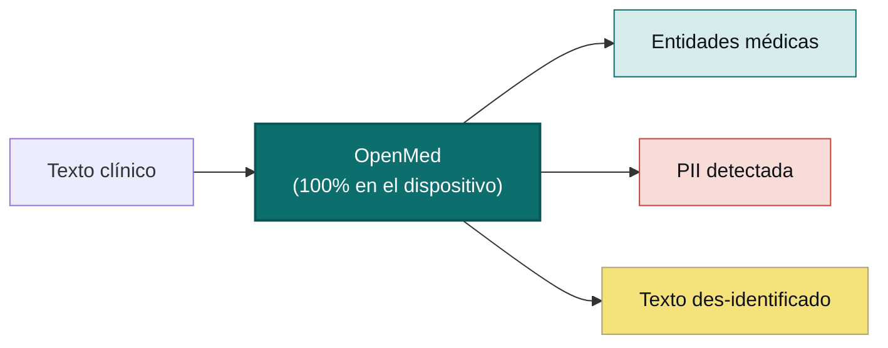

<div align="center">


<h3>IA sanitaria local que nunca abandona tu dispositivo</h3>

<p><b>Convierte texto clínico en información estructurada con una sola línea de código.</b><br/>
Extracción de entidades, des-identificación de PII y más de 1.000 modelos médicos especializados que se
ejecutan íntegramente en tu propio hardware — desde una línea en Python hasta una app nativa de Swift en el
iPhone, impulsada por Apple MLX. Sin nube. Sin dependencia de proveedores. Sin que los datos del paciente salgan de tu red.</p>

<p>
  <a href="https://pypi.org/project/openmed/"></a>
  <a href="https://www.python.org/downloads/"></a>
  <a href="https://huggingface.co/OpenMed"></a>
  <a href="https://arxiv.org/abs/2508.01630"></a>
  <a href="LICENSE"></a>
  <a href="https://github.com/maziyarpanahi/openmed/stargazers"></a>
</p>

<p>
  <a href="swift/OpenMedKit"></a>
  <a href="docs/mlx-backend.md"></a>
  <a href="docs/swift-openmedkit.md"></a>
  <a href="https://openmed.life/docs"></a>
</p>

<p>
  <b>1.000+ modelos</b> &nbsp;·&nbsp; <b>12 idiomas</b> &nbsp;·&nbsp; <b>247 checkpoints de PII</b> &nbsp;·&nbsp; <b>100% en el dispositivo</b> &nbsp;·&nbsp; <b>Apache-2.0</b>
</p>

<p>
  <a href="README.md">English</a> ·
  <a href="README.zh-CN.md">简体中文</a> ·
  <b>Español</b> ·
  <a href="README.fr.md">Français</a> ·
  <a href="README.de.md">Deutsch</a> ·
  <a href="README.it.md">Italiano</a> ·
  <a href="README.pt.md">Português</a> ·
  <a href="README.nl.md">Nederlands</a> ·
  <a href="README.ar.md">العربية</a> ·
  <a href="README.hi.md">हिन्दी</a> ·
  <a href="README.te.md">తెలుగు</a> ·
  <a href="README.ja.md">日本語</a> ·
  <a href="README.tr.md">Türkçe</a> ·
  <a href="README.fa.md">فارسی</a>
</p>

</div>

---

## Míralo en acción

<div align="center">
  
  <br/>
  <sub><b>Des-identificación de PII en tiempo real</b> — el Privacy Filter Nemotron oculta nombres, direcciones, identificadores y datos de facturación de un informe de alta clínica, completamente en el dispositivo. <i>(Todos los valores mostrados son sintéticos.)</i></sub>
</div>

---

## Ejemplo en 30 segundos

```python
from openmed import analyze_text

result = analyze_text(
    "Patient started on imatinib for chronic myeloid leukemia.",
    model_name="disease_detection_superclinical",
)

for entity in result.entities:
    print(f"{entity.label:<12} {entity.text:<28} {entity.confidence:.2f}")
# DISEASE      chronic myeloid leukemia     0.98
# DRUG         imatinib                     0.95
```

Un modelo de NER clínico de última generación ejecutándose localmente — sin clave de API, sin llamadas de red.

---

## ¿Por qué OpenMed?

|                                       |       **OpenMed**        |  APIs médicas en la nube  |
| ------------------------------------- | :----------------------: | :-----------------------: |
| Se ejecuta en tu dispositivo/servidores |          ✅            |            ❌             |
| Los datos del paciente salen de tu red  |       **Nunca**        |    Se envían al proveedor  |
| Coste                                 |   Gratis y de código abierto |     Pago por llamada    |
| Modelos médicos especializados        |          1.000+          |         Limitados         |
| Idiomas                               |           12+            |          Variable         |
| Sin conexión / aislado (air-gapped)   |            ✅            |            ❌             |
| Aceleración Apple Silicon (MLX)       |            ✅            |            n/d            |
| Apps nativas de iOS / macOS           |    ✅ con OpenMedKit     |            ❌             |
| Dependencia de proveedor              |   Ninguna — Apache-2.0   |            Sí             |

- **Modelos especializados** — más de 1.000 modelos biomédicos y clínicos seleccionados, muchos de ellos superan a las soluciones propietarias.
- **Des-identificación conforme a HIPAA** — los 18 identificadores de Safe Harbor, fusión inteligente de entidades y sustitutos ficticios que conservan el formato.
- **Se ejecuta en todas partes** — CPU, CUDA, Apple Silicon (MLX) y de forma nativa en apps de iOS/macOS mediante OpenMedKit.
- **Despliegue en una línea** — API de Python, servicio REST con Docker o pipelines por lotes.
- **Sin ataduras** — Apache-2.0, tu infraestructura, tus datos.

---

## En el dispositivo, en Apple — Swift, MLX e iOS

OpenMed está hecho para ejecutarse allí donde ya viven tus datos. En hardware de Apple se acelera con **MLX**,
y llega directamente a las apps de iPhone, iPad y Mac mediante **[OpenMedKit](swift/OpenMedKit)** — de modo que
la detección de PII y la extracción clínica ocurren totalmente sin conexión, en el propio dispositivo.

```swift
// Add OpenMedKit to your app
dependencies: [
    .package(url: "https://github.com/maziyarpanahi/openmed.git", from: "1.5.2"),
]
```

- **Runtime de MLX** para la clasificación de tokens de PII, la familia Privacy Filter y tareas zero-shot experimentales de la familia GLiNER — con una ruta de respaldo en CoreML.
- **Un nombre de modelo, todas las plataformas** — en hardware que no es de Apple, los nombres de modelo MLX recurren automáticamente al checkpoint de PyTorch correspondiente.
- **Python en Apple Silicon** también: `pip install "openmed[mlx]"`.

Guías: [Backend de MLX](docs/mlx-backend.md) · [OpenMedKit (Swift)](docs/swift-openmedkit.md) · [Exportación a CoreML](docs/coreml-export.md)

---

## Cómo funciona



---

## Inicio rápido

```bash
# Core + Hugging Face runtime (Linux, macOS, Windows; CPU or CUDA)
pip install "openmed[hf]"

# Add the REST service
pip install "openmed[hf,service]"

# Apple Silicon acceleration (MLX)
pip install "openmed[mlx]"
```

<table>
<tr>
<td width="33%" valign="top">

**API de Python**

```python
from openmed import analyze_text

analyze_text(
  "Patient received 75mg "
  "clopidogrel for NSTEMI.",
  model_name=
  "pharma_detection_superclinical",
)
```

</td>
<td width="33%" valign="top">

**Servicio REST**

```bash
uvicorn openmed.service.app:app \
  --host 0.0.0.0 --port 8080
```

`GET /health`
`POST /analyze`
`POST /pii/extract`
`POST /pii/deidentify`

</td>
<td width="33%" valign="top">

**Por lotes**

```python
from openmed import BatchProcessor

p = BatchProcessor(
  model_name=
  "disease_detection_superclinical",
  group_entities=True,
)
p.process_texts([...])
```

</td>
</tr>
</table>

**¿Sin conexión / aislado?** Apunta `model_name` (o `model_id`) a un directorio local y OpenMed lo cargará sin contactar con el Hub de Hugging Face:

```python
from openmed import OpenMedConfig, analyze_text

result = analyze_text(
    "Patient presents with chronic myeloid leukemia and Type 2 diabetes.",
    model_id="./models/OpenMed-NER-DiseaseDetect-SuperClinical-434M",
    config=OpenMedConfig(device="cpu"),
)
```

---

## Modelos

Un registro curado de modelos de NER médico especializados — explora el [catálogo completo](https://openmed.life/docs/model-registry).

| Modelo | Especialización | Tipos de entidad | Tamaño |
|--------|-----------------|------------------|--------|
| `disease_detection_superclinical` | Enfermedades y afecciones | DISEASE, CONDITION, DIAGNOSIS | 434M |
| `pharma_detection_superclinical`  | Fármacos y medicamentos | DRUG, MEDICATION, TREATMENT   | 434M |
| `pii_detection_superclinical`     | PII y des-identificación | NAME, DATE, SSN, PHONE, EMAIL, ADDRESS | 434M |
| `anatomy_detection_electramed`    | Anatomía y partes del cuerpo | ANATOMY, ORGAN, BODY_PART     | 109M |
| `gene_detection_genecorpus`       | Genes y proteínas | GENE, PROTEIN                 | 109M |

---

## Privacidad: detección y des-identificación de PII

```python
from openmed import extract_pii, deidentify

text = "Patient: John Doe, DOB: 01/15/1970, SSN: 123-45-6789"

# Extract PII with smart merging (prevents tokenization fragmentation)
result = extract_pii(text, model_name="pii_detection_superclinical", use_smart_merging=True)

# De-identify with the method you need
deidentify(text, method="mask")     # [NAME], [DATE]
deidentify(text, method="replace")  # Faker-backed, locale-aware, format-preserving fakes
deidentify(text, method="hash")     # Cryptographic hashing
deidentify(text, method="shift_dates", date_shift_days=180)
```

- **La fusión inteligente de entidades** mantiene `01/15/1970` completo en lugar de fragmentarlo.
- **Ofuscación basada en Faker** con proveedores personalizados de identificadores clínicos (CPF, CNPJ, BSN, NIR, Codice Fiscale, NIE, Aadhaar, Steuer-ID, NPI).
- **HIPAA**: los 18 identificadores de Safe Harbor, con umbrales de confianza configurables.

[Cuaderno completo de PII](examples/notebooks/PII_Detection_Complete_Guide.ipynb) · [Fusión inteligente](docs/pii-smart-merging.md) · [Anonimización](docs/anonymization.md)

<details>
<summary><b>Familia Privacy Filter</b> — tres familias de modelos sobre la arquitectura OpenAI Privacy Filter</summary>

<br/>

El código del modelo es el mismo (transformador disperso MoE estilo gpt-oss con atención local, tokens sink, RoPE+YaRN, tokenización tiktoken `o200k_base`); solo cambian los datos de entrenamiento. Todas usan la **misma** API `extract_pii()` / `deidentify()` — solo cambia el argumento `model_name=`.

| Variante | PyTorch (CPU + CUDA) | MLX (Apple Silicon) | MLX 8-bit |
| --- | --- | --- | --- |
| **OpenAI Privacy Filter** | [`openai/privacy-filter`](https://huggingface.co/openai/privacy-filter) | [`OpenMed/privacy-filter-mlx`](https://huggingface.co/OpenMed/privacy-filter-mlx) | [`…-mlx-8bit`](https://huggingface.co/OpenMed/privacy-filter-mlx-8bit) |
| **Nemotron-PII fine-tune** | [`OpenMed/privacy-filter-nemotron`](https://huggingface.co/OpenMed/privacy-filter-nemotron) | [`…-nemotron-mlx`](https://huggingface.co/OpenMed/privacy-filter-nemotron-mlx) | [`…-nemotron-mlx-8bit`](https://huggingface.co/OpenMed/privacy-filter-nemotron-mlx-8bit) |
| **OpenMed Multilingual** | [`OpenMed/privacy-filter-multilingual`](https://huggingface.co/OpenMed/privacy-filter-multilingual) | [`…-multilingual-mlx`](https://huggingface.co/OpenMed/privacy-filter-multilingual-mlx) | [`…-multilingual-mlx-8bit`](https://huggingface.co/OpenMed/privacy-filter-multilingual-mlx-8bit) |

```python
from openmed import extract_pii

text = "Patient Sarah Connor (DOB: 03/15/1985) at MRN 4471882."

extract_pii(text, model_name="openai/privacy-filter")              # PyTorch baseline
extract_pii(text, model_name="OpenMed/privacy-filter-nemotron")    # same code, different weights
extract_pii(text, model_name="OpenMed/privacy-filter-mlx")         # Apple Silicon (MLX)
```

En hosts que no son Apple Silicon, los nombres de modelo MLX se sustituyen automáticamente por el checkpoint de PyTorch correspondiente (con un aviso único) — escribe un nombre de modelo y ejecútalo en cualquier lugar. Consulta [Arquitectura de Privacy Filter y enrutamiento del backend](docs/anonymization.md#privacy-filter-family).

</details>

---

## PII multilingüe (12 idiomas)

Extracción y des-identificación en `en`, `fr`, `de`, `it`, `es`, `nl`, `hi`, `te`, `pt`, `ar`, `ja` y `tr` — **247 checkpoints de PII** en total.

```bash
python -c "from openmed import extract_pii; print([(e.label, e.text) for e in extract_pii('Dr. Pedro Almeida, CPF: 123.456.789-09, email: pedro@hospital.pt', lang='pt').entities])"
```

<details>
<summary>Ver ejemplos por idioma (portugués, neerlandés, hindi, árabe, japonés, turco)</summary>

<br/>

```python
from openmed import extract_pii

portuguese = extract_pii("Paciente: Pedro Almeida, CPF: 123.456.789-09, telefone: +351 912 345 678", lang="pt", use_smart_merging=True)
dutch      = extract_pii("Patiënt: Eva de Vries, BSN: 123456782, telefoon: +31 6 12345678", lang="nl", use_smart_merging=True)
hindi      = extract_pii("रोगी: अनीता शर्मा, फोन: +91 9876543210, पता: नई दिल्ली 110001", lang="hi", use_smart_merging=True)
arabic     = extract_pii("المريضة ليلى حسن، الهاتف +20 10 1234 5678، الرقم القومي 29801011234567.", lang="ar", use_smart_merging=True)
japanese   = extract_pii("患者 佐藤 花子、電話 +81 90 1234 5678、マイナンバー 1234 5678 9012.", lang="ja", use_smart_merging=True)
turkish    = extract_pii("Hasta Ayşe Yılmaz, telefon +90 532 123 45 67, TCKN 10000000146.", lang="tr", use_smart_merging=True)

for r in (portuguese, dutch, hindi, arabic, japanese, turkish):
    print([(e.label, e.text) for e in r.entities])
```

</details>

---

## REST API

Un servicio FastAPI compatible con Docker, con validación de solicitudes, precarga de pipeline compartida y envoltorios de error unificados.

```bash
pip install "openmed[hf,service]"
uvicorn openmed.service.app:app --host 0.0.0.0 --port 8080

# or with Docker
docker build -t openmed:1.5.2 .
docker run --rm -p 8080:8080 -e OPENMED_PROFILE=prod openmed:1.5.2
```

```bash
curl -X POST http://127.0.0.1:8080/pii/extract \
  -H "Content-Type: application/json" \
  -d '{"text":"Paciente: Maria Garcia, DNI: 12345678Z","lang":"es"}'
```

Consulta la [guía completa del servicio REST](docs/rest-service.md).

---

## Documentación

Guías completas en **[openmed.life/docs](https://openmed.life/docs/)**.

| | | |
|---|---|---|
| [Primeros pasos](https://openmed.life/docs/) | [Analizar texto](https://openmed.life/docs/analyze-text) | [Registro de modelos](https://openmed.life/docs/model-registry) |
| [Guía de detección de PII](examples/notebooks/PII_Detection_Complete_Guide.ipynb) | [Anonimización](docs/anonymization.md) | [Procesamiento por lotes](https://openmed.life/docs/batch-processing) |
| [Perfiles de configuración](https://openmed.life/docs/profiles) | [Servicio REST](docs/rest-service.md) | [Backend de MLX](docs/mlx-backend.md) |

---

## Conoce a la mascota


El guardián de OpenMed es un esponjoso gato persa caracterizado como un pequeño **Avicena (Ibn Sina)** — el gran
médico persa cuyo *Canon de Medicina* fue el texto médico de referencia en todo el mundo durante unos 600 años.
Vigila el libro abierto del conocimiento médico, con una paleta inspirada en la **turquesa persa (fīrūza)**: un
guardián local-first para tus datos más privados.

<br clear="left"/>

---

## Contribuir

¡Las contribuciones son bienvenidas! — informes de errores, solicitudes de funciones y PRs por igual.

- [Abrir una incidencia](https://github.com/maziyarpanahi/openmed/issues)
- **Se aceptan traducciones** — ayuda a completar los README en otros idiomas enlazados en el selector de la parte superior.

---

## Créditos

OpenMed se basa en excelente trabajo de código abierto — agradecimiento especial a **OpenAI** (la arquitectura [Privacy Filter](https://huggingface.co/openai/privacy-filter)), **NVIDIA** (el [conjunto de datos Nemotron PII](https://huggingface.co/datasets/nvidia/Nemotron-PII-v1)), **Hugging Face** (`transformers` y el ecosistema de modelos), **Apple** ([MLX](https://github.com/ml-explore/mlx)) y los mantenedores de **[Faker](https://faker.readthedocs.io/)**.

## Licencia

Publicado bajo la [Licencia Apache-2.0](LICENSE).

## Cita

Si OpenMed te resulta útil en tu investigación, cítalo:

```bibtex
@misc{panahi2025openmedneropensourcedomainadapted,
      title={OpenMed NER: Open-Source, Domain-Adapted State-of-the-Art Transformers for Biomedical NER Across 12 Public Datasets},
      author={Maziyar Panahi},
      year={2025},
      eprint={2508.01630},
      archivePrefix={arXiv},
      primaryClass={cs.CL},
      url={https://arxiv.org/abs/2508.01630},
}
```

---

## Historial de estrellas

Si OpenMed te resulta útil, una estrella ayuda a que otros lo descubran.

<a href="https://star-history.com/#maziyarpanahi/openmed&Date">
  
</a>

---

<div align="center">

Hecho por el equipo de OpenMed

<a href="https://openmed.life">Sitio web</a> ·
<a href="https://openmed.life/docs">Documentación</a> ·
<a href="https://x.com/openmed_ai">X / Twitter</a> ·
<a href="https://www.linkedin.com/company/openmed-ai/">LinkedIn</a>

</div>
