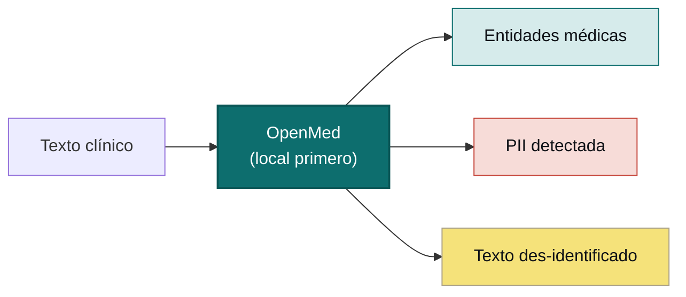

<div align="center">


<h3>Tus datos. Tu modelo. Tu hardware.</h3>

<p><b>Convierta texto clínico en información estructurada y desidentificada en hardware bajo su control.</b><br/>
El entorno local principal de OpenMed realiza la extracción y la desidentificación una vez disponibles los artefactos de modelo necesarios. Las descargas de modelos, los adaptadores de proveedores remotos, las rutas con telemetría y las integraciones configuradas por el usuario pueden usar la red; revise las condiciones de cada modelo y conjunto de datos.</p>

<p>
  <a href="https://pypi.org/project/openmed/">PyPI package</a> ·
  <a href="https://www.python.org/downloads/">Python 3.10+</a> ·
  <a href="https://huggingface.co/OpenMed">Model catalog</a> ·
  <a href="https://arxiv.org/abs/2508.01630">Research paper</a> ·
  <a href="LICENSE">Apache-2.0 SDK source</a>
</p>

<p>
  <a href="swift/OpenMedKit">OpenMedKit</a> ·
  <a href="docs/mlx-backend.md">Apple Silicon / MLX</a> ·
  <a href="docs/export-onnx-android.md">Android / ONNX Runtime Mobile</a> ·
  <a href="docs/export-transformersjs.md">Browser / Transformers.js</a> ·
  <a href="https://openmed.life/docs">Documentation</a>
</p>

<p>
  <b>Ejecución local primero</b> &nbsp;·&nbsp; <b>33 idiomas PII respaldados por modelos</b> &nbsp;·&nbsp; <b>Apache-2.0 SDK</b>
</p>

<p>
  <a href="README.md">English</a> ·
  <a href="README.zh-CN.md">简体中文</a> ·
  <b>Español</b> ·
  <a href="README.fr.md">Français</a> ·
  <a href="README.de.md">Deutsch</a> ·
  <a href="README.it.md">Italiano</a> ·
  <a href="README.pt.md">Português</a> ·
  <a href="README.nl.md">Nederlands</a> ·
  <a href="README.ar.md">العربية</a> ·
  <a href="README.hi.md">हिन्दी</a> ·
  <a href="README.te.md">తెలుగు</a> ·
  <a href="README.ja.md">日本語</a> ·
  <a href="README.tr.md">Türkçe</a> ·
  <a href="README.fa.md">فارسی</a>
</p>

</div>

---

## Míralo en acción

<div align="center">
  
  <br/>
  <sub><b>Des-identificación de PII en tiempo real</b>: el Privacy Filter Nemotron oculta nombres, direcciones, identificadores y datos de facturación de un informe de alta clínica, completamente en el dispositivo. <i>(Todos los valores mostrados son sintéticos.)</i></sub>
</div>

---

## Ejemplo en 30 segundos

```python
from openmed import analyze_text

result = analyze_text(
    "Patient started on imatinib for chronic myeloid leukemia.",
    model_name="disease_detection_superclinical",
)

for entity in result.entities:
    print(f"{entity.label:<12} {entity.text:<28} {entity.confidence:.2f}")
# DISEASE      chronic myeloid leukemia     0.98
# DRUG         imatinib                     0.95
```

Un modelo de NER clínico usa el entorno local después de que sus artefactos necesarios están disponibles.

---

## ¿Por qué OpenMed?

| Consideración de despliegue | Límite del SDK de OpenMed |
| --- | --- |
| Entorno principal | Procesa localmente cuando están disponibles los artefactos necesarios |
| Rutas de red opcionales | Descargas, adaptadores remotos, telemetría e integraciones pueden usar la red |
| Validación | El responsable valida términos de modelos y datos, privacidad y aptitud clínica |
| Interfaces | Python, Swift, Android, navegador y servicios cuando son compatibles |

- **Catálogo de modelos seleccionado**: valide cada modelo, licencia y conjunto de datos para su caso de uso.
- **Configuración alineada con Safe Harbor**: puede dirigirse a las 18 categorías de identificadores; sigue siendo necesaria la revisión experta del despliegue y usar el SDK no demuestra por sí solo el cumplimiento de HIPAA.
- **Rutas de ejecución compatibles**: los adaptadores de CPU, CUDA, MLX, móvil, servicio y navegador varían según el entorno y el artefacto.
- **Interfaces de despliegue**: Python, contenedores, servicios y flujos por lotes requieren configuración y validación.
- **Código fuente del SDK**: publicado bajo Apache-2.0 License; los términos de modelos y datos varían.

---

## En el dispositivo, en Apple: Swift, MLX e iOS

En hardware Apple compatible, OpenMed puede usar **MLX** y **[OpenMedKit](swift/OpenMedKit)** para el procesamiento local una vez disponibles los artefactos necesarios. La obtención de modelos y las integraciones remotas configuradas por el usuario son límites de red independientes.

```swift
// Add OpenMedKit to your app
dependencies: [
    .package(url: "https://github.com/maziyarpanahi/openmed.git", from: "2.1.0"),
]
```

- **Runtime de MLX** para la clasificación de tokens de PII, la familia Privacy Filter y tareas zero-shot experimentales de la familia GLiNER, con una ruta de respaldo en CoreML.
- **Un nombre de modelo, todas las plataformas**: en hardware que no es de Apple, los nombres de modelo MLX recurren automáticamente al checkpoint de PyTorch correspondiente.
- **Python en Apple Silicon** también: `pip install --upgrade "openmed[mlx]"`.

Guías: [Backend de MLX](docs/mlx-backend.md) · [OpenMedKit (Swift)](docs/swift-openmedkit.md) · [Exportación a CoreML](docs/coreml-export.md)

---

## Cómo funciona


```mermaid
flowchart LR
    A["Texto clínico"] --> B["OpenMed<br/>(local primero)"]
    B --> C["Entidades médicas"]
    B --> D["PII detectada"]
    B --> E["Texto des-identificado"]
    style B fill:#0D6E6E,stroke:#0A5656,stroke-width:2px,color:#ffffff
    style C fill:#D6EBEB,stroke:#0D6E6E,color:#0E1116
    style D fill:#F7DCD8,stroke:#C5453A,color:#0E1116
    style E fill:#F5E27A,stroke:#A9A088,color:#0E1116
```

---

## Inicio rápido

```bash
# Core + Hugging Face runtime (Linux, macOS, Windows; CPU or CUDA)
pip install --upgrade "openmed[hf]"

# Add the REST service
pip install --upgrade "openmed[hf,service]"

# Apple Silicon acceleration (MLX)
pip install --upgrade "openmed[mlx]"
```

<table>
<tr>
<td width="33%" valign="top">

**API de Python**

```python
from openmed import analyze_text

analyze_text(
  "Patient received 75mg "
  "clopidogrel for NSTEMI.",
  model_name=
  "pharma_detection_superclinical",
)
```

</td>
<td width="33%" valign="top">

**Servicio REST**

```bash
uvicorn openmed.service.app:app \
  --host 0.0.0.0 --port 8080
```

`GET /health`
`POST /analyze`
`POST /pii/extract`
`POST /pii/deidentify`

</td>
<td width="33%" valign="top">

**Por lotes**

```python
from openmed import BatchProcessor

p = BatchProcessor(
  model_name=
  "disease_detection_superclinical",
  group_entities=True,
)
p.process_texts([...])
```

</td>
</tr>
</table>

**¿Sin conexión / aislado?** Apunta `model_name` (o `model_id`) a un directorio local y OpenMed lo cargará sin contactar con el Hub de Hugging Face:

```python
from openmed import OpenMedConfig, analyze_text

result = analyze_text(
    "Patient presents with chronic myeloid leukemia and Type 2 diabetes.",
    model_id="./models/OpenMed-NER-DiseaseDetect-SuperClinical-434M",
    config=OpenMedConfig(device="cpu"),
)
```

---

## Modelos

Un registro curado de modelos de NER médico especializados. Explora el [catálogo completo](https://openmed.life/docs/model-registry).

| Modelo | Especialización | Tipos de entidad | Tamaño |
|--------|-----------------|------------------|--------|
| `disease_detection_superclinical` | Enfermedades y afecciones | DISEASE, CONDITION, DIAGNOSIS | 434M |
| `pharma_detection_superclinical`  | Fármacos y medicamentos | DRUG, MEDICATION, TREATMENT   | 434M |
| `pii_superclinical_large`     | PII y des-identificación | NAME, DATE, SSN, PHONE, EMAIL, ADDRESS | 434M |
| `anatomy_detection_electramed`    | Anatomía y partes del cuerpo | ANATOMY, ORGAN, BODY_PART     | 109M |
| `gene_detection_genecorpus`       | Genes y proteínas | GENE, PROTEIN                 | 109M |

---

## Privacidad: detección y des-identificación de PII

```python
from openmed import extract_pii, deidentify

text = "Patient: John Doe, DOB: 01/15/1970, SSN: 123-45-6789"

# Extract PII with smart merging (prevents tokenization fragmentation)
result = extract_pii(text, model_name="pii_superclinical_large", use_smart_merging=True)

# De-identify with the method you need
deidentify(text, method="mask")     # [NAME], [DATE]
deidentify(text, method="replace")  # Faker-backed, locale-aware, format-preserving fakes
deidentify(text, method="hash")     # Cryptographic hashing
deidentify(text, method="shift_dates", date_shift_days=180)
```

- **La fusión inteligente de entidades** mantiene `01/15/1970` completo en lugar de fragmentarlo.
- **Ofuscación basada en Faker** con proveedores personalizados de identificadores clínicos (CPF, CNPJ, BSN, NIR, Codice Fiscale, NIE, Aadhaar, Steuer-ID, NPI).
- **Límite de HIPAA**: las categorías alineadas con Safe Harbor y los umbrales configurables ayudan a la implementación; sigue siendo necesaria la revisión experta del despliegue y usar el SDK no demuestra por sí solo el cumplimiento.

[Cuaderno completo de PII](examples/notebooks/PII_Detection_Complete_Guide.ipynb) · [Fusión inteligente](docs/pii-smart-merging.md) · [Anonimización](docs/anonymization.md)

<details>
<summary><b>Familia Privacy Filter</b>: tres familias de modelos sobre la arquitectura OpenAI Privacy Filter</summary>

<br/>

El código del modelo es el mismo (transformador disperso MoE estilo gpt-oss con atención local, tokens sink, RoPE+YaRN, tokenización tiktoken `o200k_base`); solo cambian los datos de entrenamiento. Todas usan la **misma** API `extract_pii()` / `deidentify()`: solo cambia el argumento `model_name=`.

| Variante | PyTorch (CPU + CUDA) | MLX (Apple Silicon) | MLX 8-bit |
| --- | --- | --- | --- |
| **OpenAI Privacy Filter** | [`openai/privacy-filter`](https://huggingface.co/openai/privacy-filter) | [`OpenMed/privacy-filter-mlx`](https://huggingface.co/OpenMed/privacy-filter-mlx) | [`…-mlx-8bit`](https://huggingface.co/OpenMed/privacy-filter-mlx-8bit) |
| **Nemotron-PII fine-tune** | [`OpenMed/privacy-filter-nemotron`](https://huggingface.co/OpenMed/privacy-filter-nemotron) | [`…-nemotron-mlx`](https://huggingface.co/OpenMed/privacy-filter-nemotron-mlx) | [`…-nemotron-mlx-8bit`](https://huggingface.co/OpenMed/privacy-filter-nemotron-mlx-8bit) |
| **OpenMed Multilingual** | [`OpenMed/privacy-filter-multilingual`](https://huggingface.co/OpenMed/privacy-filter-multilingual) | [`…-multilingual-mlx`](https://huggingface.co/OpenMed/privacy-filter-multilingual-mlx) | [`…-multilingual-mlx-8bit`](https://huggingface.co/OpenMed/privacy-filter-multilingual-mlx-8bit) |

```python
from openmed import extract_pii

text = "Patient Sarah Connor (DOB: 03/15/1985) at MRN 4471882."

extract_pii(text, model_name="openai/privacy-filter")              # PyTorch baseline
extract_pii(text, model_name="OpenMed/privacy-filter-nemotron")    # same code, different weights
extract_pii(text, model_name="OpenMed/privacy-filter-mlx")         # Apple Silicon (MLX)
```

En hosts que no son Apple Silicon, los nombres de modelo MLX se sustituyen automáticamente por el checkpoint de PyTorch correspondiente (con un aviso único): escribe un nombre de modelo y ejecútalo en cualquier lugar. Consulta [Arquitectura de Privacy Filter y enrutamiento del backend](docs/anonymization.md#privacy-filter-family).

</details>

---

## PII multilingüe (35 rutas admitidas; 33 respaldadas por modelos)

Extracción y des-identificación en `en`, `fr`, `de`, `it`, `es`, `nl`, `hi`, `te`, `pt`, `ar`, `ja` y `tr`: **el catálogo registrado de modelos PII** en total.

```bash
python -c "from openmed import extract_pii; print([(e.label, e.text) for e in extract_pii('Dr. Pedro Almeida, CPF: 123.456.789-09, email: pedro@hospital.pt', lang='pt').entities])"
```

<details>
<summary>Ver ejemplos por idioma (portugués, neerlandés, hindi, árabe, japonés, turco)</summary>

<br/>

```python
from openmed import extract_pii

portuguese = extract_pii("Paciente: Pedro Almeida, CPF: 123.456.789-09, telefone: +351 912 345 678", lang="pt", use_smart_merging=True)
dutch      = extract_pii("Patiënt: Eva de Vries, BSN: 123456782, telefoon: +31 6 12345678", lang="nl", use_smart_merging=True)
hindi      = extract_pii("रोगी: अनीता शर्मा, फोन: +91 9876543210, पता: नई दिल्ली 110001", lang="hi", use_smart_merging=True)
arabic     = extract_pii("المريضة ليلى حسن، الهاتف +20 10 1234 5678، الرقم القومي 29801011234567.", lang="ar", use_smart_merging=True)
japanese   = extract_pii("患者 佐藤 花子、電話 +81 90 1234 5678、マイナンバー 1234 5678 9012.", lang="ja", use_smart_merging=True)
turkish    = extract_pii("Hasta Ayşe Yılmaz, telefon +90 532 123 45 67, TCKN 10000000146.", lang="tr", use_smart_merging=True)

for r in (portuguese, dutch, hindi, arabic, japanese, turkish):
    print([(e.label, e.text) for e in r.entities])
```

</details>

---

## REST API

Un servicio FastAPI compatible con Docker, con validación de solicitudes, precarga de pipeline compartida y envoltorios de error unificados.

```bash
pip install --upgrade "openmed[hf,service]"
uvicorn openmed.service.app:app --host 0.0.0.0 --port 8080

# or with Docker
docker build -t openmed:local .
docker run --rm -p 8080:8080 -e OPENMED_PROFILE=prod openmed:local
```

```bash
curl -X POST http://127.0.0.1:8080/pii/extract \
  -H "Content-Type: application/json" \
  -d '{"text":"Paciente: Maria Garcia, DNI: 12345678Z","lang":"es"}'
```

Consulta la [guía completa del servicio REST](docs/rest-service.md).

---

## Documentación

Guías completas en **[openmed.life/docs](https://openmed.life/docs/)**.

| | | |
|---|---|---|
| [Primeros pasos](https://openmed.life/docs/) | [Analizar texto](https://openmed.life/docs/analyze-text) | [Registro de modelos](https://openmed.life/docs/model-registry) |
| [Guía de detección de PII](examples/notebooks/PII_Detection_Complete_Guide.ipynb) | [Anonimización](docs/anonymization.md) | [Procesamiento por lotes](https://openmed.life/docs/batch-processing) |
| [Perfiles de configuración](https://openmed.life/docs/profiles) | [Servicio REST](docs/rest-service.md) | [Backend de MLX](docs/mlx-backend.md) |

---

## Conoce a la mascota


El guardián de OpenMed es un esponjoso gato persa caracterizado como un pequeño **Avicena (Ibn Sina)**, el gran
médico persa cuyo *Canon de Medicina* fue el texto médico de referencia en todo el mundo durante unos 600 años.
Vigila el libro abierto del conocimiento médico, con una paleta inspirada en la **turquesa persa (fīrūza)**: un
guardián local-first para tus datos más privados.

<br clear="left"/>

---

## Contribuir

¡Las contribuciones son bienvenidas! Informes de errores, solicitudes de funciones y PRs por igual.

- [Abrir una incidencia](https://github.com/maziyarpanahi/openmed/issues)
- **Se aceptan traducciones**: ayuda a completar los README en otros idiomas enlazados en el selector de la parte superior.

---

## Créditos

OpenMed se basa en excelente trabajo de código abierto: agradecimiento especial a **OpenAI** (la arquitectura [Privacy Filter](https://huggingface.co/openai/privacy-filter)), **NVIDIA** (el [conjunto de datos Nemotron PII](https://huggingface.co/datasets/nvidia/Nemotron-PII-v1)), **Hugging Face** (`transformers` y el ecosistema de modelos), **Apple** ([MLX](https://github.com/ml-explore/mlx)) y los mantenedores de **[Faker](https://faker.readthedocs.io/)**.

## Licencia

El código fuente del SDK de OpenMed se publica bajo la [Apache-2.0 License](LICENSE).

## Cita

Si OpenMed te resulta útil en tu investigación, cítalo:

```bibtex
@misc{panahi2025openmedneropensourcedomainadapted,
      title={OpenMed NER: Open-Source, Domain-Adapted State-of-the-Art Transformers for Biomedical NER Across 12 Public Datasets},
      author={Maziyar Panahi},
      year={2025},
      eprint={2508.01630},
      archivePrefix={arXiv},
      primaryClass={cs.CL},
      url={https://arxiv.org/abs/2508.01630},
}
```

---

## Historial de estrellas

Si OpenMed te resulta útil, una estrella ayuda a que otros lo descubran.

[4,700+ GitHub stars · 29 Jul 2026 snapshot](https://github.com/maziyarpanahi/openmed/stargazers)

---

<div align="center">

Hecho por el equipo de OpenMed

<a href="https://openmed.life">Sitio web</a> ·
<a href="https://openmed.life/docs">Documentación</a> ·
<a href="https://x.com/openmed_ai">X / Twitter</a> ·
<a href="https://www.linkedin.com/company/openmed-ai/">LinkedIn</a>

</div>
