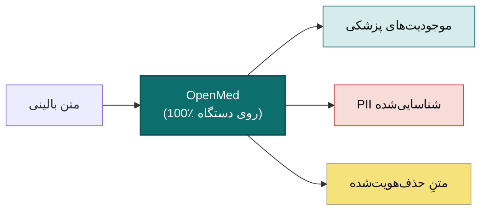

<div align="center">


<h3>هوش مصنوعی سلامتِ محلی که هرگز از دستگاه شما خارج نمی‌شود</h3>

<p><b>متنِ بالینی را با یک خط کد به دادهٔ ساختارمند تبدیل کنید.</b><br/>
استخراج موجودیت‌ها، حذف اطلاعات شناسایی‌کنندهٔ شخصی (PII)، و بیش از 1,000 مدل تخصصی پزشکی که کاملاً روی
سخت‌افزار خودتان اجرا می‌شوند — از یک تک‌خط در پایتون تا یک اپ بومی Swift روی آیفون، با شتاب‌دهیِ Apple MLX.
بدون ابر. بدون وابستگی به تأمین‌کننده. بدون خروج داده‌های بیمار از شبکهٔ شما.</p>

<p>
  <a href="https://pypi.org/project/openmed/"></a>
  <a href="https://www.python.org/downloads/"></a>
  <a href="https://huggingface.co/OpenMed"></a>
  <a href="https://arxiv.org/abs/2508.01630"></a>
  <a href="LICENSE"></a>
  <a href="https://github.com/maziyarpanahi/openmed/stargazers"></a>
</p>

<p>
  <a href="swift/OpenMedKit"></a>
  <a href="docs/mlx-backend.md"></a>
  <a href="docs/swift-openmedkit.md"></a>
  <a href="https://openmed.life/docs"></a>
</p>

<p>
  <b>1,000+ مدل</b> &nbsp;·&nbsp; <b>12 زبان</b> &nbsp;·&nbsp; <b>247 نقطه‌بازرسیِ PII</b> &nbsp;·&nbsp; <b>100٪ روی دستگاه</b> &nbsp;·&nbsp; <b>Apache-2.0</b>
</p>

<p>
  <a href="README.md">English</a> ·
  <a href="README.zh-CN.md">简体中文</a> ·
  <a href="README.es.md">Español</a> ·
  <a href="README.fr.md">Français</a> ·
  <a href="README.de.md">Deutsch</a> ·
  <a href="README.it.md">Italiano</a> ·
  <a href="README.pt.md">Português</a> ·
  <a href="README.nl.md">Nederlands</a> ·
  <a href="README.ar.md">العربية</a> ·
  <a href="README.hi.md">हिन्दी</a> ·
  <a href="README.te.md">తెలుగు</a> ·
  <a href="README.ja.md">日本語</a> ·
  <a href="README.tr.md">Türkçe</a> ·
  <b>فارسی</b>
</p>

</div>

---

<div dir="rtl">

## نمایشِ زنده

</div>

<div align="center">
  
  <br/>
  <sub><b>حذف بلادرنگِ اطلاعات شناسایی‌کننده</b> — فیلترِ حریمِ خصوصیِ Nemotron در حال پنهان‌سازیِ نام‌ها، نشانی‌ها، شناسه‌ها و اطلاعات صورتحساب از یک برگهٔ ترخیص بالینی، کاملاً روی دستگاه. <i>(همهٔ مقادیر نمایش‌داده‌شده ساختگی‌اند.)</i></sub>
</div>

---

<div dir="rtl">

## مثالِ 30‌ثانیه‌ای

</div>

```python
from openmed import analyze_text

result = analyze_text(
    "Patient started on imatinib for chronic myeloid leukemia.",
    model_name="disease_detection_superclinical",
)

for entity in result.entities:
    print(f"{entity.label:<12} {entity.text:<28} {entity.confidence:.2f}")
# DISEASE      chronic myeloid leukemia     0.98
# DRUG         imatinib                     0.95
```

<div dir="rtl">

یک مدلِ پیشرفتهٔ NER بالینی که به‌صورت محلی اجرا می‌شود — بدون کلید API، بدون تماس شبکه‌ای.

</div>

---

<div dir="rtl">

## چرا OpenMed؟

</div>

|                                       |       **OpenMed**        |   APIهای ابریِ پزشکی   |
| ------------------------------------- | :----------------------: | :--------------------: |
| اجرا روی دستگاه/سرورهای شما            |            ✅            |           ❌           |
| خروج داده‌های بیمار از شبکهٔ شما       |         **هرگز**         |   ارسال به تأمین‌کننده  |
| هزینه                                 |     رایگان و متن‌باز     |  هزینه به‌ازای هر فراخوان |
| مدل‌های تخصصی پزشکی                    |          1,000+          |         محدود          |
| زبان‌ها                               |           12+            |         متغیر          |
| آفلاین / ایزوله (air-gapped)          |            ✅            |           ❌           |
| شتاب‌دهیِ Apple Silicon (MLX)         |            ✅            |          ندارد          |
| اپ‌های بومیِ iOS / macOS              |   ✅ از طریق OpenMedKit   |           ❌           |
| وابستگی به تأمین‌کننده                 |     ندارد — Apache-2.0   |          دارد          |

<div dir="rtl">

- **مدل‌های تخصصی** — بیش از 1,000 مدلِ زیست‌پزشکی و بالینیِ گزینش‌شده که بسیاری از آن‌ها از راهکارهای انحصاری بهتر عمل می‌کنند.
- **حذف هویتِ سازگار با HIPAA** — هر 18 شناسهٔ Safe Harbor، ادغامِ هوشمندِ موجودیت‌ها، و جایگزین‌های ساختگیِ حافظِ قالب.
- **همه‌جا اجرا می‌شود** — CPU، CUDA، Apple Silicon (MLX)، و به‌صورت بومی در اپ‌های iOS/macOS از طریق OpenMedKit.
- **استقرارِ یک‌خطی** — API پایتون، سرویس REST داکرایزشده، یا خط‌لوله‌های دسته‌ای.
- **بدون قفل‌شدگی** — Apache-2.0، زیرساختِ شما، دادهٔ شما.

</div>

---

<div dir="rtl">

## روی دستگاه، روی Apple — Swift، MLX و iOS

OpenMed برای اجرا در همان‌جایی که داده‌هایتان زندگی می‌کنند ساخته شده است. روی سخت‌افزارِ Apple با **MLX**
شتاب می‌گیرد و از طریق **[OpenMedKit](swift/OpenMedKit)** مستقیماً به اپ‌های iPhone، iPad و Mac می‌رسد —
به‌طوری‌که تشخیصِ PII و استخراجِ بالینی کاملاً آفلاین و روی خودِ دستگاه انجام می‌شود.

</div>

```swift
// Add OpenMedKit to your app
dependencies: [
    .package(url: "https://github.com/maziyarpanahi/openmed.git", from: "1.5.2"),
]
```

<div dir="rtl">

- **زمان‌اجرای MLX** برای دسته‌بندیِ توکنیِ PII، خانوادهٔ Privacy Filter و وظایفِ zero-shot آزمایشیِ خانوادهٔ GLiNER — به‌همراه مسیرِ جایگزینِ CoreML.
- **یک نامِ مدل، همهٔ پلتفرم‌ها** — نام‌های مدلِ MLX روی سخت‌افزارِ غیر‌Apple به‌طور خودکار به نقطه‌بازرسیِ متناظرِ PyTorch بازمی‌گردند.
- **پایتون روی Apple Silicon** هم: `pip install "openmed[mlx]"`.

راهنماها: [بک‌اندِ MLX](docs/mlx-backend.md) · [OpenMedKit (Swift)](docs/swift-openmedkit.md) · [خروجیِ CoreML](docs/coreml-export.md)

</div>

---

<div dir="rtl">

## چگونه کار می‌کند

</div>



---

<div dir="rtl">

## شروع سریع

</div>

```bash
# Core + Hugging Face runtime (Linux, macOS, Windows; CPU or CUDA)
pip install "openmed[hf]"

# Add the REST service
pip install "openmed[hf,service]"

# Apple Silicon acceleration (MLX)
pip install "openmed[mlx]"
```

<table>
<tr>
<td width="33%" valign="top">

**API پایتون**

```python
from openmed import analyze_text

analyze_text(
  "Patient received 75mg "
  "clopidogrel for NSTEMI.",
  model_name=
  "pharma_detection_superclinical",
)
```

</td>
<td width="33%" valign="top">

**سرویس REST**

```bash
uvicorn openmed.service.app:app \
  --host 0.0.0.0 --port 8080
```

`GET /health`
`POST /analyze`
`POST /pii/extract`
`POST /pii/deidentify`

</td>
<td width="33%" valign="top">

**دسته‌ای**

```python
from openmed import BatchProcessor

p = BatchProcessor(
  model_name=
  "disease_detection_superclinical",
  group_entities=True,
)
p.process_texts([...])
```

</td>
</tr>
</table>

<div dir="rtl">

**آفلاین / ایزوله؟** کافی است `model_name` (یا `model_id`) را به یک پوشهٔ محلی اشاره دهید تا OpenMed آن را بدونِ تماس با Hugging Face Hub بارگذاری کند:

</div>

```python
from openmed import OpenMedConfig, analyze_text

result = analyze_text(
    "Patient presents with chronic myeloid leukemia and Type 2 diabetes.",
    model_id="./models/OpenMed-NER-DiseaseDetect-SuperClinical-434M",
    config=OpenMedConfig(device="cpu"),
)
```

---

<div dir="rtl">

## مدل‌ها

یک رجیستریِ گزینش‌شده از مدل‌های تخصصیِ NER پزشکی — [کاتالوگِ کامل](https://openmed.life/docs/model-registry) را مرور کنید.

</div>

| مدل | تخصص | انواعِ موجودیت | اندازه |
|-----|------|---------------|--------|
| `disease_detection_superclinical` | بیماری‌ها و شرایط | DISEASE, CONDITION, DIAGNOSIS | 434M |
| `pharma_detection_superclinical`  | داروها  | DRUG, MEDICATION, TREATMENT   | 434M |
| `pii_superclinical_large`     | PII و حذفِ هویت | NAME, DATE, SSN, PHONE, EMAIL, ADDRESS | 434M |
| `anatomy_detection_electramed`    | آناتومی و اعضای بدن | ANATOMY, ORGAN, BODY_PART     | 109M |
| `gene_detection_genecorpus`       | ژن‌ها و پروتئین‌ها     | GENE, PROTEIN                 | 109M |

---

<div dir="rtl">

## حریمِ خصوصی: تشخیص و حذفِ PII

</div>

```python
from openmed import extract_pii, deidentify

text = "Patient: John Doe, DOB: 01/15/1970, SSN: 123-45-6789"

# Extract PII with smart merging (prevents tokenization fragmentation)
result = extract_pii(text, model_name="pii_superclinical_large", use_smart_merging=True)

# De-identify with the method you need
deidentify(text, method="mask")     # [NAME], [DATE]
deidentify(text, method="replace")  # Faker-backed, locale-aware, format-preserving fakes
deidentify(text, method="hash")     # Cryptographic hashing
deidentify(text, method="shift_dates", date_shift_days=180)
```

<div dir="rtl">

- **ادغامِ هوشمندِ موجودیت‌ها** تاریخِ `01/15/1970` را به‌جای تکه‌تکه‌شدن، یک‌پارچه نگه می‌دارد.
- **مبهم‌سازیِ مبتنی بر Faker** با ارائه‌دهنده‌های سفارشیِ شناسه‌های بالینی (CPF، CNPJ، BSN، NIR، Codice Fiscale، NIE، Aadhaar، Steuer-ID، NPI).
- **HIPAA**: هر 18 شناسهٔ Safe Harbor، با آستانه‌های اطمینانِ قابل‌تنظیم.

[نوت‌بوکِ کاملِ PII](examples/notebooks/PII_Detection_Complete_Guide.ipynb) · [ادغامِ هوشمند](docs/pii-smart-merging.md) · [ناشناس‌سازی](docs/anonymization.md)

</div>

<details>
<summary><b>خانوادهٔ Privacy Filter</b> — سه خانوادهٔ مدل بر پایهٔ معماریِ OpenAI Privacy Filter</summary>

<br/>

<div dir="rtl">

کدِ مدل یکسان است (ترانسفورمرِ sparse-MoE به سبکِ gpt-oss با توجهِ محلی، توکن‌های sink، RoPE+YaRN، توکنایزرِ tiktoken `o200k_base`)، فقط دادهٔ آموزشی متفاوت است. همه از طریقِ **همان** APIِ `extract_pii()` / `deidentify()` کار می‌کنند — تنها آرگومانِ `model_name=` تغییر می‌کند.

</div>

| گونه | PyTorch (CPU + CUDA) | MLX (Apple Silicon) | MLX ۸-بیتی |
| --- | --- | --- | --- |
| **OpenAI Privacy Filter** | [`openai/privacy-filter`](https://huggingface.co/openai/privacy-filter) | [`OpenMed/privacy-filter-mlx`](https://huggingface.co/OpenMed/privacy-filter-mlx) | [`…-mlx-8bit`](https://huggingface.co/OpenMed/privacy-filter-mlx-8bit) |
| **Nemotron-PII fine-tune** | [`OpenMed/privacy-filter-nemotron`](https://huggingface.co/OpenMed/privacy-filter-nemotron) | [`…-nemotron-mlx`](https://huggingface.co/OpenMed/privacy-filter-nemotron-mlx) | [`…-nemotron-mlx-8bit`](https://huggingface.co/OpenMed/privacy-filter-nemotron-mlx-8bit) |
| **OpenMed Multilingual** | [`OpenMed/privacy-filter-multilingual`](https://huggingface.co/OpenMed/privacy-filter-multilingual) | [`…-multilingual-mlx`](https://huggingface.co/OpenMed/privacy-filter-multilingual-mlx) | [`…-multilingual-mlx-8bit`](https://huggingface.co/OpenMed/privacy-filter-multilingual-mlx-8bit) |

```python
from openmed import extract_pii

text = "Patient Sarah Connor (DOB: 03/15/1985) at MRN 4471882."

extract_pii(text, model_name="openai/privacy-filter")              # PyTorch baseline
extract_pii(text, model_name="OpenMed/privacy-filter-nemotron")    # same code, different weights
extract_pii(text, model_name="OpenMed/privacy-filter-mlx")         # Apple Silicon (MLX)
```

<div dir="rtl">

روی میزبان‌های غیر‌Apple-Silicon، نام‌های مدلِ MLX به‌طور خودکار با نقطه‌بازرسیِ متناظرِ PyTorch جایگزین می‌شوند (با یک هشدارِ یک‌باره) — یک نامِ مدل بنویسید، همه‌جا اجرا کنید. [معماریِ Privacy Filter و مسیریابیِ بک‌اند](docs/anonymization.md#privacy-filter-family) را ببینید.

</div>

</details>

---

<div dir="rtl">

## PII چندزبانه (12 زبان)

استخراج و حذفِ هویت در زبان‌های `en`، `fr`، `de`، `it`، `es`، `nl`، `hi`، `te`، `pt`، `ar`، `ja` و `tr` — در مجموع **247 نقطه‌بازرسیِ PII**.

</div>

```bash
python -c "from openmed import extract_pii; print([(e.label, e.text) for e in extract_pii('Dr. Pedro Almeida, CPF: 123.456.789-09, email: pedro@hospital.pt', lang='pt').entities])"
```

<details>
<summary>نمونه‌های هر زبان (پرتغالی، هلندی، هندی، عربی، ژاپنی، ترکی)</summary>

<br/>

```python
from openmed import extract_pii

portuguese = extract_pii("Paciente: Pedro Almeida, CPF: 123.456.789-09, telefone: +351 912 345 678", lang="pt", use_smart_merging=True)
dutch      = extract_pii("Patiënt: Eva de Vries, BSN: 123456782, telefoon: +31 6 12345678", lang="nl", use_smart_merging=True)
hindi      = extract_pii("रोगी: अनीता शर्मा, फोन: +91 9876543210, पता: नई दिल्ली 110001", lang="hi", use_smart_merging=True)
arabic     = extract_pii("المريضة ليلى حسن، الهاتف +20 10 1234 5678، الرقم القومي 29801011234567.", lang="ar", use_smart_merging=True)
japanese   = extract_pii("患者 佐藤 花子、電話 +81 90 1234 5678、マイナンバー 1234 5678 9012.", lang="ja", use_smart_merging=True)
turkish    = extract_pii("Hasta Ayşe Yılmaz, telefon +90 532 123 45 67, TCKN 10000000146.", lang="tr", use_smart_merging=True)

for r in (portuguese, dutch, hindi, arabic, japanese, turkish):
    print([(e.label, e.text) for e in r.entities])
```

</details>

---

<div dir="rtl">

## REST API

یک سرویسِ FastAPI سازگار با Docker، با اعتبارسنجیِ درخواست، پیش‌بارگذاریِ خط‌لولهٔ مشترک و پاکت‌های خطای یک‌پارچه.

</div>

```bash
pip install "openmed[hf,service]"
uvicorn openmed.service.app:app --host 0.0.0.0 --port 8080

# or with Docker
docker build -t openmed:1.5.2 .
docker run --rm -p 8080:8080 -e OPENMED_PROFILE=prod openmed:1.5.2
```

```bash
curl -X POST http://127.0.0.1:8080/pii/extract \
  -H "Content-Type: application/json" \
  -d '{"text":"Paciente: Maria Garcia, DNI: 12345678Z","lang":"es"}'
```

<div dir="rtl">

راهنمای کاملِ [سرویس REST](docs/rest-service.md) را ببینید.

</div>

---

<div dir="rtl">

## مستندات

راهنماهای کامل در **[openmed.life/docs](https://openmed.life/docs/)**.

</div>

| | | |
|---|---|---|
| [شروع به کار](https://openmed.life/docs/) | [تحلیلِ متن](https://openmed.life/docs/analyze-text) | [رجیستریِ مدل](https://openmed.life/docs/model-registry) |
| [راهنمای تشخیصِ PII](examples/notebooks/PII_Detection_Complete_Guide.ipynb) | [ناشناس‌سازی](docs/anonymization.md) | [پردازشِ دسته‌ای](https://openmed.life/docs/batch-processing) |
| [پروفایل‌های پیکربندی](https://openmed.life/docs/profiles) | [سرویس REST](docs/rest-service.md) | [بک‌اندِ MLX](docs/mlx-backend.md) |

---

<div dir="rtl">

## با نمادِ ما آشنا شوید


نگهبانِ OpenMed یک گربهٔ ایرانیِ پشمالوست که به‌شکلِ بوعلی سینا (ابن‌سینا) درآمده — پزشکِ بزرگِ ایرانی که
کتابِ «قانون در طب» او نزدیک به 600 سال متنِ پزشکیِ مرجعِ جهان بود. او نگهبانِ کتابِ گشودهٔ دانشِ پزشکی است،
با پالتی برگرفته از فیروزهٔ ایرانی: نگهبانی محلی‌محور برای خصوصی‌ترین داده‌های شما.

<br clear="right"/>

</div>

---

<div dir="rtl">

## مشارکت

از مشارکت‌ها استقبال می‌کنیم — گزارشِ اشکال، درخواستِ ویژگی و Pull Requestها.

- [ثبتِ یک issue](https://github.com/maziyarpanahi/openmed/issues)
- **ترجمه‌ها پذیرفته می‌شوند** — به تکمیلِ README‌های زبان‌های دیگر (در سوییچرِ بالای صفحه) کمک کنید.

## سپاس‌گزاری

OpenMed بر پایهٔ کارهای عالیِ متن‌باز ساخته شده — با سپاسِ ویژه از **OpenAI** (معماریِ [Privacy Filter](https://huggingface.co/openai/privacy-filter))، **NVIDIA** (مجموعه‌دادهٔ [Nemotron PII](https://huggingface.co/datasets/nvidia/Nemotron-PII-v1))، **Hugging Face** (`transformers` و اکوسیستمِ مدل)، **Apple** ([MLX](https://github.com/ml-explore/mlx))، و نگه‌دارندگانِ **[Faker](https://faker.readthedocs.io/)**.

## مجوز

تحتِ [مجوزِ Apache-2.0](LICENSE) منتشر شده است.

## استناد

اگر OpenMed در پژوهشِ شما مفید بود، لطفاً به آن استناد کنید:

</div>

```bibtex
@misc{panahi2025openmedneropensourcedomainadapted,
      title={OpenMed NER: Open-Source, Domain-Adapted State-of-the-Art Transformers for Biomedical NER Across 12 Public Datasets},
      author={Maziyar Panahi},
      year={2025},
      eprint={2508.01630},
      archivePrefix={arXiv},
      primaryClass={cs.CL},
      url={https://arxiv.org/abs/2508.01630},
}
```

---

<div dir="rtl">

## تاریخچهٔ ستاره‌ها

اگر OpenMed برایتان مفید است، یک ستاره به دیگران کمک می‌کند آن را پیدا کنند.

</div>

<a href="https://star-history.com/#maziyarpanahi/openmed&Date">
  
</a>

---

<div align="center">

ساخته‌شده به‌دستِ تیمِ OpenMed

<a href="https://openmed.life">وب‌سایت</a> ·
<a href="https://openmed.life/docs">مستندات</a> ·
<a href="https://x.com/openmed_ai">X / توییتر</a> ·
<a href="https://www.linkedin.com/company/openmed-ai/">لینکدین</a>

</div>
