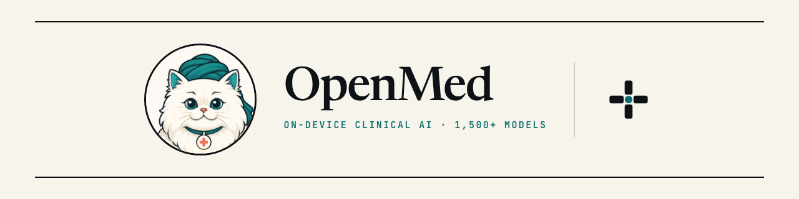
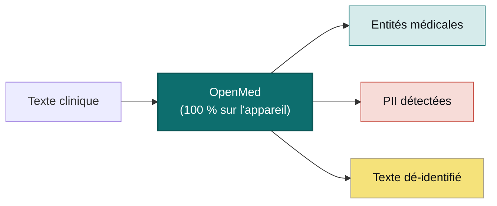

<div align="center">



<h3>Vos données. Votre modèle. Votre matériel.</h3>

<p><b>Transformez le texte clinique en informations structurées et désidentifiées, sans aucun téléversement.</b><br/>
OpenMed extrait les entités biomédicales et supprime plus de 55 types de PHI entièrement sur le matériel que vous contrôlez, de sorte que vos données ne quittent jamais l'appareil. Les mêmes 1 500+ modèles ouverts fonctionnent du téléphone au serveur GPU, entièrement hors ligne : iOS et iPadOS via OpenMedKit, Android via ONNX, les CPU classiques, Apple Silicon, les GPU NVIDIA et le navigateur. Pas de cloud. Pas de dépendance à un fournisseur. Aucune donnée de patient ne quitte votre réseau.</p>

<p>
  <a href="https://pypi.org/project/openmed/"></a>
  <a href="https://www.python.org/downloads/"></a>
  <a href="https://huggingface.co/OpenMed"></a>
  <a href="https://arxiv.org/abs/2508.01630"></a>
  <a href="LICENSE"></a>
  <a href="https://github.com/maziyarpanahi/openmed/stargazers"></a>
</p>

<p>
  <a href="swift/OpenMedKit"></a>
  <a href="docs/mlx-backend.md"></a>
  <a href="docs/swift-openmedkit.md"></a>
  <a href="https://openmed.life/docs"></a>
</p>

<p>
  <b>1 500+ modèles</b> &nbsp;·&nbsp; <b>15 langues PII</b> &nbsp;·&nbsp; <b>600+ checkpoints PII</b> &nbsp;·&nbsp; <b>100 % sur l'appareil</b> &nbsp;·&nbsp; <b>Apache-2.0</b>
</p>

<p>
  <a href="README.md">English</a> ·
  <a href="README.zh-CN.md">简体中文</a> ·
  <a href="README.es.md">Español</a> ·
  <b>Français</b> ·
  <a href="README.de.md">Deutsch</a> ·
  <a href="README.it.md">Italiano</a> ·
  <a href="README.pt.md">Português</a> ·
  <a href="README.nl.md">Nederlands</a> ·
  <a href="README.ar.md">العربية</a> ·
  <a href="README.hi.md">हिन्दी</a> ·
  <a href="README.te.md">తెలుగు</a> ·
  <a href="README.ja.md">日本語</a> ·
  <a href="README.tr.md">Türkçe</a> ·
  <a href="README.fa.md">فارسی</a>
</p>

</div>

---

## Voir en action

<div align="center">
  
  <br/>
  <sub><b>Dé-identification des PII en temps réel</b> — le Privacy Filter Nemotron masque les noms, adresses, identifiants et données de facturation d'un compte rendu de sortie clinique, entièrement sur l'appareil. <i>(Toutes les valeurs affichées sont synthétiques.)</i></sub>
</div>

---

## Exemple en 30 secondes

```python
from openmed import analyze_text

result = analyze_text(
    "Patient started on imatinib for chronic myeloid leukemia.",
    model_name="disease_detection_superclinical",
)

for entity in result.entities:
    print(f"{entity.label:<12} {entity.text:<28} {entity.confidence:.2f}")
# DISEASE      chronic myeloid leukemia     0.98
# DRUG         imatinib                     0.95
```

Un modèle de NER clinique à l'état de l'art qui s'exécute localement — sans clé d'API, sans appel réseau.

---

## Pourquoi OpenMed ?

|                                       |       **OpenMed**        |    API médicales cloud    |
| ------------------------------------- | :----------------------: | :-----------------------: |
| S'exécute sur votre appareil/serveurs |            ✅            |            ❌             |
| Les données patient quittent le réseau |        **Jamais**       |   Envoyées au fournisseur  |
| Coût                                  |   Gratuit et open source |    Tarification à l'appel  |
| Modèles médicaux spécialisés          |          1 500+          |          Limités          |
| Langues                               |           12+            |          Variable         |
| Hors ligne / isolé (air-gapped)       |            ✅            |            ❌             |
| Accélération Apple Silicon (MLX)      |            ✅            |            s.o.           |
| Applications natives iOS / macOS      |    ✅ via OpenMedKit     |            ❌             |
| Dépendance fournisseur                |   Aucune — Apache-2.0    |            Oui            |

- **Modèles spécialisés** — plus de 1 500 modèles biomédicaux et cliniques sélectionnés, dont beaucoup surpassent les solutions propriétaires.
- **Dé-identification conforme à HIPAA** — les 18 identifiants Safe Harbor, fusion intelligente des entités et substituts factices préservant le format.
- **S'exécute partout** — CPU, CUDA, Apple Silicon (MLX), et nativement dans les applications iOS/macOS via OpenMedKit.
- **Déploiement en une ligne** — API Python, service REST dockerisé ou pipelines par lots.
- **Aucun verrouillage** — Apache-2.0, votre infrastructure, vos données.

---

## Sur l'appareil, sur Apple — Swift, MLX et iOS

OpenMed est conçu pour s'exécuter là où vivent déjà vos données. Sur le matériel Apple, il accélère avec **MLX**,
et il s'intègre directement dans les applications iPhone, iPad et Mac via **[OpenMedKit](swift/OpenMedKit)** —
de sorte que la détection des PII et l'extraction clinique se font entièrement hors ligne, sur l'appareil.

```swift
// Add OpenMedKit to your app
dependencies: [
    .package(url: "https://github.com/maziyarpanahi/openmed.git", from: "1.5.5"),
]
```

- **Runtime MLX** pour la classification de tokens PII, la famille Privacy Filter et les tâches zero-shot expérimentales de la famille GLiNER — avec une voie de repli CoreML.
- **Un seul nom de modèle, toutes les plateformes** — sur du matériel non-Apple, les noms de modèles MLX basculent automatiquement vers le checkpoint PyTorch correspondant.
- **Python sur Apple Silicon** aussi : `pip install "openmed[mlx]"`.

Guides : [Backend MLX](docs/mlx-backend.md) · [OpenMedKit (Swift)](docs/swift-openmedkit.md) · [Export CoreML](docs/coreml-export.md)

---

## Comment ça marche



---

## Démarrage rapide

```bash
# Core + Hugging Face runtime (Linux, macOS, Windows; CPU or CUDA)
pip install "openmed[hf]"

# Add the REST service
pip install "openmed[hf,service]"

# Apple Silicon acceleration (MLX)
pip install "openmed[mlx]"
```

<table>
<tr>
<td width="33%" valign="top">

**API Python**

```python
from openmed import analyze_text

analyze_text(
  "Patient received 75mg "
  "clopidogrel for NSTEMI.",
  model_name=
  "pharma_detection_superclinical",
)
```

</td>
<td width="33%" valign="top">

**Service REST**

```bash
uvicorn openmed.service.app:app \
  --host 0.0.0.0 --port 8080
```

`GET /health`
`POST /analyze`
`POST /pii/extract`
`POST /pii/deidentify`

</td>
<td width="33%" valign="top">

**Par lots**

```python
from openmed import BatchProcessor

p = BatchProcessor(
  model_name=
  "disease_detection_superclinical",
  group_entities=True,
)
p.process_texts([...])
```

</td>
</tr>
</table>

**Hors ligne / isolé ?** Pointez `model_name` (ou `model_id`) vers un répertoire local et OpenMed le charge sans contacter le Hub Hugging Face :

```python
from openmed import OpenMedConfig, analyze_text

result = analyze_text(
    "Patient presents with chronic myeloid leukemia and Type 2 diabetes.",
    model_id="./models/OpenMed-NER-DiseaseDetect-SuperClinical-434M",
    config=OpenMedConfig(device="cpu"),
)
```

---

## Modèles

Un registre soigneusement sélectionné de modèles NER médicaux spécialisés — parcourez le [catalogue complet](https://openmed.life/docs/model-registry).

| Modèle | Spécialisation | Types d'entités | Taille |
|--------|----------------|-----------------|--------|
| `disease_detection_superclinical` | Maladies et affections | DISEASE, CONDITION, DIAGNOSIS | 434M |
| `pharma_detection_superclinical`  | Médicaments et traitements | DRUG, MEDICATION, TREATMENT   | 434M |
| `pii_superclinical_large`     | PII et dé-identification | NAME, DATE, SSN, PHONE, EMAIL, ADDRESS | 434M |
| `anatomy_detection_electramed`    | Anatomie et parties du corps | ANATOMY, ORGAN, BODY_PART     | 109M |
| `gene_detection_genecorpus`       | Gènes et protéines | GENE, PROTEIN                 | 109M |

---

## Confidentialité : détection et dé-identification des PII

```python
from openmed import extract_pii, deidentify

text = "Patient: John Doe, DOB: 01/15/1970, SSN: 123-45-6789"

# Extract PII with smart merging (prevents tokenization fragmentation)
result = extract_pii(text, model_name="pii_superclinical_large", use_smart_merging=True)

# De-identify with the method you need
deidentify(text, method="mask")     # [NAME], [DATE]
deidentify(text, method="replace")  # Faker-backed, locale-aware, format-preserving fakes
deidentify(text, method="hash")     # Cryptographic hashing
deidentify(text, method="shift_dates", date_shift_days=180)
```

- **La fusion intelligente des entités** conserve `01/15/1970` intact au lieu de le fragmenter.
- **Obfuscation basée sur Faker** avec des fournisseurs personnalisés d'identifiants cliniques (CPF, CNPJ, BSN, NIR, Codice Fiscale, NIE, Aadhaar, Steuer-ID, NPI).
- **HIPAA** : les 18 identifiants Safe Harbor, avec des seuils de confiance configurables.

[Notebook PII complet](examples/notebooks/PII_Detection_Complete_Guide.ipynb) · [Fusion intelligente](docs/pii-smart-merging.md) · [Anonymisation](docs/anonymization.md)

<details>
<summary><b>Famille Privacy Filter</b> — trois familles de modèles sur l'architecture OpenAI Privacy Filter</summary>

<br/>

Le code du modèle est identique (transformeur MoE clairsemé de style gpt-oss avec attention locale, tokens sink, RoPE+YaRN, tokenisation tiktoken `o200k_base`) ; seules les données d'entraînement diffèrent. Toutes passent par la **même** API `extract_pii()` / `deidentify()` — seul l'argument `model_name=` change.

| Variante | PyTorch (CPU + CUDA) | MLX (Apple Silicon) | MLX 8-bit |
| --- | --- | --- | --- |
| **OpenAI Privacy Filter** | [`openai/privacy-filter`](https://huggingface.co/openai/privacy-filter) | [`OpenMed/privacy-filter-mlx`](https://huggingface.co/OpenMed/privacy-filter-mlx) | [`…-mlx-8bit`](https://huggingface.co/OpenMed/privacy-filter-mlx-8bit) |
| **Nemotron-PII fine-tune** | [`OpenMed/privacy-filter-nemotron`](https://huggingface.co/OpenMed/privacy-filter-nemotron) | [`…-nemotron-mlx`](https://huggingface.co/OpenMed/privacy-filter-nemotron-mlx) | [`…-nemotron-mlx-8bit`](https://huggingface.co/OpenMed/privacy-filter-nemotron-mlx-8bit) |
| **OpenMed Multilingual** | [`OpenMed/privacy-filter-multilingual`](https://huggingface.co/OpenMed/privacy-filter-multilingual) | [`…-multilingual-mlx`](https://huggingface.co/OpenMed/privacy-filter-multilingual-mlx) | [`…-multilingual-mlx-8bit`](https://huggingface.co/OpenMed/privacy-filter-multilingual-mlx-8bit) |

```python
from openmed import extract_pii

text = "Patient Sarah Connor (DOB: 03/15/1985) at MRN 4471882."

extract_pii(text, model_name="openai/privacy-filter")              # PyTorch baseline
extract_pii(text, model_name="OpenMed/privacy-filter-nemotron")    # same code, different weights
extract_pii(text, model_name="OpenMed/privacy-filter-mlx")         # Apple Silicon (MLX)
```

Sur les hôtes non-Apple-Silicon, les noms de modèles MLX sont automatiquement remplacés par le checkpoint PyTorch correspondant (avec un avertissement unique) — écrivez un seul nom de modèle, exécutez-le partout. Voir [Architecture Privacy Filter et routage du backend](docs/anonymization.md#privacy-filter-family).

</details>

---

## PII multilingue (12 langues)

Extraction et dé-identification en `en`, `fr`, `de`, `it`, `es`, `nl`, `hi`, `te`, `pt`, `ar`, `ja` et `tr` — **600+ checkpoints PII** au total.

```bash
python -c "from openmed import extract_pii; print([(e.label, e.text) for e in extract_pii('Dr. Pedro Almeida, CPF: 123.456.789-09, email: pedro@hospital.pt', lang='pt').entities])"
```

<details>
<summary>Voir des exemples par langue (portugais, néerlandais, hindi, arabe, japonais, turc)</summary>

<br/>

```python
from openmed import extract_pii

portuguese = extract_pii("Paciente: Pedro Almeida, CPF: 123.456.789-09, telefone: +351 912 345 678", lang="pt", use_smart_merging=True)
dutch      = extract_pii("Patiënt: Eva de Vries, BSN: 123456782, telefoon: +31 6 12345678", lang="nl", use_smart_merging=True)
hindi      = extract_pii("रोगी: अनीता शर्मा, फोन: +91 9876543210, पता: नई दिल्ली 110001", lang="hi", use_smart_merging=True)
arabic     = extract_pii("المريضة ليلى حسن، الهاتف +20 10 1234 5678، الرقم القومي 29801011234567.", lang="ar", use_smart_merging=True)
japanese   = extract_pii("患者 佐藤 花子、電話 +81 90 1234 5678、マイナンバー 1234 5678 9012.", lang="ja", use_smart_merging=True)
turkish    = extract_pii("Hasta Ayşe Yılmaz, telefon +90 532 123 45 67, TCKN 10000000146.", lang="tr", use_smart_merging=True)

for r in (portuguese, dutch, hindi, arabic, japanese, turkish):
    print([(e.label, e.text) for e in r.entities])
```

</details>

---

## API REST

Un service FastAPI compatible Docker, avec validation des requêtes, préchargement de pipeline partagé et enveloppes d'erreur unifiées.

```bash
pip install "openmed[hf,service]"
uvicorn openmed.service.app:app --host 0.0.0.0 --port 8080

# or with Docker
docker build -t openmed:1.5.5 .
docker run --rm -p 8080:8080 -e OPENMED_PROFILE=prod openmed:1.5.5
```

```bash
curl -X POST http://127.0.0.1:8080/pii/extract \
  -H "Content-Type: application/json" \
  -d '{"text":"Paciente: Maria Garcia, DNI: 12345678Z","lang":"es"}'
```

Consultez le [guide complet du service REST](docs/rest-service.md).

---

## Documentation

Guides complets sur **[openmed.life/docs](https://openmed.life/docs/)**.

| | | |
|---|---|---|
| [Premiers pas](https://openmed.life/docs/) | [Analyser du texte](https://openmed.life/docs/analyze-text) | [Registre des modèles](https://openmed.life/docs/model-registry) |
| [Guide de détection PII](examples/notebooks/PII_Detection_Complete_Guide.ipynb) | [Anonymisation](docs/anonymization.md) | [Traitement par lots](https://openmed.life/docs/batch-processing) |
| [Profils de configuration](https://openmed.life/docs/profiles) | [Service REST](docs/rest-service.md) | [Backend MLX](docs/mlx-backend.md) |

---

## Découvrez la mascotte


Le gardien d'OpenMed est un chat persan duveteux représenté en petit **Avicenne (Ibn Sina)** — le grand médecin
perse dont le *Canon de la médecine* fut le manuel médical de référence dans le monde entier pendant près de
600 ans. Il veille sur le livre ouvert du savoir médical, dans une palette inspirée de la **turquoise persane
(fīrūza)** : un gardien local-first pour vos données les plus privées.

<br clear="left"/>

---

## Contribuer

Les contributions sont les bienvenues — rapports de bugs, demandes de fonctionnalités et PR.

- [Ouvrir une issue](https://github.com/maziyarpanahi/openmed/issues)
- **Traductions bienvenues** — aidez à compléter les README dans les autres langues liés dans le sélecteur en haut de page.

---

## Remerciements

OpenMed s'appuie sur d'excellents travaux open source — un merci tout particulier à **OpenAI** (l'architecture [Privacy Filter](https://huggingface.co/openai/privacy-filter)), **NVIDIA** (le [jeu de données Nemotron PII](https://huggingface.co/datasets/nvidia/Nemotron-PII-v1)), **Hugging Face** (`transformers` et l'écosystème de modèles), **Apple** ([MLX](https://github.com/ml-explore/mlx)) et les mainteneurs de **[Faker](https://faker.readthedocs.io/)**.

## Licence

Publié sous la [licence Apache-2.0](LICENSE).

## Citation

Si OpenMed vous est utile dans vos recherches, merci de le citer :

```bibtex
@misc{panahi2025openmedneropensourcedomainadapted,
      title={OpenMed NER: Open-Source, Domain-Adapted State-of-the-Art Transformers for Biomedical NER Across 12 Public Datasets},
      author={Maziyar Panahi},
      year={2025},
      eprint={2508.01630},
      archivePrefix={arXiv},
      primaryClass={cs.CL},
      url={https://arxiv.org/abs/2508.01630},
}
```

---

## Historique des étoiles

Si OpenMed vous est utile, une étoile aide les autres à le découvrir.

<a href="https://star-history.com/#maziyarpanahi/openmed&Date">
  
</a>

---

<div align="center">

Réalisé par l'équipe OpenMed

<a href="https://openmed.life">Site web</a> ·
<a href="https://openmed.life/docs">Documentation</a> ·
<a href="https://x.com/openmed_ai">X / Twitter</a> ·
<a href="https://www.linkedin.com/company/openmed-ai/">LinkedIn</a>

</div>
