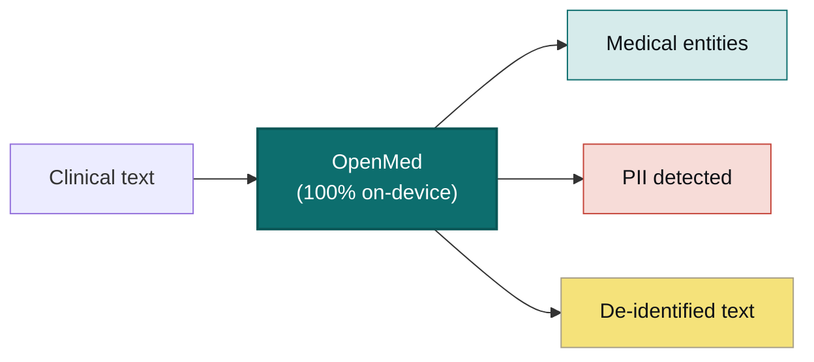

<div align="center">


<h2>आपका डेटा। आपका मॉडल। आपका हार्डवेयर।</h2>

<a href="https://trendshift.io/repositories/40195?utm_source=repository-badge&amp;utm_medium=badge&amp;utm_campaign=badge-repository-40195" target="_blank" rel="noopener noreferrer"></a>

<p><b>कुछ भी अपलोड किए बिना क्लिनिकल टेक्स्ट को संरचित, डी-आइडेंटिफाइड जानकारी में बदलें।</b><br/>
OpenMed आपके नियंत्रण वाले हार्डवेयर पर ही बायोमेडिकल एंटिटी निकालता है और 55+ PHI प्रकार हटाता है,
इसलिए आपका डेटा कभी डिवाइस से बाहर नहीं जाता। वही 2,000+ ओपन मॉडल फ़ोन से GPU सर्वर तक पूरी तरह
ऑफ़लाइन चलते हैं: OpenMedKit के माध्यम से iOS, iPadOS और Android, साथ ही React Native, सामान्य CPU,
Apple Silicon, NVIDIA GPU, ब्राउज़र और REST/gRPC सेवाएँ। कोई क्लाउड नहीं। कोई वेंडर लॉक-इन नहीं।
रोगी डेटा आपके नेटवर्क से बाहर नहीं जाता।</p>

<p>
  <a href="https://pypi.org/project/openmed/"></a>
  <a href="https://www.python.org/downloads/"></a>
  <a href="https://huggingface.co/OpenMed"></a>
  <a href="https://arxiv.org/abs/2508.01630"></a>
  <a href="LICENSE"></a>
  <a href="https://github.com/maziyarpanahi/openmed/stargazers"></a>
</p>

<p>
  <a href="swift/OpenMedKit"></a>
  <a href="docs/mlx-backend.md"></a>
  <a href="docs/export-onnx-android.md"></a>
  <a href="docs/export-transformersjs.md"></a>
  <a href="docs/swift-openmedkit.md"></a>
  <a href="https://openmed.life/docs"></a>
</p>

<p>
  <b>2,000+ मॉडल</b> &nbsp;·&nbsp; <b>24 मॉडल-समर्थित PII भाषाएँ</b> &nbsp;·&nbsp; <b>600+ PII चेकपॉइंट</b> &nbsp;·&nbsp; <b>100% डिवाइस पर</b> &nbsp;·&nbsp; <b>Apache-2.0</b>
</p>

<p>
  <a href="README.md">English</a> ·
  <a href="README.zh-CN.md">简体中文</a> ·
  <a href="README.es.md">Español</a> ·
  <a href="README.fr.md">Français</a> ·
  <a href="README.de.md">Deutsch</a> ·
  <a href="README.it.md">Italiano</a> ·
  <a href="README.pt.md">Português</a> ·
  <a href="README.nl.md">Nederlands</a> ·
  <a href="README.ar.md">العربية</a> ·
  <b>हिन्दी</b> ·
  <a href="README.te.md">తెలుగు</a> ·
  <a href="README.ja.md">日本語</a> ·
  <a href="README.tr.md">Türkçe</a> ·
  <a href="README.fa.md">فارسی</a> ·
  <a href="README.sw.md">Kiswahili</a>
</p>

</div>

---

## इसे काम करते देखें

OpenMed **पूरी तरह डिवाइस पर चलता है**; क्लिनिकल टेक्स्ट कभी उससे बाहर नहीं जाता। यहाँ यह iPhone पर पूरी तरह ऑफ़लाइन चल रहा है:

<div align="center">
  
  <br/>
  <sub><b><a href="swift/OpenMedKit">OpenMedKit</a> के माध्यम से iPhone पर</b>: क्लिनिकल नोट स्कैन करें, उसे डी-आइडेंटिफाई करें और क्लिनिकल संकेत निकालें—Apple MLX के साथ पूरी तरह स्थानीय रूप से। कुछ भी अपलोड नहीं होता।</sub>
</div>

<br/>

<div align="center">
  
  <br/>
  <sub><b>रीयल-टाइम PII डी-आइडेंटिफिकेशन</b>: Nemotron Privacy Filter नाम, पते, ID और बिलिंग डेटा को क्लिनिकल डिस्चार्ज पैकेट से पूरी तरह डिवाइस पर छिपाता है। <i>(दिखाए गए सभी मान सिंथेटिक हैं।)</i></sub>
</div>

---

## 30 सेकंड का उदाहरण

```python
from openmed import analyze_text

result = analyze_text(
    "Patient started on imatinib for chronic myeloid leukemia.",
    model_name="disease_detection_superclinical",
)

for entity in result.entities:
    print(f"{entity.label:<12} {entity.text:<28} {entity.confidence:.2f}")
# DISEASE      chronic myeloid leukemia     0.98
# DRUG         imatinib                     0.95
```

एक अत्याधुनिक क्लिनिकल NER मॉडल स्थानीय रूप से चलता है: कोई API कुंजी नहीं, कोई नेटवर्क कॉल नहीं।

---

## OpenMed क्यों?

|                                       |       **OpenMed**        |     क्लाउड चिकित्सा API     |
| ------------------------------------- | :----------------------: | :-------------------------: |
| आपके डिवाइस / सर्वर पर चलता है        |            ✅            |             ❌              |
| रोगी डेटा आपके नेटवर्क से बाहर जाता है |       **कभी नहीं**       |       वेंडर को भेजा जाता है  |
| लागत                                  |     मुफ़्त और ओपन-सोर्स   |        प्रति-कॉल शुल्क       |
| विशेष चिकित्सा मॉडल                    |          2,000+          |            सीमित            |
| मॉडल-समर्थित PII भाषाएँ               |            24            |            भिन्न            |
| ऑफ़लाइन / एयर-गैप्ड                   |            ✅            |             ❌              |
| Apple Silicon (MLX) त्वरण             |            ✅            |          लागू नहीं          |
| नेटिव iOS / macOS ऐप्स                | ✅ OpenMedKit के माध्यम से |             ❌              |
| ब्राउज़र/WebGPU टोकन वर्गीकरण          | ✅ Transformers.js के माध्यम से |        भिन्न            |
| वेंडर लॉक-इन                          |    कोई नहीं (Apache-2.0) |             हाँ             |

- **विशेष मॉडल**: 2,000+ सावधानी से चुने गए बायोमेडिकल और क्लिनिकल मॉडल, जिनमें से कई प्रोप्राइटरी समाधानों से बेहतर प्रदर्शन करते हैं।
- **HIPAA-सचेत डी-आइडेंटिफिकेशन**: सभी 18 Safe Harbor पहचानकर्ता, स्मार्ट एंटिटी मर्जिंग और फ़ॉर्मेट-संरक्षित सिंथेटिक मान।
- **हर जगह चलता है**: CPU, CUDA, Apple Silicon (MLX), OpenMedKit के माध्यम से iOS/macOS, Android/Kotlin, React Native, REST/gRPC सेवाएँ और Transformers.js के माध्यम से ब्राउज़र/WebGPU बंडल।
- **एक पंक्ति में परिनियोजन**: Python API, Docker-आधारित REST सेवा या बैच पाइपलाइन।
- **शून्य लॉक-इन**: Apache-2.0, आपका इंफ्रास्ट्रक्चर, आपका डेटा।

---

## Apple डिवाइस पर: Swift, MLX और iOS

OpenMed को वहीं चलाने के लिए बनाया गया है जहाँ आपका डेटा पहले से मौजूद है। Apple हार्डवेयर पर यह **MLX** से
तेज़ होता है और **[OpenMedKit](swift/OpenMedKit)** के माध्यम से सीधे iPhone, iPad और Mac ऐप में पहुँचता है,
ताकि PII पहचान और क्लिनिकल निष्कर्षण पूरी तरह ऑफ़लाइन, डिवाइस पर हों।

```swift
// Add OpenMedKit to your app
dependencies: [
    .package(url: "https://github.com/maziyarpanahi/openmed.git", from: "1.9.1"),
]
```

अपेक्षित परिणाम: Swift Package Manager OpenMedKit को resolve करता है और आपके ऐप target में
`import OpenMedKit` उपलब्ध कराता है।

- PII टोकन वर्गीकरण, Privacy Filter परिवार, प्रायोगिक GLiNER-परिवार zero-shot कार्यों और Laneformer के साथ Python MLX-LM टेक्स्ट जनरेशन के लिए **MLX रनटाइम**; समर्थित टोकन-वर्गीकरण artifacts के लिए CoreML fallback path भी शामिल है।
- **एक मॉडल नाम, हर प्लेटफ़ॉर्म**: गैर-Apple हार्डवेयर पर MLX मॉडल नाम स्वचालित रूप से संबंधित PyTorch चेकपॉइंट पर वापस आ जाते हैं।
- **Apple Silicon पर Python** भी: `pip install --upgrade "openmed[mlx]"`।

गाइड: [MLX बैकएंड](docs/mlx-backend.md) · [OpenMedKit (Swift)](docs/swift-openmedkit.md) · [CoreML एक्सपोर्ट](docs/coreml-export.md)

<div align="center">
  
  <br/>
  <sub><b>Apple Silicon पर MLX: CPU PyTorch की तुलना में 24–33× तेज़</b>: Privacy Filter के लिए प्रति inference चरण की median latency; कम मान बेहतर हैं।</sub>
</div>

---

## Android डिवाइस पर — Kotlin और ONNX Runtime Mobile

OpenMedKit स्थानीय दस्तावेज़ intake, OCR handoff, PII redaction और **ONNX Runtime Mobile** के माध्यम से
टोकन-वर्गीकरण inference के लिए नेटिव Android/Kotlin लाइब्रेरी के रूप में भी उपलब्ध है। मोबाइल मॉडल repositories
में स्थिर tensor नाम, dynamic sequence axes, tokenizer फ़ाइलें, labels और Android-ready fp32, fp16, INT8 तथा
वैकल्पिक `.ort` outputs शामिल हैं।

`settings.gradle.kts` में scoped JitPack repository जोड़ें:

```kotlin
dependencyResolutionManagement {
    repositories {
        google()
        mavenCentral()
        maven {
            url = uri("https://jitpack.io")
            content { includeGroup("com.github.maziyarpanahi") }
        }
    }
}
```

फिर immutable OpenMed `v1.9.1` release उपयोग करें:

```kotlin
dependencies {
    implementation("com.github.maziyarpanahi:openmed:v1.9.1")
}
```

स्थानीय build और publishing विवरण के लिए [Android installation guide](android/README.md) देखें।

```kotlin
val model = OpenMedKit.fromDirectory(modelDir)
val entities = model.analyzeText("Patient Alice Nguyen was seen in cardiology.")
```

- **Android ONNX profile** `model.onnx`, `model_fp16.onnx`, `model_int8.onnx`, tokenizer assets, labels और `openmed-onnx.json` बनाता है।
- **ORT Mobile support** ONNX Runtime conversion tooling install होने पर minimal-build operator configuration दर्ज करता है।
- **Kotlin parity tests** tokenizer offsets, span boundaries और decoder output को Python runtime के अनुरूप रखते हैं।

गाइड: [Android ONNX एक्सपोर्ट](docs/export-onnx-android.md) ·
[Android span parity](docs/android-parity.md) ·
[OpenMedKit Android](android/openmedkit)

### Python CPU पर वही ONNX मॉडल

```python
from openmed import OnnxModel

model = OnnxModel.from_pretrained(
    "OpenMed/OpenMed-PII-ClinicalE5-Small-33M-v1-onnx-android"
)
entities = model("Patient Alice Nguyen was seen in cardiology.")
```

### ब्राउज़र में वही ONNX मॉडल

```bash
npm install openmed @huggingface/transformers
```

```typescript
import { loadOnnxModel } from "openmed";

const model = await loadOnnxModel(
  "OpenMed/OpenMed-PII-ClinicalE5-Small-33M-v1-onnx-android",
);
const entities = await model("Patient Alice Nguyen was seen in cardiology.");
```

---

## यह कैसे काम करता है



Rendered परिणाम: एक स्थानीय clinical-text pipeline जो cloud API को डेटा भेजे बिना चिकित्सा एंटिटी,
PII निष्कर्ष और डी-आइडेंटिफाइड टेक्स्ट लौटाती है।

---

## त्वरित शुरुआत

```bash
# Core + Hugging Face runtime (Linux, macOS, Windows; CPU or CUDA)
pip install --upgrade "openmed[hf]"

# Add the REST service
pip install --upgrade "openmed[hf,service]"

# Apple Silicon acceleration (MLX)
pip install --upgrade "openmed[mlx]"
```

अपेक्षित परिणाम:

```text
Successfully installed openmed-...
```

<table>
<tr>
<td width="33%" valign="top">

**Python API**

```python
from openmed import analyze_text

result = analyze_text(
  "Patient received 75mg "
  "clopidogrel for NSTEMI.",
  model_name=
  "pharma_detection_superclinical",
)
print([(e.label, e.text) for e in result.entities])
```

उदाहरण output:

```text
[('DRUG', 'clopidogrel'), ('CONDITION', 'NSTEMI')]
```

</td>
<td width="33%" valign="top">

**REST सेवा**

```bash
uvicorn openmed.service.app:app \
  --host 0.0.0.0 --port 8080
```

उदाहरण output:

```text
INFO:     Uvicorn running on http://0.0.0.0:8080
GET /health -> 200 OK
```

`GET /health`
`POST /analyze`
`POST /pii/extract`
`POST /pii/deidentify`

</td>
<td width="33%" valign="top">

**बैच**

```python
from openmed import BatchProcessor

p = BatchProcessor(
  model_name=
  "disease_detection_superclinical",
  group_entities=True,
)
results = p.process_texts([...])
print(len(results), sum(len(r.entities) for r in results))
print([(e.label, e.text) for e in results[0].entities[:1]])
```

उदाहरण output:

```text
3 7
[('DISEASE', 'leukemia')]
```

</td>
</tr>
</table>

**ब्राउज़र / WebGPU**

Transformers.js के माध्यम से ब्राउज़र में inference के लिए ONNX टोकन-वर्गीकरण exports को package करें:

```bash
python -m openmed.onnx.convert \
  --model dslim/bert-base-NER \
  --output dist/example-onnx \
  --include-transformersjs
```

उदाहरण output:

```text
Exported Transformers.js bundle to dist/example-onnx
```

```javascript
import { pipeline } from "@huggingface/transformers";

const detector = await pipeline(
  "token-classification",
  "/models/openmed-pii/transformersjs",
  { device: "webgpu" },
);
const entities = await detector("Patient Casey Example called 212-555-0198.");
console.log(entities.slice(0, 2));
```

उदाहरण output:

```javascript
[
  { entity: "NAME", word: "Casey Example", score: 0.99 },
  { entity: "PHONE", word: "212-555-0198", score: 0.98 },
]
```

[Transformers.js एक्सपोर्ट गाइड](docs/export-transformersjs.md)

**ऑफ़लाइन / एयर-गैप्ड?** `model_name` (या `model_id`) को किसी स्थानीय directory की ओर इंगित करें और OpenMed उसे Hugging Face Hub से संपर्क किए बिना load करेगा:

```python
from openmed import OpenMedConfig, analyze_text

result = analyze_text(
    "Patient presents with chronic myeloid leukemia and Type 2 diabetes.",
    model_id="./models/OpenMed-NER-DiseaseDetect-SuperClinical-434M",
    config=OpenMedConfig(device="cpu"),
)
for entity in result.entities:
    print(f"{entity.label:<12} {entity.text:<28} {entity.confidence:.2f}")
```

उदाहरण output:

```text
DISEASE      chronic myeloid leukemia     0.98
DISEASE      Type 2 diabetes              0.96
```

क्योंकि `model_id` स्थानीय directory को इंगित करता है, यह उदाहरण Hugging Face Hub या किसी बाहरी model provider से संपर्क नहीं करता।

---

## मॉडल

विशेष चिकित्सा NER मॉडलों की curated registry; [पूरा catalog](https://openmed.life/docs/model-registry) देखें।

| मॉडल | विशेषज्ञता | एंटिटी प्रकार | आकार |
|-------|-----------|--------------|------|
| `disease_detection_superclinical` | रोग और स्थितियाँ | DISEASE, CONDITION, DIAGNOSIS | 434M |
| `pharma_detection_superclinical`  | दवाएँ और औषधियाँ | DRUG, MEDICATION, TREATMENT   | 434M |
| `pii_superclinical_large`     | PII और डी-आइडेंटिफिकेशन | NAME, DATE, SSN, PHONE, EMAIL, ADDRESS | 434M |
| `anatomy_detection_electramed`    | शरीर रचना और अंग | ANATOMY, ORGAN, BODY_PART     | 109M |
| `gene_detection_genecorpus`       | जीन और प्रोटीन | GENE, PROTEIN                 | 109M |

---

## गोपनीयता: PII पहचान और डी-आइडेंटिफिकेशन

```python
from openmed import extract_pii, deidentify

text = "Patient: John Doe, DOB: 01/15/1970, SSN: 123-45-6789"

# Extract PII with smart merging (prevents tokenization fragmentation)
result = extract_pii(text, model_name="pii_superclinical_large", use_smart_merging=True)
print([(e.label, e.text) for e in result.entities])

# De-identify with the method you need
print(deidentify(text, method="mask").deidentified_text)
print(deidentify(text, method="replace").deidentified_text)
print(deidentify(text, method="hash").deidentified_text)
print(deidentify(text, method="shift_dates", date_shift_days=180).deidentified_text)
```

उदाहरण output:

```text
[('NAME', 'John Doe'), ('DATE', '01/15/1970'), ('SSN', '123-45-6789')]
Patient: [NAME], DOB: [DATE], SSN: [SSN]
Patient: Emily Chen, DOB: 03/22/1985, SSN: 456-78-9012
Patient: 6b8f...c4a1, DOB: 48b1...91de, SSN: 3f13...e912
Patient: John Doe, DOB: 07/14/1970, SSN: 123-45-6789
```

**सिंथेटिक Hinglish उदाहरण (केवल कृत्रिम डेटा; इसमें कोई वास्तविक रोगी जानकारी नहीं है):**

```python
from openmed import deidentify

# Synthetic Hinglish data; no real patient information.
hinglish_text = (
    "रोगी Asha Verma ka phone +91 9876543210 hai aur वह Delhi clinic में "
    "follow-up ke liye aayi."
)
result = deidentify(hinglish_text, lang="hi", method="mask")
print(result.deidentified_text)
```

उदाहरण output:

```text
रोगी [NAME] ka phone [PHONE] hai aur वह [ADDRESS] में follow-up ke liye aayi.
```

- **स्मार्ट एंटिटी मर्जिंग** `01/15/1970` को खंडित करने के बजाय पूरा रखती है।
- **नीति-सचेत पाइपलाइन** HIPAA/GDPR/research profiles, calibrated thresholds, signed audit reports, redaction previews और minimum-necessary action selection जोड़ती हैं।
- **Faker-आधारित obfuscation** में clinical-ID के custom providers शामिल हैं (CPF, CNPJ, BSN, NIR, Codice Fiscale, NIE, Aadhaar, Steuer-ID, NPI)।
- **HIPAA**: सभी 18 Safe Harbor पहचानकर्ता, configurable confidence thresholds के साथ।
- **बैच और streaming PII**: `BatchProcessor(operation="extract_pii" | "deidentify", batch_size=16)` या incremental streaming helpers से अनेक दस्तावेज़ों में PII निकालें या डी-आइडेंटिफाई करें।

<div align="center">
  
  <br/>
  <sub><b>बैच processing</b>: एक समय में एक दस्तावेज़ की तुलना में CPU पर <b>3.3×</b> और MLX पर <b>2.2×</b> अधिक throughput।</sub>
</div>

[पूर्ण PII notebook](examples/notebooks/PII_Detection_Complete_Guide.ipynb) · [स्मार्ट मर्जिंग](docs/pii-smart-merging.md) · [Anonymization quickstart](docs/anonymization.md#quickstart-choosing-a-method)

<details>
<summary><b>Privacy Filter परिवार</b>: OpenAI Privacy Filter architecture पर तीन model families</summary>

<br/>

मॉडल code समान है (local attention, sink tokens, RoPE+YaRN और tiktoken `o200k_base` वाला gpt-oss-style sparse-MoE transformer); केवल training data अलग है। सभी **एक ही** `extract_pii()` / `deidentify()` API से गुजरते हैं; केवल `model_name=` बदलता है।
`openai/privacy-filter` Hugging Face पर local weights का model identifier है;
इसे यहाँ उपयोग करने से OpenAI API call नहीं होती।

| Variant | PyTorch (CPU + CUDA) | MLX (Apple Silicon) | MLX 8-bit |
| --- | --- | --- | --- |
| **OpenAI Privacy Filter** | [`openai/privacy-filter`](https://huggingface.co/openai/privacy-filter) | [`OpenMed/privacy-filter-mlx`](https://huggingface.co/OpenMed/privacy-filter-mlx) | [`…-mlx-8bit`](https://huggingface.co/OpenMed/privacy-filter-mlx-8bit) |
| **Nemotron-PII fine-tune** | [`OpenMed/privacy-filter-nemotron`](https://huggingface.co/OpenMed/privacy-filter-nemotron) | [`…-nemotron-mlx`](https://huggingface.co/OpenMed/privacy-filter-nemotron-mlx) | [`…-nemotron-mlx-8bit`](https://huggingface.co/OpenMed/privacy-filter-nemotron-mlx-8bit) |
| **OpenMed Multilingual** | [`OpenMed/privacy-filter-multilingual`](https://huggingface.co/OpenMed/privacy-filter-multilingual) | [`…-multilingual-mlx`](https://huggingface.co/OpenMed/privacy-filter-multilingual-mlx) | [`…-multilingual-mlx-8bit`](https://huggingface.co/OpenMed/privacy-filter-multilingual-mlx-8bit) |

```python
from openmed import extract_pii

text = "Patient Sarah Connor (DOB: 03/15/1985) at MRN 4471882."

variants = {
    "baseline": extract_pii(text, model_name="openai/privacy-filter"),
    "nemotron": extract_pii(text, model_name="OpenMed/privacy-filter-nemotron"),
    "mlx": extract_pii(text, model_name="OpenMed/privacy-filter-mlx"),
}
print([(e.label, e.text) for e in variants["baseline"].entities])
```

उदाहरण output:

```text
[('NAME', 'Sarah Connor'), ('DATE', '03/15/1985'), ('ID', '4471882')]
```

गैर-Apple-Silicon hosts पर MLX मॉडल नाम matching PyTorch checkpoint से अपने-आप बदल दिए जाते हैं (एक बार warning के साथ): एक मॉडल नाम ship करें और कहीं भी चलाएँ। [Privacy Filter architecture और backend routing](docs/anonymization.md#privacy-filter-family) देखें।

</details>

---

## बहुभाषी PII (26 समर्थित भाषाएँ)

निष्कर्षण और डी-आइडेंटिफिकेशन **26 समर्थित PII भाषा codes** में उपलब्ध हैं:
`am`, `ar`, `da`, `de`, `en`, `es`, `fr`, `he`, `hi`, `id`, `it`, `ja`, `ko`, `nl`, `no`, `pt`, `ro`, `ru`, `sv`, `sw`, `te`, `th`, `tr`, `xh`, `zh` और `zu`, कुल **600+ PII checkpoints** के साथ।
Chinese routing अभी दस्तावेज़ित multilingual default-model placeholder का उपयोग
करती है, जबकि dedicated Chinese model weights अलग रहते हैं।
एक वैकल्पिक, उपयोगकर्ता द्वारा configured Indic NER family नौ अतिरिक्त routes
(`as`, `bn`, `gu`, `kn`, `ml`, `mr`, `or`, `pa` और `ta`) स्वीकार करती है और Hindi
तथा Telugu को भी सेवा दे सकती है। `OPENMED_INDIC_NER_MODEL` सेट करें; OpenMed इन
weights को न तो bundle करता है और न अपने आप चुनता है।
OpenMed में Polish, Latvian, Slovak, Malay, Filipino और Finnish जैसे अतिरिक्त ID-only locales के लिए validator-समर्थित national-ID coverage भी शामिल है।

हर code के default PII मॉडल, Faker locale और डी-आइडेंटिफिकेशन के पहले/बाद के उदाहरण के लिए [प्रति-भाषा गाइड](docs/languages.md) देखें।

```bash
python -c "from openmed import extract_pii; print([(e.label, e.text) for e in extract_pii('Dr. Pedro Almeida, CPF: 123.456.789-09, email: pedro@hospital.pt', lang='pt').entities])"
```

उदाहरण output:

```text
[('NAME', 'Pedro Almeida'), ('ID', '123.456.789-09'), ('EMAIL', 'pedro@hospital.pt')]
```

<details>
<summary>प्रति-भाषा उदाहरण दिखाएँ (Portuguese, Dutch, Hindi, Arabic, Japanese, Turkish)</summary>

<br/>

```python
from openmed import extract_pii

portuguese = extract_pii("Paciente: Pedro Almeida, CPF: 123.456.789-09, telefone: +351 912 345 678", lang="pt", use_smart_merging=True)
dutch      = extract_pii("Patiënt: Eva de Vries, BSN: 123456782, telefoon: +31 6 12345678", lang="nl", use_smart_merging=True)
hindi      = extract_pii("रोगी: अनीता शर्मा, फोन: +91 9876543210, पता: नई दिल्ली 110001", lang="hi", use_smart_merging=True)
arabic     = extract_pii("المريضة ليلى حسن، الهاتف +20 10 1234 5678، الرقم القومي 29801011234567.", lang="ar", use_smart_merging=True)
japanese   = extract_pii("患者 佐藤 花子、電話 +81 90 1234 5678、マイナンバー 1234 5678 9012.", lang="ja", use_smart_merging=True)
turkish    = extract_pii("Hasta Ayşe Yılmaz, telefon +90 532 123 45 67, TCKN 10000000146.", lang="tr", use_smart_merging=True)

for r in (portuguese, dutch, hindi, arabic, japanese, turkish):
    print([(e.label, e.text) for e in r.entities])
```

उदाहरण output:

```text
[('NAME', 'Pedro Almeida'), ('ID', '123.456.789-09'), ('PHONE', '+351 912 345 678')]
[('NAME', 'Eva de Vries'), ('ID', '123456782'), ('PHONE', '+31 6 12345678')]
[('NAME', 'अनीता शर्मा'), ('PHONE', '+91 9876543210'), ('ADDRESS', 'नई दिल्ली 110001')]
[('NAME', 'ليلى حسن'), ('PHONE', '+20 10 1234 5678'), ('ID', '29801011234567')]
[('NAME', '佐藤 花子'), ('PHONE', '+81 90 1234 5678'), ('ID', '1234 5678 9012')]
[('NAME', 'Ayşe Yılmaz'), ('PHONE', '+90 532 123 45 67'), ('ID', '10000000146')]
```

</details>

---

## REST API

Request validation, shared pipeline preload और unified error envelopes वाली Docker-अनुकूल FastAPI सेवा।

```bash
pip install --upgrade "openmed[hf,service]"
uvicorn openmed.service.app:app --host 0.0.0.0 --port 8080

# or with Docker
docker build -t openmed:local .
docker run --rm -p 8080:8080 -e OPENMED_PROFILE=prod openmed:local
```

उदाहरण output:

```text
INFO:     Uvicorn running on http://0.0.0.0:8080
```

```bash
curl -X POST http://127.0.0.1:8080/pii/extract \
  -H "Content-Type: application/json" \
  -d '{"text":"Paciente: Maria Garcia, DNI: 12345678Z","lang":"es"}'
```

संक्षिप्त उदाहरण response:

```json
{
  "text": "Paciente: Maria Garcia, DNI: 12345678Z",
  "entities": [
    {"text": "Maria Garcia", "label": "NAME", "confidence": 0.99, "start": 10, "end": 22},
    {"text": "12345678Z", "label": "ID", "confidence": 0.98, "start": 29, "end": 38}
  ],
  "model_name": "OpenMed/privacy-filter-multilingual"
}
```

**मॉडल lifecycle और service controls:** `GET /models/loaded`, `POST /models/unload` और `keep_alive` idle window से आवश्यकता पर memory खाली करें;
v1.8 में API-key/JWT auth, no-PHI request logging, tracing, gRPC, async jobs, webhooks, warm pools, dynamic batching,
request coalescing, rate और concurrency limits, `/livez`, `/readyz` और opt-in metrics भी शामिल हैं:

```bash
OPENMED_SERVICE_KEEP_ALIVE=10m uvicorn openmed.service.app:app --host 0.0.0.0 --port 8080
curl -X POST http://127.0.0.1:8080/models/unload -H "Content-Type: application/json" -d '{"all":true}'
```

उदाहरण response:

```json
{
  "unloaded": true,
  "released": {"models": 1, "tokenizers": 1, "pipelines": 1},
  "active_models": {}
}
```

पूर्ण [REST सेवा गाइड](docs/rest-service.md) देखें।

---

## दस्तावेज़ीकरण

पूर्ण गाइड **[openmed.life/docs](https://openmed.life/docs/)** पर उपलब्ध हैं।

AI agents चुनी हुई [llms.txt](https://openmed.life/docs/llms.txt) index या inline
[llms-full.txt](https://openmed.life/docs/llms-full.txt) feed लोड कर सकते हैं। हर
strict MkDocs build के दौरान दोनों को मौजूदा दस्तावेज़ों से फिर बनाया जाता है।

| | | |
|---|---|---|
| [शुरुआत करें](https://openmed.life/docs/) | [टेक्स्ट विश्लेषण](https://openmed.life/docs/analyze-text) | [मॉडल registry](https://openmed.life/docs/model-registry) |
| [FAQ](docs/faq.md) | [Anonymization](docs/anonymization.md) | [बैच processing](https://openmed.life/docs/batch-processing) |
| [Configuration profiles](https://openmed.life/docs/profiles) | [REST सेवा](docs/rest-service.md) | [MLX बैकएंड](docs/mlx-backend.md) |
| [Transformers.js एक्सपोर्ट](docs/export-transformersjs.md) | [FHIR interop](docs/fhir-interop.md) | [HL7 v2 डी-आइडेंटिफिकेशन](docs/hl7v2-deidentification.md) |
| [OpenMed 1.9.1 release notes](docs/release/v1.9.1.md) | [OpenMed 1.9.0 release notes](docs/release/v1.9.0.md) | [उदाहरण](docs/examples.md) |
| [Release streams](docs/release/semver-and-channels.md) | [Generative model नीति](docs/generative-model-policy.md) | [योगदान](docs/contributing.md) |
| [सुरक्षा नीति](SECURITY.md) | [Compliance posture](docs/compliance.md) | [Detector plugin SDK](docs/plugin-sdk.md) |
| [v1 से v2 migration](docs/migration.md) | [MCP client connections](docs/mcp-clients.md) | [अफ़्रीकी डेवलपर ऑनबोर्डिंग](docs/africa-onboarding.md) |

---

## हमारे शुभंकर से मिलें


OpenMed का संरक्षक एक रोएँदार फ़ारसी बिल्ली है जिसे छोटे **एविसेना (इब्न सीना)** के रूप में दिखाया गया है—वह महान फ़ारसी
चिकित्सक जिनकी *क़ानून फ़ी अल-तिब्ब (The Canon of Medicine)* लगभग 600 वर्षों तक दुनिया की मानक चिकित्सा पुस्तक रही।
वह चिकित्सा ज्ञान की खुली पुस्तक की रक्षा करता है, जिसका रंग-पटल फ़ारसी फ़िरोज़ा (*fīrūza*) से प्रेरित है:
आपके सबसे निजी डेटा के लिए एक लोकल-फर्स्ट संरक्षक।

<br clear="left"/>

---

## योगदान

Bug reports, feature requests और PR—सभी योगदानों का स्वागत है। पहले [योगदान गाइड](CONTRIBUTING.md) और हमारा [Code of Conduct](CODE_OF_CONDUCT.md) पढ़ें।

- [Issue खोलें](https://github.com/maziyarpanahi/openmed/issues)
- [योगदान गाइड](CONTRIBUTING.md) · [Code of Conduct](CODE_OF_CONDUCT.md) · [सुरक्षा नीति](SECURITY.md)
- **अनुवादों का स्वागत है**: ऊपर language switcher में linked अन्य भाषाओं की README पूरी करने में मदद करें।

---

## सुरक्षा

कोई vulnerability मिली? OpenMed PHI को redact करता है, इसलिए **redaction bypass या PHI/PII leak सुरक्षा समस्या है**:
इसे निजी रूप से report करें, कभी public issue के रूप में नहीं। Responsible disclosure policy के लिए
**[SECURITY.md](SECURITY.md)** और [private reporting form](https://github.com/maziyarpanahi/openmed/security/advisories/new) देखें।
Report में कभी वास्तविक रोगी डेटा शामिल न करें।

---

## आभार

OpenMed उत्कृष्ट ओपन-सोर्स कार्य पर आधारित है: विशेष धन्यवाद **OpenAI** ([Privacy Filter](https://huggingface.co/openai/privacy-filter) architecture), **NVIDIA** ([Nemotron PII dataset](https://huggingface.co/datasets/nvidia/Nemotron-PII-v1)), **Hugging Face** (`transformers`, Transformers.js और model ecosystem), **Apple** ([MLX](https://github.com/ml-explore/mlx)) और **[Faker](https://faker.readthedocs.io/)** maintainers को।

## लाइसेंस

[Apache-2.0 License](LICENSE) के अंतर्गत जारी। Third-party asset notices [NOTICE](NOTICE) में दर्ज हैं।

## उद्धरण

```bibtex
@misc{panahi2025openmedneropensourcedomainadapted,
      title={OpenMed NER: Open-Source, Domain-Adapted State-of-the-Art Transformers for Biomedical NER Across 12 Public Datasets},
      author={Maziyar Panahi},
      year={2025},
      eprint={2508.01630},
      archivePrefix={arXiv},
      primaryClass={cs.CL},
      url={https://arxiv.org/abs/2508.01630},
}
```

अपेक्षित परिणाम: papers, posters और derived documentation में OpenMed को reference करने के लिए BibTeX-compatible citation metadata।

---

## स्टार इतिहास

यदि OpenMed आपके लिए उपयोगी है, तो एक star दूसरों को इसे खोजने में मदद करता है।

[](https://www.star-history.com/?repos=maziyarpanahi%2Fopenmed&type=date&legend=top-left)

---

<div align="center">

OpenMed टीम द्वारा निर्मित

<a href="https://openmed.life">वेबसाइट</a> ·
<a href="https://openmed.life/docs">दस्तावेज़</a> ·
<a href="https://x.com/openmed_ai">X / Twitter</a> ·
<a href="https://www.linkedin.com/company/openmed-ai/">LinkedIn</a>

</div>
