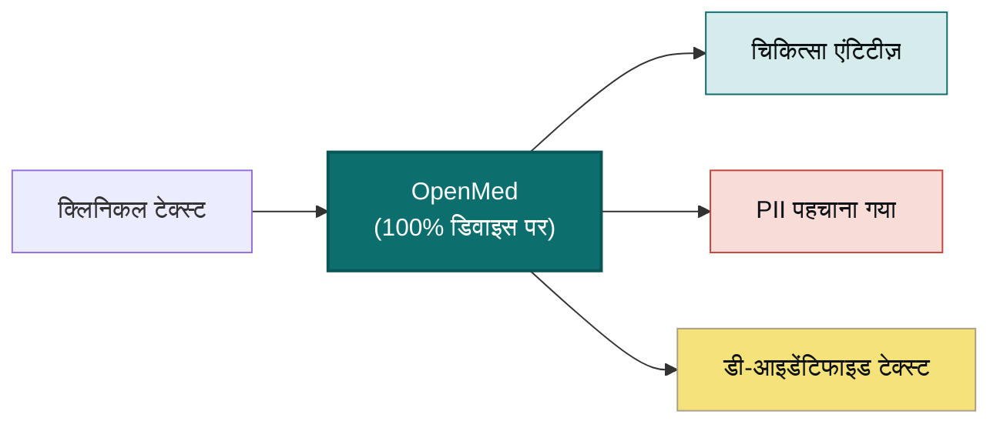

<div align="center">


<h3>लोकल-फर्स्ट हेल्थकेयर AI जो डिवाइस से कभी बाहर नहीं जाता</h3>

<p><b>क्लिनिकल टेक्स्ट को कोड की एक पंक्ति से संरचित अंतर्दृष्टि में बदलें।</b><br/>
एंटिटी निष्कर्षण, PII डी-आइडेंटिफिकेशन, और 1,000+ विशेष चिकित्सा मॉडल जो पूरी तरह आपके अपने हार्डवेयर पर चलते हैं
— Python की एक पंक्ति से लेकर Apple MLX द्वारा संचालित iPhone पर एक नेटिव Swift ऐप तक। कोई क्लाउड नहीं। कोई
वेंडर लॉक-इन नहीं। रोगी का डेटा आपके नेटवर्क से बाहर नहीं जाता।</p>

<p>
  <a href="https://pypi.org/project/openmed/"></a>
  <a href="https://www.python.org/downloads/"></a>
  <a href="https://huggingface.co/OpenMed"></a>
  <a href="https://arxiv.org/abs/2508.01630"></a>
  <a href="LICENSE"></a>
  <a href="https://github.com/maziyarpanahi/openmed/stargazers"></a>
</p>

<p>
  <a href="swift/OpenMedKit"></a>
  <a href="docs/mlx-backend.md"></a>
  <a href="docs/swift-openmedkit.md"></a>
  <a href="https://openmed.life/docs"></a>
</p>

<p>
  <b>1,000+ मॉडल</b> &nbsp;·&nbsp; <b>12 भाषाएँ</b> &nbsp;·&nbsp; <b>247 PII चेकपॉइंट</b> &nbsp;·&nbsp; <b>100% डिवाइस पर</b> &nbsp;·&nbsp; <b>Apache-2.0</b>
</p>

<p>
  <a href="README.md">English</a> ·
  <a href="README.zh-CN.md">简体中文</a> ·
  <a href="README.es.md">Español</a> ·
  <a href="README.fr.md">Français</a> ·
  <a href="README.de.md">Deutsch</a> ·
  <a href="README.it.md">Italiano</a> ·
  <a href="README.pt.md">Português</a> ·
  <a href="README.nl.md">Nederlands</a> ·
  <a href="README.ar.md">العربية</a> ·
  <b>हिन्दी</b> ·
  <a href="README.te.md">తెలుగు</a> ·
  <a href="README.ja.md">日本語</a> ·
  <a href="README.tr.md">Türkçe</a> ·
  <a href="README.fa.md">فارسی</a>
</p>

</div>

---

## इसे काम करते देखें

OpenMed पूरी तरह डिवाइस पर चलता है — क्लिनिकल टेक्स्ट कभी भी डिवाइस से बाहर नहीं जाता। iPhone पर इसे पूरी तरह ऑफ़लाइन चलते हुए देखें:

<div align="center">
  
  <br/>
  <sub><b>OpenMedKit के माध्यम से iPhone पर</b> — क्लिनिकल नोट स्कैन करें, उसे डी-आइडेंटिफाई करें और क्लिनिकल संकेतों को निकालें, वह भी Apple MLX के साथ पूरी तरह स्थानीय रूप से। कोई डेटा अपलोड नहीं किया जाता।</sub>
</div>

<br/>

<div align="center">
  
  <br/>
  <sub><b>रीयल-टाइम PII डी-आइडेंटिफिकेशन</b> — Nemotron Privacy Filter एक क्लिनिकल डिस्चार्ज दस्तावेज़ से नाम, पते, पहचान संख्या और बिलिंग डेटा को पूरी तरह डिवाइस पर छिपा रहा है। <i>(दिखाए गए सभी मान सिंथेटिक हैं।)</i></sub>
</div>

---

## 30 सेकंड का उदाहरण

```python
from openmed import analyze_text

result = analyze_text(
    "Patient started on imatinib for chronic myeloid leukemia.",
    model_name="disease_detection_superclinical",
)

for entity in result.entities:
    print(f"{entity.label:<12} {entity.text:<28} {entity.confidence:.2f}")
# DISEASE      chronic myeloid leukemia     0.98
# DRUG         imatinib                     0.95
```

एक अत्याधुनिक क्लिनिकल NER मॉडल स्थानीय रूप से चल रहा है — कोई API कुंजी नहीं, कोई नेटवर्क कॉल नहीं।

---

## OpenMed क्यों?

|                                       |       **OpenMed**        |     क्लाउड चिकित्सा API    |
| ------------------------------------- | :----------------------: | :-----------------------: |
| आपके डिवाइस/सर्वर पर चलता है           |            ✅            |            ❌             |
| रोगी डेटा आपके नेटवर्क से बाहर जाता है  |       **कभी नहीं**       |    वेंडर को भेजा जाता है    |
| लागत                                  | मुफ़्त और ओपन-सोर्स       |    प्रति-कॉल शुल्क          |
| विशेष चिकित्सा मॉडल                     |          1,000+          |          सीमित            |
| भाषाएँ                                 |           12+            |          भिन्न            |
| ऑफ़लाइन / एयर-गैप्ड (air-gapped)       |            ✅            |            ❌             |
| Apple Silicon (MLX) त्वरण             |            ✅            |         लागू नहीं         |
| नेटिव iOS / macOS ऐप्स                 |  ✅ OpenMedKit के माध्यम से |            ❌             |
| वेंडर लॉक-इन                           |   कोई नहीं — Apache-2.0   |            हाँ            |

- **विशेष मॉडल** — 1,000+ सावधानी से चुने गए बायोमेडिकल और क्लिनिकल मॉडल, जिनमें से कई प्रोप्राइटरी समाधानों से बेहतर प्रदर्शन करते हैं।
- **HIPAA-अनुरूप डी-आइडेंटिफिकेशन** — सभी 18 Safe Harbor पहचानकर्ता, स्मार्ट एंटिटी मर्जिंग, और फ़ॉर्मेट-संरक्षित नकली मान।
- **हर जगह चलता है** — CPU, CUDA, Apple Silicon (MLX), और OpenMedKit के माध्यम से iOS/macOS ऐप्स में नेटिव रूप से।
- **एक पंक्ति में परिनियोजन** — Python API, Docker-आधारित REST सेवा, या बैच पाइपलाइन।
- **कोई लॉक-इन नहीं** — Apache-2.0, आपका इंफ्रास्ट्रक्चर, आपका डेटा।

---

## डिवाइस पर, Apple पर — Swift, MLX और iOS

OpenMed को वहीं चलाने के लिए बनाया गया है जहाँ आपका डेटा पहले से मौजूद है। Apple हार्डवेयर पर यह **MLX** के साथ
त्वरित होता है, और **[OpenMedKit](swift/OpenMedKit)** के माध्यम से सीधे iPhone, iPad और Mac ऐप्स में पहुँचता है —
ताकि PII पहचान और क्लिनिकल निष्कर्षण पूरी तरह ऑफ़लाइन, डिवाइस पर हों।

```swift
// Add OpenMedKit to your app
dependencies: [
    .package(url: "https://github.com/maziyarpanahi/openmed.git", from: "1.5.5"),
]
```

- **MLX रनटाइम** — PII टोकन वर्गीकरण, Privacy Filter परिवार, और प्रायोगिक GLiNER परिवार के zero-shot कार्यों के लिए (CoreML फ़ॉलबैक पथ के साथ)।
- **एक मॉडल नाम, हर प्लेटफ़ॉर्म** — गैर-Apple हार्डवेयर पर MLX मॉडल नाम स्वचालित रूप से संबंधित PyTorch चेकपॉइंट पर वापस आ जाते हैं।
- **Apple Silicon पर Python** भी: `pip install "openmed[mlx]"`।

गाइड: [MLX बैकएंड](docs/mlx-backend.md) · [OpenMedKit (Swift)](docs/swift-openmedkit.md) · [CoreML एक्सपोर्ट](docs/coreml-export.md)

<div align="center">
  
  <br/>
  <sub><b>Apple Silicon पर MLX: CPU PyTorch की तुलना में 24–33× तेज़</b> — Privacy Filter के लिए प्रति इन्फरेंस चरण की माध्य विलंबता; कम मान बेहतर हैं।</sub>
</div>

---

## यह कैसे काम करता है



---

## त्वरित शुरुआत

```bash
# Core + Hugging Face runtime (Linux, macOS, Windows; CPU or CUDA)
pip install "openmed[hf]"

# Add the REST service
pip install "openmed[hf,service]"

# Apple Silicon acceleration (MLX)
pip install "openmed[mlx]"
```

<table>
<tr>
<td width="33%" valign="top">

**Python API**

```python
from openmed import analyze_text

analyze_text(
  "Patient received 75mg "
  "clopidogrel for NSTEMI.",
  model_name=
  "pharma_detection_superclinical",
)
```

</td>
<td width="33%" valign="top">

**REST सेवा**

```bash
uvicorn openmed.service.app:app \
  --host 0.0.0.0 --port 8080
```

`GET /health`
`POST /analyze`
`POST /pii/extract`
`POST /pii/deidentify`

</td>
<td width="33%" valign="top">

**बैच**

```python
from openmed import BatchProcessor

p = BatchProcessor(
  model_name=
  "disease_detection_superclinical",
  group_entities=True,
)
p.process_texts([...])
```

</td>
</tr>
</table>

**ऑफ़लाइन / एयर-गैप्ड?** `model_name` (या `model_id`) को किसी स्थानीय डायरेक्टरी की ओर इंगित करें, और OpenMed इसे Hugging Face Hub से संपर्क किए बिना लोड करता है:

```python
from openmed import OpenMedConfig, analyze_text

result = analyze_text(
    "Patient presents with chronic myeloid leukemia and Type 2 diabetes.",
    model_id="./models/OpenMed-NER-DiseaseDetect-SuperClinical-434M",
    config=OpenMedConfig(device="cpu"),
)
```

---

## मॉडल

विशेष चिकित्सा NER मॉडलों की एक क्यूरेटेड रजिस्ट्री — [पूरा कैटलॉग](https://openmed.life/docs/model-registry) ब्राउज़ करें।

| मॉडल | विशेषज्ञता | एंटिटी प्रकार | आकार |
|------|-----------|--------------|------|
| `disease_detection_superclinical` | रोग और स्थितियाँ | DISEASE, CONDITION, DIAGNOSIS | 434M |
| `pharma_detection_superclinical`  | दवाएँ और औषधियाँ | DRUG, MEDICATION, TREATMENT   | 434M |
| `pii_superclinical_large`     | PII और डी-आइडेंटिफिकेशन | NAME, DATE, SSN, PHONE, EMAIL, ADDRESS | 434M |
| `anatomy_detection_electramed`    | शरीर रचना और अंग | ANATOMY, ORGAN, BODY_PART     | 109M |
| `gene_detection_genecorpus`       | जीन और प्रोटीन | GENE, PROTEIN                 | 109M |

---

## गोपनीयता: PII पहचान और डी-आइडेंटिफिकेशन

```python
from openmed import extract_pii, deidentify

text = "Patient: John Doe, DOB: 01/15/1970, SSN: 123-45-6789"

# Extract PII with smart merging (prevents tokenization fragmentation)
result = extract_pii(text, model_name="pii_superclinical_large", use_smart_merging=True)

# De-identify with the method you need
deidentify(text, method="mask")     # [NAME], [DATE]
deidentify(text, method="replace")  # Faker-backed, locale-aware, format-preserving fakes
deidentify(text, method="hash")     # Cryptographic hashing
deidentify(text, method="shift_dates", date_shift_days=180)
```

- **स्मार्ट एंटिटी मर्जिंग** `01/15/1970` को खंडित करने के बजाय पूरा रखती है।
- **Faker-आधारित ऑब्सक्यूरेशन** — क्लिनिकल ID के लिए कस्टम प्रोवाइडर के साथ (CPF, CNPJ, BSN, NIR, Codice Fiscale, NIE, Aadhaar, Steuer-ID, NPI)।
- **HIPAA**: सभी 18 Safe Harbor पहचानकर्ता, कॉन्फ़िगर करने योग्य कॉन्फ़िडेंस थ्रेशोल्ड के साथ।
- **बैच PII (v1.5.5)** — `BatchProcessor(operation="extract_pii" | "deidentify", batch_size=16)` के माध्यम से अनेक दस्तावेज़ों पर PII निष्कर्षण या डी-आइडेंटिफिकेशन।

<div align="center">
  
  <br/>
  <sub><b>बैच प्रोसेसिंग</b> — एक समय में एक दस्तावेज़ की तुलना में CPU पर <b>3.3×</b> और MLX पर <b>2.2×</b> अधिक थ्रूपुट।</sub>
</div>

[पूर्ण PII नोटबुक](examples/notebooks/PII_Detection_Complete_Guide.ipynb) · [स्मार्ट मर्जिंग](docs/pii-smart-merging.md) · [एनोनिमाइज़ेशन](docs/anonymization.md)

<details>
<summary><b>Privacy Filter परिवार</b> — OpenAI Privacy Filter आर्किटेक्चर पर तीन मॉडल परिवार</summary>

<br/>

मॉडल कोड समान है (स्थानीय अटेंशन, sink टोकन, RoPE+YaRN, tiktoken `o200k_base` टोकनाइज़ेशन के साथ gpt-oss-शैली का स्पार्स MoE ट्रांसफ़ॉर्मर); केवल प्रशिक्षण डेटा अलग है। सभी **एक ही** `extract_pii()` / `deidentify()` API से होकर गुज़रते हैं — केवल `model_name=` आर्गुमेंट बदलता है।

| वैरिएंट | PyTorch (CPU + CUDA) | MLX (Apple Silicon) | MLX 8-bit |
| --- | --- | --- | --- |
| **OpenAI Privacy Filter** | [`openai/privacy-filter`](https://huggingface.co/openai/privacy-filter) | [`OpenMed/privacy-filter-mlx`](https://huggingface.co/OpenMed/privacy-filter-mlx) | [`…-mlx-8bit`](https://huggingface.co/OpenMed/privacy-filter-mlx-8bit) |
| **Nemotron-PII fine-tune** | [`OpenMed/privacy-filter-nemotron`](https://huggingface.co/OpenMed/privacy-filter-nemotron) | [`…-nemotron-mlx`](https://huggingface.co/OpenMed/privacy-filter-nemotron-mlx) | [`…-nemotron-mlx-8bit`](https://huggingface.co/OpenMed/privacy-filter-nemotron-mlx-8bit) |
| **OpenMed Multilingual** | [`OpenMed/privacy-filter-multilingual`](https://huggingface.co/OpenMed/privacy-filter-multilingual) | [`…-multilingual-mlx`](https://huggingface.co/OpenMed/privacy-filter-multilingual-mlx) | [`…-multilingual-mlx-8bit`](https://huggingface.co/OpenMed/privacy-filter-multilingual-mlx-8bit) |

```python
from openmed import extract_pii

text = "Patient Sarah Connor (DOB: 03/15/1985) at MRN 4471882."

extract_pii(text, model_name="openai/privacy-filter")              # PyTorch baseline
extract_pii(text, model_name="OpenMed/privacy-filter-nemotron")    # same code, different weights
extract_pii(text, model_name="OpenMed/privacy-filter-mlx")         # Apple Silicon (MLX)
```

गैर-Apple-Silicon होस्ट पर, MLX मॉडल नाम स्वचालित रूप से संबंधित PyTorch चेकपॉइंट से बदल दिए जाते हैं (एक-बार की चेतावनी के साथ) — एक मॉडल नाम लिखें, कहीं भी चलाएँ। देखें [Privacy Filter आर्किटेक्चर और बैकएंड रूटिंग](docs/anonymization.md#privacy-filter-family)।

</details>

---

## बहुभाषी PII (12 भाषाएँ)

`en`, `fr`, `de`, `it`, `es`, `nl`, `hi`, `te`, `pt`, `ar`, `ja` और `tr` में निष्कर्षण और डी-आइडेंटिफिकेशन — कुल **247 PII चेकपॉइंट**।

```bash
python -c "from openmed import extract_pii; print([(e.label, e.text) for e in extract_pii('Dr. Pedro Almeida, CPF: 123.456.789-09, email: pedro@hospital.pt', lang='pt').entities])"
```

<details>
<summary>प्रति-भाषा उदाहरण दिखाएँ (पुर्तगाली, डच, हिंदी, अरबी, जापानी, तुर्की)</summary>

<br/>

```python
from openmed import extract_pii

portuguese = extract_pii("Paciente: Pedro Almeida, CPF: 123.456.789-09, telefone: +351 912 345 678", lang="pt", use_smart_merging=True)
dutch      = extract_pii("Patiënt: Eva de Vries, BSN: 123456782, telefoon: +31 6 12345678", lang="nl", use_smart_merging=True)
hindi      = extract_pii("रोगी: अनीता शर्मा, फोन: +91 9876543210, पता: नई दिल्ली 110001", lang="hi", use_smart_merging=True)
arabic     = extract_pii("المريضة ليلى حسن، الهاتف +20 10 1234 5678، الرقم القومي 29801011234567.", lang="ar", use_smart_merging=True)
japanese   = extract_pii("患者 佐藤 花子、電話 +81 90 1234 5678、マイナンバー 1234 5678 9012.", lang="ja", use_smart_merging=True)
turkish    = extract_pii("Hasta Ayşe Yılmaz, telefon +90 532 123 45 67, TCKN 10000000146.", lang="tr", use_smart_merging=True)

for r in (portuguese, dutch, hindi, arabic, japanese, turkish):
    print([(e.label, e.text) for e in r.entities])
```

</details>

---

## REST API

रिक्वेस्ट वैलिडेशन, साझा पाइपलाइन प्रीलोड, और एकीकृत त्रुटि एनवेलप के साथ एक Docker-अनुकूल FastAPI सेवा।

```bash
pip install "openmed[hf,service]"
uvicorn openmed.service.app:app --host 0.0.0.0 --port 8080

# or with Docker
docker build -t openmed:1.5.5 .
docker run --rm -p 8080:8080 -e OPENMED_PROFILE=prod openmed:1.5.5
```

```bash
curl -X POST http://127.0.0.1:8080/pii/extract \
  -H "Content-Type: application/json" \
  -d '{"text":"Paciente: Maria Garcia, DNI: 12345678Z","lang":"es"}'
```

**मॉडल लाइफसाइकल (v1.5.5):** `GET /models/loaded`, `POST /models/unload` और `keep_alive` निष्क्रिय समय-सीमा के माध्यम से आवश्यकता पड़ने पर मेमोरी मुक्त करें:

```bash
OPENMED_SERVICE_KEEP_ALIVE=10m uvicorn openmed.service.app:app --host 0.0.0.0 --port 8080
curl -X POST http://127.0.0.1:8080/models/unload -H "Content-Type: application/json" -d '{"all":true}'
```

पूर्ण [REST सेवा गाइड](docs/rest-service.md) देखें।

---

## दस्तावेज़ीकरण

पूर्ण गाइड **[openmed.life/docs](https://openmed.life/docs/)** पर।

| | | |
|---|---|---|
| [आरंभ करें](https://openmed.life/docs/) | [टेक्स्ट विश्लेषण](https://openmed.life/docs/analyze-text) | [मॉडल रजिस्ट्री](https://openmed.life/docs/model-registry) |
| [PII पहचान गाइड](examples/notebooks/PII_Detection_Complete_Guide.ipynb) | [एनोनिमाइज़ेशन](docs/anonymization.md) | [बैच प्रोसेसिंग](https://openmed.life/docs/batch-processing) |
| [कॉन्फ़िगरेशन प्रोफ़ाइल](https://openmed.life/docs/profiles) | [REST सेवा](docs/rest-service.md) | [MLX बैकएंड](docs/mlx-backend.md) |

---

## हमारे शुभंकर से मिलें


OpenMed का संरक्षक एक रोएँदार फ़ारसी बिल्ली है जिसे छोटे **एविसेना (इब्न सीना, Avicenna / Ibn Sina)** के रूप में
दर्शाया गया है — वह महान फ़ारसी चिकित्सक जिनकी पुस्तक *क़ानून फ़ी अल-तिब्ब (The Canon of Medicine)* लगभग 600
वर्षों तक दुनिया की मानक चिकित्सा पाठ्यपुस्तक रही। वह चिकित्सा ज्ञान की खुली पुस्तक की रक्षा करता है, जिसका
रंग-पटल **फ़ारसी फ़िरोज़ा (fīrūza)** से प्रेरित है: आपके सबसे निजी डेटा के लिए एक लोकल-फर्स्ट संरक्षक।

<br clear="left"/>

---

## योगदान

योगदान का स्वागत है — बग रिपोर्ट, फ़ीचर अनुरोध और PR।

- [एक issue खोलें](https://github.com/maziyarpanahi/openmed/issues)
- **अनुवाद का स्वागत है** — शीर्ष पर भाषा स्विचर में लिंक की गई अन्य भाषाओं की README को पूरा करने में मदद करें।

---

## आभार

OpenMed उत्कृष्ट ओपन-सोर्स कार्य पर आधारित है — विशेष धन्यवाद **OpenAI** ([Privacy Filter](https://huggingface.co/openai/privacy-filter) आर्किटेक्चर), **NVIDIA** ([Nemotron PII डेटासेट](https://huggingface.co/datasets/nvidia/Nemotron-PII-v1)), **Hugging Face** (`transformers` और मॉडल इकोसिस्टम), **Apple** ([MLX](https://github.com/ml-explore/mlx)), और **[Faker](https://faker.readthedocs.io/)** के अनुरक्षकों को।

## लाइसेंस

[Apache-2.0 लाइसेंस](LICENSE) के तहत जारी।

## उद्धरण

```bibtex
@misc{panahi2025openmedneropensourcedomainadapted,
      title={OpenMed NER: Open-Source, Domain-Adapted State-of-the-Art Transformers for Biomedical NER Across 12 Public Datasets},
      author={Maziyar Panahi},
      year={2025},
      eprint={2508.01630},
      archivePrefix={arXiv},
      primaryClass={cs.CL},
      url={https://arxiv.org/abs/2508.01630},
}
```

---

## स्टार इतिहास

यदि OpenMed आपके लिए उपयोगी है, तो एक स्टार दूसरों को इसे खोजने में मदद करता है।

<a href="https://star-history.com/#maziyarpanahi/openmed&Date">
  
</a>

---

<div align="center">

OpenMed टीम द्वारा निर्मित

<a href="https://openmed.life">वेबसाइट</a> ·
<a href="https://openmed.life/docs">दस्तावेज़</a> ·
<a href="https://x.com/openmed_ai">X / Twitter</a> ·
<a href="https://www.linkedin.com/company/openmed-ai/">LinkedIn</a>

</div>
