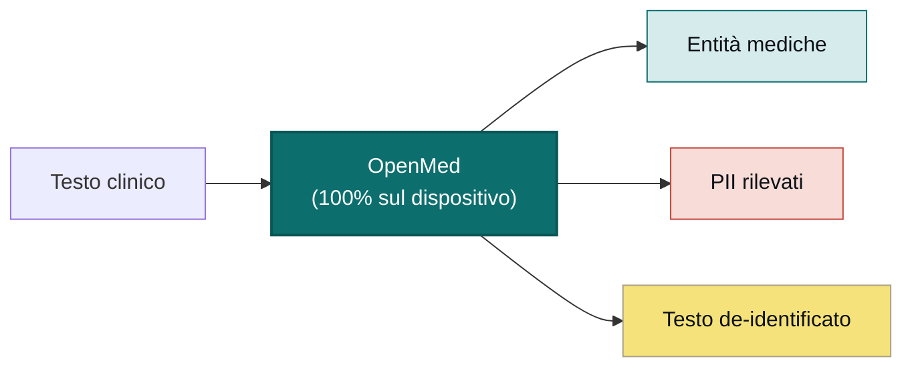

<div align="center">


<h3>IA sanitaria locale che non lascia mai il dispositivo</h3>

<p><b>Trasforma il testo clinico in informazioni strutturate con una sola riga di codice.</b><br/>
Estrazione di entità, de-identificazione dei PII e oltre 1.000 modelli medici specializzati che girano
interamente sul tuo hardware — da una riga in Python a un'app Swift nativa su iPhone, accelerata da Apple MLX.
Niente cloud. Nessun vincolo con il fornitore. Nessun dato del paziente che lascia la tua rete.</p>

<p>
  <a href="https://pypi.org/project/openmed/"></a>
  <a href="https://www.python.org/downloads/"></a>
  <a href="https://huggingface.co/OpenMed"></a>
  <a href="https://arxiv.org/abs/2508.01630"></a>
  <a href="LICENSE"></a>
  <a href="https://github.com/maziyarpanahi/openmed/stargazers"></a>
</p>

<p>
  <a href="swift/OpenMedKit"></a>
  <a href="docs/mlx-backend.md"></a>
  <a href="docs/swift-openmedkit.md"></a>
  <a href="https://openmed.life/docs"></a>
</p>

<p>
  <b>1.000+ modelli</b> &nbsp;·&nbsp; <b>12 lingue</b> &nbsp;·&nbsp; <b>247 checkpoint PII</b> &nbsp;·&nbsp; <b>100% sul dispositivo</b> &nbsp;·&nbsp; <b>Apache-2.0</b>
</p>

<p>
  <a href="README.md">English</a> ·
  <a href="README.zh-CN.md">简体中文</a> ·
  <a href="README.es.md">Español</a> ·
  <a href="README.fr.md">Français</a> ·
  <a href="README.de.md">Deutsch</a> ·
  <b>Italiano</b> ·
  <a href="README.pt.md">Português</a> ·
  <a href="README.nl.md">Nederlands</a> ·
  <a href="README.ar.md">العربية</a> ·
  <a href="README.hi.md">हिन्दी</a> ·
  <a href="README.te.md">తెలుగు</a> ·
  <a href="README.ja.md">日本語</a> ·
  <a href="README.tr.md">Türkçe</a> ·
  <a href="README.fa.md">فارسی</a>
</p>

</div>

---

## Guardalo in azione

<div align="center">
  
  <br/>
  <sub><b>De-identificazione dei PII in tempo reale</b> — il Privacy Filter Nemotron oscura nomi, indirizzi, identificativi e dati di fatturazione da una lettera di dimissione clinica, interamente sul dispositivo. <i>(Tutti i valori mostrati sono sintetici.)</i></sub>
</div>

---

## Esempio in 30 secondi

```python
from openmed import analyze_text

result = analyze_text(
    "Patient started on imatinib for chronic myeloid leukemia.",
    model_name="disease_detection_superclinical",
)

for entity in result.entities:
    print(f"{entity.label:<12} {entity.text:<28} {entity.confidence:.2f}")
# DISEASE      chronic myeloid leukemia     0.98
# DRUG         imatinib                     0.95
```

Un modello di NER clinico allo stato dell'arte in esecuzione localmente — senza chiave API, senza chiamate di rete.

---

## Perché OpenMed?

|                                       |       **OpenMed**        |     API mediche cloud     |
| ------------------------------------- | :----------------------: | :-----------------------: |
| Gira sul tuo dispositivo/server       |            ✅            |            ❌             |
| I dati del paziente lasciano la rete  |        **Mai**           |   Inviati al fornitore     |
| Costo                                 |   Gratis e open source   |  Tariffa per chiamata      |
| Modelli medici specializzati          |          1.000+          |          Limitati         |
| Lingue                                |           12+            |          Variabile        |
| Offline / isolato (air-gapped)        |            ✅            |            ❌             |
| Accelerazione Apple Silicon (MLX)     |            ✅            |            n/d            |
| App native iOS / macOS                |   ✅ tramite OpenMedKit   |            ❌             |
| Vincolo con il fornitore              |   Nessuno — Apache-2.0   |            Sì             |

- **Modelli specializzati** — oltre 1.000 modelli biomedici e clinici selezionati, molti dei quali superano le soluzioni proprietarie.
- **De-identificazione conforme a HIPAA** — tutti i 18 identificatori Safe Harbor, fusione intelligente delle entità e sostituti fittizi che preservano il formato.
- **Gira ovunque** — CPU, CUDA, Apple Silicon (MLX) e nativamente nelle app iOS/macOS tramite OpenMedKit.
- **Distribuzione in una riga** — API Python, servizio REST dockerizzato o pipeline batch.
- **Nessun vincolo** — Apache-2.0, la tua infrastruttura, i tuoi dati.

---

## Sul dispositivo, su Apple — Swift, MLX e iOS

OpenMed è progettato per girare dove vivono già i tuoi dati. Su hardware Apple accelera con **MLX** e arriva
direttamente nelle app per iPhone, iPad e Mac tramite **[OpenMedKit](swift/OpenMedKit)** — così il rilevamento
dei PII e l'estrazione clinica avvengono completamente offline, sul dispositivo.

```swift
// Add OpenMedKit to your app
dependencies: [
    .package(url: "https://github.com/maziyarpanahi/openmed.git", from: "1.5.5"),
]
```

- **Runtime MLX** per la classificazione dei token PII, la famiglia Privacy Filter e le attività zero-shot sperimentali della famiglia GLiNER — con un percorso di fallback CoreML.
- **Un solo nome di modello, tutte le piattaforme** — su hardware non Apple, i nomi dei modelli MLX ricadono automaticamente sul checkpoint PyTorch corrispondente.
- **Python su Apple Silicon** anche: `pip install "openmed[mlx]"`.

Guide: [Backend MLX](docs/mlx-backend.md) · [OpenMedKit (Swift)](docs/swift-openmedkit.md) · [Esportazione CoreML](docs/coreml-export.md)

---

## Come funziona



---

## Avvio rapido

```bash
# Core + Hugging Face runtime (Linux, macOS, Windows; CPU or CUDA)
pip install "openmed[hf]"

# Add the REST service
pip install "openmed[hf,service]"

# Apple Silicon acceleration (MLX)
pip install "openmed[mlx]"
```

<table>
<tr>
<td width="33%" valign="top">

**API Python**

```python
from openmed import analyze_text

analyze_text(
  "Patient received 75mg "
  "clopidogrel for NSTEMI.",
  model_name=
  "pharma_detection_superclinical",
)
```

</td>
<td width="33%" valign="top">

**Servizio REST**

```bash
uvicorn openmed.service.app:app \
  --host 0.0.0.0 --port 8080
```

`GET /health`
`POST /analyze`
`POST /pii/extract`
`POST /pii/deidentify`

</td>
<td width="33%" valign="top">

**Batch**

```python
from openmed import BatchProcessor

p = BatchProcessor(
  model_name=
  "disease_detection_superclinical",
  group_entities=True,
)
p.process_texts([...])
```

</td>
</tr>
</table>

**Offline / isolato?** Punta `model_name` (o `model_id`) a una directory locale e OpenMed la carica senza contattare l'Hub di Hugging Face:

```python
from openmed import OpenMedConfig, analyze_text

result = analyze_text(
    "Patient presents with chronic myeloid leukemia and Type 2 diabetes.",
    model_id="./models/OpenMed-NER-DiseaseDetect-SuperClinical-434M",
    config=OpenMedConfig(device="cpu"),
)
```

---

## Modelli

Un registro curato di modelli NER medici specializzati — esplora il [catalogo completo](https://openmed.life/docs/model-registry).

| Modello | Specializzazione | Tipi di entità | Dimensione |
|---------|------------------|----------------|------------|
| `disease_detection_superclinical` | Malattie e condizioni | DISEASE, CONDITION, DIAGNOSIS | 434M |
| `pharma_detection_superclinical`  | Farmaci e terapie | DRUG, MEDICATION, TREATMENT   | 434M |
| `pii_superclinical_large`     | PII e de-identificazione | NAME, DATE, SSN, PHONE, EMAIL, ADDRESS | 434M |
| `anatomy_detection_electramed`    | Anatomia e parti del corpo | ANATOMY, ORGAN, BODY_PART     | 109M |
| `gene_detection_genecorpus`       | Geni e proteine | GENE, PROTEIN                 | 109M |

---

## Privacy: rilevamento e de-identificazione dei PII

```python
from openmed import extract_pii, deidentify

text = "Patient: John Doe, DOB: 01/15/1970, SSN: 123-45-6789"

# Extract PII with smart merging (prevents tokenization fragmentation)
result = extract_pii(text, model_name="pii_superclinical_large", use_smart_merging=True)

# De-identify with the method you need
deidentify(text, method="mask")     # [NAME], [DATE]
deidentify(text, method="replace")  # Faker-backed, locale-aware, format-preserving fakes
deidentify(text, method="hash")     # Cryptographic hashing
deidentify(text, method="shift_dates", date_shift_days=180)
```

- **La fusione intelligente delle entità** mantiene `01/15/1970` intero invece di frammentarlo.
- **Offuscamento basato su Faker** con provider personalizzati di identificativi clinici (CPF, CNPJ, BSN, NIR, Codice Fiscale, NIE, Aadhaar, Steuer-ID, NPI).
- **HIPAA**: tutti i 18 identificatori Safe Harbor, con soglie di confidenza configurabili.

[Notebook PII completo](examples/notebooks/PII_Detection_Complete_Guide.ipynb) · [Fusione intelligente](docs/pii-smart-merging.md) · [Anonimizzazione](docs/anonymization.md)

<details>
<summary><b>Famiglia Privacy Filter</b> — tre famiglie di modelli sull'architettura OpenAI Privacy Filter</summary>

<br/>

Il codice del modello è identico (transformer MoE sparso in stile gpt-oss con attenzione locale, token sink, RoPE+YaRN, tokenizzazione tiktoken `o200k_base`); cambiano solo i dati di addestramento. Tutti usano la **stessa** API `extract_pii()` / `deidentify()` — cambia solo l'argomento `model_name=`.

| Variante | PyTorch (CPU + CUDA) | MLX (Apple Silicon) | MLX 8-bit |
| --- | --- | --- | --- |
| **OpenAI Privacy Filter** | [`openai/privacy-filter`](https://huggingface.co/openai/privacy-filter) | [`OpenMed/privacy-filter-mlx`](https://huggingface.co/OpenMed/privacy-filter-mlx) | [`…-mlx-8bit`](https://huggingface.co/OpenMed/privacy-filter-mlx-8bit) |
| **Nemotron-PII fine-tune** | [`OpenMed/privacy-filter-nemotron`](https://huggingface.co/OpenMed/privacy-filter-nemotron) | [`…-nemotron-mlx`](https://huggingface.co/OpenMed/privacy-filter-nemotron-mlx) | [`…-nemotron-mlx-8bit`](https://huggingface.co/OpenMed/privacy-filter-nemotron-mlx-8bit) |
| **OpenMed Multilingual** | [`OpenMed/privacy-filter-multilingual`](https://huggingface.co/OpenMed/privacy-filter-multilingual) | [`…-multilingual-mlx`](https://huggingface.co/OpenMed/privacy-filter-multilingual-mlx) | [`…-multilingual-mlx-8bit`](https://huggingface.co/OpenMed/privacy-filter-multilingual-mlx-8bit) |

```python
from openmed import extract_pii

text = "Patient Sarah Connor (DOB: 03/15/1985) at MRN 4471882."

extract_pii(text, model_name="openai/privacy-filter")              # PyTorch baseline
extract_pii(text, model_name="OpenMed/privacy-filter-nemotron")    # same code, different weights
extract_pii(text, model_name="OpenMed/privacy-filter-mlx")         # Apple Silicon (MLX)
```

Sugli host non Apple Silicon, i nomi dei modelli MLX vengono sostituiti automaticamente con il checkpoint PyTorch corrispondente (con un avviso una tantum) — scrivi un solo nome di modello, eseguilo ovunque. Vedi [Architettura Privacy Filter e routing del backend](docs/anonymization.md#privacy-filter-family).

</details>

---

## PII multilingue (12 lingue)

Estrazione e de-identificazione in `en`, `fr`, `de`, `it`, `es`, `nl`, `hi`, `te`, `pt`, `ar`, `ja` e `tr` — **247 checkpoint PII** in totale.

```bash
python -c "from openmed import extract_pii; print([(e.label, e.text) for e in extract_pii('Dr. Pedro Almeida, CPF: 123.456.789-09, email: pedro@hospital.pt', lang='pt').entities])"
```

<details>
<summary>Mostra esempi per lingua (portoghese, olandese, hindi, arabo, giapponese, turco)</summary>

<br/>

```python
from openmed import extract_pii

portuguese = extract_pii("Paciente: Pedro Almeida, CPF: 123.456.789-09, telefone: +351 912 345 678", lang="pt", use_smart_merging=True)
dutch      = extract_pii("Patiënt: Eva de Vries, BSN: 123456782, telefoon: +31 6 12345678", lang="nl", use_smart_merging=True)
hindi      = extract_pii("रोगी: अनीता शर्मा, फोन: +91 9876543210, पता: नई दिल्ली 110001", lang="hi", use_smart_merging=True)
arabic     = extract_pii("المريضة ليلى حسن، الهاتف +20 10 1234 5678، الرقم القومي 29801011234567.", lang="ar", use_smart_merging=True)
japanese   = extract_pii("患者 佐藤 花子、電話 +81 90 1234 5678、マイナンバー 1234 5678 9012.", lang="ja", use_smart_merging=True)
turkish    = extract_pii("Hasta Ayşe Yılmaz, telefon +90 532 123 45 67, TCKN 10000000146.", lang="tr", use_smart_merging=True)

for r in (portuguese, dutch, hindi, arabic, japanese, turkish):
    print([(e.label, e.text) for e in r.entities])
```

</details>

---

## REST API

Un servizio FastAPI compatibile con Docker, con validazione delle richieste, precaricamento della pipeline condivisa e involucri di errore unificati.

```bash
pip install "openmed[hf,service]"
uvicorn openmed.service.app:app --host 0.0.0.0 --port 8080

# or with Docker
docker build -t openmed:1.5.5 .
docker run --rm -p 8080:8080 -e OPENMED_PROFILE=prod openmed:1.5.5
```

```bash
curl -X POST http://127.0.0.1:8080/pii/extract \
  -H "Content-Type: application/json" \
  -d '{"text":"Paciente: Maria Garcia, DNI: 12345678Z","lang":"es"}'
```

Consulta la [guida completa al servizio REST](docs/rest-service.md).

---

## Documentazione

Guide complete su **[openmed.life/docs](https://openmed.life/docs/)**.

| | | |
|---|---|---|
| [Per iniziare](https://openmed.life/docs/) | [Analizza testo](https://openmed.life/docs/analyze-text) | [Registro dei modelli](https://openmed.life/docs/model-registry) |
| [Guida al rilevamento PII](examples/notebooks/PII_Detection_Complete_Guide.ipynb) | [Anonimizzazione](docs/anonymization.md) | [Elaborazione batch](https://openmed.life/docs/batch-processing) |
| [Profili di configurazione](https://openmed.life/docs/profiles) | [Servizio REST](docs/rest-service.md) | [Backend MLX](docs/mlx-backend.md) |

---

## Conosci la mascotte


Il guardiano di OpenMed è un soffice gatto persiano nei panni di un piccolo **Avicenna (Ibn Sina)** — il grande
medico persiano il cui *Canone della medicina* fu il testo medico di riferimento nel mondo per circa 600 anni.
Veglia sul libro aperto del sapere medico, con una palette ispirata al **turchese persiano (fīrūza)**: un
guardiano local-first per i tuoi dati più riservati.

<br clear="left"/>

---

## Contribuire

I contributi sono benvenuti — segnalazioni di bug, richieste di funzionalità e PR.

- [Apri una issue](https://github.com/maziyarpanahi/openmed/issues)
- **Traduzioni benvenute** — aiuta a completare i README nelle altre lingue collegati nel selettore in alto.

---

## Ringraziamenti

OpenMed si basa su eccellente lavoro open source — un ringraziamento speciale a **OpenAI** (l'architettura [Privacy Filter](https://huggingface.co/openai/privacy-filter)), **NVIDIA** (il [dataset Nemotron PII](https://huggingface.co/datasets/nvidia/Nemotron-PII-v1)), **Hugging Face** (`transformers` e l'ecosistema di modelli), **Apple** ([MLX](https://github.com/ml-explore/mlx)) e i manutentori di **[Faker](https://faker.readthedocs.io/)**.

## Licenza

Distribuito con [Licenza Apache-2.0](LICENSE).

## Citazione

Se OpenMed ti è utile nella tua ricerca, ti preghiamo di citarlo:

```bibtex
@misc{panahi2025openmedneropensourcedomainadapted,
      title={OpenMed NER: Open-Source, Domain-Adapted State-of-the-Art Transformers for Biomedical NER Across 12 Public Datasets},
      author={Maziyar Panahi},
      year={2025},
      eprint={2508.01630},
      archivePrefix={arXiv},
      primaryClass={cs.CL},
      url={https://arxiv.org/abs/2508.01630},
}
```

---

## Cronologia delle stelle

Se OpenMed ti è utile, una stella aiuta altri a scoprirlo.

<a href="https://star-history.com/#maziyarpanahi/openmed&Date">
  
</a>

---

<div align="center">

Realizzato dal team OpenMed

<a href="https://openmed.life">Sito web</a> ·
<a href="https://openmed.life/docs">Documentazione</a> ·
<a href="https://x.com/openmed_ai">X / Twitter</a> ·
<a href="https://www.linkedin.com/company/openmed-ai/">LinkedIn</a>

</div>
