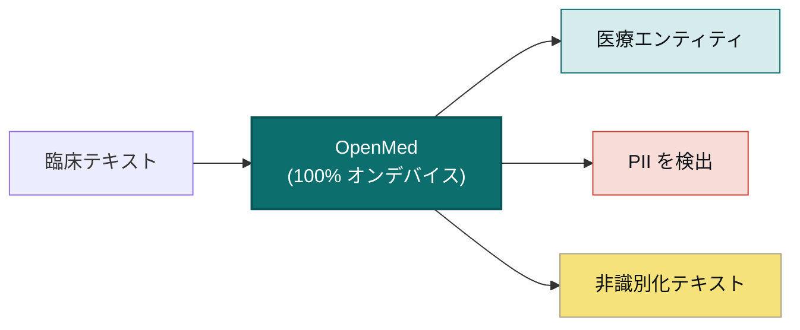

<div align="center">


<h3>あなたのデータ。あなたのモデル。あなたのハードウェア。</h3>

<p><b>臨床テキストを、構造化され匿名化されたインサイトへ変換します。アップロードは一切ありません。</b><br/>
OpenMed は生物医学エンティティを抽出し、55+ 種類の PHI を、お客様が管理するハードウェア上で完全に除去するため、データがデバイスから外に出ることはありません。同じ 2,000+ のオープンモデルが、スマートフォンから GPU サーバーまで、完全オフラインで動作します。iOS と iPadOS では OpenMedKit 経由、Android では ONNX 経由、通常の CPU、Apple Silicon、NVIDIA GPU、そしてブラウザに対応します。クラウドなし。ベンダーロックインなし。患者データがネットワークの外に出ることもありません。</p>

<p>
  <a href="https://pypi.org/project/openmed/"></a>
  <a href="https://www.python.org/downloads/"></a>
  <a href="https://huggingface.co/OpenMed"></a>
  <a href="https://arxiv.org/abs/2508.01630"></a>
  <a href="LICENSE"></a>
  <a href="https://github.com/maziyarpanahi/openmed/stargazers"></a>
</p>

<p>
  <a href="swift/OpenMedKit"></a>
  <a href="docs/mlx-backend.md"></a>
  <a href="docs/swift-openmedkit.md"></a>
  <a href="https://openmed.life/docs"></a>
</p>

<p>
  <b>2,000+ モデル</b> &nbsp;·&nbsp; <b>15 の PII 対応言語</b> &nbsp;·&nbsp; <b>600+ 個の PII チェックポイント</b> &nbsp;·&nbsp; <b>100% オンデバイス</b> &nbsp;·&nbsp; <b>Apache-2.0</b>
</p>

<p>
  <a href="README.md">English</a> ·
  <a href="README.zh-CN.md">简体中文</a> ·
  <a href="README.es.md">Español</a> ·
  <a href="README.fr.md">Français</a> ·
  <a href="README.de.md">Deutsch</a> ·
  <a href="README.it.md">Italiano</a> ·
  <a href="README.pt.md">Português</a> ·
  <a href="README.nl.md">Nederlands</a> ·
  <a href="README.ar.md">العربية</a> ·
  <a href="README.hi.md">हिन्दी</a> ·
  <a href="README.te.md">తెలుగు</a> ·
  <b>日本語</b> ·
  <a href="README.tr.md">Türkçe</a> ·
  <a href="README.fa.md">فارسی</a>
</p>

</div>

---

## 実際の動作

<div align="center">
  
  <br/>
  <sub><b>リアルタイムの PII 非識別化</b>：Nemotron Privacy Filter が臨床退院サマリーの氏名・住所・ID・請求データをオンデバイスでマスキングします。<i>（表示されている値はすべて合成データです。）</i></sub>
</div>

---

## 30 秒で試す例

```python
from openmed import analyze_text

result = analyze_text(
    "Patient started on imatinib for chronic myeloid leukemia.",
    model_name="disease_detection_superclinical",
)

for entity in result.entities:
    print(f"{entity.label:<12} {entity.text:<28} {entity.confidence:.2f}")
# DISEASE      chronic myeloid leukemia     0.98
# DRUG         imatinib                     0.95
```

最先端の臨床 NER モデルがローカルで動作：API キー不要、ネットワーク呼び出しなし。

---

## OpenMed を選ぶ理由

|                                       |       **OpenMed**        |     クラウド医療 API      |
| ------------------------------------- | :----------------------: | :-----------------------: |
| 自分のデバイス/サーバーで動作          |            ✅            |            ❌             |
| 患者データがネットワーク外に出る       |      **決して出ない**     |     ベンダーに送信         |
| コスト                                |  無料・オープンソース     |   呼び出しごとの課金       |
| 専門医療モデル                        |          2,000+          |          限定的           |
| 言語                                  |           12+            |          まちまち         |
| オフライン / 隔離環境 (air-gapped)    |            ✅            |            ❌             |
| Apple Silicon (MLX) アクセラレーション |            ✅            |          非対応           |
| ネイティブ iOS / macOS アプリ          |   ✅ OpenMedKit 経由     |            ❌             |
| ベンダーロックイン                    |    なし：Apache-2.0     |            あり           |

- **専門モデル**：厳選された 2,000 以上の生物医学・臨床モデル。その多くは商用の専有スタックを上回ります。
- **HIPAA 対応の非識別化**：18 項目すべての Safe Harbor 識別子、スマートなエンティティ統合、フォーマットを保持する偽データ置換。
- **どこでも動作**：CPU、CUDA、Apple Silicon (MLX)、そして OpenMedKit 経由で iOS/macOS アプリにネイティブ対応。
- **1 行でデプロイ**：Python API、Docker 化された REST サービス、またはバッチパイプライン。
- **ロックインなし**：Apache-2.0、あなたのインフラ、あなたのデータ。

---

## オンデバイス、Apple 上で：Swift、MLX、iOS

OpenMed は、データがすでに存在する場所で動作するよう作られています。Apple ハードウェアでは **MLX** で高速化し、
**[OpenMedKit](swift/OpenMedKit)** を通じて iPhone・iPad・Mac アプリに直接組み込めます。PII 検出と臨床抽出は
完全にオフラインで、デバイス上で行われます。

```swift
// Add OpenMedKit to your app
dependencies: [
    .package(url: "https://github.com/maziyarpanahi/openmed.git", branch: "master"),
]
```

- **MLX ランタイム**：PII トークン分類、Privacy Filter ファミリー、実験的な GLiNER ファミリーの zero-shot タスクに対応（CoreML フォールバック経路あり）。
- **1 つのモデル名であらゆるプラットフォーム**：Apple 以外のハードウェアでは、MLX のモデル名は対応する PyTorch チェックポイントに自動的にフォールバックします。
- **Apple Silicon 上の Python** も対応：`pip install --upgrade "openmed[mlx]"`。

ガイド：[MLX バックエンド](docs/mlx-backend.md) · [OpenMedKit (Swift)](docs/swift-openmedkit.md) · [CoreML エクスポート](docs/coreml-export.md)

---

## 仕組み



---

## クイックスタート

```bash
# Core + Hugging Face runtime (Linux, macOS, Windows; CPU or CUDA)
pip install --upgrade "openmed[hf]"

# Add the REST service
pip install --upgrade "openmed[hf,service]"

# Apple Silicon acceleration (MLX)
pip install --upgrade "openmed[mlx]"
```

<table>
<tr>
<td width="33%" valign="top">

**Python API**

```python
from openmed import analyze_text

analyze_text(
  "Patient received 75mg "
  "clopidogrel for NSTEMI.",
  model_name=
  "pharma_detection_superclinical",
)
```

</td>
<td width="33%" valign="top">

**REST サービス**

```bash
uvicorn openmed.service.app:app \
  --host 0.0.0.0 --port 8080
```

`GET /health`
`POST /analyze`
`POST /pii/extract`
`POST /pii/deidentify`

</td>
<td width="33%" valign="top">

**バッチ**

```python
from openmed import BatchProcessor

p = BatchProcessor(
  model_name=
  "disease_detection_superclinical",
  group_entities=True,
)
p.process_texts([...])
```

</td>
</tr>
</table>

**オフライン / 隔離環境？** `model_name`（または `model_id`）をローカルディレクトリに指定すれば、OpenMed は Hugging Face Hub に接続せずにローカルで読み込みます：

```python
from openmed import OpenMedConfig, analyze_text

result = analyze_text(
    "Patient presents with chronic myeloid leukemia and Type 2 diabetes.",
    model_id="./models/OpenMed-NER-DiseaseDetect-SuperClinical-434M",
    config=OpenMedConfig(device="cpu"),
)
```

---

## モデル

厳選された専門医療 NER モデルのレジストリ。[全カタログ](https://openmed.life/docs/model-registry)を参照してください。

| モデル | 専門分野 | エンティティ種別 | サイズ |
|--------|----------|------------------|--------|
| `disease_detection_superclinical` | 疾患・病態 | DISEASE, CONDITION, DIAGNOSIS | 434M |
| `pharma_detection_superclinical`  | 薬剤・投薬 | DRUG, MEDICATION, TREATMENT   | 434M |
| `pii_superclinical_large`     | PII・非識別化 | NAME, DATE, SSN, PHONE, EMAIL, ADDRESS | 434M |
| `anatomy_detection_electramed`    | 解剖・身体部位 | ANATOMY, ORGAN, BODY_PART     | 109M |
| `gene_detection_genecorpus`       | 遺伝子・タンパク質 | GENE, PROTEIN                 | 109M |

---

## プライバシー：PII 検出と非識別化

```python
from openmed import extract_pii, deidentify

text = "Patient: John Doe, DOB: 01/15/1970, SSN: 123-45-6789"

# Extract PII with smart merging (prevents tokenization fragmentation)
result = extract_pii(text, model_name="pii_superclinical_large", use_smart_merging=True)

# De-identify with the method you need
deidentify(text, method="mask")     # [NAME], [DATE]
deidentify(text, method="replace")  # Faker-backed, locale-aware, format-preserving fakes
deidentify(text, method="hash")     # Cryptographic hashing
deidentify(text, method="shift_dates", date_shift_days=180)
```

- **スマートなエンティティ統合**は `01/15/1970` を分割せずにそのまま保持します。
- **Faker ベースの難読化**：臨床 ID 用のカスタムプロバイダー（CPF、CNPJ、BSN、NIR、Codice Fiscale、NIE、Aadhaar、Steuer-ID、NPI）を内蔵。
- **HIPAA**：18 項目すべての Safe Harbor 識別子、信頼度しきい値を設定可能。

[完全な PII ノートブック](examples/notebooks/PII_Detection_Complete_Guide.ipynb) · [スマート統合](docs/pii-smart-merging.md) · [匿名化](docs/anonymization.md)

<details>
<summary><b>Privacy Filter ファミリー</b>：OpenAI Privacy Filter アーキテクチャ上の 3 つのモデルファミリー</summary>

<br/>

モデルのコードは同一です（局所注意・sink トークン・RoPE+YaRN・tiktoken `o200k_base` トークナイザを備えた gpt-oss 風スパース MoE Transformer）。異なるのは学習データのみです。すべて**同一の** `extract_pii()` / `deidentify()` API を経由します。変更するのは `model_name=` 引数だけです。

| バリアント | PyTorch (CPU + CUDA) | MLX (Apple Silicon) | MLX 8-bit |
| --- | --- | --- | --- |
| **OpenAI Privacy Filter** | [`openai/privacy-filter`](https://huggingface.co/openai/privacy-filter) | [`OpenMed/privacy-filter-mlx`](https://huggingface.co/OpenMed/privacy-filter-mlx) | [`…-mlx-8bit`](https://huggingface.co/OpenMed/privacy-filter-mlx-8bit) |
| **Nemotron-PII fine-tune** | [`OpenMed/privacy-filter-nemotron`](https://huggingface.co/OpenMed/privacy-filter-nemotron) | [`…-nemotron-mlx`](https://huggingface.co/OpenMed/privacy-filter-nemotron-mlx) | [`…-nemotron-mlx-8bit`](https://huggingface.co/OpenMed/privacy-filter-nemotron-mlx-8bit) |
| **OpenMed Multilingual** | [`OpenMed/privacy-filter-multilingual`](https://huggingface.co/OpenMed/privacy-filter-multilingual) | [`…-multilingual-mlx`](https://huggingface.co/OpenMed/privacy-filter-multilingual-mlx) | [`…-multilingual-mlx-8bit`](https://huggingface.co/OpenMed/privacy-filter-multilingual-mlx-8bit) |

```python
from openmed import extract_pii

text = "Patient Sarah Connor (DOB: 03/15/1985) at MRN 4471882."

extract_pii(text, model_name="openai/privacy-filter")              # PyTorch baseline
extract_pii(text, model_name="OpenMed/privacy-filter-nemotron")    # same code, different weights
extract_pii(text, model_name="OpenMed/privacy-filter-mlx")         # Apple Silicon (MLX)
```

Apple Silicon 以外のホストでは、MLX のモデル名は対応する PyTorch チェックポイントに自動的に置き換えられます（一度だけ警告が表示されます）。モデル名を 1 つ書けば、どこでも動作します。[Privacy Filter アーキテクチャとバックエンドのルーティング](docs/anonymization.md#privacy-filter-family)を参照してください。

</details>

---

## 多言語 PII（12 言語）

`en`、`fr`、`de`、`it`、`es`、`nl`、`hi`、`te`、`pt`、`ar`、`ja`、`tr` での抽出と非識別化：合計 **600+ 個の PII チェックポイント**。

```bash
python -c "from openmed import extract_pii; print([(e.label, e.text) for e in extract_pii('Dr. Pedro Almeida, CPF: 123.456.789-09, email: pedro@hospital.pt', lang='pt').entities])"
```

<details>
<summary>言語別の例を表示（ポルトガル語、オランダ語、ヒンディー語、アラビア語、日本語、トルコ語）</summary>

<br/>

```python
from openmed import extract_pii

portuguese = extract_pii("Paciente: Pedro Almeida, CPF: 123.456.789-09, telefone: +351 912 345 678", lang="pt", use_smart_merging=True)
dutch      = extract_pii("Patiënt: Eva de Vries, BSN: 123456782, telefoon: +31 6 12345678", lang="nl", use_smart_merging=True)
hindi      = extract_pii("रोगी: अनीता शर्मा, फोन: +91 9876543210, पता: नई दिल्ली 110001", lang="hi", use_smart_merging=True)
arabic     = extract_pii("المريضة ليلى حسن، الهاتف +20 10 1234 5678، الرقم القومي 29801011234567.", lang="ar", use_smart_merging=True)
japanese   = extract_pii("患者 佐藤 花子、電話 +81 90 1234 5678、マイナンバー 1234 5678 9012.", lang="ja", use_smart_merging=True)
turkish    = extract_pii("Hasta Ayşe Yılmaz, telefon +90 532 123 45 67, TCKN 10000000146.", lang="tr", use_smart_merging=True)

for r in (portuguese, dutch, hindi, arabic, japanese, turkish):
    print([(e.label, e.text) for e in r.entities])
```

</details>

---

## REST API

リクエスト検証、共有パイプラインのプリロード、統一されたエラーエンベロープを備えた、Docker フレンドリーな FastAPI サービス。

```bash
pip install --upgrade "openmed[hf,service]"
uvicorn openmed.service.app:app --host 0.0.0.0 --port 8080

# or with Docker
docker build -t openmed:local .
docker run --rm -p 8080:8080 -e OPENMED_PROFILE=prod openmed:local
```

```bash
curl -X POST http://127.0.0.1:8080/pii/extract \
  -H "Content-Type: application/json" \
  -d '{"text":"Paciente: Maria Garcia, DNI: 12345678Z","lang":"es"}'
```

完全な [REST サービスガイド](docs/rest-service.md)を参照してください。

---

## ドキュメント

完全なガイドは **[openmed.life/docs](https://openmed.life/docs/)** にあります。

| | | |
|---|---|---|
| [はじめに](https://openmed.life/docs/) | [テキスト分析](https://openmed.life/docs/analyze-text) | [モデルレジストリ](https://openmed.life/docs/model-registry) |
| [PII 検出ガイド](examples/notebooks/PII_Detection_Complete_Guide.ipynb) | [匿名化](docs/anonymization.md) | [バッチ処理](https://openmed.life/docs/batch-processing) |
| [設定プロファイル](https://openmed.life/docs/profiles) | [REST サービス](docs/rest-service.md) | [MLX バックエンド](docs/mlx-backend.md) |

---

## マスコットの紹介


OpenMed の守護者は、小さな**アヴィセンナ（イブン・スィーナー、Avicenna / Ibn Sina）**に扮したふわふわのペルシャ
猫です。その『医学典範』（*Canon of Medicine*）は約 600 年にわたり世界の標準的な医学教科書でした。開かれた
医学知識の書を見守り、配色は**ペルシャ・ターコイズ（fīrūza）**にちなんでいます。あなたの最もプライベートな
データを守る、ローカルファーストの守護者です。

<br clear="left"/>

---

## コントリビュート

コントリビューション歓迎：バグ報告、機能リクエスト、PR いずれも歓迎します。

- [Issue を開く](https://github.com/maziyarpanahi/openmed/issues)
- **翻訳歓迎**：上部の言語スイッチャーにリンクされた他言語の README の完成にご協力ください。

---

## クレジット

OpenMed は優れたオープンソースの成果の上に成り立っています。特に **OpenAI**（[Privacy Filter](https://huggingface.co/openai/privacy-filter) アーキテクチャ）、**NVIDIA**（[Nemotron PII データセット](https://huggingface.co/datasets/nvidia/Nemotron-PII-v1)）、**Hugging Face**（`transformers` とモデルエコシステム）、**Apple**（[MLX](https://github.com/ml-explore/mlx)）、そして **[Faker](https://faker.readthedocs.io/)** のメンテナーに感謝します。

## ライセンス

[Apache-2.0 ライセンス](LICENSE)の下で公開されています。

## 引用

研究で OpenMed が役立った場合は、ぜひ引用してください：

```bibtex
@misc{panahi2025openmedneropensourcedomainadapted,
      title={OpenMed NER: Open-Source, Domain-Adapted State-of-the-Art Transformers for Biomedical NER Across 12 Public Datasets},
      author={Maziyar Panahi},
      year={2025},
      eprint={2508.01630},
      archivePrefix={arXiv},
      primaryClass={cs.CL},
      url={https://arxiv.org/abs/2508.01630},
}
```

---

## スター履歴

OpenMed が役立つと感じたら、スターを付けると他の人が見つけやすくなります。

<a href="https://star-history.com/#maziyarpanahi/openmed&Date">
  
</a>

---

<div align="center">

OpenMed チームが制作

<a href="https://openmed.life">ウェブサイト</a> ·
<a href="https://openmed.life/docs">ドキュメント</a> ·
<a href="https://x.com/openmed_ai">X / Twitter</a> ·
<a href="https://www.linkedin.com/company/openmed-ai/">LinkedIn</a>

</div>
