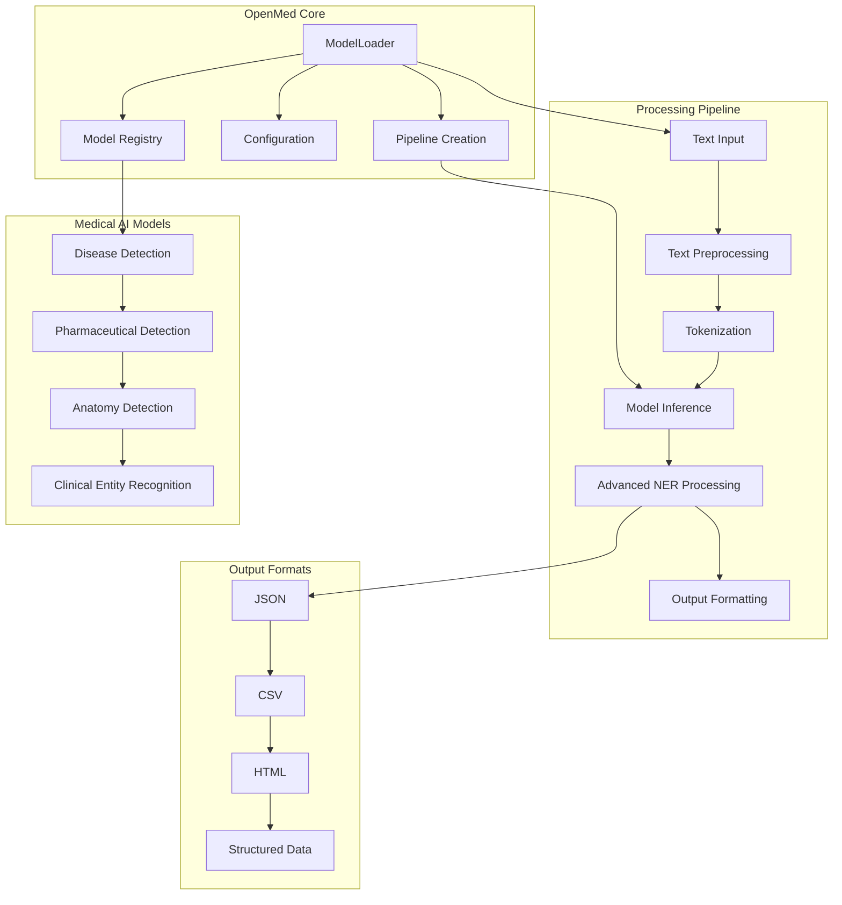
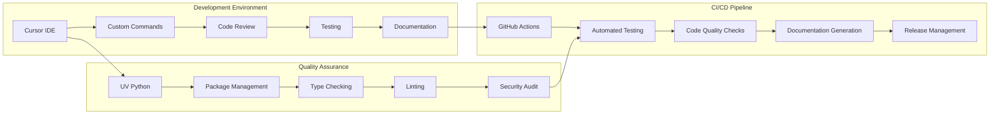
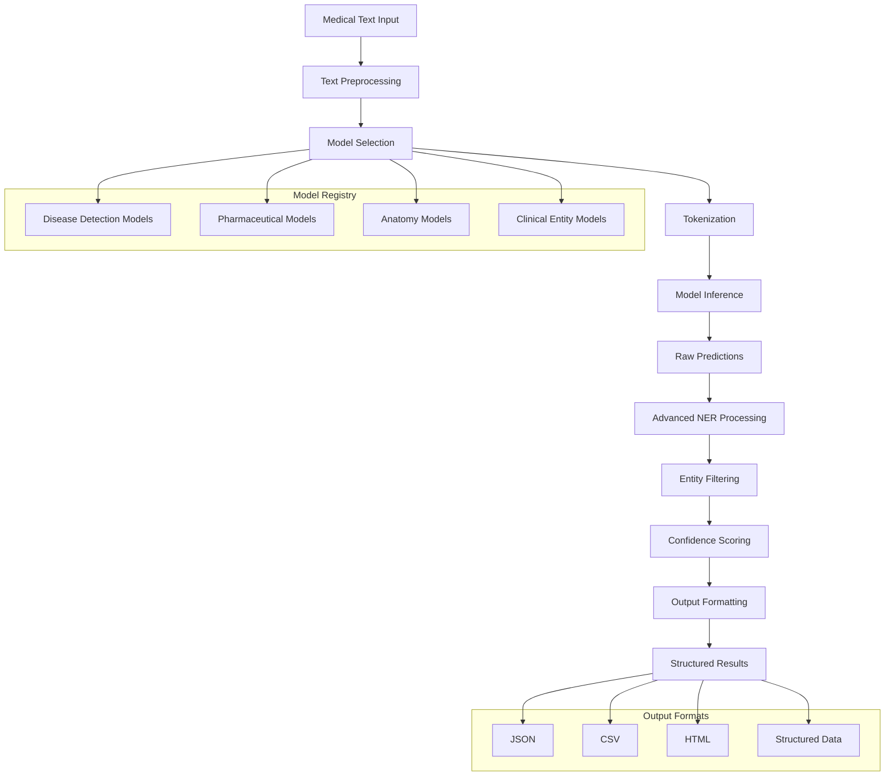

# OpenMed

OpenMed is a Python toolkit for biomedical and clinical NLP, built to deliver state-of-the-art models, including advanced large language models (LLMs) for healthcare, that rival and often outperform proprietary enterprise solutions. It unifies model discovery, assertion status detection, de-identification pipelines, advanced extraction and reasoning tools, and one-line orchestration for scripts, services, or notebooks, enabling teams to deploy production-grade healthcare AI without vendor lock-in.

It also bundles configuration management, model loading, support for cutting-edge medical LLMs, post-processing, and formatting utilities — making it seamless to integrate clinical AI into existing scripts, services, and research workflows.

> **Status:** The package is pre-release and the API may change. Feedback and contributions are
> welcome while the project stabilises.

## 🏗️ Project Architecture



## 🔄 Development Workflow



## 📚 Documentation & Development Tools

### **Core Development Guides**

- **[Cursor IDE Configuration](.cursor/rules/)** - Custom development rules and standards
- **[Cursor Commands](.cursor/commands/)** - AI-powered development workflow commands
- **[UV Python Package Manager](.cursor/rules/uv-python.mdc)** - Modern Python development standards
- **[Docker Integration](.cursor/rules/docker-uv-python.mdc)** - Containerised development workflows

### **Available Cursor Commands**

- **`/code-review`** - Comprehensive code review automation
- **`/write-tests`** - Generate comprehensive test suites
- **`/fix-bugs`** - Systematic debugging and issue resolution
- **`/refactor-code`** - Intelligent code refactoring
- **`/setup-new-feature`** - Complete feature implementation
- **`/optimise-performance`** - Performance analysis and improvement
- **`/security-audit`** - Comprehensive security review
- **`/add-documentation`** - Generate comprehensive documentation
- **`/create-pr`** - Generate detailed pull requests
- **`/debug-issue`** - Systematic issue debugging
- **`/onboard-developer`** - New team member onboarding

## 🏗️ Repository Structure

```text
openmed/
├── openmed/                                # Core package
│   ├── core/                              # Core functionality
│   │   ├── config.py                      # Configuration management
│   │   ├── model_registry.py              # Model registry and discovery
│   │   └── models.py                      # Model definitions
│   ├── processing/                        # Text processing pipeline
│   │   ├── advanced_ner.py                # Advanced NER post-processing
│   │   ├── outputs.py                     # Output formatting utilities
│   │   ├── text.py                        # Text preprocessing
│   │   └── tokenization.py                # Tokenisation helpers
│   ├── cli/                               # Command-line interface
│   │   └── main.py                        # CLI entry point
│   └── utils/                             # Utility functions
│       ├── logging.py                     # Logging configuration
│       └── validation.py                  # Input validation
├── .cursor/                               # Cursor IDE configuration
│   ├── rules/                             # Development rules
│   │   ├── global.mdc                     # Global project standards
│   │   ├── uv-python.mdc                  # UV Python development rules
│   │   └── docker-uv-python.mdc           # Docker with UV standards
│   └── commands/                          # Custom slash commands
│       ├── README.md                      # Commands overview
│       ├── code-review.md                 # Code review automation
│       ├── write-tests.md                 # Test generation
│       ├── fix-bugs.md                    # Bug fixing
│       ├── refactor-code.md               # Code refactoring
│       ├── setup-new-feature.md           # Feature implementation
│       ├── optimise-performance.md        # Performance optimization
│       ├── security-audit.md              # Security auditing
│       ├── add-documentation.md           # Documentation addition
│       ├── create-pr.md                   # Pull request creation
│       ├── debug-issue.md                 # Issue debugging
│       └── onboard-developer.md           # Developer onboarding
├── docs/                                  # Documentation
│   ├── README.md                          # Documentation overview
│   └── website/                           # Project website
├── examples/                              # Usage examples
│   └── notebooks/                         # Jupyter notebooks
├── tests/                                 # Test suite
│   ├── unit/                              # Unit tests
│   ├── integration/                       # Integration tests
│   └── fixtures/                          # Test fixtures
├── scripts/                               # Automation scripts
└── pyproject.toml                         # Project configuration
```

## ✨ Key Features

### 🧠 **Medical AI Models**

- **Curated model registry** with metadata for the OpenMed Hugging Face collection, including
  category filters, entity coverage, and confidence guidance
- **State-of-the-art medical LLMs** that rival and outperform proprietary enterprise solutions
- **Specialised medical entity recognition** for diseases, pharmaceuticals, anatomy, and clinical entities

### 🔧 **Core Functionality**

- **One-line model loading** via `ModelLoader`, with optional pipeline creation,
  caching, and authenticated access to private models
- **Advanced NER post-processing** (`AdvancedNERProcessor`) that applies the filtering and
  grouping techniques proven in the OpenMed demos
- **Text preprocessing & tokenisation helpers** tailored for medical text workflows
- **Output formatting utilities** that convert raw predictions into dict/JSON/HTML/CSV for
  downstream systems

### 🛠️ **Development Tools**

- **Cursor IDE Integration** - AI-powered development with custom rules and commands
- **UV Python Package Manager** - 10-100x faster than traditional tools
- **Comprehensive Testing** - Unit tests, integration tests, and fixtures
- **Quality Assurance** - Logging and validation helpers to keep pipelines observable and inputs safe
- **Documentation System** - Automated generation and comprehensive guides

### 🚀 **Production Ready**

- **Configuration management** with environment variable support
- **Caching and optimisation** for production workloads
- **Security features** including input validation and secure model access
- **CLI interface** for quick model discovery and text analysis

## 🔄 Medical AI Processing Workflow



## 🚀 Quick Start

### Prerequisites

- Python 3.10 or newer
- [`transformers`](https://huggingface.co/docs/transformers/index) and a compatible deep learning
  backend such as [PyTorch](https://pytorch.org/get-started/locally/)
- Optional `HF_TOKEN` environment variable for gated models

### Installation

#### Option 1: PyPI Installation

```bash
pip install openmed transformers
# Install PyTorch backend (CPU version shown):
pip install torch --index-url https://download.pytorch.org/whl/cpu
```

#### Option 2: UV Package Manager (Recommended)

```bash
# Install UV if not already installed
curl -LsSf https://astral.sh/uv/install.sh | sh

# Create new project with UV
uv init my-medical-ai-project
cd my-medical-ai-project

# Add OpenMed dependencies
uv add openmed transformers torch
```

#### Option 3: Development Installation

```bash
# Clone the repository
git clone https://github.com/OpenMed/OpenMed.git
cd OpenMed

# Install with UV (recommended)
uv sync

# Or install with pip
pip install -e .
```

> **Note:** For GPU support, install CUDA-enabled PyTorch wheels following the [official instructions](https://pytorch.org/get-started/locally/).

### Basic Usage

```python
from openmed.core import ModelLoader
from openmed.processing import format_predictions

# Initialise the model loader
loader = ModelLoader()  # uses the default configuration

# Create a medical NER pipeline
ner = loader.create_pipeline(
    "disease_detection_superclinical",  # registry key or full model ID
    aggregation_strategy="simple",      # group sub-token predictions for quick wins
)

# Analyse medical text
text = "Patient diagnosed with acute lymphoblastic leukemia and started on imatinib."
raw_predictions = ner(text)

# Format and display results
result = format_predictions(raw_predictions, text, model_name="Disease Detection")
for entity in result.entities:
    print(f"{entity.label:<12} -> {entity.text} (confidence={entity.confidence:.2f})")
```

### Convenience Helper

```python
from openmed import analyze_text

# Single-call analysis
result = analyze_text(
    "Patient received 75mg clopidogrel for NSTEMI.",
    model_name="pharma_detection_superclinical"
)

for entity in result.entities:
    print(entity)
```

## 🛠️ Technologies & Tools

### **Core Technologies**

- **Python 3.10+** - Modern Python with type hints and error handling
- **Transformers** - Hugging Face transformers for medical AI models
- **PyTorch** - Deep learning backend for model inference
- **UV Python** - Ultra-fast Python package manager (10-100x faster than pip)

### **Development Tools**

- **Cursor IDE** - AI-powered code editor with custom rules and commands
- **GitHub Actions** - CI/CD workflows and automated testing
- **Docker** - Containerised development and deployment
- **Pre-commit Hooks** - Automated code quality checks

### **Medical AI Stack**

- **Hugging Face Hub** - Model registry and distribution
- **Medical NLP Models** - Specialised biomedical and clinical models
- **Advanced NER** - Post-processing for medical entity recognition
- **Clinical Text Processing** - Medical-specific text preprocessing

### **Quality Assurance**

- **Black** - Code formatting
- **Ruff** - Fast Python linter
- **MyPy** - Static type checking
- **Pytest** - Testing framework
- **Security Auditing** - Automated security checks

## 💼 Use Cases

### **For Healthcare Researchers**

- **Clinical text analysis** for research studies and clinical trials
- **Medical entity extraction** from electronic health records
- **Biomedical literature mining** for drug discovery and research
- **Clinical decision support** system development

### **For Healthcare Organisations**

- **Electronic health record processing** and structured data extraction
- **Clinical documentation automation** and quality improvement
- **Medical coding assistance** and billing optimisation
- **Patient safety monitoring** through clinical text analysis

### **For Medical AI Developers**

- **Rapid prototyping** of medical AI applications
- **Model evaluation and benchmarking** against clinical datasets
- **Integration into existing healthcare systems** and workflows
- **Custom medical AI model development** and fine-tuning

### **For Academic Institutions**

- **Medical education** and training material development
- **Research collaboration** and reproducible medical AI studies
- **Student projects** and medical AI curriculum development
- **Publication support** with clinical text analysis tools

## 🖥️ Command-Line Interface

The `openmed` CLI provides quick access to model discovery, text analysis, and configuration management:

```bash
# List available models from the registry
openmed models list
openmed models list --include-remote

# Analyse medical text with specific models
openmed analyze --model disease_detection_superclinical --text "Acute leukemia treated with imatinib."

# Configuration management
openmed config show
openmed config set device cuda

# Model information and capabilities
openmed models info disease_detection_superclinical
```

> **Tip:** Use `--config-path /custom/path.toml` for custom configurations during automation or testing. Run `openmed --help` for all available options.

## Discovering models

```python
from openmed.core import ModelLoader
from openmed.core.model_registry import list_model_categories, get_models_by_category

loader = ModelLoader()
print(loader.list_available_models()[:5])  # Hugging Face + registry entries

suggestions = loader.get_model_suggestions(
    "Metastatic breast cancer treated with paclitaxel and trastuzumab"
)
for key, info, reason in suggestions:
    print(f"{info.display_name} -> {reason}")

print(list_model_categories())
for info in get_models_by_category("Oncology"):
    print(f"- {info.display_name} ({info.model_id})")

from openmed import get_model_max_length
print(get_model_max_length("disease_detection_superclinical"))
```

Or use the top-level helper:

```python
from openmed import list_models

print(list_models()[:10])
```

## Advanced NER processing

```python
from openmed.core import ModelLoader
from openmed.processing.advanced_ner import create_advanced_processor

loader = ModelLoader()
# aggregation_strategy=None yields raw token-level predictions for maximum control
ner = loader.create_pipeline("pharma_detection_superclinical", aggregation_strategy=None)

text = "Administered 75mg clopidogrel daily alongside aspirin for secondary stroke prevention."
raw = ner(text)

processor = create_advanced_processor(confidence_threshold=0.65)
entities = processor.process_pipeline_output(text, raw)
summary = processor.create_entity_summary(entities)

for entity in entities:
    print(f"{entity.label}: {entity.text} (score={entity.score:.3f})")

print(summary["by_type"])
```

## Text preprocessing & tokenisation

```python
from openmed.processing import TextProcessor, TokenizationHelper
from openmed.core import ModelLoader

text_processor = TextProcessor(normalize_whitespace=True, lowercase=False)
clean_text = text_processor.clean_text("BP 120/80, HR 88 bpm. Start Metformin 500mg bid.")
print(clean_text)

loader = ModelLoader()
model_data = loader.load_model("anatomy_detection_electramed")
token_helper = TokenizationHelper(model_data["tokenizer"])
encoding = token_helper.tokenize_with_alignment(clean_text)
print(encoding["tokens"][:10])
```

## Formatting outputs

```python
# Reuse `raw_predictions` and `text` from the quick start example
from openmed.processing import format_predictions

formatted = format_predictions(
    raw_predictions,
    text,
    model_name="Disease Detection",
    output_format="json",
    include_confidence=True,
    confidence_threshold=0.5,
)
print(formatted)  # JSON string ready for logging or storage
```

`format_predictions` can also return CSV rows or rich HTML snippets for dashboards.

## Configuration & logging

```python
from openmed.core import OpenMedConfig, ModelLoader
from openmed.utils import setup_logging

config = OpenMedConfig(
    default_org="OpenMed",
    cache_dir="/tmp/openmed-cache",
    device="cuda",  # "cpu", "cuda", or a specific device index
)
setup_logging(level="INFO")
loader = ModelLoader(config=config)
```

`OpenMedConfig` automatically picks up `HF_TOKEN` from the environment so you can access
private or gated models without storing credentials in code.

## Validation utilities

```python
from openmed.utils.validation import validate_input, validate_model_name

text = validate_input(user_supplied_text, max_length=2000)
model = validate_model_name("OpenMed/OpenMed-NER-DiseaseDetect-SuperClinical-434M")
```

Use these helpers to guard API endpoints or batch pipelines against malformed inputs.

## 🔗 Resources & Links

### **Official Resources**

- **Repository**: [https://github.com/OpenMed/OpenMed](https://github.com/OpenMed/OpenMed)
- **Hugging Face Models**: [https://huggingface.co/OpenMed](https://huggingface.co/OpenMed)
- **Documentation**: [https://openmed.readthedocs.io](https://openmed.readthedocs.io)
- **PyPI Package**: [https://pypi.org/project/openmed](https://pypi.org/project/openmed)

### **External Tools & Resources**

- **Cursor IDE**: [https://cursor.com](https://cursor.com)
- **UV Python**: [https://docs.astral.sh/uv/](https://docs.astral.sh/uv/)
- **Hugging Face Transformers**: [https://huggingface.co/docs/transformers/](https://huggingface.co/docs/transformers/)
- **PyTorch**: [https://pytorch.org/](https://pytorch.org/)

### **Medical AI Community**

- **Medical AI Research**: [https://arxiv.org/abs/2508.01630](https://arxiv.org/abs/2508.01630)
- **Clinical NLP Resources**: [https://huggingface.co/medical-ai](https://huggingface.co/medical-ai)
- **Biomedical NLP**: [https://huggingface.co/bio-ai](https://huggingface.co/bio-ai)

## 📄 License

OpenMed is released under the Apache-2.0 License. See [LICENSE](LICENSE) for details.

## 📚 Citation

If you use OpenMed in your research, please cite:

```bibtex
@misc{panahi2025openmedneropensourcedomainadapted,
      title={OpenMed NER: Open-Source, Domain-Adapted State-of-the-Art Transformers for Biomedical NER Across 12 Public Datasets},
      author={Maziyar Panahi},
      year={2025},
      eprint={2508.01630},
      archivePrefix={arXiv},
      primaryClass={cs.CL},
      url={https://arxiv.org/abs/2508.01630},
}
```

## 🤝 Contributing

We welcome contributions! Please see our [Contributing Guidelines](CONTRIBUTING.md) for details on how to:

- Report bugs and request features
- Submit code contributions
- Improve documentation
- Join our community discussions

## 🙏 Acknowledgments

- **Hugging Face** for the transformers library and model hosting
- **Medical AI Research Community** for datasets and model development
- **Open Source Contributors** who make this project possible
- **Healthcare Professionals** who provide domain expertise and validation
