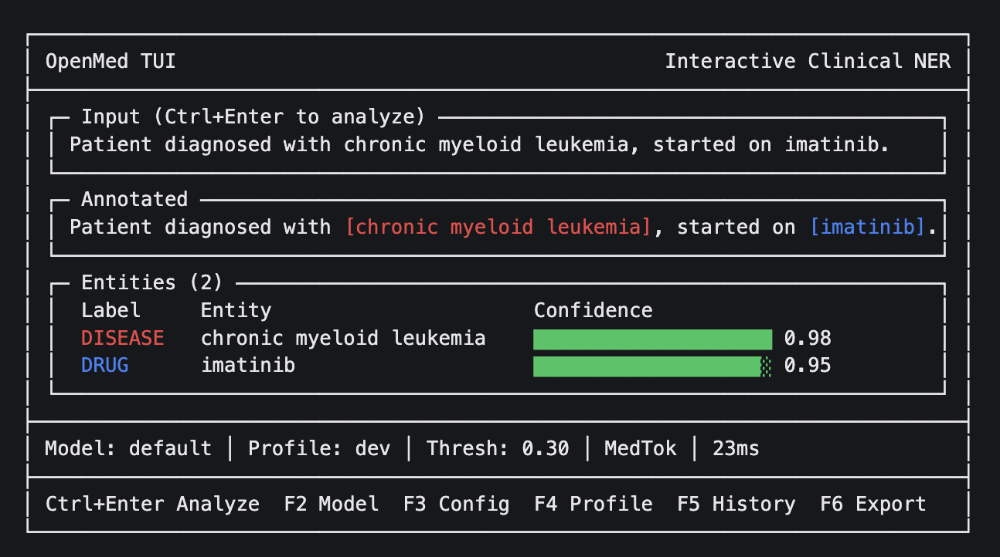

# OpenMed

> **Production-ready medical NLP toolkit powered by state-of-the-art transformers**

Transform clinical text into structured insights with a single line of code. OpenMed delivers enterprise-grade entity extraction, assertion detection, and medical reasoning—no vendor lock-in, no compromise on accuracy.

[](https://opensource.org/licenses/Apache-2.0)
[](https://www.python.org/downloads/)
[](https://arxiv.org/abs/2508.01630)
[](https://colab.research.google.com/drive/1x1xJjTZTWR3Z7uLJ0B5B_FyAomeeZGq5?usp=sharing)

```python
from openmed import analyze_text

result = analyze_text(
    "Patient started on imatinib for chronic myeloid leukemia.",
    model_name="disease_detection_superclinical"
)

for entity in result.entities:
    print(f"{entity.label:<12} {entity.text:<35} {entity.confidence:.2f}")
# DISEASE      chronic myeloid leukemia            0.98
# DRUG         imatinib                            0.95
```

---

## ✨ Why OpenMed?

- 🎯 **Specialized Models**: 12+ curated medical NER models outperforming proprietary solutions
- 🚀 **One-Line Deployment**: From prototype to production in minutes
- 🎨 **Interactive TUI**: Beautiful terminal interface for rapid experimentation
- ⚡ **Batch Processing**: Multi-file workflows with progress tracking
- 🔧 **Production-Ready**: Configuration profiles, profiling tools, and medical-aware tokenization
- 📦 **Zero Lock-In**: Apache 2.0 licensed, runs on your infrastructure

---

## 🚀 Quick Start

### Installation

```bash
# Install with Hugging Face support
pip install openmed[hf]

# Or try the interactive TUI
pip install openmed[tui]
```

### Three Ways to Use OpenMed

**1️⃣ Python API** — One-liner for scripts and notebooks

```python
from openmed import analyze_text

result = analyze_text(
    "Patient received 75mg clopidogrel for NSTEMI.",
    model_name="pharma_detection_superclinical"
)
```

**2️⃣ Interactive TUI** — Visual workbench for exploration

```bash
openmed  # Launch the TUI directly
```



**3️⃣ CLI Automation** — Batch processing for production

```bash
# Process a directory of clinical notes
openmed batch --input-dir ./notes --output results.json

# Use configuration profiles
openmed config profile-use prod
```

---

## 🎨 Interactive Terminal Interface

The OpenMed TUI provides a full-featured workbench that runs in any terminal:

- 🎯 Real-time entity extraction with `Ctrl+Enter`
- 🌈 Color-coded entity highlighting
- ⚡ Live configuration tuning (threshold, grouping, tokenization)
- 📊 Confidence visualization with progress bars
- 💾 Analysis history and export (JSON, CSV)
- 🔄 Hot-swappable models and profiles
- 📁 File browser for batch analysis

```bash
# Launch with custom settings
openmed tui --model disease_detection_superclinical --confidence-threshold 0.7
```

[📖 Full TUI Documentation](https://openmed.life/docs/tui)

---

## 📦 Key Features

### Core Capabilities

- **Curated Model Registry**: Metadata-rich catalog with 12+ specialized medical NER models
- **Medical-Aware Tokenization**: Clean handling of clinical patterns (`COVID-19`, `CAR-T`, `IL-6`)
- **Advanced NER Processing**: Confidence filtering, entity grouping, and span alignment
- **Multiple Output Formats**: Dict, JSON, HTML, CSV for any downstream system

### Production Tools (v0.4.0)

- **Batch Processing**: Multi-text and multi-file workflows with progress tracking
- **Configuration Profiles**: `dev`/`prod`/`test`/`fast` presets with flexible overrides
- **Performance Profiling**: Built-in inference timing and bottleneck analysis
- **Interactive TUI**: Rich terminal UI for rapid iteration

### Coming Soon (v0.5.0+)

- 🔗 UMLS/SNOMED Concept Linking
- 💰 HCC & ICD-10 Medical Coding
- 🔒 HIPAA-Compliant De-identification
- 🧠 Assertion Status Detection
- 🔗 Clinical Relation Extraction
- ⏰ Temporal Reasoning & Event Timelines

[🗺️ View Full Roadmap](https://github.com/maziyarpanahi/openmed/blob/master/PLAN.md)

---

## 📚 Documentation

Comprehensive guides available at **[openmed.life/docs](https://openmed.life/docs/)**

Quick links:

- [Getting Started](https://openmed.life/docs/) — Installation and first analysis
- [Analyze Text Helper](https://openmed.life/docs/analyze-text) — Python API reference
- [CLI & Automation](https://openmed.life/docs/cli) — Batch processing and profiles
- [Interactive TUI](https://openmed.life/docs/tui) — Terminal interface guide
- [Model Registry](https://openmed.life/docs/model-registry) — Browse available models
- [Configuration](https://openmed.life/docs/config) — Settings and environment variables

---

## 🔬 Models

OpenMed includes a curated registry of 12+ specialized medical NER models:

| Model | Specialization | Entity Types | Size |
|-------|---------------|--------------|------|
| `disease_detection_superclinical` | Disease & Conditions | DISEASE, CONDITION, DIAGNOSIS | 434M |
| `pharma_detection_superclinical` | Drugs & Medications | DRUG, MEDICATION, TREATMENT | 434M |
| `anatomy_detection_electramed` | Anatomy & Body Parts | ANATOMY, ORGAN, BODY_PART | 109M |
| `gene_detection_genecorpus` | Genes & Proteins | GENE, PROTEIN | 109M |

[📖 Full Model Catalog](https://openmed.life/docs/model-registry)

---

## 🛠️ Advanced Usage

### Batch Processing

```bash
# Process multiple files with progress tracking
openmed batch --input-dir ./clinical_notes --pattern "*.txt" --recursive

# Use profiles for different environments
openmed config profile-use prod
openmed batch --input-files note1.txt note2.txt --output results.json
```

### Configuration Profiles

```python
from openmed import analyze_text

# Apply a profile programmatically
result = analyze_text(
    text,
    model_name="disease_detection_superclinical",
    config_profile="prod"  # High confidence, grouped entities
)
```

### Performance Profiling

```python
from openmed import analyze_text, profile_inference

with profile_inference() as profiler:
    result = analyze_text(text, model_name="disease_detection_superclinical")

print(profiler.summary())  # Inference time, bottlenecks, recommendations
```

[📖 More Examples](https://openmed.life/docs/examples)

---

## 🤝 Contributing

We welcome contributions! Whether it's bug reports, feature requests, or pull requests.

- 🐛 **Found a bug?** [Open an issue](https://github.com/maziyarpanahi/openmed/issues)
- 💡 **Have an idea?** Check our [roadmap](https://github.com/maziyarpanahi/openmed/blob/master/PLAN.md) and discuss
- 🔧 **Want to contribute?** See [CONTRIBUTING.md](./CONTRIBUTING.md)

---

## 📄 License

OpenMed is released under the [Apache-2.0 License](LICENSE).

---

## 📖 Citation

If you use OpenMed in your research, please cite:

```bibtex
@misc{panahi2025openmedneropensourcedomainadapted,
      title={OpenMed NER: Open-Source, Domain-Adapted State-of-the-Art Transformers for Biomedical NER Across 12 Public Datasets},
      author={Maziyar Panahi},
      year={2025},
      eprint={2508.01630},
      archivePrefix={arXiv},
      primaryClass={cs.CL},
      url={https://arxiv.org/abs/2508.01630},
}
```

---

## 🌟 Star History

If you find OpenMed useful, consider giving it a star ⭐ to help others discover it!

---

**Built with ❤️ by the OpenMed team**

[🌐 Website](https://openmed.life) • [📚 Documentation](https://openmed.life/docs) • [🐦 X/Twitter](https://x.com/openmed_ai) • [💬 LinkedIn](https://www.linkedin.com/company/openmed-ai/)
