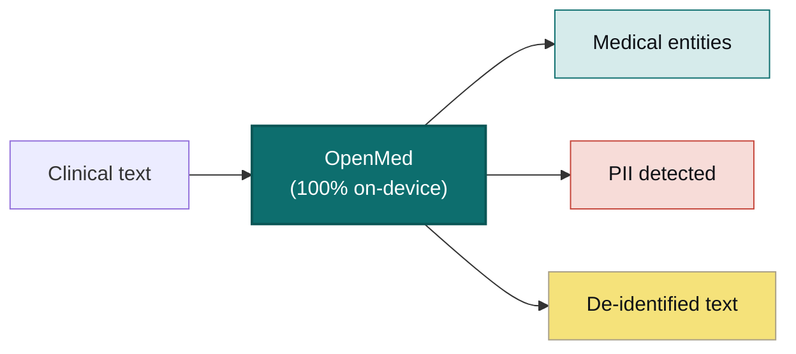

<div align="center">


<h2>Your Data. Your Model. Your Hardware.</h2>

<a href="https://trendshift.io/repositories/40195?utm_source=repository-badge&amp;utm_medium=badge&amp;utm_campaign=badge-repository-40195" target="_blank" rel="noopener noreferrer"></a>

<p><b>Turn clinical text into structured, de-identified insight, with nothing uploaded.</b><br/>
OpenMed extracts biomedical entities and removes 55+ PHI types entirely on the
hardware you control, so your data never leaves the device. The same 2,000+ open models run from a
phone to a GPU server, fully offline: iOS, iPadOS, and Android via OpenMedKit, React Native,
plain CPUs, Apple Silicon, NVIDIA GPUs, the browser, and REST/gRPC services.
No cloud. No vendor lock-in. No patient data leaving your network.</p>

<p>
  <a href="https://pypi.org/project/openmed/"></a>
  <a href="https://www.python.org/downloads/"></a>
  <a href="https://huggingface.co/OpenMed"></a>
  <a href="https://arxiv.org/abs/2508.01630"></a>
  <a href="LICENSE"></a>
  <a href="https://github.com/maziyarpanahi/openmed/stargazers"></a>
</p>

<p>
  <a href="swift/OpenMedKit"></a>
  <a href="docs/mlx-backend.md"></a>
  <a href="docs/export-onnx-android.md"></a>
  <a href="docs/export-transformersjs.md"></a>
  <a href="docs/swift-openmedkit.md"></a>
  <a href="https://openmed.life/docs"></a>
</p>

<p>
  <b>2,000+ models</b> &nbsp;·&nbsp; <b>28 model-backed PII languages</b> &nbsp;·&nbsp; <b>600+ PII checkpoints</b> &nbsp;·&nbsp; <b>100% on-device</b> &nbsp;·&nbsp; <b>Apache-2.0</b>
</p>

<p>
  <b>English</b> ·
  <a href="README.zh-CN.md">简体中文</a> ·
  <a href="README.es.md">Español</a> ·
  <a href="README.fr.md">Français</a> ·
  <a href="README.de.md">Deutsch</a> ·
  <a href="README.it.md">Italiano</a> ·
  <a href="README.pt.md">Português</a> ·
  <a href="README.nl.md">Nederlands</a> ·
  <a href="README.ar.md">العربية</a> ·
  <a href="README.hi.md">हिन्दी</a> ·
  <a href="README.te.md">తెలుగు</a> ·
  <a href="README.ja.md">日本語</a> ·
  <a href="README.tr.md">Türkçe</a> ·
  <a href="README.fa.md">فارسی</a> ·
  <a href="README.sw.md">Kiswahili</a>
</p>

</div>

---

## See it in action

OpenMed runs **entirely on the device**; clinical text never leaves it. Here it is on iPhone, fully offline:

<div align="center">
  
  <br/>
  <sub><b>On iPhone via <a href="swift/OpenMedKit">OpenMedKit</a></b>: scan a clinical note, de-identify it, and extract clinical signals, all locally with Apple MLX. Nothing is uploaded.</sub>
</div>

<br/>

<div align="center">
  
  <br/>
  <sub><b>Real-time PII de-identification</b>: the Nemotron Privacy Filter redacting names, addresses, IDs, and billing data from a clinical discharge packet, entirely on-device. <i>(All values shown are synthetic.)</i></sub>
</div>

---

## 30-second example

```python
from openmed import analyze_text

result = analyze_text(
    "Patient started on imatinib for chronic myeloid leukemia.",
    model_name="disease_detection_superclinical",
)

for entity in result.entities:
    print(f"{entity.label:<12} {entity.text:<28} {entity.confidence:.2f}")
# DISEASE      chronic myeloid leukemia     0.98
# DRUG         imatinib                     0.95
```

A state-of-the-art clinical NER model running locally: no API key, no network call.

---

## Why OpenMed?

|                                       |       **OpenMed**        |   Cloud medical APIs   |
| ------------------------------------- | :----------------------: | :--------------------: |
| Runs on your device / servers         |            ✅            |           ❌           |
| Patient data leaves your network      |        **Never**         |   Sent to the vendor   |
| Cost                                  |    Free & open-source    |    Per-call pricing    |
| Specialized medical models            |          2,000+          |        Limited         |
| Model-backed PII languages            |            28            |         Varies         |
| Offline / air-gapped                  |            ✅            |           ❌           |
| Apple Silicon (MLX) acceleration      |            ✅            |          n/a           |
| Native iOS / macOS apps               |   ✅ via OpenMedKit      |           ❌           |
| Browser/WebGPU token classification   | ✅ via Transformers.js   |         Varies         |
| Vendor lock-in                        |    None (Apache-2.0)    |          Yes           |

- **Specialized models**: 2,000+ curated biomedical & clinical models, many outperforming proprietary stacks.
- **HIPAA-aware de-identification**: all 18 Safe Harbor identifiers, smart entity merging, format-preserving fakes.
- **Runs everywhere**: CPU, CUDA, Apple Silicon (MLX), iOS/macOS via OpenMedKit, Android/Kotlin, React Native, REST/gRPC services, and browser/WebGPU bundles via Transformers.js.
- **One-line deployment**: Python API, Dockerized REST service, or batch pipelines.
- **Zero lock-in**: Apache-2.0, your infrastructure, your data.

---

## On-device on Apple: Swift, MLX & iOS

OpenMed is built to run where your data already lives. On Apple hardware it accelerates with **MLX**,
and it ships straight into iPhone, iPad, and Mac apps through **[OpenMedKit](swift/OpenMedKit)**: so
PII detection and clinical extraction happen fully offline, on the device.

```swift
// Add OpenMedKit to your app
dependencies: [
    .package(url: "https://github.com/maziyarpanahi/openmed.git", from: "1.9.1"),
]
```

Expected result: Swift Package Manager resolves OpenMedKit and makes
`import OpenMedKit` available to your app target.

- **MLX runtime** for PII token classification, the Privacy Filter family, experimental GLiNER-family zero-shot tasks, and Python MLX-LM text generation with Laneformer; includes a CoreML fallback path for supported token-classification artifacts.
- **One model name, every platform**: MLX model names automatically fall back to the matching PyTorch checkpoint on non-Apple hardware.
- **Python on Apple Silicon** too: `pip install --upgrade "openmed[mlx]"`.

Guides: [MLX backend](docs/mlx-backend.md) · [OpenMedKit (Swift)](docs/swift-openmedkit.md) · [CoreML export](docs/coreml-export.md)

<div align="center">
  
  <br/>
  <sub><b>MLX on Apple Silicon: 24–33× faster than CPU PyTorch</b> for the Privacy Filter: median latency per inference step, lower is better.</sub>
</div>

---

## On-device on Android — Kotlin & ONNX Runtime Mobile

OpenMedKit also ships as a native Android/Kotlin library for local document
intake, OCR handoff, PII redaction, and token-classification inference through
**ONNX Runtime Mobile**. Mobile model repositories include stable tensor names,
dynamic sequence axes, tokenizer files, labels, and Android-ready fp32, fp16,
INT8, and optional `.ort` outputs.

Add the scoped JitPack repository in `settings.gradle.kts`:

```kotlin
dependencyResolutionManagement {
    repositories {
        google()
        mavenCentral()
        maven {
            url = uri("https://jitpack.io")
            content { includeGroup("com.github.maziyarpanahi") }
        }
    }
}
```

Then use the immutable OpenMed `v1.9.1` release:

```kotlin
dependencies {
    implementation("com.github.maziyarpanahi:openmed:v1.9.1")
}
```

See the [Android installation guide](android/README.md) for local builds and
publishing details.

```kotlin
val model = OpenMedKit.fromDirectory(modelDir)
val entities = model.analyzeText("Patient Alice Nguyen was seen in cardiology.")
```

- **Android ONNX profile** emits `model.onnx`, `model_fp16.onnx`,
  `model_int8.onnx`, tokenizer assets, labels, and `openmed-onnx.json`.
- **ORT Mobile support** records the minimal-build operator configuration when
  ONNX Runtime conversion tooling is installed.
- **Kotlin parity tests** keep tokenizer offsets, span boundaries, and decoder
  output aligned with the Python runtime.

Guides: [Android ONNX export](docs/export-onnx-android.md) ·
[Android span parity](docs/android-parity.md) ·
[OpenMedKit Android](android/openmedkit)

### The same ONNX model on Python CPU

```python
from openmed import OnnxModel

model = OnnxModel.from_pretrained(
    "OpenMed/OpenMed-PII-ClinicalE5-Small-33M-v1-onnx-android"
)
entities = model("Patient Alice Nguyen was seen in cardiology.")
```

### The same ONNX model in the browser

```bash
npm install openmed @huggingface/transformers
```

```typescript
import { loadOnnxModel } from "openmed";

const model = await loadOnnxModel(
  "OpenMed/OpenMed-PII-ClinicalE5-Small-33M-v1-onnx-android",
);
const entities = await model("Patient Alice Nguyen was seen in cardiology.");
```

---

## How it works


```mermaid
flowchart LR
    A["Clinical text"] --> B["OpenMed<br/>(100% on-device)"]
    B --> C["Medical entities"]
    B --> D["PII detected"]
    B --> E["De-identified text"]
    style B fill:#0D6E6E,stroke:#0A5656,stroke-width:2px,color:#ffffff
    style C fill:#D6EBEB,stroke:#0D6E6E,color:#0E1116
    style D fill:#F7DCD8,stroke:#C5453A,color:#0E1116
    style E fill:#F5E27A,stroke:#A9A088,color:#0E1116
```

Rendered result: a local clinical-text pipeline that returns medical entities,
PII findings, and de-identified text without sending data to a cloud API.

---

## Quick start

```bash
# Core + Hugging Face runtime (Linux, macOS, Windows; CPU or CUDA)
pip install --upgrade "openmed[hf]"

# Add the REST service
pip install --upgrade "openmed[hf,service]"

# Apple Silicon acceleration (MLX)
pip install --upgrade "openmed[mlx]"
```

Expected result:

```text
Successfully installed openmed-...
```

<table>
<tr>
<td width="33%" valign="top">

**Python API**

```python
from openmed import analyze_text

result = analyze_text(
  "Patient received 75mg "
  "clopidogrel for NSTEMI.",
  model_name=
  "pharma_detection_superclinical",
)
print([(e.label, e.text) for e in result.entities])
```

Example output:

```text
[('DRUG', 'clopidogrel'), ('CONDITION', 'NSTEMI')]
```

</td>
<td width="33%" valign="top">

**REST service**

```bash
uvicorn openmed.service.app:app \
  --host 0.0.0.0 --port 8080
```

Example output:

```text
INFO:     Uvicorn running on http://0.0.0.0:8080
GET /health -> 200 OK
```

`GET /health`
`POST /analyze`
`POST /pii/extract`
`POST /pii/deidentify`

</td>
<td width="33%" valign="top">

**Batch**

```python
from openmed import BatchProcessor

p = BatchProcessor(
  model_name=
  "disease_detection_superclinical",
  group_entities=True,
)
results = p.process_texts([...])
print(len(results), sum(len(r.entities) for r in results))
print([(e.label, e.text) for e in results[0].entities[:1]])
```

Example output:

```text
3 7
[('DISEASE', 'leukemia')]
```

</td>
</tr>
</table>

**Browser / WebGPU**

Package ONNX token-classification exports for in-browser inference through
Transformers.js:

```bash
python -m openmed.onnx.convert \
  --model dslim/bert-base-NER \
  --output dist/example-onnx \
  --include-transformersjs
```

Example output:

```text
Exported Transformers.js bundle to dist/example-onnx
```

```javascript
import { pipeline } from "@huggingface/transformers";

const detector = await pipeline(
  "token-classification",
  "/models/openmed-pii/transformersjs",
  { device: "webgpu" },
);
const entities = await detector("Patient Casey Example called 212-555-0198.");
console.log(entities.slice(0, 2));
```

Example output:

```javascript
[
  { entity: "NAME", word: "Casey Example", score: 0.99 },
  { entity: "PHONE", word: "212-555-0198", score: 0.98 },
]
```

[Transformers.js export guide](docs/export-transformersjs.md)

**Offline / air-gapped?** Point `model_name` (or `model_id`) at a local directory and OpenMed loads it without contacting the Hugging Face Hub:

```python
from openmed import OpenMedConfig, analyze_text

result = analyze_text(
    "Patient presents with chronic myeloid leukemia and Type 2 diabetes.",
    model_id="./models/OpenMed-NER-DiseaseDetect-SuperClinical-434M",
    config=OpenMedConfig(device="cpu"),
)
for entity in result.entities:
    print(f"{entity.label:<12} {entity.text:<28} {entity.confidence:.2f}")
```

Example output:

```text
DISEASE      chronic myeloid leukemia     0.98
DISEASE      Type 2 diabetes              0.96
```

Because `model_id` points to a local directory, this example does not contact
the Hugging Face Hub or any external model provider.

---

## Models

A curated registry of specialized medical NER models; browse the [full catalog](https://openmed.life/docs/model-registry).

| Model | Specialization | Entity types | Size |
|-------|----------------|--------------|------|
| `disease_detection_superclinical` | Disease & conditions | DISEASE, CONDITION, DIAGNOSIS | 434M |
| `pharma_detection_superclinical`  | Drugs & medications  | DRUG, MEDICATION, TREATMENT   | 434M |
| `pii_superclinical_large`     | PII & de-identification | NAME, DATE, SSN, PHONE, EMAIL, ADDRESS | 434M |
| `anatomy_detection_electramed`    | Anatomy & body parts | ANATOMY, ORGAN, BODY_PART     | 109M |
| `gene_detection_genecorpus`       | Genes & proteins     | GENE, PROTEIN                 | 109M |

---

## Privacy: PII detection & de-identification

```python
from openmed import extract_pii, deidentify

text = "Patient: John Doe, DOB: 01/15/1970, SSN: 123-45-6789"

# Extract PII with smart merging (prevents tokenization fragmentation)
result = extract_pii(text, model_name="pii_superclinical_large", use_smart_merging=True)
print([(e.label, e.text) for e in result.entities])

# De-identify with the method you need
print(deidentify(text, method="mask").deidentified_text)
print(deidentify(text, method="replace").deidentified_text)
print(deidentify(text, method="hash").deidentified_text)
print(deidentify(text, method="shift_dates", date_shift_days=180).deidentified_text)
```

Example output:

```text
[('NAME', 'John Doe'), ('DATE', '01/15/1970'), ('SSN', '123-45-6789')]
Patient: [NAME], DOB: [DATE], SSN: [SSN]
Patient: Emily Chen, DOB: 03/22/1985, SSN: 456-78-9012
Patient: 6b8f...c4a1, DOB: 48b1...91de, SSN: 3f13...e912
Patient: John Doe, DOB: 07/14/1970, SSN: 123-45-6789
```

- **Smart entity merging** keeps `01/15/1970` whole instead of fragmenting it.
- **Policy-aware pipelines** add HIPAA/GDPR/research profiles, calibrated thresholds, signed audit reports, redaction previews, and minimum-necessary action selection.
- **Faker-backed obfuscation** with custom clinical-ID providers (CPF, CNPJ, BSN, NIR, Codice Fiscale, NIE, Aadhaar, Steuer-ID, NPI).
- **HIPAA**: all 18 Safe Harbor identifiers, configurable confidence thresholds.
- **Batch and streaming PII**: extract or de-identify across many documents with `BatchProcessor(operation="extract_pii" | "deidentify", batch_size=16)` or incremental streaming helpers.

<div align="center">
  
  <br/>
  <sub><b>Batch processing</b>: up to <b>3.3×</b> higher throughput on CPU and <b>2.2×</b> on MLX vs. one document at a time.</sub>
</div>

[Complete PII notebook](examples/notebooks/PII_Detection_Complete_Guide.ipynb) · [Smart merging](docs/pii-smart-merging.md) · [Anonymization quickstart](docs/anonymization.md#quickstart-choosing-a-method)

<details>
<summary><b>Privacy Filter family</b>: three model families on the OpenAI Privacy Filter architecture</summary>

<br/>

Same model code (gpt-oss-style sparse-MoE transformer with local attention, sink tokens, RoPE+YaRN, tiktoken `o200k_base`), different training data. All route through the **same** `extract_pii()` / `deidentify()` API; only `model_name=` changes.
`openai/privacy-filter` is a Hugging Face model identifier for local weights;
using it here does not call the OpenAI API.

| Variant | PyTorch (CPU + CUDA) | MLX (Apple Silicon) | MLX 8-bit |
| --- | --- | --- | --- |
| **OpenAI Privacy Filter** | [`openai/privacy-filter`](https://huggingface.co/openai/privacy-filter) | [`OpenMed/privacy-filter-mlx`](https://huggingface.co/OpenMed/privacy-filter-mlx) | [`…-mlx-8bit`](https://huggingface.co/OpenMed/privacy-filter-mlx-8bit) |
| **Nemotron-PII fine-tune** | [`OpenMed/privacy-filter-nemotron`](https://huggingface.co/OpenMed/privacy-filter-nemotron) | [`…-nemotron-mlx`](https://huggingface.co/OpenMed/privacy-filter-nemotron-mlx) | [`…-nemotron-mlx-8bit`](https://huggingface.co/OpenMed/privacy-filter-nemotron-mlx-8bit) |
| **OpenMed Multilingual** | [`OpenMed/privacy-filter-multilingual`](https://huggingface.co/OpenMed/privacy-filter-multilingual) | [`…-multilingual-mlx`](https://huggingface.co/OpenMed/privacy-filter-multilingual-mlx) | [`…-multilingual-mlx-8bit`](https://huggingface.co/OpenMed/privacy-filter-multilingual-mlx-8bit) |

```python
from openmed import extract_pii

text = "Patient Sarah Connor (DOB: 03/15/1985) at MRN 4471882."

variants = {
    "baseline": extract_pii(text, model_name="openai/privacy-filter"),
    "nemotron": extract_pii(text, model_name="OpenMed/privacy-filter-nemotron"),
    "mlx": extract_pii(text, model_name="OpenMed/privacy-filter-mlx"),
}
print([(e.label, e.text) for e in variants["baseline"].entities])
```

Example output:

```text
[('NAME', 'Sarah Connor'), ('DATE', '03/15/1985'), ('ID', '4471882')]
```

On non-Apple-Silicon hosts, MLX model names are automatically substituted with the matching PyTorch checkpoint (with a one-time warning): ship one model name, run anywhere. See [Privacy Filter architecture & backend routing](docs/anonymization.md#privacy-filter-family).

</details>

---

## Multilingual PII (30 supported languages)

Extraction and de-identification support **30 supported PII language codes**:
`am`, `ar`, `as`, `cs`, `da`, `de`, `el`, `en`, `es`, `fr`, `he`, `hi`, `id`,
`it`, `ja`, `ko`, `nl`, `no`, `pt`, `ro`, `ru`, `sv`, `sw`, `te`, `th`, `tr`,
`uk`, `xh`, `zh`, and `zu`, with **600+ PII checkpoints** in total.
Russian and Chinese routing currently use documented multilingual
default-model placeholders while dedicated model weights remain separate.
An optional, user-configured Indic NER family accepts eight additional routes
(`bn`, `gu`, `kn`, `ml`, `mr`, `or`, `pa`, and `ta`) and can also serve
Assamese, Hindi, and Telugu. Set `OPENMED_INDIC_NER_MODEL`; OpenMed never
bundles or automatically selects those weights.
OpenMed also includes validator-backed national-ID coverage for additional
ID-only locales such as Polish, Latvian, Slovak, Malay, Filipino, and Finnish.

See the [per-language guide](docs/languages.md) for each code's default PII
model, Faker locale, and a before/after de-identification example.

```bash
python -c "from openmed import extract_pii; print([(e.label, e.text) for e in extract_pii('Dr. Pedro Almeida, CPF: 123.456.789-09, email: pedro@hospital.pt', lang='pt').entities])"
```

Example output:

```text
[('NAME', 'Pedro Almeida'), ('ID', '123.456.789-09'), ('EMAIL', 'pedro@hospital.pt')]
```

<details>
<summary>Show per-language examples (Portuguese, Dutch, Hindi, Arabic, Japanese, Turkish)</summary>

<br/>

```python
from openmed import extract_pii

portuguese = extract_pii("Paciente: Pedro Almeida, CPF: 123.456.789-09, telefone: +351 912 345 678", lang="pt", use_smart_merging=True)
dutch      = extract_pii("Patiënt: Eva de Vries, BSN: 123456782, telefoon: +31 6 12345678", lang="nl", use_smart_merging=True)
hindi      = extract_pii("रोगी: अनीता शर्मा, फोन: +91 9876543210, पता: नई दिल्ली 110001", lang="hi", use_smart_merging=True)
arabic     = extract_pii("المريضة ليلى حسن، الهاتف +20 10 1234 5678، الرقم القومي 29801011234567.", lang="ar", use_smart_merging=True)
japanese   = extract_pii("患者 佐藤 花子、電話 +81 90 1234 5678、マイナンバー 1234 5678 9012.", lang="ja", use_smart_merging=True)
turkish    = extract_pii("Hasta Ayşe Yılmaz, telefon +90 532 123 45 67, TCKN 10000000146.", lang="tr", use_smart_merging=True)

for r in (portuguese, dutch, hindi, arabic, japanese, turkish):
    print([(e.label, e.text) for e in r.entities])
```

Example output:

```text
[('NAME', 'Pedro Almeida'), ('ID', '123.456.789-09'), ('PHONE', '+351 912 345 678')]
[('NAME', 'Eva de Vries'), ('ID', '123456782'), ('PHONE', '+31 6 12345678')]
[('NAME', 'अनीता शर्मा'), ('PHONE', '+91 9876543210'), ('ADDRESS', 'नई दिल्ली 110001')]
[('NAME', 'ليلى حسن'), ('PHONE', '+20 10 1234 5678'), ('ID', '29801011234567')]
[('NAME', '佐藤 花子'), ('PHONE', '+81 90 1234 5678'), ('ID', '1234 5678 9012')]
[('NAME', 'Ayşe Yılmaz'), ('PHONE', '+90 532 123 45 67'), ('ID', '10000000146')]
```

</details>

---

## REST API

A Docker-friendly FastAPI service with request validation, shared pipeline preload, and unified error envelopes.

```bash
pip install --upgrade "openmed[hf,service]"
uvicorn openmed.service.app:app --host 0.0.0.0 --port 8080

# or with Docker
docker build -t openmed:local .
docker run --rm -p 8080:8080 -e OPENMED_PROFILE=prod openmed:local
```

Example output:

```text
INFO:     Uvicorn running on http://0.0.0.0:8080
```

```bash
curl -X POST http://127.0.0.1:8080/pii/extract \
  -H "Content-Type: application/json" \
  -d '{"text":"Paciente: Maria Garcia, DNI: 12345678Z","lang":"es"}'
```

Abbreviated example response:

```json
{
  "text": "Paciente: Maria Garcia, DNI: 12345678Z",
  "entities": [
    {"text": "Maria Garcia", "label": "NAME", "confidence": 0.99, "start": 10, "end": 22},
    {"text": "12345678Z", "label": "ID", "confidence": 0.98, "start": 29, "end": 38}
  ],
  "model_name": "OpenMed/privacy-filter-multilingual"
}
```

**Model lifecycle and service controls:** free memory on demand with
`GET /models/loaded`, `POST /models/unload`, and a `keep_alive` idle window;
v1.8 also includes API-key/JWT auth, no-PHI request logging, tracing, gRPC,
async jobs, webhooks, warm pools, dynamic batching, request coalescing, rate
and concurrency limits, `/livez`, `/readyz`, and opt-in metrics:

```bash
OPENMED_SERVICE_KEEP_ALIVE=10m uvicorn openmed.service.app:app --host 0.0.0.0 --port 8080
curl -X POST http://127.0.0.1:8080/models/unload -H "Content-Type: application/json" -d '{"all":true}'
```

Example response:

```json
{
  "unloaded": true,
  "released": {"models": 1, "tokenizers": 1, "pipelines": 1},
  "active_models": {}
}
```

See the full [REST service guide](docs/rest-service.md).

---

## Documentation

Full guides at **[openmed.life/docs](https://openmed.life/docs/)**.

AI agents can load the curated [llms.txt](https://openmed.life/docs/llms.txt)
index or the inlined [llms-full.txt](https://openmed.life/docs/llms-full.txt)
feed. Both are regenerated from the current documentation during every strict
MkDocs build.

| | | |
|---|---|---|
| [Getting Started](https://openmed.life/docs/) | [Analyze Text](https://openmed.life/docs/analyze-text) | [Model Registry](https://openmed.life/docs/model-registry) |
| [FAQ](docs/faq.md) | [Anonymization](docs/anonymization.md) | [Batch Processing](https://openmed.life/docs/batch-processing) |
| [Configuration Profiles](https://openmed.life/docs/profiles) | [REST Service](docs/rest-service.md) | [MLX Backend](docs/mlx-backend.md) |
| [Transformers.js Export](docs/export-transformersjs.md) | [FHIR Interop](docs/fhir-interop.md) | [HL7 v2 De-identification](docs/hl7v2-deidentification.md) |
| [OpenMed 1.9.1 Release Notes](docs/release/v1.9.1.md) | [OpenMed 1.9.0 Release Notes](docs/release/v1.9.0.md) | [Examples](docs/examples.md) |
| [Release Streams](docs/release/semver-and-channels.md) | [Generative Model Policy](docs/generative-model-policy.md) | [Contributing](docs/contributing.md) |
| [Security Policy](SECURITY.md) | [Compliance Posture](docs/compliance.md) | [Detector Plugin SDK](docs/plugin-sdk.md) |
| [v1 to v2 Migration](docs/migration.md) | [MCP Client Connections](docs/mcp-clients.md) | [African Developer Onboarding](docs/africa-onboarding.md) |

---

## Meet the mascot


OpenMed's guardian is a fluffy Persian cat styled as a tiny **Avicenna (Ibn Sina)**: the great Persian
physician whose *Canon of Medicine* was the world's standard medical text for some 600 years. He keeps
watch over the open book of medical knowledge, in a palette built around Persian turquoise (*fīrūza*):
a local-first guardian for your most private data.

<br clear="left"/>

---

## Contributing

Contributions welcome: bug reports, feature requests, and PRs alike. Please read the [Contributing guide](CONTRIBUTING.md) and our [Code of Conduct](CODE_OF_CONDUCT.md) first.

- [Open an issue](https://github.com/maziyarpanahi/openmed/issues)
- [Contributing guide](CONTRIBUTING.md) · [Code of Conduct](CODE_OF_CONDUCT.md) · [Security policy](SECURITY.md)
- **Translations welcome**: help complete the other-language READMEs linked in the switcher at the top.

---

## Security

Found a vulnerability? OpenMed redacts PHI, so a **redaction bypass or PHI/PII
leak is a security issue**: please report it **privately**, never as a public
issue. See **[SECURITY.md](SECURITY.md)** for the responsible-disclosure policy
and the [private reporting form](https://github.com/maziyarpanahi/openmed/security/advisories/new).
Never include real patient data in a report.

---

## Credits

OpenMed builds on excellent open-source work: particular thanks to **OpenAI** (the [Privacy Filter](https://huggingface.co/openai/privacy-filter) architecture), **NVIDIA** (the [Nemotron PII dataset](https://huggingface.co/datasets/nvidia/Nemotron-PII-v1)), **Hugging Face** (`transformers`, Transformers.js & the model ecosystem), **Apple** ([MLX](https://github.com/ml-explore/mlx)), and the **[Faker](https://faker.readthedocs.io/)** maintainers.

## License

Released under the [Apache-2.0 License](LICENSE). Third-party asset notices are recorded in [NOTICE](NOTICE).

## Citation

```bibtex
@misc{panahi2025openmedneropensourcedomainadapted,
      title={OpenMed NER: Open-Source, Domain-Adapted State-of-the-Art Transformers for Biomedical NER Across 12 Public Datasets},
      author={Maziyar Panahi},
      year={2025},
      eprint={2508.01630},
      archivePrefix={arXiv},
      primaryClass={cs.CL},
      url={https://arxiv.org/abs/2508.01630},
}
```

Expected result: BibTeX-compatible citation metadata for referencing OpenMed in
papers, posters, and derived documentation.

---

## Star History

If OpenMed is useful to you, a star helps others discover it.

[](https://www.star-history.com/?repos=maziyarpanahi%2Fopenmed&type=date&legend=top-left)

---

<div align="center">

Built by the OpenMed team

<a href="https://openmed.life">Website</a> ·
<a href="https://openmed.life/docs">Docs</a> ·
<a href="https://x.com/openmed_ai">X / Twitter</a> ·
<a href="https://www.linkedin.com/company/openmed-ai/">LinkedIn</a>

</div>
