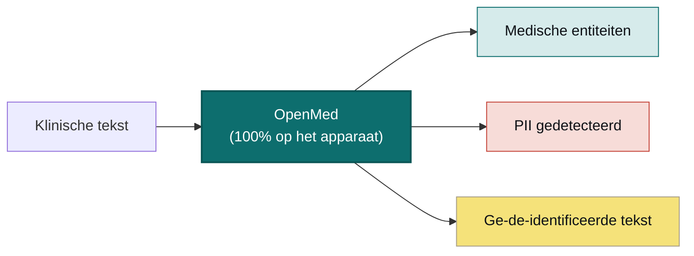

<div align="center">


<h3>Jouw data. Jouw model. Jouw hardware.</h3>

<p><b>Zet klinische tekst om in gestructureerd, ge-de-identificeerd inzicht — zonder iets te uploaden.</b><br/>
OpenMed extraheert biomedische entiteiten en verwijdert 55+ PHI-typen volledig op de hardware die jij beheert, zodat je gegevens het apparaat nooit verlaten. Dezelfde 1.500+ open modellen draaien van een telefoon tot een GPU-server, volledig offline — iOS en iPadOS via OpenMedKit, Android via ONNX, gewone CPU's, Apple Silicon, NVIDIA GPU's en de browser. Geen cloud. Geen vendor lock-in. Geen patiëntgegevens die je netwerk verlaten.</p>

<p>
  <a href="https://pypi.org/project/openmed/"></a>
  <a href="https://www.python.org/downloads/"></a>
  <a href="https://huggingface.co/OpenMed"></a>
  <a href="https://arxiv.org/abs/2508.01630"></a>
  <a href="LICENSE"></a>
  <a href="https://github.com/maziyarpanahi/openmed/stargazers"></a>
</p>

<p>
  <a href="swift/OpenMedKit"></a>
  <a href="docs/mlx-backend.md"></a>
  <a href="docs/swift-openmedkit.md"></a>
  <a href="https://openmed.life/docs"></a>
</p>

<p>
  <b>1.500+ modellen</b> &nbsp;·&nbsp; <b>15 PII-talen</b> &nbsp;·&nbsp; <b>600+ PII-checkpoints</b> &nbsp;·&nbsp; <b>100% op het apparaat</b> &nbsp;·&nbsp; <b>Apache-2.0</b>
</p>

<p>
  <a href="README.md">English</a> ·
  <a href="README.zh-CN.md">简体中文</a> ·
  <a href="README.es.md">Español</a> ·
  <a href="README.fr.md">Français</a> ·
  <a href="README.de.md">Deutsch</a> ·
  <a href="README.it.md">Italiano</a> ·
  <a href="README.pt.md">Português</a> ·
  <b>Nederlands</b> ·
  <a href="README.ar.md">العربية</a> ·
  <a href="README.hi.md">हिन्दी</a> ·
  <a href="README.te.md">తెలుగు</a> ·
  <a href="README.ja.md">日本語</a> ·
  <a href="README.tr.md">Türkçe</a> ·
  <a href="README.fa.md">فارسی</a>
</p>

</div>

---

## Zie het in actie

<div align="center">
  
  <br/>
  <sub><b>PII-de-identificatie in realtime</b> — de Nemotron Privacy Filter maskeert namen, adressen, ID's en factuurgegevens uit een klinisch ontslagbericht, volledig op het apparaat. <i>(Alle getoonde waarden zijn synthetisch.)</i></sub>
</div>

---

## Voorbeeld in 30 seconden

```python
from openmed import analyze_text

result = analyze_text(
    "Patient started on imatinib for chronic myeloid leukemia.",
    model_name="disease_detection_superclinical",
)

for entity in result.entities:
    print(f"{entity.label:<12} {entity.text:<28} {entity.confidence:.2f}")
# DISEASE      chronic myeloid leukemia     0.98
# DRUG         imatinib                     0.95
```

Een state-of-the-art klinisch NER-model dat lokaal draait — geen API-sleutel, geen netwerkoproep.

---

## Waarom OpenMed?

|                                       |       **OpenMed**        |     Medische cloud-API's   |
| ------------------------------------- | :----------------------: | :------------------------: |
| Draait op je apparaat/servers         |            ✅            |             ❌             |
| Patiëntgegevens verlaten je netwerk   |        **Nooit**         | Naar de leverancier gestuurd |
| Kosten                                | Gratis & open source     |     Prijs per aanroep      |
| Gespecialiseerde medische modellen    |          1.500+          |           Beperkt          |
| Talen                                 |           12+            |          Wisselend         |
| Offline / air-gapped                  |            ✅            |             ❌             |
| Apple Silicon (MLX)-versnelling       |            ✅            |           n.v.t.           |
| Native iOS-/macOS-apps                |   ✅ via OpenMedKit       |             ❌             |
| Vendor lock-in                        |    Geen — Apache-2.0     |             Ja             |

- **Gespecialiseerde modellen** — meer dan 1.500 zorgvuldig geselecteerde biomedische en klinische modellen, waarvan vele propriëtaire oplossingen overtreffen.
- **HIPAA-bewuste de-identificatie** — alle 18 Safe Harbor-identificatoren, slimme entiteitssamenvoeging en formaatbehoudende nepwaarden.
- **Draait overal** — CPU, CUDA, Apple Silicon (MLX), en native in iOS-/macOS-apps via OpenMedKit.
- **Implementatie in één regel** — Python-API, gedockeriseerde REST-service of batchpipelines.
- **Geen lock-in** — Apache-2.0, jouw infrastructuur, jouw data.

---

## Op het apparaat, op Apple — Swift, MLX & iOS

OpenMed is gebouwd om te draaien waar je data al leeft. Op Apple-hardware versnelt het met **MLX** en komt het
via **[OpenMedKit](swift/OpenMedKit)** rechtstreeks in iPhone-, iPad- en Mac-apps — zodat PII-detectie en
klinische extractie volledig offline, op het apparaat, plaatsvinden.

```swift
// Add OpenMedKit to your app
dependencies: [
    .package(url: "https://github.com/maziyarpanahi/openmed.git", from: "1.5.5"),
]
```

- **MLX-runtime** voor PII-tokenclassificatie, de Privacy Filter-familie en experimentele zero-shot-taken van de GLiNER-familie — met een CoreML-fallbackpad.
- **Eén modelnaam, elk platform** — op niet-Apple-hardware vallen MLX-modelnamen automatisch terug op het bijbehorende PyTorch-checkpoint.
- **Python op Apple Silicon** ook: `pip install "openmed[mlx]"`.

Handleidingen: [MLX-backend](docs/mlx-backend.md) · [OpenMedKit (Swift)](docs/swift-openmedkit.md) · [CoreML-export](docs/coreml-export.md)

---

## Hoe het werkt



---

## Snelstart

```bash
# Core + Hugging Face runtime (Linux, macOS, Windows; CPU or CUDA)
pip install "openmed[hf]"

# Add the REST service
pip install "openmed[hf,service]"

# Apple Silicon acceleration (MLX)
pip install "openmed[mlx]"
```

<table>
<tr>
<td width="33%" valign="top">

**Python-API**

```python
from openmed import analyze_text

analyze_text(
  "Patient received 75mg "
  "clopidogrel for NSTEMI.",
  model_name=
  "pharma_detection_superclinical",
)
```

</td>
<td width="33%" valign="top">

**REST-service**

```bash
uvicorn openmed.service.app:app \
  --host 0.0.0.0 --port 8080
```

`GET /health`
`POST /analyze`
`POST /pii/extract`
`POST /pii/deidentify`

</td>
<td width="33%" valign="top">

**Batch**

```python
from openmed import BatchProcessor

p = BatchProcessor(
  model_name=
  "disease_detection_superclinical",
  group_entities=True,
)
p.process_texts([...])
```

</td>
</tr>
</table>

**Offline / air-gapped?** Wijs `model_name` (of `model_id`) naar een lokale map en OpenMed laadt het zonder contact met de Hugging Face Hub:

```python
from openmed import OpenMedConfig, analyze_text

result = analyze_text(
    "Patient presents with chronic myeloid leukemia and Type 2 diabetes.",
    model_id="./models/OpenMed-NER-DiseaseDetect-SuperClinical-434M",
    config=OpenMedConfig(device="cpu"),
)
```

---

## Modellen

Een samengesteld register van gespecialiseerde medische NER-modellen — blader door de [volledige catalogus](https://openmed.life/docs/model-registry).

| Model | Specialisatie | Entiteitstypen | Grootte |
|-------|---------------|----------------|---------|
| `disease_detection_superclinical` | Ziekten & aandoeningen | DISEASE, CONDITION, DIAGNOSIS | 434M |
| `pharma_detection_superclinical`  | Geneesmiddelen & medicatie | DRUG, MEDICATION, TREATMENT   | 434M |
| `pii_superclinical_large`     | PII & de-identificatie | NAME, DATE, SSN, PHONE, EMAIL, ADDRESS | 434M |
| `anatomy_detection_electramed`    | Anatomie & lichaamsdelen | ANATOMY, ORGAN, BODY_PART     | 109M |
| `gene_detection_genecorpus`       | Genen & eiwitten | GENE, PROTEIN                 | 109M |

---

## Privacy: PII-detectie & de-identificatie

```python
from openmed import extract_pii, deidentify

text = "Patient: John Doe, DOB: 01/15/1970, SSN: 123-45-6789"

# Extract PII with smart merging (prevents tokenization fragmentation)
result = extract_pii(text, model_name="pii_superclinical_large", use_smart_merging=True)

# De-identify with the method you need
deidentify(text, method="mask")     # [NAME], [DATE]
deidentify(text, method="replace")  # Faker-backed, locale-aware, format-preserving fakes
deidentify(text, method="hash")     # Cryptographic hashing
deidentify(text, method="shift_dates", date_shift_days=180)
```

- **Slimme entiteitssamenvoeging** houdt `01/15/1970` heel in plaats van het te fragmenteren.
- **Faker-gebaseerde verhulling** met aangepaste providers voor klinische ID's (CPF, CNPJ, BSN, NIR, Codice Fiscale, NIE, Aadhaar, Steuer-ID, NPI).
- **HIPAA**: alle 18 Safe Harbor-identificatoren, met configureerbare betrouwbaarheidsdrempels.

[Volledig PII-notebook](examples/notebooks/PII_Detection_Complete_Guide.ipynb) · [Slimme samenvoeging](docs/pii-smart-merging.md) · [Anonimisering](docs/anonymization.md)

<details>
<summary><b>Privacy Filter-familie</b> — drie modelfamilies op de OpenAI Privacy Filter-architectuur</summary>

<br/>

De modelcode is identiek (gpt-oss-achtige sparse-MoE-transformer met lokale attention, sink-tokens, RoPE+YaRN, tiktoken-`o200k_base`-tokenisatie); alleen de trainingsdata verschilt. Alle gebruiken **dezelfde** `extract_pii()` / `deidentify()`-API — alleen het argument `model_name=` verandert.

| Variant | PyTorch (CPU + CUDA) | MLX (Apple Silicon) | MLX 8-bit |
| --- | --- | --- | --- |
| **OpenAI Privacy Filter** | [`openai/privacy-filter`](https://huggingface.co/openai/privacy-filter) | [`OpenMed/privacy-filter-mlx`](https://huggingface.co/OpenMed/privacy-filter-mlx) | [`…-mlx-8bit`](https://huggingface.co/OpenMed/privacy-filter-mlx-8bit) |
| **Nemotron-PII fine-tune** | [`OpenMed/privacy-filter-nemotron`](https://huggingface.co/OpenMed/privacy-filter-nemotron) | [`…-nemotron-mlx`](https://huggingface.co/OpenMed/privacy-filter-nemotron-mlx) | [`…-nemotron-mlx-8bit`](https://huggingface.co/OpenMed/privacy-filter-nemotron-mlx-8bit) |
| **OpenMed Multilingual** | [`OpenMed/privacy-filter-multilingual`](https://huggingface.co/OpenMed/privacy-filter-multilingual) | [`…-multilingual-mlx`](https://huggingface.co/OpenMed/privacy-filter-multilingual-mlx) | [`…-multilingual-mlx-8bit`](https://huggingface.co/OpenMed/privacy-filter-multilingual-mlx-8bit) |

```python
from openmed import extract_pii

text = "Patient Sarah Connor (DOB: 03/15/1985) at MRN 4471882."

extract_pii(text, model_name="openai/privacy-filter")              # PyTorch baseline
extract_pii(text, model_name="OpenMed/privacy-filter-nemotron")    # same code, different weights
extract_pii(text, model_name="OpenMed/privacy-filter-mlx")         # Apple Silicon (MLX)
```

Op niet-Apple-Silicon-hosts worden MLX-modelnamen automatisch vervangen door het bijbehorende PyTorch-checkpoint (met een eenmalige waarschuwing) — schrijf één modelnaam, draai overal. Zie [Privacy Filter-architectuur & backend-routing](docs/anonymization.md#privacy-filter-family).

</details>

---

## Meertalige PII (12 talen)

Extractie en de-identificatie in `en`, `fr`, `de`, `it`, `es`, `nl`, `hi`, `te`, `pt`, `ar`, `ja` en `tr` — in totaal **600+ PII-checkpoints**.

```bash
python -c "from openmed import extract_pii; print([(e.label, e.text) for e in extract_pii('Dr. Pedro Almeida, CPF: 123.456.789-09, email: pedro@hospital.pt', lang='pt').entities])"
```

<details>
<summary>Voorbeelden per taal tonen (Portugees, Nederlands, Hindi, Arabisch, Japans, Turks)</summary>

<br/>

```python
from openmed import extract_pii

portuguese = extract_pii("Paciente: Pedro Almeida, CPF: 123.456.789-09, telefone: +351 912 345 678", lang="pt", use_smart_merging=True)
dutch      = extract_pii("Patiënt: Eva de Vries, BSN: 123456782, telefoon: +31 6 12345678", lang="nl", use_smart_merging=True)
hindi      = extract_pii("रोगी: अनीता शर्मा, फोन: +91 9876543210, पता: नई दिल्ली 110001", lang="hi", use_smart_merging=True)
arabic     = extract_pii("المريضة ليلى حسن، الهاتف +20 10 1234 5678، الرقم القومي 29801011234567.", lang="ar", use_smart_merging=True)
japanese   = extract_pii("患者 佐藤 花子、電話 +81 90 1234 5678、マイナンバー 1234 5678 9012.", lang="ja", use_smart_merging=True)
turkish    = extract_pii("Hasta Ayşe Yılmaz, telefon +90 532 123 45 67, TCKN 10000000146.", lang="tr", use_smart_merging=True)

for r in (portuguese, dutch, hindi, arabic, japanese, turkish):
    print([(e.label, e.text) for e in r.entities])
```

</details>

---

## REST API

Een Docker-vriendelijke FastAPI-service met requestvalidatie, gedeelde pipeline-preload en uniforme foutenveloppen.

```bash
pip install "openmed[hf,service]"
uvicorn openmed.service.app:app --host 0.0.0.0 --port 8080

# or with Docker
docker build -t openmed:1.5.5 .
docker run --rm -p 8080:8080 -e OPENMED_PROFILE=prod openmed:1.5.5
```

```bash
curl -X POST http://127.0.0.1:8080/pii/extract \
  -H "Content-Type: application/json" \
  -d '{"text":"Paciente: Maria Garcia, DNI: 12345678Z","lang":"es"}'
```

Zie de volledige [REST-service-handleiding](docs/rest-service.md).

---

## Documentatie

Volledige handleidingen op **[openmed.life/docs](https://openmed.life/docs/)**.

| | | |
|---|---|---|
| [Aan de slag](https://openmed.life/docs/) | [Tekst analyseren](https://openmed.life/docs/analyze-text) | [Modelregister](https://openmed.life/docs/model-registry) |
| [PII-detectiegids](examples/notebooks/PII_Detection_Complete_Guide.ipynb) | [Anonimisering](docs/anonymization.md) | [Batchverwerking](https://openmed.life/docs/batch-processing) |
| [Configuratieprofielen](https://openmed.life/docs/profiles) | [REST-service](docs/rest-service.md) | [MLX-backend](docs/mlx-backend.md) |

---

## Maak kennis met de mascotte


De bewaker van OpenMed is een pluizige Perzische kat in de gedaante van een kleine **Avicenna (Ibn Sina)** — de
grote Perzische arts wiens *Canon van de geneeskunde* zo'n 600 jaar lang hét medische standaardwerk ter wereld
was. Hij waakt over het opengeslagen boek van medische kennis, in een palet geïnspireerd op **Perzisch turkoois
(fīrūza)**: een local-first bewaker voor je meest private data.

<br clear="left"/>

---

## Bijdragen

Bijdragen zijn welkom — bugrapporten, featureverzoeken en PR's.

- [Een issue openen](https://github.com/maziyarpanahi/openmed/issues)
- **Vertalingen welkom** — help de README's in andere talen te voltooien die in de taalschakelaar bovenaan staan.

---

## Met dank aan

OpenMed bouwt voort op uitstekend opensourcewerk — met speciale dank aan **OpenAI** (de [Privacy Filter](https://huggingface.co/openai/privacy-filter)-architectuur), **NVIDIA** (de [Nemotron PII-dataset](https://huggingface.co/datasets/nvidia/Nemotron-PII-v1)), **Hugging Face** (`transformers` en het modelecosysteem), **Apple** ([MLX](https://github.com/ml-explore/mlx)) en de maintainers van **[Faker](https://faker.readthedocs.io/)**.

## Licentie

Uitgebracht onder de [Apache-2.0-licentie](LICENSE).

## Citeren

Als OpenMed nuttig is in je onderzoek, citeer het dan:

```bibtex
@misc{panahi2025openmedneropensourcedomainadapted,
      title={OpenMed NER: Open-Source, Domain-Adapted State-of-the-Art Transformers for Biomedical NER Across 12 Public Datasets},
      author={Maziyar Panahi},
      year={2025},
      eprint={2508.01630},
      archivePrefix={arXiv},
      primaryClass={cs.CL},
      url={https://arxiv.org/abs/2508.01630},
}
```

---

## Stergeschiedenis

Als OpenMed nuttig voor je is, helpt een ster anderen om het te ontdekken.

<a href="https://star-history.com/#maziyarpanahi/openmed&Date">
  
</a>

---

<div align="center">

Gemaakt door het OpenMed-team

<a href="https://openmed.life">Website</a> ·
<a href="https://openmed.life/docs">Documentatie</a> ·
<a href="https://x.com/openmed_ai">X / Twitter</a> ·
<a href="https://www.linkedin.com/company/openmed-ai/">LinkedIn</a>

</div>
