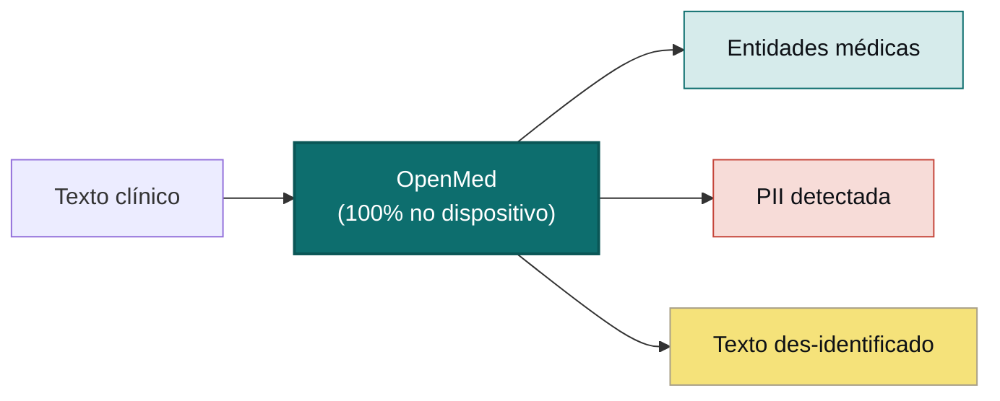

<div align="center">


<h3>Seus dados. Seu modelo. Seu hardware.</h3>

<p><b>Transforme texto clínico em informação estruturada e desidentificada, sem nada enviado para a nuvem.</b><br/>
O OpenMed extrai entidades biomédicas e remove mais de 55 tipos de PHI inteiramente no hardware que você controla, de modo que seus dados nunca saem do dispositivo. Os mesmos 2.000+ modelos abertos rodam de um telefone a um servidor com GPU, totalmente offline: iOS e iPadOS via OpenMedKit, Android via ONNX, CPUs comuns, Apple Silicon, GPUs NVIDIA e o navegador. Sem nuvem. Sem dependência de fornecedor. Sem dados de pacientes saindo da sua rede.</p>

<p>
  <a href="https://pypi.org/project/openmed/"></a>
  <a href="https://www.python.org/downloads/"></a>
  <a href="https://huggingface.co/OpenMed"></a>
  <a href="https://arxiv.org/abs/2508.01630"></a>
  <a href="LICENSE"></a>
  <a href="https://github.com/maziyarpanahi/openmed/stargazers"></a>
</p>

<p>
  <a href="swift/OpenMedKit"></a>
  <a href="docs/mlx-backend.md"></a>
  <a href="docs/swift-openmedkit.md"></a>
  <a href="https://openmed.life/docs"></a>
</p>

<p>
  <b>2.000+ modelos</b> &nbsp;·&nbsp; <b>15 idiomas de PII</b> &nbsp;·&nbsp; <b>600+ checkpoints de PII</b> &nbsp;·&nbsp; <b>100% no dispositivo</b> &nbsp;·&nbsp; <b>Apache-2.0</b>
</p>

<p>
  <a href="README.md">English</a> ·
  <a href="README.zh-CN.md">简体中文</a> ·
  <a href="README.es.md">Español</a> ·
  <a href="README.fr.md">Français</a> ·
  <a href="README.de.md">Deutsch</a> ·
  <a href="README.it.md">Italiano</a> ·
  <b>Português</b> ·
  <a href="README.nl.md">Nederlands</a> ·
  <a href="README.ar.md">العربية</a> ·
  <a href="README.hi.md">हिन्दी</a> ·
  <a href="README.te.md">తెలుగు</a> ·
  <a href="README.ja.md">日本語</a> ·
  <a href="README.tr.md">Türkçe</a> ·
  <a href="README.fa.md">فارسی</a>
</p>

</div>

---

## Veja em ação

<div align="center">
  
  <br/>
  <sub><b>Des-identificação de PII em tempo real</b>: o Privacy Filter Nemotron oculta nomes, endereços, identificadores e dados de faturamento de um relatório de alta clínica, totalmente no dispositivo. <i>(Todos os valores exibidos são sintéticos.)</i></sub>
</div>

---

## Exemplo em 30 segundos

```python
from openmed import analyze_text

result = analyze_text(
    "Patient started on imatinib for chronic myeloid leukemia.",
    model_name="disease_detection_superclinical",
)

for entity in result.entities:
    print(f"{entity.label:<12} {entity.text:<28} {entity.confidence:.2f}")
# DISEASE      chronic myeloid leukemia     0.98
# DRUG         imatinib                     0.95
```

Um modelo de NER clínico de última geração rodando localmente, sem chave de API, sem chamada de rede.

---

## Por que OpenMed?

|                                       |       **OpenMed**        |   APIs médicas em nuvem   |
| ------------------------------------- | :----------------------: | :-----------------------: |
| Roda no seu dispositivo/servidores    |            ✅            |            ❌             |
| Dados do paciente saem da sua rede    |        **Nunca**         |   Enviados ao fornecedor   |
| Custo                                 | Gratuito e open source   |   Cobrança por chamada     |
| Modelos médicos especializados        |          2.000+          |          Limitados        |
| Idiomas                               |           12+            |          Variável         |
| Offline / isolado (air-gapped)        |            ✅            |            ❌             |
| Aceleração Apple Silicon (MLX)        |            ✅            |            n/d            |
| Apps nativos de iOS / macOS           |    ✅ via OpenMedKit     |            ❌             |
| Dependência de fornecedor             |   Nenhuma, Apache-2.0   |            Sim            |

- **Modelos especializados**: mais de 2.000 modelos biomédicos e clínicos selecionados, muitos superando soluções proprietárias.
- **Des-identificação compatível com HIPAA**: todos os 18 identificadores de Safe Harbor, mesclagem inteligente de entidades e substitutos fictícios que preservam o formato.
- **Roda em qualquer lugar**: CPU, CUDA, Apple Silicon (MLX) e nativamente em apps iOS/macOS via OpenMedKit.
- **Implantação em uma linha**: API Python, serviço REST com Docker ou pipelines em lote.
- **Sem aprisionamento**: Apache-2.0, sua infraestrutura, seus dados.

---

## No dispositivo, na Apple: Swift, MLX e iOS

O OpenMed foi feito para rodar onde seus dados já vivem. Em hardware Apple, ele acelera com **MLX** e chega
diretamente aos apps de iPhone, iPad e Mac via **[OpenMedKit](swift/OpenMedKit)**, de modo que a detecção de
PII e a extração clínica acontecem totalmente offline, no dispositivo.

```swift
// Add OpenMedKit to your app
dependencies: [
    .package(url: "https://github.com/maziyarpanahi/openmed.git", branch: "master"),
]
```

- **Runtime MLX** para classificação de tokens de PII, a família Privacy Filter e tarefas zero-shot experimentais da família GLiNER, com um caminho de fallback em CoreML.
- **Um nome de modelo, todas as plataformas**: em hardware que não é Apple, os nomes de modelo MLX recorrem automaticamente ao checkpoint PyTorch correspondente.
- **Python no Apple Silicon** também: `pip install --upgrade "openmed[mlx]"`.

Guias: [Backend MLX](docs/mlx-backend.md) · [OpenMedKit (Swift)](docs/swift-openmedkit.md) · [Exportação CoreML](docs/coreml-export.md)

---

## Como funciona



---

## Início rápido

```bash
# Core + Hugging Face runtime (Linux, macOS, Windows; CPU or CUDA)
pip install --upgrade "openmed[hf]"

# Add the REST service
pip install --upgrade "openmed[hf,service]"

# Apple Silicon acceleration (MLX)
pip install --upgrade "openmed[mlx]"
```

<table>
<tr>
<td width="33%" valign="top">

**API Python**

```python
from openmed import analyze_text

analyze_text(
  "Patient received 75mg "
  "clopidogrel for NSTEMI.",
  model_name=
  "pharma_detection_superclinical",
)
```

</td>
<td width="33%" valign="top">

**Serviço REST**

```bash
uvicorn openmed.service.app:app \
  --host 0.0.0.0 --port 8080
```

`GET /health`
`POST /analyze`
`POST /pii/extract`
`POST /pii/deidentify`

</td>
<td width="33%" valign="top">

**Em lote**

```python
from openmed import BatchProcessor

p = BatchProcessor(
  model_name=
  "disease_detection_superclinical",
  group_entities=True,
)
p.process_texts([...])
```

</td>
</tr>
</table>

**Offline / isolado?** Aponte `model_name` (ou `model_id`) para um diretório local e o OpenMed o carrega sem contatar o Hugging Face Hub:

```python
from openmed import OpenMedConfig, analyze_text

result = analyze_text(
    "Patient presents with chronic myeloid leukemia and Type 2 diabetes.",
    model_id="./models/OpenMed-NER-DiseaseDetect-SuperClinical-434M",
    config=OpenMedConfig(device="cpu"),
)
```

---

## Modelos

Um registro curado de modelos de NER médico especializados: explore o [catálogo completo](https://openmed.life/docs/model-registry).

| Modelo | Especialização | Tipos de entidade | Tamanho |
|--------|----------------|-------------------|---------|
| `disease_detection_superclinical` | Doenças e condições | DISEASE, CONDITION, DIAGNOSIS | 434M |
| `pharma_detection_superclinical`  | Fármacos e medicamentos | DRUG, MEDICATION, TREATMENT   | 434M |
| `pii_superclinical_large`     | PII e des-identificação | NAME, DATE, SSN, PHONE, EMAIL, ADDRESS | 434M |
| `anatomy_detection_electramed`    | Anatomia e partes do corpo | ANATOMY, ORGAN, BODY_PART     | 109M |
| `gene_detection_genecorpus`       | Genes e proteínas | GENE, PROTEIN                 | 109M |

---

## Privacidade: detecção e des-identificação de PII

```python
from openmed import extract_pii, deidentify

text = "Patient: John Doe, DOB: 01/15/1970, SSN: 123-45-6789"

# Extract PII with smart merging (prevents tokenization fragmentation)
result = extract_pii(text, model_name="pii_superclinical_large", use_smart_merging=True)

# De-identify with the method you need
deidentify(text, method="mask")     # [NAME], [DATE]
deidentify(text, method="replace")  # Faker-backed, locale-aware, format-preserving fakes
deidentify(text, method="hash")     # Cryptographic hashing
deidentify(text, method="shift_dates", date_shift_days=180)
```

- **A mesclagem inteligente de entidades** mantém `01/15/1970` inteiro em vez de fragmentá-lo.
- **Ofuscação baseada em Faker** com provedores personalizados de identificadores clínicos (CPF, CNPJ, BSN, NIR, Codice Fiscale, NIE, Aadhaar, Steuer-ID, NPI).
- **HIPAA**: todos os 18 identificadores de Safe Harbor, com limiares de confiança configuráveis.

[Notebook completo de PII](examples/notebooks/PII_Detection_Complete_Guide.ipynb) · [Mesclagem inteligente](docs/pii-smart-merging.md) · [Anonimização](docs/anonymization.md)

<details>
<summary><b>Família Privacy Filter</b>: três famílias de modelos sobre a arquitetura OpenAI Privacy Filter</summary>

<br/>

O código do modelo é o mesmo (transformer MoE esparso no estilo gpt-oss com atenção local, tokens sink, RoPE+YaRN, tokenização tiktoken `o200k_base`); apenas os dados de treinamento mudam. Todos usam a **mesma** API `extract_pii()` / `deidentify()`: só muda o argumento `model_name=`.

| Variante | PyTorch (CPU + CUDA) | MLX (Apple Silicon) | MLX 8-bit |
| --- | --- | --- | --- |
| **OpenAI Privacy Filter** | [`openai/privacy-filter`](https://huggingface.co/openai/privacy-filter) | [`OpenMed/privacy-filter-mlx`](https://huggingface.co/OpenMed/privacy-filter-mlx) | [`…-mlx-8bit`](https://huggingface.co/OpenMed/privacy-filter-mlx-8bit) |
| **Nemotron-PII fine-tune** | [`OpenMed/privacy-filter-nemotron`](https://huggingface.co/OpenMed/privacy-filter-nemotron) | [`…-nemotron-mlx`](https://huggingface.co/OpenMed/privacy-filter-nemotron-mlx) | [`…-nemotron-mlx-8bit`](https://huggingface.co/OpenMed/privacy-filter-nemotron-mlx-8bit) |
| **OpenMed Multilingual** | [`OpenMed/privacy-filter-multilingual`](https://huggingface.co/OpenMed/privacy-filter-multilingual) | [`…-multilingual-mlx`](https://huggingface.co/OpenMed/privacy-filter-multilingual-mlx) | [`…-multilingual-mlx-8bit`](https://huggingface.co/OpenMed/privacy-filter-multilingual-mlx-8bit) |

```python
from openmed import extract_pii

text = "Patient Sarah Connor (DOB: 03/15/1985) at MRN 4471882."

extract_pii(text, model_name="openai/privacy-filter")              # PyTorch baseline
extract_pii(text, model_name="OpenMed/privacy-filter-nemotron")    # same code, different weights
extract_pii(text, model_name="OpenMed/privacy-filter-mlx")         # Apple Silicon (MLX)
```

Em hosts que não são Apple Silicon, os nomes de modelo MLX são substituídos automaticamente pelo checkpoint PyTorch correspondente (com um aviso único): escreva um nome de modelo e rode em qualquer lugar. Veja [Arquitetura do Privacy Filter e roteamento de backend](docs/anonymization.md#privacy-filter-family).

</details>

---

## PII multilíngue (12 idiomas)

Extração e des-identificação em `en`, `fr`, `de`, `it`, `es`, `nl`, `hi`, `te`, `pt`, `ar`, `ja` e `tr`, **600+ checkpoints de PII** no total.

```bash
python -c "from openmed import extract_pii; print([(e.label, e.text) for e in extract_pii('Dr. Pedro Almeida, CPF: 123.456.789-09, email: pedro@hospital.pt', lang='pt').entities])"
```

<details>
<summary>Ver exemplos por idioma (português, holandês, hindi, árabe, japonês, turco)</summary>

<br/>

```python
from openmed import extract_pii

portuguese = extract_pii("Paciente: Pedro Almeida, CPF: 123.456.789-09, telefone: +351 912 345 678", lang="pt", use_smart_merging=True)
dutch      = extract_pii("Patiënt: Eva de Vries, BSN: 123456782, telefoon: +31 6 12345678", lang="nl", use_smart_merging=True)
hindi      = extract_pii("रोगी: अनीता शर्मा, फोन: +91 9876543210, पता: नई दिल्ली 110001", lang="hi", use_smart_merging=True)
arabic     = extract_pii("المريضة ليلى حسن، الهاتف +20 10 1234 5678، الرقم القومي 29801011234567.", lang="ar", use_smart_merging=True)
japanese   = extract_pii("患者 佐藤 花子、電話 +81 90 1234 5678、マイナンバー 1234 5678 9012.", lang="ja", use_smart_merging=True)
turkish    = extract_pii("Hasta Ayşe Yılmaz, telefon +90 532 123 45 67, TCKN 10000000146.", lang="tr", use_smart_merging=True)

for r in (portuguese, dutch, hindi, arabic, japanese, turkish):
    print([(e.label, e.text) for e in r.entities])
```

</details>

---

## REST API

Um serviço FastAPI amigável ao Docker, com validação de requisições, pré-carregamento de pipeline compartilhado e envelopes de erro unificados.

```bash
pip install --upgrade "openmed[hf,service]"
uvicorn openmed.service.app:app --host 0.0.0.0 --port 8080

# or with Docker
docker build -t openmed:local .
docker run --rm -p 8080:8080 -e OPENMED_PROFILE=prod openmed:local
```

```bash
curl -X POST http://127.0.0.1:8080/pii/extract \
  -H "Content-Type: application/json" \
  -d '{"text":"Paciente: Maria Garcia, DNI: 12345678Z","lang":"es"}'
```

Veja o [guia completo do serviço REST](docs/rest-service.md).

---

## Documentação

Guias completos em **[openmed.life/docs](https://openmed.life/docs/)**.

| | | |
|---|---|---|
| [Primeiros passos](https://openmed.life/docs/) | [Analisar texto](https://openmed.life/docs/analyze-text) | [Registro de modelos](https://openmed.life/docs/model-registry) |
| [Guia de detecção de PII](examples/notebooks/PII_Detection_Complete_Guide.ipynb) | [Anonimização](docs/anonymization.md) | [Processamento em lote](https://openmed.life/docs/batch-processing) |
| [Perfis de configuração](https://openmed.life/docs/profiles) | [Serviço REST](docs/rest-service.md) | [Backend MLX](docs/mlx-backend.md) |

---

## Conheça o mascote


O guardião do OpenMed é um gato persa fofo caracterizado como um pequeno **Avicena (Ibn Sina)**, o grande
médico persa cujo *Cânone da Medicina* foi o texto médico de referência no mundo todo por cerca de 600 anos.
Ele cuida do livro aberto do conhecimento médico, com uma paleta inspirada na **turquesa persa (fīrūza)**: um
guardião local-first para os seus dados mais privados.

<br clear="left"/>

---

## Contribuir

Contribuições são bem-vindas: relatórios de bugs, pedidos de recursos e PRs.

- [Abrir uma issue](https://github.com/maziyarpanahi/openmed/issues)
- **Traduções são bem-vindas**: ajude a completar os README em outros idiomas vinculados no seletor no topo.

---

## Créditos

O OpenMed se baseia em excelente trabalho open source: agradecimento especial à **OpenAI** (a arquitetura [Privacy Filter](https://huggingface.co/openai/privacy-filter)), à **NVIDIA** (o [conjunto de dados Nemotron PII](https://huggingface.co/datasets/nvidia/Nemotron-PII-v1)), à **Hugging Face** (`transformers` e o ecossistema de modelos), à **Apple** ([MLX](https://github.com/ml-explore/mlx)) e aos mantenedores do **[Faker](https://faker.readthedocs.io/)**.

## Licença

Publicado sob a [Licença Apache-2.0](LICENSE).

## Citação

Se o OpenMed for útil na sua pesquisa, por favor, cite:

```bibtex
@misc{panahi2025openmedneropensourcedomainadapted,
      title={OpenMed NER: Open-Source, Domain-Adapted State-of-the-Art Transformers for Biomedical NER Across 12 Public Datasets},
      author={Maziyar Panahi},
      year={2025},
      eprint={2508.01630},
      archivePrefix={arXiv},
      primaryClass={cs.CL},
      url={https://arxiv.org/abs/2508.01630},
}
```

---

## Histórico de estrelas

Se o OpenMed for útil para você, uma estrela ajuda outros a descobri-lo.

<a href="https://star-history.com/#maziyarpanahi/openmed&Date">
  
</a>

---

<div align="center">

Feito pela equipe OpenMed

<a href="https://openmed.life">Site</a> ·
<a href="https://openmed.life/docs">Documentação</a> ·
<a href="https://x.com/openmed_ai">X / Twitter</a> ·
<a href="https://www.linkedin.com/company/openmed-ai/">LinkedIn</a>

</div>
