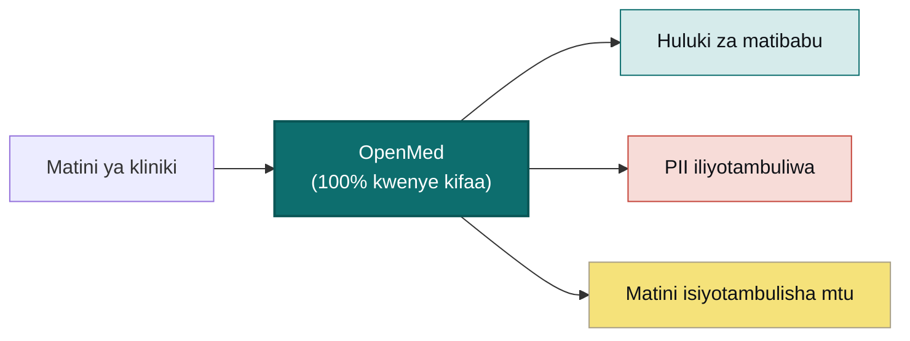

<div align="center">


<h2>Data Yako. Modeli Yako. Maunzi Yako.</h2>

<a href="https://trendshift.io/repositories/40195?utm_source=repository-badge&amp;utm_medium=badge&amp;utm_campaign=badge-repository-40195" target="_blank" rel="noopener noreferrer"></a>

<p><b>Badili matini ya kliniki kuwa maarifa yaliyopangwa na yasiyotambulisha mtu, bila kupakia chochote.</b><br/>
OpenMed hutambua huluki za biomedicine na kuondoa aina 55+ za PHI kwenye
maunzi unayodhibiti, hivyo data yako haiondoki kwenye kifaa. Modeli huria
2,000+ zinaweza kufanya kazi nje ya mtandao kutoka simu hadi seva ya GPU:
iOS, iPadOS na Android kupitia OpenMedKit, React Native, CPU za kawaida,
Apple Silicon, GPU za NVIDIA, kivinjari na huduma za REST/gRPC. Hakuna wingu,
hakuna kufungiwa kwa muuzaji, na hakuna data ya mgonjwa inayotoka kwenye
mtandao wako.</p>

<p>
  <a href="https://pypi.org/project/openmed/"></a>
  <a href="https://www.python.org/downloads/"></a>
  <a href="https://huggingface.co/OpenMed"></a>
  <a href="https://arxiv.org/abs/2508.01630"></a>
  <a href="LICENSE"></a>
  <a href="https://github.com/maziyarpanahi/openmed/stargazers"></a>
</p>

<p>
  <a href="swift/OpenMedKit"></a>
  <a href="docs/mlx-backend.md"></a>
  <a href="docs/export-onnx-android.md"></a>
  <a href="docs/export-transformersjs.md"></a>
  <a href="docs/swift-openmedkit.md"></a>
  <a href="https://openmed.life/docs"></a>
</p>

<p>
  <b>Modeli 2,000+</b> &nbsp;·&nbsp; <b>Lugha 27 za PII zinazotumia modeli</b> &nbsp;·&nbsp; <b>Checkpoint 600+ za PII</b> &nbsp;·&nbsp; <b>100% kwenye kifaa</b> &nbsp;·&nbsp; <b>Apache-2.0</b>
</p>

<p>
  <a href="README.md">English</a> ·
  <a href="README.zh-CN.md">简体中文</a> ·
  <a href="README.es.md">Español</a> ·
  <a href="README.fr.md">Français</a> ·
  <a href="README.de.md">Deutsch</a> ·
  <a href="README.it.md">Italiano</a> ·
  <a href="README.pt.md">Português</a> ·
  <a href="README.nl.md">Nederlands</a> ·
  <a href="README.ar.md">العربية</a> ·
  <a href="README.hi.md">हिन्दी</a> ·
  <a href="README.te.md">తెలుగు</a> ·
  <a href="README.ja.md">日本語</a> ·
  <a href="README.tr.md">Türkçe</a> ·
  <a href="README.fa.md">فارسی</a> ·
  <b>Kiswahili</b>
</p>

</div>

---

## Ione ikifanya kazi

OpenMed hufanya kazi **yote kwenye kifaa**; matini ya kliniki haiondoki humo.
Hivi ndivyo inavyofanya kazi kwenye iPhone, nje kabisa ya mtandao:

<div align="center">
  
  <br/>
  <sub><b>Kwenye iPhone kupitia <a href="swift/OpenMedKit">OpenMedKit</a></b>: changanua dokezo la kliniki, ondoa utambulisho na utoe ishara za kliniki kwa Apple MLX kwenye kifaa. Hakuna kinachopakiwa.</sub>
</div>

<br/>

<div align="center">
  
  <br/>
  <sub><b>Uondoaji wa utambulisho wa PII kwa wakati halisi</b>: Nemotron Privacy Filter huficha majina, anwani, vitambulisho na data ya malipo kwenye kifaa. <i>(Thamani zote zinazoonekana ni za kutengenezwa.)</i></sub>
</div>

---

## Mfano wa sekunde 30

```python
from openmed import analyze_text

result = analyze_text(
    "Patient started on imatinib for chronic myeloid leukemia.",
    model_name="disease_detection_superclinical",
)

for entity in result.entities:
    print(f"{entity.label:<12} {entity.text:<28} {entity.confidence:.2f}")
# DISEASE      chronic myeloid leukemia     0.98
# DRUG         imatinib                     0.95
```

Modeli ya kisasa ya NER ya kliniki hufanya kazi ndani ya mashine yako: hakuna
ufunguo wa API wala ombi la mtandao.

---

## Kwa nini OpenMed?

|                                      |          **OpenMed**           | API za matibabu za wingu |
| ------------------------------------ | :----------------------------: | :----------------------: |
| Hufanya kazi kwenye kifaa/seva zako  |               ✅               |            ❌            |
| Data ya mgonjwa hutoka mtandao wako  |          **Kamwe**             | Hutumwa kwa mtoa huduma  |
| Gharama                              | Bure na chanzo huria            | Malipo kwa kila ombi     |
| Modeli maalumu za matibabu           |            2,000+              | Chache                    |
| Lugha za PII zinazotumia modeli      |              27                | Hutofautiana              |
| Nje ya mtandao/air-gapped            |               ✅               |            ❌            |
| Uharakishaji wa Apple Silicon (MLX)  |               ✅               | Haitumiki                 |
| Programu asilia za iOS/macOS         | ✅ kupitia OpenMedKit           |            ❌            |
| Uainishaji wa token kwenye WebGPU    | ✅ kupitia Transformers.js     | Hutofautiana              |
| Kufungiwa kwa muuzaji                | Hakuna (Apache-2.0)             | Kupo                      |

- **Modeli maalumu**: modeli 2,000+ za biomedicine na kliniki zilizochaguliwa.
- **Uondoaji utambulisho unaozingatia HIPAA**: vitambulishi vyote 18 vya Safe
  Harbor, uunganishaji makini wa huluki na vibadala vinavyohifadhi umbizo.
- **Hufanya kazi kila mahali**: CPU, CUDA, Apple Silicon (MLX), iOS/macOS,
  Android/Kotlin, React Native, REST/gRPC na vifurushi vya kivinjari/WebGPU.
- **Usambazaji wa mstari mmoja**: Python API, huduma ya REST ya Docker au
  michakato ya batch.
- **Hakuna kufungiwa**: Apache-2.0, miundombinu yako na data yako.

---

## Kwenye kifaa cha Apple: Swift, MLX na iOS

OpenMed imeundwa kufanya kazi mahali data yako ilipo. Kwenye maunzi ya Apple
inaharakishwa na **MLX**, na kupitia **[OpenMedKit](swift/OpenMedKit)** inaingia
moja kwa moja kwenye programu za iPhone, iPad na Mac. Utambuzi wa PII na
uchambuzi wa kliniki hufanyika nje ya mtandao, kwenye kifaa.

```swift
// Add OpenMedKit to your app
dependencies: [
    .package(url: "https://github.com/maziyarpanahi/openmed.git", from: "1.9.1"),
]
```

Matokeo yanayotarajiwa: Swift Package Manager itatambua OpenMedKit na
`import OpenMedKit` itapatikana kwenye target ya programu yako.

- **Runtime ya MLX** kwa uainishaji wa token za PII, familia ya Privacy Filter,
  majaribio ya zero-shot ya familia ya GLiNER na uzalishaji wa matini wa
  Python MLX-LM kwa Laneformer.
- **Jina moja la modeli, kila jukwaa**: majina ya modeli za MLX hubadilishwa
  kiotomatiki kuwa checkpoint ya PyTorch kwenye maunzi yasiyo ya Apple.
- **Python kwenye Apple Silicon**: `pip install --upgrade "openmed[mlx]"`.

Miongozo: [MLX backend](docs/mlx-backend.md) ·
[OpenMedKit (Swift)](docs/swift-openmedkit.md) ·
[CoreML export](docs/coreml-export.md)

<div align="center">
  
  <br/>
  <sub><b>MLX kwenye Apple Silicon ni haraka mara 24–33 kuliko CPU PyTorch</b> kwa Privacy Filter: muda wa wastani kwa hatua ya inference, mdogo ni bora.</sub>
</div>

---

## Kwenye kifaa cha Android — Kotlin na ONNX Runtime Mobile

OpenMedKit pia hutolewa kama maktaba asilia ya Android/Kotlin kwa kupokea hati,
OCR, kuficha PII na uainishaji wa token kupitia **ONNX Runtime Mobile**. Hazina
za modeli za simu zina majina thabiti ya tensor, mhimili wa urefu unaobadilika,
tokenizer, lebo na matokeo ya fp32, fp16, INT8 na `.ort`.

Ongeza hazina ya JitPack yenye upeo katika `settings.gradle.kts`:

```kotlin
dependencyResolutionManagement {
    repositories {
        google()
        mavenCentral()
        maven {
            url = uri("https://jitpack.io")
            content { includeGroup("com.github.maziyarpanahi") }
        }
    }
}
```

Kisha tumia toleo lisilobadilika la OpenMed `v1.9.1`:

```kotlin
dependencies {
    implementation("com.github.maziyarpanahi:openmed:v1.9.1")
}
```

Tazama [mwongozo wa usakinishaji wa Android](android/README.md) kwa build za
ndani na maelezo ya uchapishaji.

```kotlin
val model = OpenMedKit.fromDirectory(modelDir)
val entities = model.analyzeText("Patient Alice Nguyen was seen in cardiology.")
```

- **Wasifu wa Android ONNX** hutoa `model.onnx`, `model_fp16.onnx`,
  `model_int8.onnx`, tokenizer, lebo na `openmed-onnx.json`.
- **ORT Mobile** huhifadhi usanidi wa operator wa build ndogo zaidi zana za
  ubadilishaji wa ONNX Runtime zikipatikana.
- **Vipimo vya ulinganifu wa Kotlin** huweka offset za tokenizer, mipaka ya
  span na matokeo ya decoder sawa na runtime ya Python.

Miongozo: [Android ONNX export](docs/export-onnx-android.md) ·
[Android span parity](docs/android-parity.md) ·
[OpenMedKit Android](android/openmedkit)

### Modeli hiyo hiyo ya ONNX kwenye Python CPU

```python
from openmed import OnnxModel

model = OnnxModel.from_pretrained(
    "OpenMed/OpenMed-PII-ClinicalE5-Small-33M-v1-onnx-android"
)
entities = model("Patient Alice Nguyen was seen in cardiology.")
```

### Modeli hiyo hiyo ya ONNX kwenye kivinjari

```bash
npm install openmed @huggingface/transformers
```

```typescript
import { loadOnnxModel } from "openmed";

const model = await loadOnnxModel(
  "OpenMed/OpenMed-PII-ClinicalE5-Small-33M-v1-onnx-android",
);
const entities = await model("Patient Alice Nguyen was seen in cardiology.");
```

---

## Jinsi inavyofanya kazi



Matokeo: mchakato wa ndani unaorudisha huluki za matibabu, PII iliyopatikana na
matini isiyotambulisha mtu bila kutuma data kwa API ya wingu.

---

## Anza haraka

```bash
# Core + Hugging Face runtime (Linux, macOS, Windows; CPU or CUDA)
pip install --upgrade "openmed[hf]"

# Ongeza huduma ya REST
pip install --upgrade "openmed[hf,service]"

# Uharakishaji wa Apple Silicon (MLX)
pip install --upgrade "openmed[mlx]"
```

Matokeo yanayotarajiwa:

```text
Successfully installed openmed-...
```

**Python API**

```python
from openmed import analyze_text

result = analyze_text(
    "Patient received 75mg clopidogrel for NSTEMI.",
    model_name="pharma_detection_superclinical",
)
print([(e.label, e.text) for e in result.entities])
```

Mfano wa matokeo:

```text
[('DRUG', 'clopidogrel'), ('CONDITION', 'NSTEMI')]
```

**Huduma ya REST**

```bash
uvicorn openmed.service.app:app --host 0.0.0.0 --port 8080
```

`GET /health` · `POST /analyze` · `POST /pii/extract` ·
`POST /pii/deidentify`

**Batch**

```python
from openmed import BatchProcessor

processor = BatchProcessor(
    model_name="disease_detection_superclinical",
    group_entities=True,
)
results = processor.process_texts([...])
print(len(results), sum(len(item.entities) for item in results))
```

**Kivinjari/WebGPU**

Tengeneza export ya uainishaji wa token ya ONNX kwa inference kwenye kivinjari
kupitia Transformers.js:

```bash
python -m openmed.onnx.convert \
  --model dslim/bert-base-NER \
  --output dist/example-onnx \
  --include-transformersjs
```

[Mwongozo wa export ya Transformers.js](docs/export-transformersjs.md)

**Nje ya mtandao/air-gapped?** Elekeza `model_name` au `model_id` kwenye
saraka ya ndani. OpenMed itaipakia bila kuwasiliana na Hugging Face Hub:

```python
from openmed import OpenMedConfig, analyze_text

result = analyze_text(
    "Patient presents with chronic myeloid leukemia and Type 2 diabetes.",
    model_id="./models/OpenMed-NER-DiseaseDetect-SuperClinical-434M",
    config=OpenMedConfig(device="cpu"),
)
for entity in result.entities:
    print(f"{entity.label:<12} {entity.text:<28} {entity.confidence:.2f}")
```

Kwa kuwa `model_id` inaelekeza kwenye saraka ya ndani, mfano huu hauwasiliani
na Hub wala mtoa modeli mwingine.

---

## Modeli

Sajili iliyochaguliwa ya modeli maalumu za NER ya matibabu; tazama
[orodha kamili](https://openmed.life/docs/model-registry).

| Modeli | Utaalamu | Aina za huluki | Ukubwa |
|---|---|---|---|
| `disease_detection_superclinical` | Magonjwa na hali | DISEASE, CONDITION, DIAGNOSIS | 434M |
| `pharma_detection_superclinical` | Dawa na matibabu | DRUG, MEDICATION, TREATMENT | 434M |
| `pii_superclinical_large` | PII na uondoaji utambulisho | NAME, DATE, SSN, PHONE, EMAIL, ADDRESS | 434M |
| `anatomy_detection_electramed` | Anatomia na sehemu za mwili | ANATOMY, ORGAN, BODY_PART | 109M |
| `gene_detection_genecorpus` | Jeni na protini | GENE, PROTEIN | 109M |

---

## Faragha: utambuzi wa PII na uondoaji utambulisho

```python
from openmed import deidentify, extract_pii

text = "Patient: John Doe, DOB: 01/15/1970, SSN: 123-45-6789"

result = extract_pii(
    text,
    model_name="pii_superclinical_large",
    use_smart_merging=True,
)
print([(e.label, e.text) for e in result.entities])

print(deidentify(text, method="mask").deidentified_text)
print(deidentify(text, method="replace").deidentified_text)
print(deidentify(text, method="hash").deidentified_text)
print(deidentify(text, method="shift_dates", date_shift_days=180).deidentified_text)
```

- **Uunganishaji makini wa huluki** huweka `01/15/1970` kama kipande kimoja.
- **Michakato inayojua sera** huongeza wasifu wa HIPAA/GDPR/utafiti, vizingiti
  vilivyokalibishwa na ripoti za ukaguzi zilizotiwa sahihi.
- **Vibadala vya Faker** huhifadhi umbizo la vitambulisho vya kliniki.
- **HIPAA**: vitambulishi vyote 18 vya Safe Harbor na vizingiti vinavyosanidiwa.
- **PII ya batch na streaming**: tumia
  `BatchProcessor(operation="extract_pii" | "deidentify", batch_size=16)`.

<div align="center">
  
  <br/>
  <sub><b>Uchakataji wa batch</b>: hadi mara <b>3.3</b> zaidi kwenye CPU na mara <b>2.2</b> kwenye MLX kuliko hati moja moja.</sub>
</div>

[Notebook kamili ya PII](examples/notebooks/PII_Detection_Complete_Guide.ipynb) ·
[Smart merging](docs/pii-smart-merging.md) ·
[Anza na anonymization](docs/anonymization.md#quickstart-choosing-a-method)

<details>
<summary><b>Familia ya Privacy Filter</b>: familia tatu za modeli zenye usanifu mmoja</summary>

<br/>

Msimbo wa modeli ni mmoja; data ya mafunzo ndiyo tofauti. Zote hupitia API
ileile ya `extract_pii()` na `deidentify()`; badilisha tu `model_name=`.
`openai/privacy-filter` ni kitambulishi cha modeli ya uzito wa ndani kwenye
Hugging Face na matumizi yake hapa hayaiti API ya OpenAI.

| Lahaja | PyTorch (CPU + CUDA) | MLX (Apple Silicon) | MLX 8-bit |
|---|---|---|---|
| **OpenAI Privacy Filter** | [`openai/privacy-filter`](https://huggingface.co/openai/privacy-filter) | [`OpenMed/privacy-filter-mlx`](https://huggingface.co/OpenMed/privacy-filter-mlx) | [`…-mlx-8bit`](https://huggingface.co/OpenMed/privacy-filter-mlx-8bit) |
| **Nemotron-PII fine-tune** | [`OpenMed/privacy-filter-nemotron`](https://huggingface.co/OpenMed/privacy-filter-nemotron) | [`…-nemotron-mlx`](https://huggingface.co/OpenMed/privacy-filter-nemotron-mlx) | [`…-nemotron-mlx-8bit`](https://huggingface.co/OpenMed/privacy-filter-nemotron-mlx-8bit) |
| **OpenMed Multilingual** | [`OpenMed/privacy-filter-multilingual`](https://huggingface.co/OpenMed/privacy-filter-multilingual) | [`…-multilingual-mlx`](https://huggingface.co/OpenMed/privacy-filter-multilingual-mlx) | [`…-multilingual-mlx-8bit`](https://huggingface.co/OpenMed/privacy-filter-multilingual-mlx-8bit) |

Tazama [usanifu wa Privacy Filter na uelekezaji wa backend](docs/anonymization.md#privacy-filter-family).

</details>

---

## PII ya lugha nyingi (lugha 29 zinazoungwa mkono)

Utoaji na uondoaji utambulisho huunga mkono **misimbo 29 ya lugha za PII**:
`am`, `ar`, `cs`, `da`, `de`, `el`, `en`, `es`, `fr`, `he`, `hi`, `id`, `it`,
`ja`, `ko`, `nl`, `no`, `pt`, `ro`, `ru`, `sv`, `sw`, `te`, `th`, `tr`, `uk`,
`xh`, `zh` na `zu`, pamoja na checkpoint
600+ za PII. Uelekezaji wa Kirusi na Kichina kwa sasa hutumia vishikilia nafasi
vya modeli chaguo-msingi ya lugha nyingi vilivyoelezwa kwenye nyaraka, huku
uzito maalumu wa modeli ukiwa tofauti. Familia ya hiari ya Indic NER
iliyosanidiwa na mtumiaji hukubali njia tisa za ziada (`as`, `bn`, `gu`, `kn`,
`ml`, `mr`, `or`, `pa` na `ta`) na inaweza pia kuhudumia Kihindi na Kitelugu.
Weka `OPENMED_INDIC_NER_MODEL`; OpenMed haijumuishi wala kuchagua uzito huo
kiotomatiki. OpenMed pia ina uthibitishaji wa vitambulisho vya kitaifa kwa
maeneo ya ziada yanayotumia kitambulisho pekee, kama vile Poland, Latvia,
Slovakia, Malaysia, Ufilipino na Finland.

Tazama [mwongozo wa kila lugha](docs/languages.md) kwa modeli chaguo-msingi,
locale ya Faker na mfano wa kabla/baada.

```bash
python -c "from openmed import extract_pii; print([(e.label, e.text) for e in extract_pii('Dr. Pedro Almeida, CPF: 123.456.789-09, email: pedro@hospital.pt', lang='pt').entities])"
```

Mfano wa matokeo:

```text
[('NAME', 'Pedro Almeida'), ('ID', '123.456.789-09'), ('EMAIL', 'pedro@hospital.pt')]
```

---

## REST API

Huduma ya FastAPI inayofaa Docker, yenye uthibitishaji wa maombi, upakiaji wa
pamoja wa pipeline na majibu ya hitilafu yaliyounganishwa.

```bash
pip install --upgrade "openmed[hf,service]"
uvicorn openmed.service.app:app --host 0.0.0.0 --port 8080

# au kwa Docker
docker build -t openmed:local .
docker run --rm -p 8080:8080 -e OPENMED_PROFILE=prod openmed:local
```

```bash
curl -X POST http://127.0.0.1:8080/pii/extract \
  -H "Content-Type: application/json" \
  -d '{"text":"Paciente: Maria Garcia, DNI: 12345678Z","lang":"es"}'
```

**Udhibiti wa mzunguko wa modeli na huduma:** tumia `GET /models/loaded`,
`POST /models/unload` na dirisha la `keep_alive`; huduma pia ina uthibitishaji
wa API-key/JWT, logging isiyo na PHI, tracing, gRPC, kazi za async, webhooks,
dynamic batching, rate limits, `/livez`, `/readyz` na metrics za kuchagua.

Tazama [mwongozo kamili wa huduma ya REST](docs/rest-service.md).

---

## Nyaraka

Miongozo kamili ipo **[openmed.life/docs](https://openmed.life/docs/)**.

Mawakala wa AI wanaweza kupakia faharasa iliyochaguliwa ya
[llms.txt](https://openmed.life/docs/llms.txt) au mlisho wa ndani wa
[llms-full.txt](https://openmed.life/docs/llms-full.txt). Zote hutengenezwa upya
kutoka kwenye nyaraka za sasa wakati wa kila build kali ya MkDocs.

| | | |
|---|---|---|
| [Kuanza](https://openmed.life/docs/) | [Analyze Text](https://openmed.life/docs/analyze-text) | [Sajili ya Modeli](https://openmed.life/docs/model-registry) |
| [Maswali](docs/faq.md) | [Anonymization](docs/anonymization.md) | [Batch Processing](https://openmed.life/docs/batch-processing) |
| [Wasifu wa Usanidi](https://openmed.life/docs/profiles) | [Huduma ya REST](docs/rest-service.md) | [MLX Backend](docs/mlx-backend.md) |
| [Transformers.js Export](docs/export-transformersjs.md) | [FHIR Interop](docs/fhir-interop.md) | [HL7 v2 De-identification](docs/hl7v2-deidentification.md) |
| [Maelezo ya Toleo la OpenMed 1.9.1](docs/release/v1.9.1.md) | [Maelezo ya Toleo la OpenMed 1.9.0](docs/release/v1.9.0.md) | [Mifano](docs/examples.md) |
| [Mikondo ya Matoleo](docs/release/semver-and-channels.md) | [Sera ya Modeli Zalishi](docs/generative-model-policy.md) | [Kuchangia](docs/contributing.md) |
| [Sera ya Usalama](SECURITY.md) | [Msimamo wa Uzingatiaji](docs/compliance.md) | [SDK ya Plugin za Detector](docs/plugin-sdk.md) |
| [Uhamishaji kutoka v1 hadi v2](docs/migration.md) | [Miunganisho ya MCP Client](docs/mcp-clients.md) | [Mwongozo wa Waendelezaji Afrika](docs/africa-onboarding.md) |

---

## Kutana na kinyago


Mlinzi wa OpenMed ni paka wa Kiajemi mwenye manyoya mengi aliyevalishwa kama
**Avicenna (Ibn Sina)** mdogo, tabibu mkubwa wa Kiajemi ambaye *Canon of
Medicine* yake ilikuwa rejea kuu ya matibabu kwa takribani miaka 600. Analinda
kitabu huria cha maarifa ya matibabu kwa rangi ya turquoise ya Kiajemi
(*fīrūza*): mlinzi wa local-first wa data yako ya faragha zaidi.

<br clear="left"/>

---

## Kuchangia

Michango inakaribishwa: ripoti za hitilafu, maombi ya vipengele na PR. Soma
[mwongozo wa kuchangia](CONTRIBUTING.md) na
[Kanuni za Maadili](CODE_OF_CONDUCT.md) kwanza.

- [Fungua issue](https://github.com/maziyarpanahi/openmed/issues)
- [Mwongozo wa kuchangia](CONTRIBUTING.md) ·
  [Kanuni za Maadili](CODE_OF_CONDUCT.md) ·
  [Sera ya usalama](SECURITY.md)
- **Tafsiri zinakaribishwa**: saidia kukamilisha README za lugha nyingine.

---

## Usalama

Umepata udhaifu? OpenMed huficha PHI, kwa hiyo **njia ya kupita ufichaji au
uvujaji wa PHI/PII ni tatizo la usalama**. Ripoti kwa faragha, kamwe si kama
issue ya umma. Tazama **[SECURITY.md](SECURITY.md)** na
[fomu ya ripoti ya faragha](https://github.com/maziyarpanahi/openmed/security/advisories/new).
Usiweke data halisi ya mgonjwa kwenye ripoti.

---

## Shukrani

OpenMed hujengwa juu ya kazi bora ya chanzo huria: shukrani hasa kwa
**OpenAI** ([usanifu wa Privacy Filter](https://huggingface.co/openai/privacy-filter)),
**NVIDIA** ([Nemotron PII dataset](https://huggingface.co/datasets/nvidia/Nemotron-PII-v1)),
**Hugging Face** (`transformers`, Transformers.js na mazingira ya modeli),
**Apple** ([MLX](https://github.com/ml-explore/mlx)) na watunzaji wa
**[Faker](https://faker.readthedocs.io/)**.

## Leseni

Imetolewa chini ya [Leseni ya Apache-2.0](LICENSE). Taarifa za mali za watu
wengine zimeandikwa katika [NOTICE](NOTICE).

## Nukuu

```bibtex
@misc{panahi2025openmedneropensourcedomainadapted,
      title={OpenMed NER: Open-Source, Domain-Adapted State-of-the-Art Transformers for Biomedical NER Across 12 Public Datasets},
      author={Maziyar Panahi},
      year={2025},
      eprint={2508.01630},
      archivePrefix={arXiv},
      primaryClass={cs.CL},
      url={https://arxiv.org/abs/2508.01630},
}
```

Matokeo yanayotarajiwa: metadata ya nukuu inayolingana na BibTeX kwa kutaja
OpenMed katika makala, mabango na nyaraka zinazotokana nayo.

---

## Historia ya nyota

Ikiwa OpenMed inakufaa, nyota huwasaidia wengine kuipata.

[](https://www.star-history.com/?repos=maziyarpanahi%2Fopenmed&type=date&legend=top-left)

---

<div align="center">

Imejengwa na timu ya OpenMed

<a href="https://openmed.life">Tovuti</a> ·
<a href="https://openmed.life/docs">Nyaraka</a> ·
<a href="https://x.com/openmed_ai">X / Twitter</a> ·
<a href="https://www.linkedin.com/company/openmed-ai/">LinkedIn</a>

</div>
