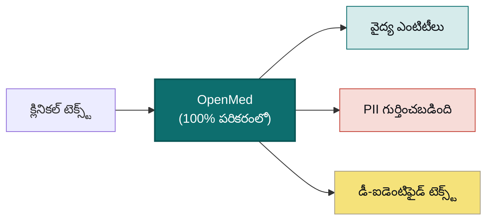

<div align="center">


<h3>మీ డేటా. మీ మోడల్. మీ హార్డ్‌వేర్.</h3>

<p><b>క్లినికల్ టెక్స్ట్‌ను నిర్మాణాత్మక, డీ-ఐడెంటిఫై చేసిన అంతర్దృష్టిగా మార్చండి, ఏదీ అప్‌లోడ్ చేయకుండా.</b><br/>
OpenMed బయోమెడికల్ ఎంటిటీలను వెలికితీస్తుంది మరియు 55+ PHI రకాలను మీ నియంత్రణలోని హార్డ్‌వేర్‌పైనే పూర్తిగా తొలగిస్తుంది, తద్వారా మీ డేటా ఎప్పటికీ పరికరం నుండి బయటకు వెళ్లదు. అదే 2,000+ ఓపెన్ మోడల్‌లు ఒక ఫోన్ నుండి GPU సర్వర్ వరకు, పూర్తిగా ఆఫ్‌లైన్‌గా నడుస్తాయి: OpenMedKit ద్వారా iOS మరియు iPadOS, ONNX ద్వారా Android, సాధారణ CPU లు, Apple Silicon, NVIDIA GPU లు, మరియు బ్రౌజర్. క్లౌడ్ లేదు. వెండర్ లాక్-ఇన్ లేదు. రోగి డేటా మీ నెట్‌వర్క్ నుండి బయటకు వెళ్లదు.</p>

<p>
  <a href="https://pypi.org/project/openmed/"></a>
  <a href="https://www.python.org/downloads/"></a>
  <a href="https://huggingface.co/OpenMed"></a>
  <a href="https://arxiv.org/abs/2508.01630"></a>
  <a href="LICENSE"></a>
  <a href="https://github.com/maziyarpanahi/openmed/stargazers"></a>
</p>

<p>
  <a href="swift/OpenMedKit"></a>
  <a href="docs/mlx-backend.md"></a>
  <a href="docs/swift-openmedkit.md"></a>
  <a href="https://openmed.life/docs"></a>
</p>

<p>
  <b>2,000+ మోడల్‌లు</b> &nbsp;·&nbsp; <b>15 PII భాషలు</b> &nbsp;·&nbsp; <b>600+ PII చెక్‌పాయింట్‌లు</b> &nbsp;·&nbsp; <b>100% పరికరంలో</b> &nbsp;·&nbsp; <b>Apache-2.0</b>
</p>

<p>
  <a href="README.md">English</a> ·
  <a href="README.zh-CN.md">简体中文</a> ·
  <a href="README.es.md">Español</a> ·
  <a href="README.fr.md">Français</a> ·
  <a href="README.de.md">Deutsch</a> ·
  <a href="README.it.md">Italiano</a> ·
  <a href="README.pt.md">Português</a> ·
  <a href="README.nl.md">Nederlands</a> ·
  <a href="README.ar.md">العربية</a> ·
  <a href="README.hi.md">हिन्दी</a> ·
  <b>తెలుగు</b> ·
  <a href="README.ja.md">日本語</a> ·
  <a href="README.tr.md">Türkçe</a> ·
  <a href="README.fa.md">فارسی</a>
</p>

</div>

---

## ప్రత్యక్షంగా చూడండి

<div align="center">
  
  <br/>
  <sub><b>రియల్-టైమ్ PII డీ-ఐడెంటిఫికేషన్</b>: Nemotron Privacy Filter ఒక క్లినికల్ డిశ్చార్జ్ పత్రం నుండి పేర్లు, చిరునామాలు, ID లు మరియు బిల్లింగ్ డేటాను పూర్తిగా పరికరంలోనే మాస్క్ చేస్తోంది. <i>(చూపిన అన్ని విలువలు సింథటిక్.)</i></sub>
</div>

---

## 30 సెకన్ల ఉదాహరణ

```python
from openmed import analyze_text

result = analyze_text(
    "Patient started on imatinib for chronic myeloid leukemia.",
    model_name="disease_detection_superclinical",
)

for entity in result.entities:
    print(f"{entity.label:<12} {entity.text:<28} {entity.confidence:.2f}")
# DISEASE      chronic myeloid leukemia     0.98
# DRUG         imatinib                     0.95
```

అత్యాధునిక క్లినికల్ NER మోడల్ స్థానికంగా నడుస్తోంది. API కీ లేదు, నెట్‌వర్క్ కాల్ లేదు.

---

## OpenMed ఎందుకు?

|                                       |       **OpenMed**        |     క్లౌడ్ వైద్య API లు    |
| ------------------------------------- | :----------------------: | :-----------------------: |
| మీ పరికరం/సర్వర్‌లలో నడుస్తుంది          |            ✅            |            ❌             |
| రోగి డేటా మీ నెట్‌వర్క్ నుండి బయటకు వెళ్తుంది |     **ఎప్పటికీ లేదు**     |    వెండర్‌కు పంపబడుతుంది    |
| ఖర్చు                                 |   ఉచితం & ఓపెన్-సోర్స్    |    కాల్‌కు ఛార్జ్           |
| ప్రత్యేక వైద్య మోడల్‌లు                  |          2,000+          |          పరిమితం          |
| భాషలు                                 |           12+            |          మారుతుంది        |
| ఆఫ్‌లైన్ / ఐసోలేటెడ్ (air-gapped)      |            ✅            |            ❌             |
| Apple Silicon (MLX) త్వరణం             |            ✅            |          వర్తించదు        |
| నేటివ్ iOS / macOS యాప్‌లు              |   ✅ OpenMedKit ద్వారా     |            ❌             |
| వెండర్ లాక్-ఇన్                         |    లేదు, Apache-2.0      |            ఉంది           |

- **ప్రత్యేక మోడల్‌లు**: జాగ్రత్తగా ఎంపిక చేసిన 2,000+ బయోమెడికల్ & క్లినికల్ మోడల్‌లు, వీటిలో చాలావి యాజమాన్య పరిష్కారాలను అధిగమిస్తాయి.
- **HIPAA-అనుకూల డీ-ఐడెంటిఫికేషన్**: మొత్తం 18 Safe Harbor ఐడెంటిఫయర్‌లు, స్మార్ట్ ఎంటిటీ మెర్జింగ్, మరియు ఫార్మాట్‌ను నిలుపుకునే నకిలీ విలువలు.
- **ప్రతిచోటా నడుస్తుంది**: CPU, CUDA, Apple Silicon (MLX), మరియు OpenMedKit ద్వారా iOS/macOS యాప్‌లలో నేటివ్‌గా.
- **ఒక లైన్‌లో డిప్లాయ్‌మెంట్**: Python API, Docker REST సేవ, లేదా బ్యాచ్ పైప్‌లైన్‌లు.
- **లాక్-ఇన్ లేదు**: Apache-2.0, మీ ఇన్‌ఫ్రాస్ట్రక్చర్, మీ డేటా.

---

## పరికరంలో, Apple లో: Swift, MLX మరియు iOS

మీ డేటా ఇప్పటికే ఉన్న చోటే నడిచేలా OpenMed రూపొందించబడింది. Apple హార్డ్‌వేర్‌పై ఇది **MLX** తో వేగవంతమవుతుంది,
మరియు **[OpenMedKit](swift/OpenMedKit)** ద్వారా నేరుగా iPhone, iPad మరియు Mac యాప్‌లలోకి చేరుతుంది, తద్వారా
PII గుర్తింపు మరియు క్లినికల్ వెలికితీత పూర్తిగా ఆఫ్‌లైన్‌గా, పరికరంలోనే జరుగుతాయి.

```swift
// Add OpenMedKit to your app
dependencies: [
    .package(url: "https://github.com/maziyarpanahi/openmed.git", from: "1.9.1"),
]
```

- **MLX రన్‌టైమ్**: PII టోకెన్ వర్గీకరణ, Privacy Filter కుటుంబం, మరియు ప్రయోగాత్మక GLiNER కుటుంబపు zero-shot పనుల కోసం (CoreML ఫాల్‌బ్యాక్ మార్గంతో).
- **ఒక మోడల్ పేరు, అన్ని ప్లాట్‌ఫారమ్‌లు**: Apple కాని హార్డ్‌వేర్‌పై, MLX మోడల్ పేర్లు స్వయంచాలకంగా సంబంధిత PyTorch చెక్‌పాయింట్‌కు తిరిగి వెళ్తాయి.
- **Apple Silicon పై Python** కూడా: `pip install --upgrade "openmed[mlx]"`.

గైడ్‌లు: [MLX బ్యాకెండ్](docs/mlx-backend.md) · [OpenMedKit (Swift)](docs/swift-openmedkit.md) · [CoreML ఎక్స్‌పోర్ట్](docs/coreml-export.md)

---

## ఇది ఎలా పనిచేస్తుంది



---

## త్వరిత ప్రారంభం

```bash
# Core + Hugging Face runtime (Linux, macOS, Windows; CPU or CUDA)
pip install --upgrade "openmed[hf]"

# Add the REST service
pip install --upgrade "openmed[hf,service]"

# Apple Silicon acceleration (MLX)
pip install --upgrade "openmed[mlx]"
```

<table>
<tr>
<td width="33%" valign="top">

**Python API**

```python
from openmed import analyze_text

analyze_text(
  "Patient received 75mg "
  "clopidogrel for NSTEMI.",
  model_name=
  "pharma_detection_superclinical",
)
```

</td>
<td width="33%" valign="top">

**REST సేవ**

```bash
uvicorn openmed.service.app:app \
  --host 0.0.0.0 --port 8080
```

`GET /health`
`POST /analyze`
`POST /pii/extract`
`POST /pii/deidentify`

</td>
<td width="33%" valign="top">

**బ్యాచ్**

```python
from openmed import BatchProcessor

p = BatchProcessor(
  model_name=
  "disease_detection_superclinical",
  group_entities=True,
)
p.process_texts([...])
```

</td>
</tr>
</table>

**ఆఫ్‌లైన్ / ఐసోలేటెడ్?** `model_name` (లేదా `model_id`) ను స్థానిక డైరెక్టరీకి చూపించండి, OpenMed దానిని Hugging Face Hub ను సంప్రదించకుండా స్థానికంగా లోడ్ చేస్తుంది:

```python
from openmed import OpenMedConfig, analyze_text

result = analyze_text(
    "Patient presents with chronic myeloid leukemia and Type 2 diabetes.",
    model_id="./models/OpenMed-NER-DiseaseDetect-SuperClinical-434M",
    config=OpenMedConfig(device="cpu"),
)
```

---

## మోడల్‌లు

ప్రత్యేక వైద్య NER మోడల్‌ల క్యూరేటెడ్ రిజిస్ట్రీ. [పూర్తి కేటలాగ్](https://openmed.life/docs/model-registry) ను బ్రౌజ్ చేయండి.

| మోడల్ | ప్రత్యేకత | ఎంటిటీ రకాలు | పరిమాణం |
|-------|-----------|--------------|---------|
| `disease_detection_superclinical` | వ్యాధులు & స్థితులు | DISEASE, CONDITION, DIAGNOSIS | 434M |
| `pharma_detection_superclinical`  | మందులు & ఔషధాలు | DRUG, MEDICATION, TREATMENT   | 434M |
| `pii_superclinical_large`     | PII & డీ-ఐడెంటిఫికేషన్ | NAME, DATE, SSN, PHONE, EMAIL, ADDRESS | 434M |
| `anatomy_detection_electramed`    | శరీర నిర్మాణం & శరీర భాగాలు | ANATOMY, ORGAN, BODY_PART     | 109M |
| `gene_detection_genecorpus`       | జన్యువులు & ప్రోటీన్‌లు | GENE, PROTEIN                 | 109M |

---

## గోప్యత: PII గుర్తింపు & డీ-ఐడెంటిఫికేషన్

```python
from openmed import extract_pii, deidentify

text = "Patient: John Doe, DOB: 01/15/1970, SSN: 123-45-6789"

# Extract PII with smart merging (prevents tokenization fragmentation)
result = extract_pii(text, model_name="pii_superclinical_large", use_smart_merging=True)

# De-identify with the method you need
deidentify(text, method="mask")     # [NAME], [DATE]
deidentify(text, method="replace")  # Faker-backed, locale-aware, format-preserving fakes
deidentify(text, method="hash")     # Cryptographic hashing
deidentify(text, method="shift_dates", date_shift_days=180)
```

- **స్మార్ట్ ఎంటిటీ మెర్జింగ్** `01/15/1970` ను విభజించకుండా పూర్తిగా ఉంచుతుంది.
- **Faker-ఆధారిత అస్పష్టీకరణ**: క్లినికల్ ID ల కోసం అనుకూల ప్రొవైడర్‌లతో (CPF, CNPJ, BSN, NIR, Codice Fiscale, NIE, Aadhaar, Steuer-ID, NPI).
- **HIPAA**: మొత్తం 18 Safe Harbor ఐడెంటిఫయర్‌లు, కాన్ఫిగర్ చేయగల కాన్ఫిడెన్స్ థ్రెష్‌హోల్డ్‌లతో.

[పూర్తి PII నోట్‌బుక్](examples/notebooks/PII_Detection_Complete_Guide.ipynb) · [స్మార్ట్ మెర్జింగ్](docs/pii-smart-merging.md) · [అనామకీకరణ](docs/anonymization.md)

<details>
<summary><b>Privacy Filter కుటుంబం</b>: OpenAI Privacy Filter ఆర్కిటెక్చర్‌పై మూడు మోడల్ కుటుంబాలు</summary>

<br/>

మోడల్ కోడ్ ఒకటే (స్థానిక అటెన్షన్, sink టోకెన్‌లు, RoPE+YaRN, tiktoken `o200k_base` టోకనైజేషన్‌తో gpt-oss-శైలి స్పార్స్ MoE ట్రాన్స్‌ఫార్మర్); శిక్షణ డేటా మాత్రమే వేరు. అన్నీ **ఒకే** `extract_pii()` / `deidentify()` API ద్వారా వెళ్తాయి. `model_name=` ఆర్గ్యుమెంట్ మాత్రమే మారుతుంది.

| వేరియంట్ | PyTorch (CPU + CUDA) | MLX (Apple Silicon) | MLX 8-bit |
| --- | --- | --- | --- |
| **OpenAI Privacy Filter** | [`openai/privacy-filter`](https://huggingface.co/openai/privacy-filter) | [`OpenMed/privacy-filter-mlx`](https://huggingface.co/OpenMed/privacy-filter-mlx) | [`…-mlx-8bit`](https://huggingface.co/OpenMed/privacy-filter-mlx-8bit) |
| **Nemotron-PII fine-tune** | [`OpenMed/privacy-filter-nemotron`](https://huggingface.co/OpenMed/privacy-filter-nemotron) | [`…-nemotron-mlx`](https://huggingface.co/OpenMed/privacy-filter-nemotron-mlx) | [`…-nemotron-mlx-8bit`](https://huggingface.co/OpenMed/privacy-filter-nemotron-mlx-8bit) |
| **OpenMed Multilingual** | [`OpenMed/privacy-filter-multilingual`](https://huggingface.co/OpenMed/privacy-filter-multilingual) | [`…-multilingual-mlx`](https://huggingface.co/OpenMed/privacy-filter-multilingual-mlx) | [`…-multilingual-mlx-8bit`](https://huggingface.co/OpenMed/privacy-filter-multilingual-mlx-8bit) |

```python
from openmed import extract_pii

text = "Patient Sarah Connor (DOB: 03/15/1985) at MRN 4471882."

extract_pii(text, model_name="openai/privacy-filter")              # PyTorch baseline
extract_pii(text, model_name="OpenMed/privacy-filter-nemotron")    # same code, different weights
extract_pii(text, model_name="OpenMed/privacy-filter-mlx")         # Apple Silicon (MLX)
```

Apple Silicon కాని హోస్ట్‌లపై, MLX మోడల్ పేర్లు స్వయంచాలకంగా సంబంధిత PyTorch చెక్‌పాయింట్‌తో భర్తీ చేయబడతాయి (ఒక్కసారి హెచ్చరికతో). ఒక మోడల్ పేరు రాయండి, ఎక్కడైనా అమలు చేయండి. చూడండి [Privacy Filter ఆర్కిటెక్చర్ & బ్యాకెండ్ రూటింగ్](docs/anonymization.md#privacy-filter-family).

</details>

---

## బహుభాషా PII (12 భాషలు)

`en`, `fr`, `de`, `it`, `es`, `nl`, `hi`, `te`, `pt`, `ar`, `ja` మరియు `tr` భాషల్లో వెలికితీత మరియు డీ-ఐడెంటిఫికేషన్, మొత్తం **600+ PII చెక్‌పాయింట్‌లు**.

```bash
python -c "from openmed import extract_pii; print([(e.label, e.text) for e in extract_pii('Dr. Pedro Almeida, CPF: 123.456.789-09, email: pedro@hospital.pt', lang='pt').entities])"
```

<details>
<summary>భాష వారీ ఉదాహరణలను చూపించు (పోర్చుగీస్, డచ్, హిందీ, అరబిక్, జపనీస్, టర్కిష్)</summary>

<br/>

```python
from openmed import extract_pii

portuguese = extract_pii("Paciente: Pedro Almeida, CPF: 123.456.789-09, telefone: +351 912 345 678", lang="pt", use_smart_merging=True)
dutch      = extract_pii("Patiënt: Eva de Vries, BSN: 123456782, telefoon: +31 6 12345678", lang="nl", use_smart_merging=True)
hindi      = extract_pii("रोगी: अनीता शर्मा, फोन: +91 9876543210, पता: नई दिल्ली 110001", lang="hi", use_smart_merging=True)
arabic     = extract_pii("المريضة ليلى حسن، الهاتف +20 10 1234 5678، الرقم القومي 29801011234567.", lang="ar", use_smart_merging=True)
japanese   = extract_pii("患者 佐藤 花子、電話 +81 90 1234 5678、マイナンバー 1234 5678 9012.", lang="ja", use_smart_merging=True)
turkish    = extract_pii("Hasta Ayşe Yılmaz, telefon +90 532 123 45 67, TCKN 10000000146.", lang="tr", use_smart_merging=True)

for r in (portuguese, dutch, hindi, arabic, japanese, turkish):
    print([(e.label, e.text) for e in r.entities])
```

</details>

---

## REST API

రిక్వెస్ట్ ధ్రువీకరణ, భాగస్వామ్య పైప్‌లైన్ ప్రీలోడ్, మరియు ఏకీకృత ఎర్రర్ ఎన్వలప్‌లతో కూడిన Docker-అనుకూల FastAPI సేవ.

```bash
pip install --upgrade "openmed[hf,service]"
uvicorn openmed.service.app:app --host 0.0.0.0 --port 8080

# or with Docker
docker build -t openmed:local .
docker run --rm -p 8080:8080 -e OPENMED_PROFILE=prod openmed:local
```

```bash
curl -X POST http://127.0.0.1:8080/pii/extract \
  -H "Content-Type: application/json" \
  -d '{"text":"Paciente: Maria Garcia, DNI: 12345678Z","lang":"es"}'
```

పూర్తి [REST సేవ గైడ్](docs/rest-service.md) చూడండి.

---

## డాక్యుమెంటేషన్

పూర్తి గైడ్‌లు **[openmed.life/docs](https://openmed.life/docs/)** లో.

| | | |
|---|---|---|
| [ప్రారంభం](https://openmed.life/docs/) | [టెక్స్ట్ విశ్లేషణ](https://openmed.life/docs/analyze-text) | [మోడల్ రిజిస్ట్రీ](https://openmed.life/docs/model-registry) |
| [PII గుర్తింపు గైడ్](examples/notebooks/PII_Detection_Complete_Guide.ipynb) | [అనామకీకరణ](docs/anonymization.md) | [బ్యాచ్ ప్రాసెసింగ్](https://openmed.life/docs/batch-processing) |
| [కాన్ఫిగరేషన్ ప్రొఫైల్‌లు](https://openmed.life/docs/profiles) | [REST సేవ](docs/rest-service.md) | [MLX బ్యాకెండ్](docs/mlx-backend.md) |

---

## మా మస్కట్‌ను కలవండి


OpenMed యొక్క సంరక్షకుడు ఒక మెత్తని పర్షియన్ పిల్లి, చిన్న **అవిసెన్నా (ఇబ్న్ సీనా, Avicenna / Ibn Sina)** రూపంలో
: ఆ గొప్ప పర్షియన్ వైద్యుని *కానన్ ఆఫ్ మెడిసిన్ (The Canon of Medicine)* సుమారు 600 సంవత్సరాలు ప్రపంచపు ప్రామాణిక
వైద్య పాఠ్యగ్రంథంగా నిలిచింది. అతను తెరిచిన వైద్య జ్ఞాన గ్రంథాన్ని కాపలా కాస్తాడు, రంగుల వరుస **పర్షియన్ ఫిరోజా
(fīrūza)** నుండి ప్రేరణ పొందింది: మీ అత్యంత గోప్యమైన డేటా కోసం ఒక లోకల్-ఫస్ట్ సంరక్షకుడు.

<br clear="left"/>

---

## సహకారం

సహకారాలకు స్వాగతం: బగ్ నివేదికలు, ఫీచర్ అభ్యర్థనలు మరియు PR లు.

- [ఒక issue తెరవండి](https://github.com/maziyarpanahi/openmed/issues)
- **అనువాదాలకు స్వాగతం**: పైన ఉన్న భాషా స్విచర్‌లో లింక్ చేయబడిన ఇతర భాషల README లను పూర్తి చేయడంలో సహాయపడండి.

---

## కృతజ్ఞతలు

OpenMed అద్భుతమైన ఓపెన్-సోర్స్ పనిపై ఆధారపడి ఉంది. ప్రత్యేక ధన్యవాదాలు **OpenAI** ([Privacy Filter](https://huggingface.co/openai/privacy-filter) ఆర్కిటెక్చర్), **NVIDIA** ([Nemotron PII డేటాసెట్](https://huggingface.co/datasets/nvidia/Nemotron-PII-v1)), **Hugging Face** (`transformers` మరియు మోడల్ ఎకోసిస్టమ్), **Apple** ([MLX](https://github.com/ml-explore/mlx)), మరియు **[Faker](https://faker.readthedocs.io/)** నిర్వాహకులకు.

## లైసెన్స్

[Apache-2.0 లైసెన్స్](LICENSE) క్రింద విడుదల చేయబడింది.

## ఉల్లేఖనం

మీ పరిశోధనలో OpenMed ఉపయోగకరంగా ఉంటే, దయచేసి ఉల్లేఖించండి:

```bibtex
@misc{panahi2025openmedneropensourcedomainadapted,
      title={OpenMed NER: Open-Source, Domain-Adapted State-of-the-Art Transformers for Biomedical NER Across 12 Public Datasets},
      author={Maziyar Panahi},
      year={2025},
      eprint={2508.01630},
      archivePrefix={arXiv},
      primaryClass={cs.CL},
      url={https://arxiv.org/abs/2508.01630},
}
```

---

## స్టార్ చరిత్ర

OpenMed మీకు ఉపయోగకరంగా ఉంటే, ఒక స్టార్ ఇతరులు దాన్ని కనుగొనడంలో సహాయపడుతుంది.

<a href="https://star-history.com/#maziyarpanahi/openmed&Date">
  
</a>

---

<div align="center">

OpenMed బృందం రూపొందించింది

<a href="https://openmed.life">వెబ్‌సైట్</a> ·
<a href="https://openmed.life/docs">డాక్యుమెంటేషన్</a> ·
<a href="https://x.com/openmed_ai">X / Twitter</a> ·
<a href="https://www.linkedin.com/company/openmed-ai/">LinkedIn</a>

</div>
