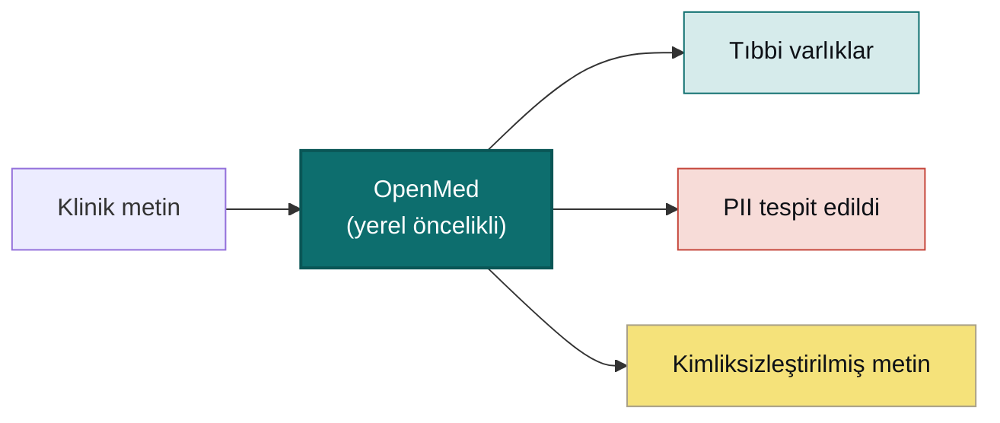

<div align="center">


<h3>Sizin Veriniz. Sizin Modeliniz. Sizin Donanımınız.</h3>

<p><b>Klinik metni kontrolünüzdeki donanımda yapılandırılmış ve kimliksizleştirilmiş içgörüye dönüştürün.</b><br/>
OpenMed’in temel yerel çalışma zamanı, gerekli model yapıtları hazır olduktan sonra çıkarım ve kimliksizleştirme yapar. Model indirmeleri, uzak sağlayıcı bağdaştırıcıları, telemetri etkin yollar ve kullanıcı tarafından yapılandırılan entegrasyonlar ağı kullanabilir; her modelin ve veri kümesinin koşullarını inceleyin.</p>

<p>
  <a href="https://pypi.org/project/openmed/">PyPI package</a> ·
  <a href="https://www.python.org/downloads/">Python 3.10+</a> ·
  <a href="https://huggingface.co/OpenMed">Model catalog</a> ·
  <a href="https://arxiv.org/abs/2508.01630">Research paper</a> ·
  <a href="LICENSE">Apache-2.0 SDK source</a>
</p>

<p>
  <a href="swift/OpenMedKit">OpenMedKit</a> ·
  <a href="docs/mlx-backend.md">Apple Silicon / MLX</a> ·
  <a href="docs/export-onnx-android.md">Android / ONNX Runtime Mobile</a> ·
  <a href="docs/export-transformersjs.md">Browser / Transformers.js</a> ·
  <a href="https://openmed.life/docs">Documentation</a>
</p>

<p>
  <b>Yerel öncelikli çalışma</b> &nbsp;·&nbsp; <b>Model destekli 33 PII dili</b> &nbsp;·&nbsp; <b>Apache-2.0 SDK</b>
</p>

<p>
  <a href="README.md">English</a> ·
  <a href="README.zh-CN.md">简体中文</a> ·
  <a href="README.es.md">Español</a> ·
  <a href="README.fr.md">Français</a> ·
  <a href="README.de.md">Deutsch</a> ·
  <a href="README.it.md">Italiano</a> ·
  <a href="README.pt.md">Português</a> ·
  <a href="README.nl.md">Nederlands</a> ·
  <a href="README.ar.md">العربية</a> ·
  <a href="README.hi.md">हिन्दी</a> ·
  <a href="README.te.md">తెలుగు</a> ·
  <a href="README.ja.md">日本語</a> ·
  <b>Türkçe</b> ·
  <a href="README.fa.md">فارسی</a>
</p>

</div>

---

## İş başında görün

<div align="center">
  
  <br/>
  <sub><b>Gerçek zamanlı PII kimliksizleştirme</b>: Nemotron Privacy Filter, bir klinik taburcu belgesindeki adları, adresleri, kimlik numaralarını ve fatura verilerini tamamen cihazda maskeliyor. <i>(Gösterilen tüm değerler sentetiktir.)</i></sub>
</div>

---

## 30 saniyelik örnek

```python
from openmed import analyze_text

result = analyze_text(
    "Patient started on imatinib for chronic myeloid leukemia.",
    model_name="disease_detection_superclinical",
)

for entity in result.entities:
    print(f"{entity.label:<12} {entity.text:<28} {entity.confidence:.2f}")
# DISEASE      chronic myeloid leukemia     0.98
# DRUG         imatinib                     0.95
```

Bir klinik NER modeli, gerekli yapıtları hazır olduktan sonra yerel çalışma zamanını kullanır.

---

## Neden OpenMed?

| Dağıtım değerlendirmesi | OpenMed SDK sınırı |
| --- | --- |
| Temel çalışma zamanı | Gerekli yapıtlar hazır olduktan sonra yerel olarak işler |
| İsteğe bağlı ağ yolları | İndirmeler, uzak bağdaştırıcılar, telemetri ve entegrasyonlar ağı kullanabilir |
| Doğrulama | Dağıtım sahibi model ve veri koşullarını, gizlilik davranışını ve klinik uygunluğu doğrular |
| Arayüzler | Desteklendiği yerlerde Python, Swift, Android, tarayıcı ve hizmetler |

- **Seçilmiş model kataloğu**: Her modeli, lisansı ve veri kümesini kullanım amacınız için doğrulayın.
- **Safe Harbor ile uyumlu yapılandırma**: 18 tanımlayıcı kategorisini hedefleyebilir; uzman dağıtım incelemesi yine gereklidir ve SDK kullanımı tek başına HIPAA uyumluluğunu kanıtlamaz.
- **Desteklenen yürütme yolları**: CPU, CUDA, MLX, mobil, hizmet ve tarayıcı bağdaştırıcıları ortama ve yapıta göre değişir.
- **Dağıtım arayüzleri**: Python, kapsayıcılar, hizmetler ve toplu iş akışları yapılandırma ve doğrulama gerektirir.
- **SDK kaynak kodu**: Apache-2.0 License altında yayımlanır; model ve veri kümesi koşulları değişir.

---

## Cihazda, Apple'da: Swift, MLX ve iOS

Desteklenen Apple donanımında OpenMed, gerekli yapıtlar hazır olduktan sonra yerel işleme için **MLX** ve **[OpenMedKit](swift/OpenMedKit)** kullanabilir. Model edinme ve kullanıcı tarafından yapılandırılan uzak entegrasyonlar ayrı ağ sınırlarıdır.

```swift
// Add OpenMedKit to your app
dependencies: [
    .package(url: "https://github.com/maziyarpanahi/openmed.git", from: "2.1.0"),
]
```

- **MLX çalışma zamanı**: PII token sınıflandırması, Privacy Filter ailesi ve deneysel GLiNER ailesi zero-shot görevleri için (CoreML yedek yolu ile).
- **Tek model adı, her platform**: Apple olmayan donanımda MLX model adları otomatik olarak ilgili PyTorch denetim noktasına geri döner.
- **Apple Silicon'da Python** da: `pip install --upgrade "openmed[mlx]"`.

Kılavuzlar: [MLX arka ucu](docs/mlx-backend.md) · [OpenMedKit (Swift)](docs/swift-openmedkit.md) · [CoreML dışa aktarma](docs/coreml-export.md)

---

## Nasıl çalışır



---

## Hızlı başlangıç

```bash
# Core + Hugging Face runtime (Linux, macOS, Windows; CPU or CUDA)
pip install --upgrade "openmed[hf]"

# Add the REST service
pip install --upgrade "openmed[hf,service]"

# Apple Silicon acceleration (MLX)
pip install --upgrade "openmed[mlx]"
```

<table>
<tr>
<td width="33%" valign="top">

**Python API**

```python
from openmed import analyze_text

analyze_text(
  "Patient received 75mg "
  "clopidogrel for NSTEMI.",
  model_name=
  "pharma_detection_superclinical",
)
```

</td>
<td width="33%" valign="top">

**REST servisi**

```bash
uvicorn openmed.service.app:app \
  --host 0.0.0.0 --port 8080
```

`GET /health`
`POST /analyze`
`POST /pii/extract`
`POST /pii/deidentify`

</td>
<td width="33%" valign="top">

**Toplu**

```python
from openmed import BatchProcessor

p = BatchProcessor(
  model_name=
  "disease_detection_superclinical",
  group_entities=True,
)
p.process_texts([...])
```

</td>
</tr>
</table>

**Çevrimdışı / izole mi?** `model_name`'i (veya `model_id`'yi) yerel bir dizine yönlendirin; OpenMed onu Hugging Face Hub'a bağlanmadan yükler:

```python
from openmed import OpenMedConfig, analyze_text

result = analyze_text(
    "Patient presents with chronic myeloid leukemia and Type 2 diabetes.",
    model_id="./models/OpenMed-NER-DiseaseDetect-SuperClinical-434M",
    config=OpenMedConfig(device="cpu"),
)
```

---

## Modeller

Özelleşmiş tıbbi NER modellerinden oluşan özenle seçilmiş bir kayıt, [tam kataloğa](https://openmed.life/docs/model-registry) göz atın.

| Model | Uzmanlık | Varlık türleri | Boyut |
|-------|----------|----------------|-------|
| `disease_detection_superclinical` | Hastalıklar ve durumlar | DISEASE, CONDITION, DIAGNOSIS | 434M |
| `pharma_detection_superclinical`  | İlaçlar ve tedaviler | DRUG, MEDICATION, TREATMENT   | 434M |
| `pii_superclinical_large`     | PII ve kimliksizleştirme | NAME, DATE, SSN, PHONE, EMAIL, ADDRESS | 434M |
| `anatomy_detection_electramed`    | Anatomi ve vücut bölümleri | ANATOMY, ORGAN, BODY_PART     | 109M |
| `gene_detection_genecorpus`       | Genler ve proteinler | GENE, PROTEIN                 | 109M |

---

## Gizlilik: PII tespiti ve kimliksizleştirme

```python
from openmed import extract_pii, deidentify

text = "Patient: John Doe, DOB: 01/15/1970, SSN: 123-45-6789"

# Extract PII with smart merging (prevents tokenization fragmentation)
result = extract_pii(text, model_name="pii_superclinical_large", use_smart_merging=True)

# De-identify with the method you need
deidentify(text, method="mask")     # [NAME], [DATE]
deidentify(text, method="replace")  # Faker-backed, locale-aware, format-preserving fakes
deidentify(text, method="hash")     # Cryptographic hashing
deidentify(text, method="shift_dates", date_shift_days=180)
```

- **Akıllı varlık birleştirme**, `01/15/1970`'i parçalamak yerine bütün tutar.
- **Faker tabanlı gizleme**: klinik kimlikler için özel sağlayıcılarla (CPF, CNPJ, BSN, NIR, Codice Fiscale, NIE, Aadhaar, Steuer-ID, NPI).
- **HIPAA sınırı**: Safe Harbor ile uyumlu kategoriler ve yapılandırılabilir eşikler uygulama yardımcılarıdır; uzman dağıtım incelemesi yine gereklidir ve yalnızca SDK kullanımı uyumluluğu kanıtlamaz.

[Tam PII defteri](examples/notebooks/PII_Detection_Complete_Guide.ipynb) · [Akıllı birleştirme](docs/pii-smart-merging.md) · [Anonimleştirme](docs/anonymization.md)

<details>
<summary><b>Privacy Filter ailesi</b>: OpenAI Privacy Filter mimarisi üzerinde üç model ailesi</summary>

<br/>

Model kodu aynıdır (yerel dikkat, sink token'ları, RoPE+YaRN, tiktoken `o200k_base` tokenizasyonlu gpt-oss tarzı seyrek MoE Transformer); yalnızca eğitim verisi farklıdır. Tümü **aynı** `extract_pii()` / `deidentify()` API'sini kullanır, yalnızca `model_name=` argümanı değişir.

| Varyant | PyTorch (CPU + CUDA) | MLX (Apple Silicon) | MLX 8-bit |
| --- | --- | --- | --- |
| **OpenAI Privacy Filter** | [`openai/privacy-filter`](https://huggingface.co/openai/privacy-filter) | [`OpenMed/privacy-filter-mlx`](https://huggingface.co/OpenMed/privacy-filter-mlx) | [`…-mlx-8bit`](https://huggingface.co/OpenMed/privacy-filter-mlx-8bit) |
| **Nemotron-PII fine-tune** | [`OpenMed/privacy-filter-nemotron`](https://huggingface.co/OpenMed/privacy-filter-nemotron) | [`…-nemotron-mlx`](https://huggingface.co/OpenMed/privacy-filter-nemotron-mlx) | [`…-nemotron-mlx-8bit`](https://huggingface.co/OpenMed/privacy-filter-nemotron-mlx-8bit) |
| **OpenMed Multilingual** | [`OpenMed/privacy-filter-multilingual`](https://huggingface.co/OpenMed/privacy-filter-multilingual) | [`…-multilingual-mlx`](https://huggingface.co/OpenMed/privacy-filter-multilingual-mlx) | [`…-multilingual-mlx-8bit`](https://huggingface.co/OpenMed/privacy-filter-multilingual-mlx-8bit) |

```python
from openmed import extract_pii

text = "Patient Sarah Connor (DOB: 03/15/1985) at MRN 4471882."

extract_pii(text, model_name="openai/privacy-filter")              # PyTorch baseline
extract_pii(text, model_name="OpenMed/privacy-filter-nemotron")    # same code, different weights
extract_pii(text, model_name="OpenMed/privacy-filter-mlx")         # Apple Silicon (MLX)
```

Apple Silicon olmayan ana makinelerde MLX model adları otomatik olarak ilgili PyTorch denetim noktasıyla değiştirilir (tek seferlik bir uyarıyla). Bir model adı yazın, her yerde çalıştırın. Bkz. [Privacy Filter mimarisi ve arka uç yönlendirme](docs/anonymization.md#privacy-filter-family).

</details>

---

## Çok dilli PII (35 desteklenen yol; 33 model destekli)

`en`, `fr`, `de`, `it`, `es`, `nl`, `hi`, `te`, `pt`, `ar`, `ja` ve `tr` dillerinde çıkarım ve kimliksizleştirme: toplam **kayıtlı PII model kataloğu**.

```bash
python -c "from openmed import extract_pii; print([(e.label, e.text) for e in extract_pii('Dr. Pedro Almeida, CPF: 123.456.789-09, email: pedro@hospital.pt', lang='pt').entities])"
```

<details>
<summary>Dile göre örnekleri göster (Portekizce, Felemenkçe, Hintçe, Arapça, Japonca, Türkçe)</summary>

<br/>

```python
from openmed import extract_pii

portuguese = extract_pii("Paciente: Pedro Almeida, CPF: 123.456.789-09, telefone: +351 912 345 678", lang="pt", use_smart_merging=True)
dutch      = extract_pii("Patiënt: Eva de Vries, BSN: 123456782, telefoon: +31 6 12345678", lang="nl", use_smart_merging=True)
hindi      = extract_pii("रोगी: अनीता शर्मा, फोन: +91 9876543210, पता: नई दिल्ली 110001", lang="hi", use_smart_merging=True)
arabic     = extract_pii("المريضة ليلى حسن، الهاتف +20 10 1234 5678، الرقم القومي 29801011234567.", lang="ar", use_smart_merging=True)
japanese   = extract_pii("患者 佐藤 花子、電話 +81 90 1234 5678、マイナンバー 1234 5678 9012.", lang="ja", use_smart_merging=True)
turkish    = extract_pii("Hasta Ayşe Yılmaz, telefon +90 532 123 45 67, TCKN 10000000146.", lang="tr", use_smart_merging=True)

for r in (portuguese, dutch, hindi, arabic, japanese, turkish):
    print([(e.label, e.text) for e in r.entities])
```

</details>

---

## REST API

İstek doğrulama, paylaşımlı pipeline ön yükleme ve birleşik hata zarfları içeren, Docker dostu bir FastAPI servisi.

```bash
pip install --upgrade "openmed[hf,service]"
uvicorn openmed.service.app:app --host 0.0.0.0 --port 8080

# or with Docker
docker build -t openmed:local .
docker run --rm -p 8080:8080 -e OPENMED_PROFILE=prod openmed:local
```

```bash
curl -X POST http://127.0.0.1:8080/pii/extract \
  -H "Content-Type: application/json" \
  -d '{"text":"Paciente: Maria Garcia, DNI: 12345678Z","lang":"es"}'
```

Tam [REST servis kılavuzuna](docs/rest-service.md) bakın.

---

## Dokümantasyon

Tam kılavuzlar **[openmed.life/docs](https://openmed.life/docs/)** adresinde.

| | | |
|---|---|---|
| [Başlarken](https://openmed.life/docs/) | [Metni analiz et](https://openmed.life/docs/analyze-text) | [Model kaydı](https://openmed.life/docs/model-registry) |
| [PII tespit kılavuzu](examples/notebooks/PII_Detection_Complete_Guide.ipynb) | [Anonimleştirme](docs/anonymization.md) | [Toplu işleme](https://openmed.life/docs/batch-processing) |
| [Yapılandırma profilleri](https://openmed.life/docs/profiles) | [REST servisi](docs/rest-service.md) | [MLX arka ucu](docs/mlx-backend.md) |

---

## Maskotumuzla tanışın


OpenMed'in koruyucusu, küçük bir **İbn Sina (Avicenna)** olarak tasarlanmış tüylü bir İran kedisidir: *Tıbbın
Kanunu* adlı eseri yaklaşık 600 yıl boyunca dünyanın standart tıp kitabı olan büyük Pers hekimi. Açık tıp bilgisi
kitabını gözetir; renk paleti **İran turkuazından (fīrūza)** ilham alır: en özel verileriniz için yerel öncelikli
bir koruyucu.

<br clear="left"/>

---

## Katkıda bulunma

Katkılar memnuniyetle karşılanır: hata raporları, özellik istekleri ve PR'lar.

- [Bir issue açın](https://github.com/maziyarpanahi/openmed/issues)
- **Çeviriler memnuniyetle karşılanır**: üstteki dil değiştiricide bağlantılı diğer dillerdeki README'leri tamamlamaya yardımcı olun.

---

## Teşekkürler

OpenMed, mükemmel açık kaynak çalışmaların üzerine inşa edilmiştir. Özellikle **OpenAI**'ye ([Privacy Filter](https://huggingface.co/openai/privacy-filter) mimarisi), **NVIDIA**'ya ([Nemotron PII veri kümesi](https://huggingface.co/datasets/nvidia/Nemotron-PII-v1)), **Hugging Face**'e (`transformers` ve model ekosistemi), **Apple**'a ([MLX](https://github.com/ml-explore/mlx)) ve **[Faker](https://faker.readthedocs.io/)** geliştiricilerine teşekkürler.

## Lisans

OpenMed SDK kaynak kodu [Apache-2.0 License](LICENSE) altında yayımlanmıştır.

## Atıf

OpenMed araştırmanızda faydalı olduysa, lütfen atıfta bulunun:

```bibtex
@misc{panahi2025openmedneropensourcedomainadapted,
      title={OpenMed NER: Open-Source, Domain-Adapted State-of-the-Art Transformers for Biomedical NER Across 12 Public Datasets},
      author={Maziyar Panahi},
      year={2025},
      eprint={2508.01630},
      archivePrefix={arXiv},
      primaryClass={cs.CL},
      url={https://arxiv.org/abs/2508.01630},
}
```

---

## Yıldız geçmişi

OpenMed sizin için faydalıysa, bir yıldız başkalarının onu keşfetmesine yardımcı olur.

[4,700+ GitHub stars · 29 Jul 2026 snapshot](https://github.com/maziyarpanahi/openmed/stargazers)

---

<div align="center">

OpenMed ekibi tarafından yapıldı

<a href="https://openmed.life">Web sitesi</a> ·
<a href="https://openmed.life/docs">Dokümantasyon</a> ·
<a href="https://x.com/openmed_ai">X / Twitter</a> ·
<a href="https://www.linkedin.com/company/openmed-ai/">LinkedIn</a>

</div>
