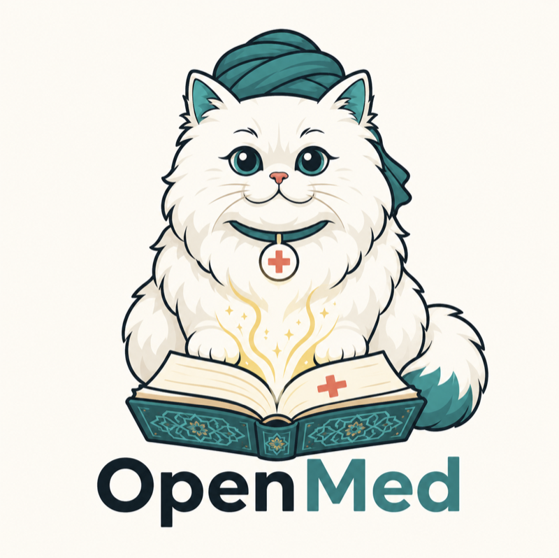
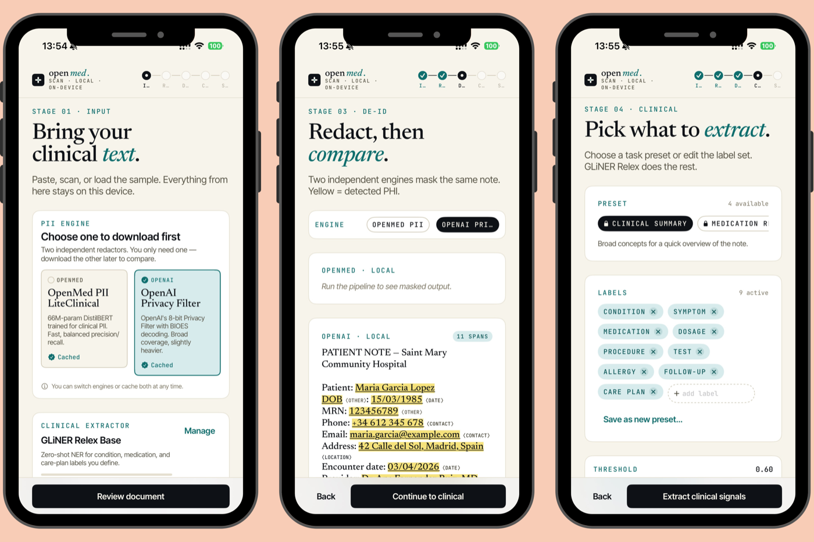
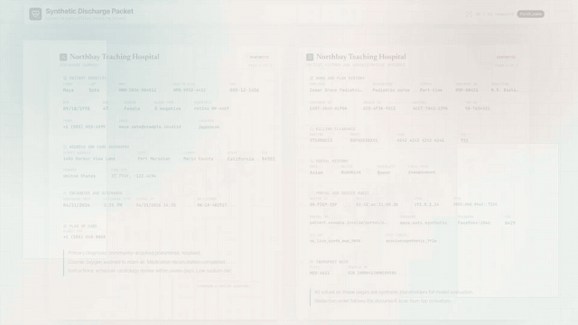
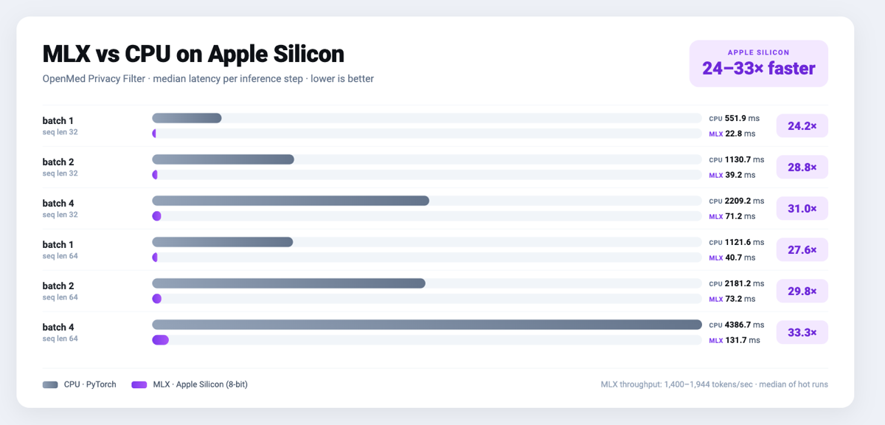
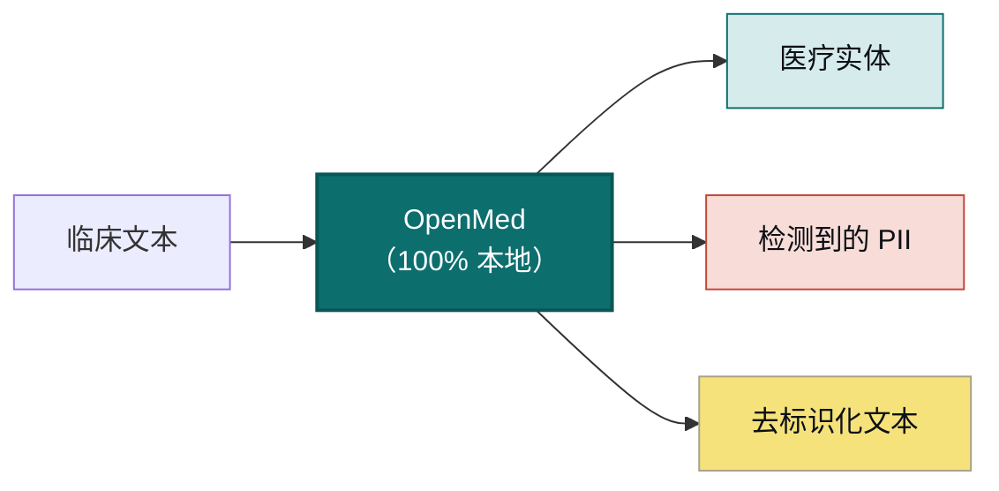
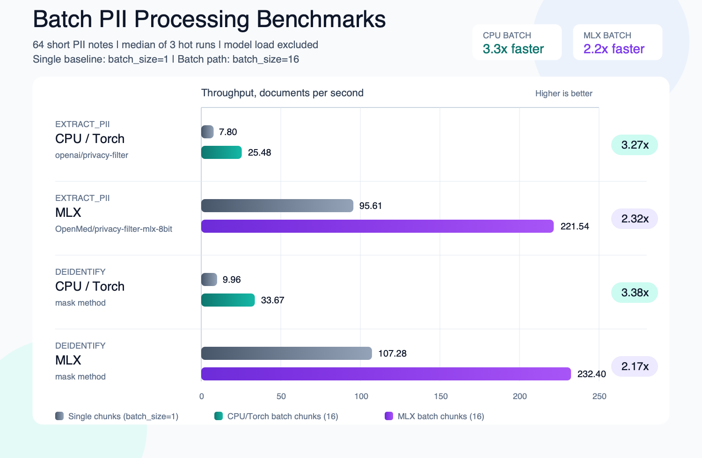

<div align="center">



<h2>你的数据。你的模型。你的硬件。</h2>

<a href="https://trendshift.io/repositories/40195?utm_source=repository-badge&amp;utm_medium=badge&amp;utm_campaign=badge-repository-40195" target="_blank" rel="noopener noreferrer"></a>

<p><b>将临床文本转化为结构化、去标识化的洞见，无需上传任何内容。</b><br/>
OpenMed 完全在你掌控的硬件上抽取生物医学实体，并彻底移除 55+ 种 PHI 类型，你的数据从不离开设备。同一套 2,000+ 个开源模型可完全离线运行，从手机到 GPU 服务器皆可：iOS、iPadOS 和 Android 通过 OpenMedKit，另支持 React Native、普通 CPU、Apple Silicon、NVIDIA GPU、浏览器以及 REST/gRPC 服务。无需云端，无供应商锁定，患者数据绝不离开你的网络。</p>

<p>
  <a href="https://pypi.org/project/openmed/"></a>
  <a href="https://www.python.org/downloads/"></a>
  <a href="https://huggingface.co/OpenMed"></a>
  <a href="https://arxiv.org/abs/2508.01630"></a>
  <a href="LICENSE"></a>
  <a href="https://github.com/maziyarpanahi/openmed/stargazers"></a>
</p>

<p>
  <a href="swift/OpenMedKit"></a>
  <a href="docs/mlx-backend.md"></a>
  <a href="docs/export-onnx-android.md"></a>
  <a href="docs/export-transformersjs.md"></a>
  <a href="docs/swift-openmedkit.md"></a>
  <a href="https://openmed.life/docs"></a>
</p>

<p>
  <b>2,000+ 个模型</b> &nbsp;·&nbsp; <b>21 种由模型支持的 PII 语言</b> &nbsp;·&nbsp; <b>600+ 个 PII 检查点</b> &nbsp;·&nbsp; <b>100% 设备本地运行</b> &nbsp;·&nbsp; <b>Apache-2.0</b>
</p>

<p>
  <a href="README.md">English</a> ·
  <b>简体中文</b> ·
  <a href="README.es.md">Español</a> ·
  <a href="README.fr.md">Français</a> ·
  <a href="README.de.md">Deutsch</a> ·
  <a href="README.it.md">Italiano</a> ·
  <a href="README.pt.md">Português</a> ·
  <a href="README.nl.md">Nederlands</a> ·
  <a href="README.ar.md">العربية</a> ·
  <a href="README.hi.md">हिन्दी</a> ·
  <a href="README.te.md">తెలుగు</a> ·
  <a href="README.ja.md">日本語</a> ·
  <a href="README.tr.md">Türkçe</a> ·
  <a href="README.fa.md">فارسی</a> ·
  <a href="README.sw.md">Kiswahili</a>
</p>

</div>

---

## 现场演示

OpenMed **完全在设备本地运行**，临床文本绝不会离开设备。以下是在 iPhone 上完全离线运行的效果：

<div align="center">
  
  <br/>
  <sub><b>通过 <a href="swift/OpenMedKit">OpenMedKit</a> 在 iPhone 上运行</b>：扫描临床记录、完成去标识化并抽取临床信号，全部由 Apple MLX 在设备本地处理，不会上传任何内容。</sub>
</div>

<br/>

<div align="center">
  
  <br/>
  <sub><b>实时 PII 去标识化</b>：Nemotron Privacy Filter 正在对一份临床出院记录中的姓名、地址、证件号和账单数据进行脱敏，全程在本地设备上完成。<i>（图中所有数值均为合成数据。）</i></sub>
</div>

---

## 30 秒上手示例

```python
from openmed import analyze_text

result = analyze_text(
    "Patient started on imatinib for chronic myeloid leukemia.",
    model_name="disease_detection_superclinical",
)

for entity in result.entities:
    print(f"{entity.label:<12} {entity.text:<28} {entity.confidence:.2f}")
# DISEASE      chronic myeloid leukemia     0.98
# DRUG         imatinib                     0.95
```

一个最先进的临床 NER 模型在本地运行，无需 API 密钥，无网络调用。

---

## 为什么选择 OpenMed？

|                                       |       **OpenMed**        |    云端医疗 API    |
| ------------------------------------- | :----------------------: | :----------------: |
| 在你的设备/服务器上运行                |            ✅            |         ❌         |
| 患者数据离开你的网络                   |        **从不**          |    发送给供应商     |
| 成本                                   |       免费且开源         |    按调用计费       |
| 专业医疗模型                           |          2,000+          |        有限         |
| 由模型支持的 PII 语言                  |            21            |        不一         |
| 离线 / 隔离网络（air-gapped）          |            ✅            |         ❌         |
| Apple Silicon (MLX) 加速               |            ✅            |       不适用        |
| 原生 iOS / macOS 应用                  |   ✅ 通过 OpenMedKit     |         ❌         |
| 浏览器/WebGPU token 分类               | ✅ 通过 Transformers.js  |        不一         |
| 供应商锁定                             |     无：Apache-2.0      |         有          |

- **专业模型**：2,000+ 个精选的生物医学与临床模型，其中许多性能超越商业专有方案。
- **符合 HIPAA 的去标识化**：覆盖全部 18 项 Safe Harbor 标识符，智能实体合并，保留格式的伪造替换。
- **随处运行**：支持 CPU、CUDA、Apple Silicon (MLX)、通过 OpenMedKit 运行的 iOS/macOS、Android/Kotlin、React Native、REST/gRPC 服务，以及通过 Transformers.js 运行的浏览器/WebGPU 软件包。
- **一行部署**：Python API、Docker 化的 REST 服务，或批处理流水线。
- **零锁定**：Apache-2.0，你的基础设施，你的数据。

---

## 在 Apple 设备上本地运行：Swift、MLX 与 iOS

OpenMed 专为在你数据所在之处运行而打造。在 Apple 硬件上，它借助 **MLX** 加速，并通过
**[OpenMedKit](swift/OpenMedKit)** 直接进入 iPhone、iPad 和 Mac 应用，因此 PII 检测与临床抽取完全离线、
在设备本地完成。

```swift
// Add OpenMedKit to your app
dependencies: [
    .package(url: "https://github.com/maziyarpanahi/openmed.git", from: "1.9.1"),
]
```

预期结果：Swift Package Manager 解析 OpenMedKit，并让你的应用 target 可以使用
`import OpenMedKit`。

- **MLX 运行时**，用于 PII token 分类、Privacy Filter 系列、实验性的 GLiNER 系列 zero-shot 任务，以及通过 Laneformer 进行 Python MLX-LM 文本生成；对支持的 token 分类产物还提供 CoreML 回退路径。
- **一个模型名，所有平台**：在非 Apple 硬件上，MLX 模型名会自动回退到对应的 PyTorch 检查点。
- **Apple Silicon 上的 Python** 同样支持：`pip install --upgrade "openmed[mlx]"`。

指南：[MLX 后端](docs/mlx-backend.md) · [OpenMedKit (Swift)](docs/swift-openmedkit.md) · [CoreML 导出](docs/coreml-export.md)

<div align="center">
  
  <br/>
  <sub><b>Apple Silicon 上的 MLX 比 CPU PyTorch 快 24–33 倍</b>：Privacy Filter 每次推理步骤的中位延迟，数值越低越好。</sub>
</div>

---

## 在 Android 设备上本地运行：Kotlin 与 ONNX Runtime Mobile

OpenMedKit 也以原生 Android/Kotlin 库的形式提供，用于本地文档导入、OCR 交接、PII 脱敏，
并通过 **ONNX Runtime Mobile** 进行 token 分类推理。移动端模型仓库包含稳定的 tensor 名称、
动态序列轴、tokenizer 文件、标签，以及可供 Android 使用的 fp32、fp16、INT8 和可选 `.ort` 输出。

在 `settings.gradle.kts` 中添加限定范围的 JitPack 仓库：

```kotlin
dependencyResolutionManagement {
    repositories {
        google()
        mavenCentral()
        maven {
            url = uri("https://jitpack.io")
            content { includeGroup("com.github.maziyarpanahi") }
        }
    }
}
```

然后使用不可变的 OpenMed `v1.9.1` 版本：

```kotlin
dependencies {
    implementation("com.github.maziyarpanahi:openmed:v1.9.1")
}
```

本地构建和发布详情参见 [Android 安装指南](android/README.md)。

```kotlin
val model = OpenMedKit.fromDirectory(modelDir)
val entities = model.analyzeText("Patient Alice Nguyen was seen in cardiology.")
```

- **Android ONNX 配置**会生成 `model.onnx`、`model_fp16.onnx`、
  `model_int8.onnx`、tokenizer 资源、标签和 `openmed-onnx.json`。
- **ORT Mobile 支持**会在安装 ONNX Runtime 转换工具时记录最小构建所需的算子配置。
- **Kotlin 对等测试**确保 tokenizer offset、span 边界和 decoder 输出与 Python 运行时保持一致。

指南：[Android ONNX 导出](docs/export-onnx-android.md) ·
[Android span 对等性](docs/android-parity.md) ·
[OpenMedKit Android](android/openmedkit)

### 在 Python CPU 上使用同一个 ONNX 模型

```python
from openmed import OnnxModel

model = OnnxModel.from_pretrained(
    "OpenMed/OpenMed-PII-ClinicalE5-Small-33M-v1-onnx-android"
)
entities = model("Patient Alice Nguyen was seen in cardiology.")
```

### 在浏览器中使用同一个 ONNX 模型

```bash
npm install openmed @huggingface/transformers
```

```typescript
import { loadOnnxModel } from "openmed";

const model = await loadOnnxModel(
  "OpenMed/OpenMed-PII-ClinicalE5-Small-33M-v1-onnx-android",
);
const entities = await model("Patient Alice Nguyen was seen in cardiology.");
```

---

## 工作原理



渲染结果：本地临床文本流水线会返回医疗实体、PII 检测结果和已去标识化文本，
无需将数据发送到云端 API。

---

## 快速开始

```bash
# Core + Hugging Face runtime (Linux, macOS, Windows; CPU or CUDA)
pip install --upgrade "openmed[hf]"

# Add the REST service
pip install --upgrade "openmed[hf,service]"

# Apple Silicon acceleration (MLX)
pip install --upgrade "openmed[mlx]"
```

预期结果：

```text
Successfully installed openmed-...
```

<table>
<tr>
<td width="33%" valign="top">

**Python API**

```python
from openmed import analyze_text

result = analyze_text(
  "Patient received 75mg "
  "clopidogrel for NSTEMI.",
  model_name=
  "pharma_detection_superclinical",
)
print([(e.label, e.text) for e in result.entities])
```

示例输出：

```text
[('DRUG', 'clopidogrel'), ('CONDITION', 'NSTEMI')]
```

</td>
<td width="33%" valign="top">

**REST 服务**

```bash
uvicorn openmed.service.app:app \
  --host 0.0.0.0 --port 8080
```

示例输出：

```text
INFO:     Uvicorn running on http://0.0.0.0:8080
GET /health -> 200 OK
```

`GET /health`
`POST /analyze`
`POST /pii/extract`
`POST /pii/deidentify`

</td>
<td width="33%" valign="top">

**批处理**

```python
from openmed import BatchProcessor

p = BatchProcessor(
  model_name=
  "disease_detection_superclinical",
  group_entities=True,
)
results = p.process_texts([...])
print(len(results), sum(len(r.entities) for r in results))
print([(e.label, e.text) for e in results[0].entities[:1]])
```

示例输出：

```text
3 7
[('DISEASE', 'leukemia')]
```

</td>
</tr>
</table>

**浏览器 / WebGPU**

通过 Transformers.js 打包 ONNX token 分类导出，以便在浏览器中进行推理：

```bash
python -m openmed.onnx.convert \
  --model dslim/bert-base-NER \
  --output dist/example-onnx \
  --include-transformersjs
```

示例输出：

```text
Exported Transformers.js bundle to dist/example-onnx
```

```javascript
import { pipeline } from "@huggingface/transformers";

const detector = await pipeline(
  "token-classification",
  "/models/openmed-pii/transformersjs",
  { device: "webgpu" },
);
const entities = await detector("Patient Casey Example called 212-555-0198.");
console.log(entities.slice(0, 2));
```

示例输出：

```javascript
[
  { entity: "NAME", word: "Casey Example", score: 0.99 },
  { entity: "PHONE", word: "212-555-0198", score: 0.98 },
]
```

[Transformers.js 导出指南](docs/export-transformersjs.md)

**离线 / 隔离网络？** 只需将 `model_name`（或 `model_id`）指向本地目录，OpenMed 即会在本地加载，而不会连接 Hugging Face Hub：

```python
from openmed import OpenMedConfig, analyze_text

result = analyze_text(
    "Patient presents with chronic myeloid leukemia and Type 2 diabetes.",
    model_id="./models/OpenMed-NER-DiseaseDetect-SuperClinical-434M",
    config=OpenMedConfig(device="cpu"),
)
for entity in result.entities:
    print(f"{entity.label:<12} {entity.text:<28} {entity.confidence:.2f}")
```

示例输出：

```text
DISEASE      chronic myeloid leukemia     0.98
DISEASE      Type 2 diabetes              0.96
```

由于 `model_id` 指向本地目录，本示例不会连接 Hugging Face Hub 或任何外部模型提供方。

---

## 模型

精选的专业医疗 NER 模型注册表，浏览[完整目录](https://openmed.life/docs/model-registry)。

| 模型 | 专长 | 实体类型 | 大小 |
|------|------|----------|------|
| `disease_detection_superclinical` | 疾病与病症 | DISEASE, CONDITION, DIAGNOSIS | 434M |
| `pharma_detection_superclinical`  | 药物与用药 | DRUG, MEDICATION, TREATMENT   | 434M |
| `pii_superclinical_large`     | PII 与去标识化 | NAME, DATE, SSN, PHONE, EMAIL, ADDRESS | 434M |
| `anatomy_detection_electramed`    | 解剖与身体部位 | ANATOMY, ORGAN, BODY_PART     | 109M |
| `gene_detection_genecorpus`       | 基因与蛋白质 | GENE, PROTEIN                 | 109M |

---

## 隐私：PII 检测与去标识化

```python
from openmed import extract_pii, deidentify

text = "Patient: John Doe, DOB: 01/15/1970, SSN: 123-45-6789"

# Extract PII with smart merging (prevents tokenization fragmentation)
result = extract_pii(text, model_name="pii_superclinical_large", use_smart_merging=True)
print([(e.label, e.text) for e in result.entities])

# De-identify with the method you need
print(deidentify(text, method="mask").deidentified_text)
print(deidentify(text, method="replace").deidentified_text)
print(deidentify(text, method="hash").deidentified_text)
print(deidentify(text, method="shift_dates", date_shift_days=180).deidentified_text)
```

示例输出：

```text
[('NAME', 'John Doe'), ('DATE', '01/15/1970'), ('SSN', '123-45-6789')]
Patient: [NAME], DOB: [DATE], SSN: [SSN]
Patient: Emily Chen, DOB: 03/22/1985, SSN: 456-78-9012
Patient: 6b8f...c4a1, DOB: 48b1...91de, SSN: 3f13...e912
Patient: John Doe, DOB: 07/14/1970, SSN: 123-45-6789
```

- **智能实体合并**让 `01/15/1970` 保持完整，而不会被拆分。
- **策略感知流水线**提供 HIPAA/GDPR/研究配置、校准阈值、签名审计报告、脱敏预览，以及最小必要操作选择。
- **基于 Faker 的混淆**，内置自定义临床证件号 provider（CPF、CNPJ、BSN、NIR、Codice Fiscale、NIE、Aadhaar、Steuer-ID、NPI）。
- **HIPAA**：覆盖全部 18 项 Safe Harbor 标识符，可配置置信度阈值。
- **批量与流式 PII 处理**：使用 `BatchProcessor(operation="extract_pii" | "deidentify", batch_size=16)` 或增量流式辅助函数，对大量文档进行抽取或去标识化。

<div align="center">
  
  <br/>
  <sub><b>批量处理</b>：与逐个处理文档相比，CPU 吞吐量最高提升 <b>3.3 倍</b>，MLX 最高提升 <b>2.2 倍</b>。</sub>
</div>

[完整 PII 笔记本](examples/notebooks/PII_Detection_Complete_Guide.ipynb) · [智能合并](docs/pii-smart-merging.md) · [匿名化快速入门](docs/anonymization.md#quickstart-choosing-a-method)

<details>
<summary><b>Privacy Filter 系列</b>：基于 OpenAI Privacy Filter 架构的三个模型系列</summary>

<br/>

模型代码相同（gpt-oss 风格的稀疏 MoE Transformer，带局部注意力、sink token、RoPE+YaRN、tiktoken `o200k_base` 分词），仅训练数据不同。它们都通过**同一套** `extract_pii()` / `deidentify()` API 调用，只需更改 `model_name=` 参数。
`openai/privacy-filter` 是本地权重在 Hugging Face 上的模型标识符；
在此使用它不会调用 OpenAI API。

| 变体 | PyTorch (CPU + CUDA) | MLX (Apple Silicon) | MLX 8-bit |
| --- | --- | --- | --- |
| **OpenAI Privacy Filter** | [`openai/privacy-filter`](https://huggingface.co/openai/privacy-filter) | [`OpenMed/privacy-filter-mlx`](https://huggingface.co/OpenMed/privacy-filter-mlx) | [`…-mlx-8bit`](https://huggingface.co/OpenMed/privacy-filter-mlx-8bit) |
| **Nemotron-PII fine-tune** | [`OpenMed/privacy-filter-nemotron`](https://huggingface.co/OpenMed/privacy-filter-nemotron) | [`…-nemotron-mlx`](https://huggingface.co/OpenMed/privacy-filter-nemotron-mlx) | [`…-nemotron-mlx-8bit`](https://huggingface.co/OpenMed/privacy-filter-nemotron-mlx-8bit) |
| **OpenMed Multilingual** | [`OpenMed/privacy-filter-multilingual`](https://huggingface.co/OpenMed/privacy-filter-multilingual) | [`…-multilingual-mlx`](https://huggingface.co/OpenMed/privacy-filter-multilingual-mlx) | [`…-multilingual-mlx-8bit`](https://huggingface.co/OpenMed/privacy-filter-multilingual-mlx-8bit) |

```python
from openmed import extract_pii

text = "Patient Sarah Connor (DOB: 03/15/1985) at MRN 4471882."

variants = {
    "baseline": extract_pii(text, model_name="openai/privacy-filter"),
    "nemotron": extract_pii(text, model_name="OpenMed/privacy-filter-nemotron"),
    "mlx": extract_pii(text, model_name="OpenMed/privacy-filter-mlx"),
}
print([(e.label, e.text) for e in variants["baseline"].entities])
```

示例输出：

```text
[('NAME', 'Sarah Connor'), ('DATE', '03/15/1985'), ('ID', '4471882')]
```

在非 Apple Silicon 主机上，MLX 模型名会自动替换为对应的 PyTorch 检查点（并给出一次性警告），写一个模型名，随处运行。参见 [Privacy Filter 架构与后端路由](docs/anonymization.md#privacy-filter-family)。

</details>

---

## 多语言 PII（支持 22 种语言）

实体抽取和去标识化支持 **22 个 PII 语言代码**：
`am`、`ar`、`de`、`en`、`es`、`fr`、`he`、`hi`、`id`、`it`、`ja`、`ko`、`nl`、`pt`、`ro`、`sw`、`te`、`th`、`tr`、`xh`、`zh` 和 `zu`，共计 **600+ 个 PII 检查点**。
中文路由目前使用文档中说明的多语言默认模型占位符，专用中文模型权重仍单独提供。
一个由用户选择并配置的印度语言 NER 系列还支持九条额外路由
（`as`、`bn`、`gu`、`kn`、`ml`、`mr`、`or`、`pa` 和 `ta`），
并且也可服务于印地语和泰卢固语。请设置 `OPENMED_INDIC_NER_MODEL`；
OpenMed 不会捆绑或自动选择这些权重。
OpenMed 还为其他仅含证件号的语言区域提供基于 validator 的国家证件号覆盖，
例如波兰、拉脱维亚、斯洛伐克、马来西亚、菲律宾和丹麦。

各语言代码的默认 PII 模型、Faker locale 和去标识化前后示例，参见[分语言指南](docs/languages.md)。

```bash
python -c "from openmed import extract_pii; print([(e.label, e.text) for e in extract_pii('Dr. Pedro Almeida, CPF: 123.456.789-09, email: pedro@hospital.pt', lang='pt').entities])"
```

示例输出：

```text
[('NAME', 'Pedro Almeida'), ('ID', '123.456.789-09'), ('EMAIL', 'pedro@hospital.pt')]
```

<details>
<summary>查看各语言示例（葡萄牙语、荷兰语、印地语、阿拉伯语、日语、土耳其语）</summary>

<br/>

```python
from openmed import extract_pii

portuguese = extract_pii("Paciente: Pedro Almeida, CPF: 123.456.789-09, telefone: +351 912 345 678", lang="pt", use_smart_merging=True)
dutch      = extract_pii("Patiënt: Eva de Vries, BSN: 123456782, telefoon: +31 6 12345678", lang="nl", use_smart_merging=True)
hindi      = extract_pii("रोगी: अनीता शर्मा, फोन: +91 9876543210, पता: नई दिल्ली 110001", lang="hi", use_smart_merging=True)
arabic     = extract_pii("المريضة ليلى حسن، الهاتف +20 10 1234 5678، الرقم القومي 29801011234567.", lang="ar", use_smart_merging=True)
japanese   = extract_pii("患者 佐藤 花子、電話 +81 90 1234 5678、マイナンバー 1234 5678 9012.", lang="ja", use_smart_merging=True)
turkish    = extract_pii("Hasta Ayşe Yılmaz, telefon +90 532 123 45 67, TCKN 10000000146.", lang="tr", use_smart_merging=True)

for r in (portuguese, dutch, hindi, arabic, japanese, turkish):
    print([(e.label, e.text) for e in r.entities])
```

示例输出：

```text
[('NAME', 'Pedro Almeida'), ('ID', '123.456.789-09'), ('PHONE', '+351 912 345 678')]
[('NAME', 'Eva de Vries'), ('ID', '123456782'), ('PHONE', '+31 6 12345678')]
[('NAME', 'अनीता शर्मा'), ('PHONE', '+91 9876543210'), ('ADDRESS', 'नई दिल्ली 110001')]
[('NAME', 'ليلى حسن'), ('PHONE', '+20 10 1234 5678'), ('ID', '29801011234567')]
[('NAME', '佐藤 花子'), ('PHONE', '+81 90 1234 5678'), ('ID', '1234 5678 9012')]
[('NAME', 'Ayşe Yılmaz'), ('PHONE', '+90 532 123 45 67'), ('ID', '10000000146')]
```

</details>

---

## REST API

一个对 Docker 友好的 FastAPI 服务，具备请求校验、共享流水线预加载，以及统一的错误响应封装。

```bash
pip install --upgrade "openmed[hf,service]"
uvicorn openmed.service.app:app --host 0.0.0.0 --port 8080

# or with Docker
docker build -t openmed:local .
docker run --rm -p 8080:8080 -e OPENMED_PROFILE=prod openmed:local
```

示例输出：

```text
INFO:     Uvicorn running on http://0.0.0.0:8080
```

```bash
curl -X POST http://127.0.0.1:8080/pii/extract \
  -H "Content-Type: application/json" \
  -d '{"text":"Paciente: Maria Garcia, DNI: 12345678Z","lang":"es"}'
```

简化的响应示例：

```json
{
  "text": "Paciente: Maria Garcia, DNI: 12345678Z",
  "entities": [
    {"text": "Maria Garcia", "label": "NAME", "confidence": 0.99, "start": 10, "end": 22},
    {"text": "12345678Z", "label": "ID", "confidence": 0.98, "start": 29, "end": 38}
  ],
  "model_name": "OpenMed/privacy-filter-multilingual"
}
```

**模型生命周期和服务控制：**通过 `GET /models/loaded`、`POST /models/unload`
和 `keep_alive` 空闲时限按需释放内存；v1.8 还提供 API key/JWT 身份验证、
不含 PHI 的请求日志、tracing、gRPC、异步任务、webhook、warm pool、动态批处理、
请求合并、速率与并发限制、`/livez`、`/readyz` 和可选 metrics：

```bash
OPENMED_SERVICE_KEEP_ALIVE=10m uvicorn openmed.service.app:app --host 0.0.0.0 --port 8080
curl -X POST http://127.0.0.1:8080/models/unload -H "Content-Type: application/json" -d '{"all":true}'
```

示例响应：

```json
{
  "unloaded": true,
  "released": {"models": 1, "tokenizers": 1, "pipelines": 1},
  "active_models": {}
}
```

参见完整的 [REST 服务指南](docs/rest-service.md)。

---

## 文档

完整指南见 **[openmed.life/docs](https://openmed.life/docs/)**。

AI 智能体可以加载精选的 [llms.txt](https://openmed.life/docs/llms.txt)
索引，或加载内联全文的 [llms-full.txt](https://openmed.life/docs/llms-full.txt)
信息流。每次严格构建 MkDocs 时，两者都会根据当前文档重新生成。

| | | |
|---|---|---|
| [快速入门](https://openmed.life/docs/) | [文本分析](https://openmed.life/docs/analyze-text) | [模型注册表](https://openmed.life/docs/model-registry) |
| [常见问题](docs/faq.md) | [匿名化](docs/anonymization.md) | [批处理](https://openmed.life/docs/batch-processing) |
| [配置档案](https://openmed.life/docs/profiles) | [REST 服务](docs/rest-service.md) | [MLX 后端](docs/mlx-backend.md) |
| [Transformers.js 导出](docs/export-transformersjs.md) | [FHIR 互操作](docs/fhir-interop.md) | [HL7 v2 去标识化](docs/hl7v2-deidentification.md) |
| [OpenMed 1.9.1 发行说明](docs/release/v1.9.1.md) | [OpenMed 1.9.0 发行说明](docs/release/v1.9.0.md) | [示例](docs/examples.md) |
| [发布通道](docs/release/semver-and-channels.md) | [生成式模型策略](docs/generative-model-policy.md) | [贡献指南](docs/contributing.md) |
| [安全策略](SECURITY.md) | [合规状态](docs/compliance.md) | [检测器插件 SDK](docs/plugin-sdk.md) |
| [v1 到 v2 迁移](docs/migration.md) | [MCP 客户端连接](docs/mcp-clients.md) | [非洲开发者入门](docs/africa-onboarding.md) |

---

## 认识一下我们的吉祥物


OpenMed 的守护者是一只蓬松的波斯猫，化身为小小的**阿维森纳（伊本·西那，Avicenna / Ibn Sina）**，这位伟大的
波斯医师所著的《医典》（*Canon of Medicine*）在约 600 年间一直是全世界的标准医学教科书。它守护着翻开的
医学知识之书，配色取自**波斯绿松石（fīrūza）**：一位守护你最私密数据的本地优先卫士。

<br clear="left"/>

---

## 贡献

欢迎贡献：bug 报告、功能请求和 PR 都欢迎。请先阅读[贡献指南](CONTRIBUTING.md)和[行为准则](CODE_OF_CONDUCT.md)。

- [提交 issue](https://github.com/maziyarpanahi/openmed/issues)
- [贡献指南](CONTRIBUTING.md) · [行为准则](CODE_OF_CONDUCT.md) · [安全策略](SECURITY.md)
- **欢迎翻译**：帮助完善顶部语言切换栏中链接的其他语言 README。

---

## 安全

发现漏洞？OpenMed 会对 PHI 进行脱敏，因此**脱敏绕过或 PHI/PII 泄漏属于安全问题**：
请通过私密渠道报告，切勿提交公开 issue。负责任披露政策参见 **[SECURITY.md](SECURITY.md)**，
也可使用[私密报告表单](https://github.com/maziyarpanahi/openmed/security/advisories/new)。
报告中绝不能包含真实患者数据。

---

## 致谢

OpenMed 建立在优秀的开源工作之上：特别感谢 **OpenAI**（[Privacy Filter](https://huggingface.co/openai/privacy-filter) 架构）、**NVIDIA**（[Nemotron PII 数据集](https://huggingface.co/datasets/nvidia/Nemotron-PII-v1)）、**Hugging Face**（`transformers`、Transformers.js 及模型生态）、**Apple**（[MLX](https://github.com/ml-explore/mlx)），以及 **[Faker](https://faker.readthedocs.io/)** 的维护者。

## 许可证

基于 [Apache-2.0 许可证](LICENSE) 发布。第三方资源声明记录在 [NOTICE](NOTICE) 中。

## 引用

```bibtex
@misc{panahi2025openmedneropensourcedomainadapted,
      title={OpenMed NER: Open-Source, Domain-Adapted State-of-the-Art Transformers for Biomedical NER Across 12 Public Datasets},
      author={Maziyar Panahi},
      year={2025},
      eprint={2508.01630},
      archivePrefix={arXiv},
      primaryClass={cs.CL},
      url={https://arxiv.org/abs/2508.01630},
}
```

预期结果：可在论文、海报和衍生文档中引用 OpenMed 的 BibTeX 兼容元数据。

---

## Star 历史

如果 OpenMed 对你有帮助，点个 star 能帮助更多人发现它。

[](https://www.star-history.com/?repos=maziyarpanahi%2Fopenmed&type=date&legend=top-left)

---

<div align="center">

由 OpenMed 团队打造

<a href="https://openmed.life">网站</a> ·
<a href="https://openmed.life/docs">文档</a> ·
<a href="https://x.com/openmed_ai">X / Twitter</a> ·
<a href="https://www.linkedin.com/company/openmed-ai/">LinkedIn</a>

</div>
