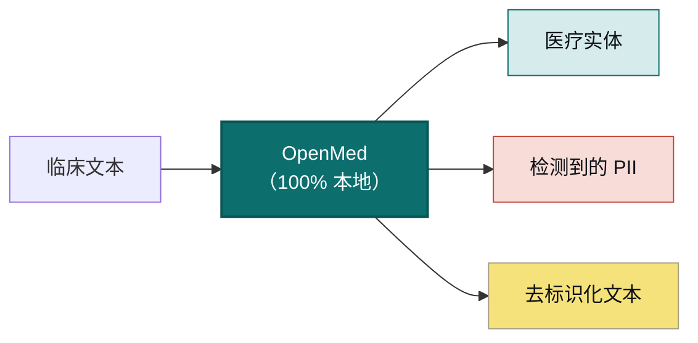

<div align="center">


<h3>你的数据。你的模型。你的硬件。</h3>

<p><b>将临床文本转化为结构化、去标识化的洞见，无需上传任何内容。</b><br/>
OpenMed 完全在你掌控的硬件上抽取生物医学实体，并彻底移除 55+ 种 PHI 类型，你的数据从不离开设备。同一套 2,000+ 个开源模型可完全离线运行，从手机到 GPU 服务器皆可：iOS 与 iPadOS 通过 OpenMedKit，Android 通过 ONNX，以及普通 CPU、Apple Silicon、NVIDIA GPU 和浏览器。无需云端，无供应商锁定，患者数据绝不离开你的网络。</p>

<p>
  <a href="https://pypi.org/project/openmed/"></a>
  <a href="https://www.python.org/downloads/"></a>
  <a href="https://huggingface.co/OpenMed"></a>
  <a href="https://arxiv.org/abs/2508.01630"></a>
  <a href="LICENSE"></a>
  <a href="https://github.com/maziyarpanahi/openmed/stargazers"></a>
</p>

<p>
  <a href="swift/OpenMedKit"></a>
  <a href="docs/mlx-backend.md"></a>
  <a href="docs/swift-openmedkit.md"></a>
  <a href="https://openmed.life/docs"></a>
</p>

<p>
  <b>2,000+ 模型</b> &nbsp;·&nbsp; <b>15 种 PII 语言</b> &nbsp;·&nbsp; <b>600+ 个 PII 检查点</b> &nbsp;·&nbsp; <b>100% 本地运行</b> &nbsp;·&nbsp; <b>Apache-2.0</b>
</p>

<p>
  <a href="README.md">English</a> ·
  <b>简体中文</b> ·
  <a href="README.es.md">Español</a> ·
  <a href="README.fr.md">Français</a> ·
  <a href="README.de.md">Deutsch</a> ·
  <a href="README.it.md">Italiano</a> ·
  <a href="README.pt.md">Português</a> ·
  <a href="README.nl.md">Nederlands</a> ·
  <a href="README.ar.md">العربية</a> ·
  <a href="README.hi.md">हिन्दी</a> ·
  <a href="README.te.md">తెలుగు</a> ·
  <a href="README.ja.md">日本語</a> ·
  <a href="README.tr.md">Türkçe</a> ·
  <a href="README.fa.md">فارسی</a>
</p>

</div>

---

## 现场演示

<div align="center">
  
  <br/>
  <sub><b>实时 PII 去标识化</b>：Nemotron Privacy Filter 正在对一份临床出院记录中的姓名、地址、证件号和账单数据进行脱敏，全程在本地设备上完成。<i>（图中所有数值均为合成数据。）</i></sub>
</div>

---

## 30 秒上手示例

```python
from openmed import analyze_text

result = analyze_text(
    "Patient started on imatinib for chronic myeloid leukemia.",
    model_name="disease_detection_superclinical",
)

for entity in result.entities:
    print(f"{entity.label:<12} {entity.text:<28} {entity.confidence:.2f}")
# DISEASE      chronic myeloid leukemia     0.98
# DRUG         imatinib                     0.95
```

一个最先进的临床 NER 模型在本地运行，无需 API 密钥，无网络调用。

---

## 为什么选择 OpenMed？

|                                       |       **OpenMed**        |    云端医疗 API    |
| ------------------------------------- | :----------------------: | :----------------: |
| 在你的设备/服务器上运行                |            ✅            |         ❌         |
| 患者数据离开你的网络                   |        **从不**          |    发送给供应商     |
| 成本                                   |       免费且开源         |    按调用计费       |
| 专业医疗模型                           |          2,000+          |        有限         |
| 语言                                   |           12+            |        不一         |
| 离线 / 隔离网络（air-gapped）          |            ✅            |         ❌         |
| Apple Silicon (MLX) 加速               |            ✅            |       不适用        |
| 原生 iOS / macOS 应用                  |   ✅ 通过 OpenMedKit     |         ❌         |
| 供应商锁定                             |     无：Apache-2.0      |         有          |

- **专业模型**：2,000+ 个精选的生物医学与临床模型，其中许多性能超越商业专有方案。
- **符合 HIPAA 的去标识化**：覆盖全部 18 项 Safe Harbor 标识符，智能实体合并，保留格式的伪造替换。
- **随处运行**：CPU、CUDA、Apple Silicon (MLX)，并可通过 OpenMedKit 原生运行于 iOS/macOS 应用。
- **一行部署**：Python API、Docker 化的 REST 服务，或批处理流水线。
- **零锁定**：Apache-2.0，你的基础设施，你的数据。

---

## 在 Apple 设备上本地运行：Swift、MLX 与 iOS

OpenMed 专为在你数据所在之处运行而打造。在 Apple 硬件上，它借助 **MLX** 加速，并通过
**[OpenMedKit](swift/OpenMedKit)** 直接进入 iPhone、iPad 和 Mac 应用，因此 PII 检测与临床抽取完全离线、
在设备本地完成。

```swift
// Add OpenMedKit to your app
dependencies: [
    .package(url: "https://github.com/maziyarpanahi/openmed.git", from: "1.9.0"),
]
```

- **MLX 运行时**，用于 PII token 分类、Privacy Filter 系列，以及实验性的 GLiNER 系列 zero-shot 任务，并提供 CoreML 回退路径。
- **一个模型名，所有平台**：在非 Apple 硬件上，MLX 模型名会自动回退到对应的 PyTorch 检查点。
- **Apple Silicon 上的 Python** 同样支持：`pip install --upgrade "openmed[mlx]"`。

指南：[MLX 后端](docs/mlx-backend.md) · [OpenMedKit (Swift)](docs/swift-openmedkit.md) · [CoreML 导出](docs/coreml-export.md)

---

## 工作原理



---

## 快速开始

```bash
# Core + Hugging Face runtime (Linux, macOS, Windows; CPU or CUDA)
pip install --upgrade "openmed[hf]"

# Add the REST service
pip install --upgrade "openmed[hf,service]"

# Apple Silicon acceleration (MLX)
pip install --upgrade "openmed[mlx]"
```

<table>
<tr>
<td width="33%" valign="top">

**Python API**

```python
from openmed import analyze_text

analyze_text(
  "Patient received 75mg "
  "clopidogrel for NSTEMI.",
  model_name=
  "pharma_detection_superclinical",
)
```

</td>
<td width="33%" valign="top">

**REST 服务**

```bash
uvicorn openmed.service.app:app \
  --host 0.0.0.0 --port 8080
```

`GET /health`
`POST /analyze`
`POST /pii/extract`
`POST /pii/deidentify`

</td>
<td width="33%" valign="top">

**批处理**

```python
from openmed import BatchProcessor

p = BatchProcessor(
  model_name=
  "disease_detection_superclinical",
  group_entities=True,
)
p.process_texts([...])
```

</td>
</tr>
</table>

**离线 / 隔离网络？** 只需将 `model_name`（或 `model_id`）指向本地目录，OpenMed 即会在本地加载，而不会连接 Hugging Face Hub：

```python
from openmed import OpenMedConfig, analyze_text

result = analyze_text(
    "Patient presents with chronic myeloid leukemia and Type 2 diabetes.",
    model_id="./models/OpenMed-NER-DiseaseDetect-SuperClinical-434M",
    config=OpenMedConfig(device="cpu"),
)
```

---

## 模型

精选的专业医疗 NER 模型注册表，浏览[完整目录](https://openmed.life/docs/model-registry)。

| 模型 | 专长 | 实体类型 | 大小 |
|------|------|----------|------|
| `disease_detection_superclinical` | 疾病与病症 | DISEASE, CONDITION, DIAGNOSIS | 434M |
| `pharma_detection_superclinical`  | 药物与用药 | DRUG, MEDICATION, TREATMENT   | 434M |
| `pii_superclinical_large`     | PII 与去标识化 | NAME, DATE, SSN, PHONE, EMAIL, ADDRESS | 434M |
| `anatomy_detection_electramed`    | 解剖与身体部位 | ANATOMY, ORGAN, BODY_PART     | 109M |
| `gene_detection_genecorpus`       | 基因与蛋白质 | GENE, PROTEIN                 | 109M |

---

## 隐私：PII 检测与去标识化

```python
from openmed import extract_pii, deidentify

text = "Patient: John Doe, DOB: 01/15/1970, SSN: 123-45-6789"

# Extract PII with smart merging (prevents tokenization fragmentation)
result = extract_pii(text, model_name="pii_superclinical_large", use_smart_merging=True)

# De-identify with the method you need
deidentify(text, method="mask")     # [NAME], [DATE]
deidentify(text, method="replace")  # Faker-backed, locale-aware, format-preserving fakes
deidentify(text, method="hash")     # Cryptographic hashing
deidentify(text, method="shift_dates", date_shift_days=180)
```

- **智能实体合并**让 `01/15/1970` 保持完整，而不会被拆分。
- **基于 Faker 的混淆**，内置自定义临床证件号 provider（CPF、CNPJ、BSN、NIR、Codice Fiscale、NIE、Aadhaar、Steuer-ID、NPI）。
- **HIPAA**：覆盖全部 18 项 Safe Harbor 标识符，可配置置信度阈值。

[完整 PII 笔记本](examples/notebooks/PII_Detection_Complete_Guide.ipynb) · [智能合并](docs/pii-smart-merging.md) · [匿名化](docs/anonymization.md)

<details>
<summary><b>Privacy Filter 系列</b>：基于 OpenAI Privacy Filter 架构的三个模型系列</summary>

<br/>

模型代码相同（gpt-oss 风格的稀疏 MoE Transformer，带局部注意力、sink token、RoPE+YaRN、tiktoken `o200k_base` 分词），仅训练数据不同。它们都通过**同一套** `extract_pii()` / `deidentify()` API 调用，只需更改 `model_name=` 参数。

| 变体 | PyTorch (CPU + CUDA) | MLX (Apple Silicon) | MLX 8-bit |
| --- | --- | --- | --- |
| **OpenAI Privacy Filter** | [`openai/privacy-filter`](https://huggingface.co/openai/privacy-filter) | [`OpenMed/privacy-filter-mlx`](https://huggingface.co/OpenMed/privacy-filter-mlx) | [`…-mlx-8bit`](https://huggingface.co/OpenMed/privacy-filter-mlx-8bit) |
| **Nemotron-PII fine-tune** | [`OpenMed/privacy-filter-nemotron`](https://huggingface.co/OpenMed/privacy-filter-nemotron) | [`…-nemotron-mlx`](https://huggingface.co/OpenMed/privacy-filter-nemotron-mlx) | [`…-nemotron-mlx-8bit`](https://huggingface.co/OpenMed/privacy-filter-nemotron-mlx-8bit) |
| **OpenMed Multilingual** | [`OpenMed/privacy-filter-multilingual`](https://huggingface.co/OpenMed/privacy-filter-multilingual) | [`…-multilingual-mlx`](https://huggingface.co/OpenMed/privacy-filter-multilingual-mlx) | [`…-multilingual-mlx-8bit`](https://huggingface.co/OpenMed/privacy-filter-multilingual-mlx-8bit) |

```python
from openmed import extract_pii

text = "Patient Sarah Connor (DOB: 03/15/1985) at MRN 4471882."

extract_pii(text, model_name="openai/privacy-filter")              # PyTorch baseline
extract_pii(text, model_name="OpenMed/privacy-filter-nemotron")    # same code, different weights
extract_pii(text, model_name="OpenMed/privacy-filter-mlx")         # Apple Silicon (MLX)
```

在非 Apple Silicon 主机上，MLX 模型名会自动替换为对应的 PyTorch 检查点（并给出一次性警告），写一个模型名，随处运行。参见 [Privacy Filter 架构与后端路由](docs/anonymization.md#privacy-filter-family)。

</details>

---

## 多语言 PII（12 种语言）

在 `en`、`fr`、`de`、`it`、`es`、`nl`、`hi`、`te`、`pt`、`ar`、`ja` 和 `tr` 等语言上进行抽取与去标识化，共 **600+ 个 PII 检查点**。

```bash
python -c "from openmed import extract_pii; print([(e.label, e.text) for e in extract_pii('Dr. Pedro Almeida, CPF: 123.456.789-09, email: pedro@hospital.pt', lang='pt').entities])"
```

<details>
<summary>查看各语言示例（葡萄牙语、荷兰语、印地语、阿拉伯语、日语、土耳其语）</summary>

<br/>

```python
from openmed import extract_pii

portuguese = extract_pii("Paciente: Pedro Almeida, CPF: 123.456.789-09, telefone: +351 912 345 678", lang="pt", use_smart_merging=True)
dutch      = extract_pii("Patiënt: Eva de Vries, BSN: 123456782, telefoon: +31 6 12345678", lang="nl", use_smart_merging=True)
hindi      = extract_pii("रोगी: अनीता शर्मा, फोन: +91 9876543210, पता: नई दिल्ली 110001", lang="hi", use_smart_merging=True)
arabic     = extract_pii("المريضة ليلى حسن، الهاتف +20 10 1234 5678، الرقم القومي 29801011234567.", lang="ar", use_smart_merging=True)
japanese   = extract_pii("患者 佐藤 花子、電話 +81 90 1234 5678、マイナンバー 1234 5678 9012.", lang="ja", use_smart_merging=True)
turkish    = extract_pii("Hasta Ayşe Yılmaz, telefon +90 532 123 45 67, TCKN 10000000146.", lang="tr", use_smart_merging=True)

for r in (portuguese, dutch, hindi, arabic, japanese, turkish):
    print([(e.label, e.text) for e in r.entities])
```

</details>

---

## REST API

一个对 Docker 友好的 FastAPI 服务，具备请求校验、共享流水线预加载，以及统一的错误响应封装。

```bash
pip install --upgrade "openmed[hf,service]"
uvicorn openmed.service.app:app --host 0.0.0.0 --port 8080

# or with Docker
docker build -t openmed:local .
docker run --rm -p 8080:8080 -e OPENMED_PROFILE=prod openmed:local
```

```bash
curl -X POST http://127.0.0.1:8080/pii/extract \
  -H "Content-Type: application/json" \
  -d '{"text":"Paciente: Maria Garcia, DNI: 12345678Z","lang":"es"}'
```

参见完整的 [REST 服务指南](docs/rest-service.md)。

---

## 文档

完整指南见 **[openmed.life/docs](https://openmed.life/docs/)**。

| | | |
|---|---|---|
| [快速入门](https://openmed.life/docs/) | [文本分析](https://openmed.life/docs/analyze-text) | [模型注册表](https://openmed.life/docs/model-registry) |
| [PII 检测指南](examples/notebooks/PII_Detection_Complete_Guide.ipynb) | [匿名化](docs/anonymization.md) | [批处理](https://openmed.life/docs/batch-processing) |
| [配置档案](https://openmed.life/docs/profiles) | [REST 服务](docs/rest-service.md) | [MLX 后端](docs/mlx-backend.md) |

---

## 认识一下我们的吉祥物


OpenMed 的守护者是一只蓬松的波斯猫，化身为小小的**阿维森纳（伊本·西那，Avicenna / Ibn Sina）**，这位伟大的
波斯医师所著的《医典》（*Canon of Medicine*）在约 600 年间一直是全世界的标准医学教科书。它守护着翻开的
医学知识之书，配色取自**波斯绿松石（fīrūza）**：一位守护你最私密数据的本地优先卫士。

<br clear="left"/>

---

## 贡献

欢迎贡献：bug 报告、功能请求和 PR 都欢迎。

- [提交 issue](https://github.com/maziyarpanahi/openmed/issues)
- **欢迎翻译**：帮助完善顶部语言切换栏中链接的其他语言 README。

---

## 致谢

OpenMed 建立在优秀的开源工作之上：特别感谢 **OpenAI**（[Privacy Filter](https://huggingface.co/openai/privacy-filter) 架构）、**NVIDIA**（[Nemotron PII 数据集](https://huggingface.co/datasets/nvidia/Nemotron-PII-v1)）、**Hugging Face**（`transformers` 及模型生态）、**Apple**（[MLX](https://github.com/ml-explore/mlx)），以及 **[Faker](https://faker.readthedocs.io/)** 的维护者。

## 许可证

基于 [Apache-2.0 许可证](LICENSE) 发布。

## 引用

如果 OpenMed 对你的研究有帮助，请引用：

```bibtex
@misc{panahi2025openmedneropensourcedomainadapted,
      title={OpenMed NER: Open-Source, Domain-Adapted State-of-the-Art Transformers for Biomedical NER Across 12 Public Datasets},
      author={Maziyar Panahi},
      year={2025},
      eprint={2508.01630},
      archivePrefix={arXiv},
      primaryClass={cs.CL},
      url={https://arxiv.org/abs/2508.01630},
}
```

---

## Star 历史

如果 OpenMed 对你有帮助，点个 star 能帮助更多人发现它。

<a href="https://star-history.com/#maziyarpanahi/openmed&Date">
  
</a>

---

<div align="center">

由 OpenMed 团队打造

<a href="https://openmed.life">网站</a> ·
<a href="https://openmed.life/docs">文档</a> ·
<a href="https://x.com/openmed_ai">X / Twitter</a> ·
<a href="https://www.linkedin.com/company/openmed-ai/">LinkedIn</a>

</div>
