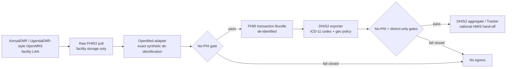

# African facility EMR to national HMIS reference

This reference demonstrates a common African health-data path without using a
real patient corpus: a facility-local OpenMRS-compatible EMR is read through
FHIR2, OpenMed removes seeded identifiers on the facility machine, precise
geography is reduced to a district organisation unit, and reviewable DHIS2
aggregate and Tracker payloads are emitted for an HMIS hand-off.

The default workflow is fully synthetic, deterministic, and offline. It starts
a recorded-response fixture for both legacy REST and FHIR2 endpoints on an
ephemeral loopback port, exercises both adapter paths, and builds the
transaction Bundle from FHIR2 resources. It does not require Java, Docker,
credentials, model downloads, or internet access.

!!! danger "The raw stage stays inside the facility boundary"

    `01-raw-openmrs.json` deliberately contains synthetic names, MSISDNs,
    national identifiers, and GPS coordinates. It exists so implementers can
    inspect the input to the privacy boundary. Never substitute real patient
    data in this reference or move the raw stage to a national reporting
    system.

## Facility-edge architecture



The de-identification and geography policy run before any national-system
handoff. Only district-level `orgUnit` values can cross the final boundary.
Facility UIDs and `geometry`, `latitude`, and `longitude` fields fail the demo's
release gate.

## Run the offline reference

From a development checkout with the OpenMRS extra or development dependencies
installed:

```bash
.venv/bin/python examples/africa-openmrs-dhis2/run_demo.py \
  --output-dir /tmp/openmed-africa-reference \
  --seed 875 \
  --patient-count 50
```

The command prints counts only. It never prints payload content or seeded
identifiers. The output directory contains:

| Stage | Artifact | Boundary |
| --- | --- | --- |
| 1 | `01-raw-openmrs.json` | Facility-only synthetic raw pull |
| 2 | `02-deidentified-fhir-bundle.json` | Valid FHIR transaction Bundle |
| 3 | `03-openmrs-deidentification-manifest.json` | PHI-free path and count summary |
| 4 | `04-dhis2-aggregate.json` | District-generalised aggregate import body |
| 5 | `05-dhis2-tracker.json` | District-generalised Tracker import body |
| 6 | `06-dhis2-export-manifest.json` | PHI-free DHIS2 transformation summary |
| 7 | `07-demo-manifest.json` | Stable hashes for every prior stage |

The fictional Mtoni district contains three facilities and 50 patients by
default. Each patient has a seeded name, MSISDN, national identifier, and GPS
coordinate. Observations use ICD-11-style codes from the WHO MMS namespace.
Two executions with the same seed and patient count produce byte-identical
artifacts, including the manifests.

Use `--page-size` to exercise fixture pagination without changing the artifacts:

```bash
.venv/bin/python examples/africa-openmrs-dhis2/run_demo.py \
  --output-dir /tmp/openmed-africa-reference-paged \
  --seed 875 \
  --patient-count 50 \
  --page-size 7
```

The smoke coverage in `tests/unit/examples/test_africa_reference_demo.py`
executes this fixture path, validates the FHIR transaction shape, runs the
DHIS2 aggregate and Tracker schema checkers, scans every egress artifact and
console output for all seeded identifiers, checks district-only geography, and
compares two complete runs byte for byte.

## Mapping to KenyaEMR and UgandaEMR-style deployments

The fixture uses the same integration boundaries an implementer should map in
an OpenMRS distribution:

1. Confirm the deployment's OpenMRS context path and enabled FHIR2 R4 module.
   KenyaEMR and UgandaEMR configurations differ by release and local
   customisation, so enumerate Patient, Encounter, and Observation search
   capabilities rather than assuming identical profiles.
2. Run the OpenMRS adapter on a facility-controlled machine or server. Keep
   credentials and the raw pull inside the facility LAN.
3. Replace the exact synthetic redactor with a reviewed OpenMed privacy policy
   for the deployment's languages and identifier formats. Measure
   direct-identifier recall before enabling an egress route.
4. Map the shipped ICD-11-style example codes and fictional DHIS2 UIDs to the
   ministry's reviewed metadata. Never infer national data-element or program
   UIDs.
5. Export through `openmed.clinical.exporters.DHIS2Exporter`. Supply a local
   organisation-unit snapshot and set the permitted district level for the
   target hierarchy.
6. Review the FHIR and DHIS2 manifests, then hand only the gated aggregate and
   Tracker files to facility-controlled transport tooling.

An OpenHIM mediator can sit between the facility and the HIE when that is part
of the national architecture. It is intentionally not included in this chain;
see [OpenHIM De-identification Mediator](openhim-mediator.md) for the separate
deployment surface.

## Facility hardware guidance

The fixture itself is lightweight and runs on a developer laptop or modest
facility PC. For a facility deployment, start with local operational
requirements rather than national-server sizing:

| Component | Practical starting point | Why |
| --- | --- | --- |
| OpenMed edge worker | 4 modern CPU cores, 8 GB RAM, encrypted SSD | Batch FHIR processing, policy checks, and local artifacts |
| Combined EMR and edge host | 8 CPU cores, 16 GB RAM, encrypted SSD | Leaves headroom for OpenMRS, its database, and privacy jobs |
| Storage | Capacity for the EMR plus two staged batches and logs that contain no raw PHI | Supports review and retry without uncontrolled copies |
| Power and network | UPS, tested shutdown, local LAN operation, queued outbound transfer | Keeps de-identification available during intermittent power or WAN service |

Treat these as a pilot baseline, not a production guarantee. Benchmark with the
facility's record volume, concurrency, language policy, retention rules, and
OpenMRS distribution. Keep database backups encrypted and test restoration
without copying real records into lower-trust environments.

## Optional live container profile

The offline fixture is the supported CI path. For an isolated demo lab,
`docker-compose.yml` also carries a `live` profile with real OpenMRS Reference
Application and DHIS2 Core containers:

```bash
docker compose \
  -f examples/africa-openmrs-dhis2/docker-compose.yml \
  --profile live \
  up -d
```

OpenMRS is bound to `127.0.0.1:8080` and DHIS2 to `127.0.0.1:8081` by default.
The containers are demo-grade, start with local-only example passwords, and are
not a hardened deployment. Load only the generated fictional recording and
reviewed fictional DHIS2 metadata before testing live API round-trips. The
fixture command does not upload anything to either service; use the existing
OpenMRS adapter and DHIS2 import endpoints only after the synthetic metadata is
present.

Stop the optional stack and remove its demo volumes when finished:

```bash
docker compose \
  -f examples/africa-openmrs-dhis2/docker-compose.yml \
  --profile live \
  down --volumes
```

CI never starts this profile. A live deployment needs separate secret
management, TLS, backups, network policy, observability, upgrade planning,
distribution-specific validation, and ministry metadata governance.

## Safety checklist

- Use only the bundled generator or another demonstrably synthetic corpus.
- Keep the raw OpenMRS pull and credentials inside the facility boundary.
- Fail closed if any seeded identifier appears in an egress artifact or log.
- Permit only district-level organisation units in national HMIS payloads.
- Review ICD-11 and DHIS2 metadata mappings with the clinical and HMIS owners.
- Do not treat this example as medical-device logic or an automated clinical
  decision system.
