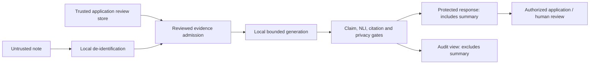

# Clinical brief threat model

## Overview

The [guarded clinical brief](../clinical/clinical-brief.md) combines local
de-identification, reviewed evidence, bounded generation, exact claim alignment,
calibrated NLI, citation checks, privacy checks and a review handoff. Successful
results require human review and remain non-diagnostic. The current Python
evidence-packet contract admits synthetic evidence only; synthetic markers and
test scores do not prove that a note is safe or clinically valid.

This model covers the library, CLI, REST, MCP and OpenMedKit brief surfaces and
their supporting local loaders. It records architecture and threat scenarios,
not validated vulnerabilities. It makes no compliance, certification,
clinical-validation or model-quality claim. Suspected defects follow the
[private disclosure policy](disclosure-policy.md); this document includes no
actionable reproduction for an unmitigated bypass.

| Component | Responsibility | Source |
|---|---|---|
| Python composer | Fixed stage order, evidence and output gates, review-required result | [brief.py:177–212](https://github.com/maziyarpanahi/openmed/blob/master/openmed/clinical/brief.py#L177-L212) |
| Shared transport contract | Bounded local configuration and trusted review lookup | [brief.py:24–65](https://github.com/maziyarpanahi/openmed/blob/master/openmed/service/brief.py#L24-L65) |
| Local generation | Cache-only alias resolution and resource admission | [summarize_backends.py:64–80](https://github.com/maziyarpanahi/openmed/blob/master/openmed/clinical/summarize_backends.py#L64-L80); [summarize_backends.py:135–220](https://github.com/maziyarpanahi/openmed/blob/master/openmed/clinical/summarize_backends.py#L135-L220) |
| OpenMedKit | Buffered local generation followed by application evaluation and native packet guards | [OpenMedMapleMLX.swift:775–795](https://github.com/maziyarpanahi/openmed/blob/master/swift/OpenMedKit/Sources/OpenMedKit/OpenMedMapleMLX.swift#L775-L795); [ClinicalBrief.swift:71–148](https://github.com/maziyarpanahi/openmed/blob/master/swift/OpenMedKit/Sources/OpenMedKit/ClinicalBrief.swift#L71-L148) |

Swift uses its application's local evaluator for the complete reviewed-evidence
and NLI pipeline. Native packet validation independently checks the safety
envelope, digests, citations, verdict labels and privacy callback; it does not
independently execute every Python stage.

### Effective resources and capabilities

Symbolic roots below describe configured locations, never an observed private
host path. No deployed bind, mount, cache ACL, review provider or actual model
file contents were supplied. Separately authorized model preparation precedes
generation; cache preparation does not authorize sending note content remotely.

| Deployment or workflow | Resource or capability | Configuration and precedence | Safe effective value or location | Readers, writers, or recipients | Enforcing control | Evidence or unknowns |
|---|---|---|---|---|---|---|
| Python raw-note composition | PII model and original note | Composer supplies `OpenMedConfig(local_only=True)`, masking; config defaults apply | OpenMed PII cache defaults to `~/.cache/openmed`; original text/entities remain in caller-owned memory; no result cache/audit requested | Local PII runtime | 16 KiB input bound, local-only guard, mask method | [brief.py:302–319](https://github.com/maziyarpanahi/openmed/blob/master/openmed/clinical/brief.py#L302-L319); [config.py:374–376](https://github.com/maziyarpanahi/openmed/blob/master/openmed/core/config.py#L374-L376); [pii.py:2651–2654](https://github.com/maziyarpanahi/openmed/blob/master/openmed/core/pii.py#L2651-L2654). Actual backend/snapshot children depend on host/profile. |
| Reviewed composition | Generator input | Validated packet, content/policy binding, sorted reviewed references | Space-joined de-identified reference spans; at most 64 facts/references; demographics refused | Registered local backend or trusted callback | Nonempty, aligned, reviewed evidence | [brief.py:320–343](https://github.com/maziyarpanahi/openmed/blob/master/openmed/clinical/brief.py#L320-L343); [brief.py:388–398](https://github.com/maziyarpanahi/openmed/blob/master/openmed/clinical/brief.py#L388-L398) |
| Python MLX aliases | Cached config and weights | Registry revision, cache-only Hub lookup; no OpenMed `cache_dir` passed | Hub-selected snapshot for `deepgrove/maple-preview-2bit-mlx` at `361db5da5e74ff6fcdd852d478e1f266ce11013a`, then `config.json` and `model*.safetensors` | Local model/tokenizer loader; separately trusted provisioning writes cache | Alias/revision selection, config/context/weight/token/memory admission | [model_registry.py:1812–1821](https://github.com/maziyarpanahi/openmed/blob/master/openmed/core/model_registry.py#L1812-L1821); [summarize_backends.py:64–74](https://github.com/maziyarpanahi/openmed/blob/master/openmed/clinical/summarize_backends.py#L64-L74); [summarize_backends.py:141–202](https://github.com/maziyarpanahi/openmed/blob/master/openmed/clinical/summarize_backends.py#L141-L202). Hub-selected root is not necessarily `~/.cache/openmed`; cache ACL/authenticity remains an obligation. |
| Python MLX-LM load | Executable artifact code and tokenizer | Cached local path into `mlx_lm.load`; Maple config selects custom artifact code | Snapshot `config.json`, model code and tokenizer; application process authority | Local application and dependencies | Upstream selection pinned; public summarizer rejects arbitrary paths | [lm.py:578–592](https://github.com/maziyarpanahi/openmed/blob/master/openmed/mlx/lm.py#L578-L592); [lm.py:896–899](https://github.com/maziyarpanahi/openmed/blob/master/openmed/mlx/lm.py#L896-L899). Pinning does not authenticate substituted local bytes. |
| CLI factory | Installed Python execution | Operator-selected `module:function`, syntax check, import and invocation | Installed factory runs before source read and composer socket guard | Trusted operator/application code | Identifier-shaped name, callable result, no ambiguous provider | [brief.py:38–54](https://github.com/maziyarpanahi/openmed/blob/master/openmed/cli/brief.py#L38-L54). Import/package integrity is operator-owned. |
| CLI source and summary | Protected files | Explicit source and `--summary-output` arguments | Bounded UTF-8 source; newly created summary destination | CLI reads source; OS-authorized readers receive summary | Reserve both outputs exclusively before writing; request mode 0600 | [brief.py:53–88](https://github.com/maziyarpanahi/openmed/blob/master/openmed/cli/brief.py#L53-L88). Parent directories, ACLs and later copies remain deployment-owned. |
| CLI audit and stdout | Audit destination and diagnostics | Remove summary; explicit `--review-output` | Separate new JSON audit; stdout has status, reason, character count and digest | Audit-file and stdout recipients | Exclusive creation, POSIX mode 0600, selected stdout fields | [brief.py:64–99](https://github.com/maziyarpanahi/openmed/blob/master/openmed/cli/brief.py#L64-L99). Windows stat attributes do not establish equivalent ACL privacy. |
| REST | Protected response and review lookup | Strict request, optional service auth, `app.state.brief_context_provider` | `POST /brief` returns summary; provider receives text/review ID, not request principal | Requester and trusted provider; access logs receive selected metadata | Wire bounds, optional transport auth/scopes, provider result binding, composer gates | [app.py:1500–1520](https://github.com/maziyarpanahi/openmed/blob/master/openmed/service/app.py#L1500-L1520); [auth.py:410–439](https://github.com/maziyarpanahi/openmed/blob/master/openmed/service/auth.py#L410-L439). Record authorization and identity propagation are application-owned. |
| MCP | Protected tool response and review lookup | Registry schema, optional gateway auth/scopes, runtime provider | `openmed_brief`; default gateway host `127.0.0.1`, port 8081; default authenticated scope `mcp:tool:openmed_brief` | MCP client/tool host and trusted provider | Gateway policy when invoked through server; schema and composer checks | [server.py:978–1002](https://github.com/maziyarpanahi/openmed/blob/master/openmed/mcp/server.py#L978-L1002); [server.py:2170–2204](https://github.com/maziyarpanahi/openmed/blob/master/openmed/mcp/server.py#L2170-L2204); [security.py:1085–1091](https://github.com/maziyarpanahi/openmed/blob/master/openmed/service/security.py#L1085-L1091). Direct local calls already hold process authority. |
| Python context callbacks | NLI and privacy input | Trusted `BriefContext` callbacks | Reviewed premise/exact claim to NLI; summary and rendered protected response to privacy detector | Same-process trusted callbacks | Composer socket guard, calibration ID and probability gate, privacy refusal | [brief.py:461–489](https://github.com/maziyarpanahi/openmed/blob/master/openmed/clinical/brief.py#L461-L489); [brief.py:581–585](https://github.com/maziyarpanahi/openmed/blob/master/openmed/clinical/brief.py#L581-L585); [brief.py:647–652](https://github.com/maziyarpanahi/openmed/blob/master/openmed/clinical/brief.py#L647-L652). Actual calibration, locality and detector recall require qualification. |
| Swift SDK loader | Native model/tokenizer files | Explicit `modelDirectoryURL` | Caller-selected directory with config, weight index/three shards and tokenizer files | Native application/runtime; trusted provisioning | Required nonempty files and native configuration checks; no runtime download | [OpenMedMapleMLX.swift:658–701](https://github.com/maziyarpanahi/openmed/blob/master/swift/OpenMedKit/Sources/OpenMedKit/OpenMedMapleMLX.swift#L658-L701). Presence is not artifact authentication. |
| Swift scan demo | Pinned cached model directory | Repo/revision into model store; default OS user cache root | `<OS user caches>/OpenMed/MLXModels/deepgrove__maple-preview-2bit-mlx/361db5da5e74ff6fcdd852d478e1f266ce11013a`, then required model/tokenizer children | Demo runtime; separate provisioning writer | Pinned selection and readiness before load | [OpenMedModelStore.swift:151–161](https://github.com/maziyarpanahi/openmed/blob/master/swift/OpenMedKit/Sources/OpenMedKit/OpenMedModelStore.swift#L151-L161); [OpenMedModelStore.swift:302–314](https://github.com/maziyarpanahi/openmed/blob/master/swift/OpenMedKit/Sources/OpenMedKit/OpenMedModelStore.swift#L302-L314); [OMPipelineRuntime.swift:243–254](https://github.com/maziyarpanahi/openmed/blob/master/swift/OpenMedScanDemo/OpenMedScanDemo/ViewModel/OMPipelineRuntime.swift#L243-L254). Actual sandbox root and writer permissions vary. |
| Swift evaluator and views | Source, generated summary and packet | Buffered generation, trusted `evaluate` and `privacyCheck`, native validation | Complete packet to privacy checker; protected response retains summary; audit removes it; brief output is not streamed | Trusted on-device callbacks and authorized UI/output consumers | Packet/digest/envelope/citation/verdict/privacy checks; demo rejects stale source results | [ClinicalBrief.swift:78–148](https://github.com/maziyarpanahi/openmed/blob/master/swift/OpenMedKit/Sources/OpenMedKit/ClinicalBrief.swift#L78-L148); [ScanFlowViewModel.swift:386–409](https://github.com/maziyarpanahi/openmed/blob/master/swift/OpenMedScanDemo/OpenMedScanDemo/ViewModel/ScanFlowViewModel.swift#L386-L409). Other evaluator fields must remain value-free; callback locality is contractual. |

## Threat model, trust boundaries and assumptions

### Assets and security objectives

Protect original notes, detected identifier surfaces/mappings, summaries and
complete protected responses. Preserve evidence/review authority, exact
content/annotation/profile binding, calibration identity, citation integrity,
review-required state, provenance, local artifact integrity and compute
availability. Audit consumers receive counts, offsets, fixed vocabulary and
digests rather than note or summary text.

The composer must never manufacture review history, silently change backends,
return partial unsafe generation, or convert a passed gate into clinical
authorization. Only uniquely aligned reviewed claims with accepted NLI outcomes
can reach a successful response. Changed content, axes or profile require fresh
review. [brief.py:92–114](https://github.com/maziyarpanahi/openmed/blob/master/openmed/clinical/brief.py#L92-L114);
[brief.py:320–343](https://github.com/maziyarpanahi/openmed/blob/master/openmed/clinical/brief.py#L320-L343);
[brief.py:412–431](https://github.com/maziyarpanahi/openmed/blob/master/openmed/clinical/brief.py#L412-L431);
[brief.py:461–489](https://github.com/maziyarpanahi/openmed/blob/master/openmed/clinical/brief.py#L461-L489).

### Surface boundaries

| Surface | Caller-controlled input and authority crossing | Component-owned controls | Application obligation |
|---|---|---|---|
| Python | Note/result and context enter the fixed composer; local callbacks already have process authority | Exact types, bounds, synthetic packet/history validation, content/policy binding, exact alignment, NLI/privacy gates | Supply genuinely reviewed context and qualified local callbacks; protect original memory and explicit output |
| CLI | Operator chooses installed factory and filesystem destinations; note content does not select executable modules | Bounded source read, local transport contract, exclusive output reservation, fixed public failure | Trust installed packages/import search path; keep input/output directories private; configure Windows ACLs |
| REST | Request text, aliases and opaque review reference enter strict schema and server-owned provider | Shared byte/config bounds and context/text binding; general authentication when enabled; selected access logs | Configure exposure, TLS/proxy logging, route policy and authenticated record authorization in provider |
| MCP | Tool arguments cross registry/gateway into runtime-owned provider | Input/output schema; configured authentication/tool scope at gateway; shared composer | Enforce review-store access and protect tool responses; read-only annotation is not data permission |
| OpenMedKit | Local source/summary enter application evaluator, then native packet boundary | Buffered brief output; envelope/hash/Unicode-scalar citation/verdict/privacy checks; summary-free debug description | Execute actual evidence/NLI review locally; provide complete-response detector and value-free evaluator metadata; protect artifacts/output |

Sources for these crossings are the component/resource table above, the
[REST request schema](https://github.com/maziyarpanahi/openmed/blob/master/openmed/service/schemas.py#L1258-L1270),
[MCP brief schema](https://github.com/maziyarpanahi/openmed/blob/master/openmed/mcp/tool_registry.py#L1855-L1885),
and [native output views](https://github.com/maziyarpanahi/openmed/blob/master/swift/OpenMedKit/Sources/OpenMedKit/ClinicalBrief.swift#L44-L70).

### Actors, prerequisites and residual obligations

A document author controls note content, including prompt-like instructions,
but has no authority to approve evidence, select installed code or access a
review store. A transport requester controls the bounded wire fields, not
review histories or NLI scores. Cross-record disclosure requires an exposed
transport and a provider that grants access incorrectly; no such deployed
condition is established here.

An artifact supplier or lower-trust shared-cache writer is a conditional
supply-chain actor. Impact requires an authorized provisioning/load path and
authority below the application process. The same user already controlling
installed packages and callbacks is not isolated by a parser or local socket
guard. An output reader needs actual file, export, backup or logging access.

Transport authentication and record authorization are separate. REST auth
defaults disabled; enabled default deny-by-default authenticates `/brief`
without a named default route scope. Configure the desired route policy and
provider identity/access binding explicitly. MCP auth is also opt-in; its
authenticated gateway enforces the configured tool scope. The review reference
is a lookup key, never a permission grant.
[auth.py:48–55](https://github.com/maziyarpanahi/openmed/blob/master/openmed/service/auth.py#L48-L55);
[auth.py:134–162](https://github.com/maziyarpanahi/openmed/blob/master/openmed/service/auth.py#L134-L162);
[auth.py:430–439](https://github.com/maziyarpanahi/openmed/blob/master/openmed/service/auth.py#L430-L439);
[server.py:2170–2204](https://github.com/maziyarpanahi/openmed/blob/master/openmed/mcp/server.py#L2170-L2204).

Factories and context-provider lookup execute before the composer guard.
During composition the guard patches Python `socket.connect`, `connect_ex`
and `create_connection`, with overlapping-scope protection. It does not
sandbox subprocesses, native networking, imported artifact code or trusted
callbacks. Swift callback locality is likewise an application contract.
[brief.py:38–57](https://github.com/maziyarpanahi/openmed/blob/master/openmed/cli/brief.py#L38-L57);
[brief.py:47–65](https://github.com/maziyarpanahi/openmed/blob/master/openmed/service/brief.py#L47-L65);
[offline.py:113–157](https://github.com/maziyarpanahi/openmed/blob/master/openmed/core/offline.py#L113-L157).

Known-source leakage checks depend on detected/supplied identifier surfaces.
Unsupported scripts, short identifiers, detector false negatives and model
memorization remain qualification risks; this page claims no universal recall.
Cache-only loading and revision selection do not independently authenticate
cached bytes. Maple is not a clinically validated summarizer, and calibration
IDs, review histories and finite score checks do not authenticate reviewer
identity or prove empirical calibration. Synthetic fixture providers are not
deployable clinical review/NLI services.
[summarize.py:399–445](https://github.com/maziyarpanahi/openmed/blob/master/openmed/clinical/summarize.py#L399-L445);
[evidence_packet.py:291–310](https://github.com/maziyarpanahi/openmed/blob/master/openmed/clinical/evidence_packet.py#L291-L310);
[nli_gate.py:199–215](https://github.com/maziyarpanahi/openmed/blob/master/openmed/clinical/nli_gate.py#L199-L215);
[Model and evidence limitations](../clinical/summarization.md).

Private output creation requests POSIX mode 0600; this is not encryption,
portable Windows ACL enforcement or protection of parent directories and later
copies. Audit digests provide content binding, not a signature or access token.
Python `to_dict()` excludes summary and exposes defensive copies;
`to_response()` explicitly includes protected content. Swift `auditJSON()`
removes summary but retains other evaluator fields, which must meet the
value-free metadata contract and pass the complete-response privacy callback.
Applications and proxies must not log protected responses.
[brief.py:125–169](https://github.com/maziyarpanahi/openmed/blob/master/openmed/clinical/brief.py#L125-L169);
[brief.py:64–88](https://github.com/maziyarpanahi/openmed/blob/master/openmed/cli/brief.py#L64-L88);
[logging.py:111–126](https://github.com/maziyarpanahi/openmed/blob/master/openmed/service/logging.py#L111-L126);
[ClinicalBrief.swift:114–148](https://github.com/maziyarpanahi/openmed/blob/master/swift/OpenMedKit/Sources/OpenMedKit/ClinicalBrief.swift#L114-L148).

## Attack surface, mitigations and attacker stories

The rows are scenario classes and existing controls, not confirmed findings.
Priority describes the impact to investigate if a control fails. Each row
links existing tests; tests with injected synthetic providers prove contract
behavior, not model quality, complete deployment isolation or clinical safety.

| ID | Priority | Scenario and capability gain | Prerequisites | Impact | Existing controls | Mitigation and residual risk | Evidence |
|---|---|---|---|---|---|---|---|
| B1 | High | Note author gains admission of unreviewed or fabricated claims | Attacker-controlled note reaches composer | Evidence/output integrity loss | Reviewed nonempty spans, fixed stages, unique exact claim alignment and citation guards | Preserve reviewed context and human review; exact alignment does not validate source truth or support general paraphrase | [Evidence, unsupported-claim and stage tests](https://github.com/maziyarpanahi/openmed/blob/master/tests/unit/clinical/test_brief.py); [brief.py:329–343](https://github.com/maziyarpanahi/openmed/blob/master/openmed/clinical/brief.py#L329-L343); [brief.py:412–431](https://github.com/maziyarpanahi/openmed/blob/master/openmed/clinical/brief.py#L412-L431) |
| B2 | High privacy impact | Generator re-emits a detected identifier into response or metadata | Generated output and a privacy-control failure | Disclosure to output/log recipient | Known-source surface check, summary scan and whole-response scan; empty summary on refusal | Qualify detector recall for scripts/identifier classes; absent detection is not proof of privacy | [Re-emission and metadata privacy tests](https://github.com/maziyarpanahi/openmed/blob/master/tests/unit/clinical/test_brief.py); [Local input/output leakage tests](https://github.com/maziyarpanahi/openmed/blob/master/tests/unit/clinical/test_summarize_backends.py); [brief.py:581–585](https://github.com/maziyarpanahi/openmed/blob/master/openmed/clinical/brief.py#L581-L585); [brief.py:647–652](https://github.com/maziyarpanahi/openmed/blob/master/openmed/clinical/brief.py#L647-L652) |
| B3 | High | Prompt-like note content gains output authority or egress | Untrusted document content; no operator code authority | Unsupported claims or protected-content exposure | Only reviewed spans generated; claim/NLI/privacy guards and Python socket blocking | Keep note content as data; socket blocking is not isolation of native/process code | [Fabrication and remote-model refusal tests](https://github.com/maziyarpanahi/openmed/blob/master/tests/unit/clinical/test_brief.py); [Custom-backend socket test](https://github.com/maziyarpanahi/openmed/blob/master/tests/unit/clinical/test_summarize_backends.py); [offline.py:113–157](https://github.com/maziyarpanahi/openmed/blob/master/openmed/core/offline.py#L113-L157) |
| B4 | High, conditional | Lower-trust cache/provisioning actor substitutes loaded artifacts | Authorized load plus cache/provisioning write access below application authority | Model integrity or process compromise | Registry alias/revision, cache-only lookup, admission checks before load | Trust provisioning and cache writers; pins/presence do not independently authenticate cached bytes; no substitution event established | [Pinned cache and admission-order tests](https://github.com/maziyarpanahi/openmed/blob/master/tests/unit/clinical/test_summarize_backends.py); [summarize_backends.py:141–202](https://github.com/maziyarpanahi/openmed/blob/master/openmed/clinical/summarize_backends.py#L141-L202); [lm.py:578–592](https://github.com/maziyarpanahi/openmed/blob/master/openmed/mlx/lm.py#L578-L592) |
| B5 | Conditional configuration risk | Untrusted factory/provider is mistakenly granted process authority | Operator or integration accepts untrusted installed code/configuration | Local execution or protected-text access | Factory is CLI configuration; transport schemas keep providers server-owned; invalid configuration fails closed | Trust installed factory and callback packages. Existing surface tests cover wire configuration/provider refusal; dedicated factory-import coverage is a review gap, not a sandbox claim | [Wire configuration and provider tests](https://github.com/maziyarpanahi/openmed/blob/master/tests/unit/service/test_brief_surfaces.py); [brief.py:38–57](https://github.com/maziyarpanahi/openmed/blob/master/openmed/cli/brief.py#L38-L57); [brief.py:47–65](https://github.com/maziyarpanahi/openmed/blob/master/openmed/service/brief.py#L47-L65) |
| B6 | High | Forged/stale review records admit changed evidence | Incorrect trusted review-store integration or changed content/axes/profile | Unauthorized evidence gains generated-output authority | Packet history validation, content digest and policy fingerprint bind inputs | Authenticate reviewers/access in application store; digests and synthetic markers are not authentication or approvals | [Missing review, digest and annotation-drift tests](https://github.com/maziyarpanahi/openmed/blob/master/tests/unit/clinical/test_brief.py); [Review transition tests](https://github.com/maziyarpanahi/openmed/blob/master/tests/unit/clinical/test_review_state_machine.py); [brief.py:320–343](https://github.com/maziyarpanahi/openmed/blob/master/openmed/clinical/brief.py#L320-L343) |
| B7 | High | Mismatched or unjustified scores are treated as support | Configured verifier/thresholds | Contradiction or uncertain claim admitted | Calibration-ID binding, probability/threshold/margin validation, entailment-only admission | Qualify actual model and calibration; matching metadata does not prove empirical calibration | [Calibration, contradiction and abstention tests](https://github.com/maziyarpanahi/openmed/blob/master/tests/unit/clinical/test_nli_gate.py); [Unavailable calibration refusal tests](https://github.com/maziyarpanahi/openmed/blob/master/tests/unit/clinical/test_brief.py); [brief.py:461–489](https://github.com/maziyarpanahi/openmed/blob/master/openmed/clinical/brief.py#L461-L489) |
| B8 | High privacy impact | Output-directory reader or later export receives protected summary | Actual file/ACL/backup/export access | Protected content disclosure | Exclusive separate destinations, POSIX 0600, collision/symlink refusal and cleanup | Configure parent-directory ownership, Windows ACLs, retention and authorized exports; cleanup is best-effort | [Private output, collision and platform-mode tests](https://github.com/maziyarpanahi/openmed/blob/master/tests/unit/service/test_brief_surfaces.py); [brief.py:64–88](https://github.com/maziyarpanahi/openmed/blob/master/openmed/cli/brief.py#L64-L88) |
| B9 | High privacy impact | Application/proxy diagnostic reader receives note or summary | Logging of protected response or private callback error | Protected-content disclosure | Fixed refusal reasons, exception-context suppression, summary-free audit/debug views, selected access logs | Do not log responses; Swift evaluator metadata and complete-response detector remain trusted obligations | [Safe serialization and private-error tests](https://github.com/maziyarpanahi/openmed/blob/master/tests/unit/clinical/test_brief.py); [Access-log and CLI separation tests](https://github.com/maziyarpanahi/openmed/blob/master/tests/unit/service/test_brief_surfaces.py); [Native audit/privacy tests](https://github.com/maziyarpanahi/openmed/blob/master/swift/OpenMedKit/Tests/OpenMedKitTests/ClinicalBriefTests.swift); [logging.py:111–126](https://github.com/maziyarpanahi/openmed/blob/master/openmed/service/logging.py#L111-L126) |
| B10 | High privacy impact, conditional | Transport caller obtains another caller's review-backed response | Exposed transport plus inadequate application record authorization | Cross-record disclosure | Strict wire contract, optional service/gateway authentication/scopes, typed missing/mismatched-provider refusal | Configure transport policy and provider caller identity/access checks; reference shape and read-only hint do not authorize data | [Wire/provider refusal tests](https://github.com/maziyarpanahi/openmed/blob/master/tests/unit/service/test_brief_surfaces.py); [Generic REST authentication tests](https://github.com/maziyarpanahi/openmed/blob/master/tests/unit/service/test_auth_middleware.py); [Generic MCP scope/policy tests](https://github.com/maziyarpanahi/openmed/blob/master/tests/unit/security/test_mcp_authorization.py); [brief.py:34–65](https://github.com/maziyarpanahi/openmed/blob/master/openmed/service/brief.py#L34-L65) |
| B11 | High | Changed/unsafe Swift evaluator packet gains display authority | Packet supplied by trusted application evaluator | Citation/output integrity or privacy loss | Bounded packet, envelope/digest/source/output binding, Unicode-scalar exact coverage, entailment labels and complete privacy scan | Evaluator must actually perform local evidence/NLI review; native validation does not recompute every Python metric; demo discards stale source results | [Native tamper, privacy and structured-task tests](https://github.com/maziyarpanahi/openmed/blob/master/swift/OpenMedKit/Tests/OpenMedKitTests/ClinicalBriefTests.swift); [ClinicalBrief.swift:78–148](https://github.com/maziyarpanahi/openmed/blob/master/swift/OpenMedKit/Sources/OpenMedKit/ClinicalBrief.swift#L78-L148); [ScanFlowViewModel.swift:407–413](https://github.com/maziyarpanahi/openmed/blob/master/swift/OpenMedScanDemo/OpenMedScanDemo/ViewModel/ScanFlowViewModel.swift#L407-L413) |
| B12 | Medium, conditional | Requester exhausts shared local inference capacity | Shared exposed service and sustained admitted workload | Availability loss | Input/reference/output bounds, conservative memory/context admission, fixed maximum generation tokens | Configure deployment concurrency/rate limits; admission estimate is not measured peak memory or an end-to-end SLO | [Memory/context/token budget tests](https://github.com/maziyarpanahi/openmed/blob/master/tests/unit/clinical/test_summarize_backends.py); [Wire bounds tests](https://github.com/maziyarpanahi/openmed/blob/master/tests/unit/service/test_brief_surfaces.py); [summarize_backends.py:184–219](https://github.com/maziyarpanahi/openmed/blob/master/openmed/clinical/summarize_backends.py#L184-L219) |

## Severity calibration: Critical, High, Medium, Low

Apply the repository [security policy](https://github.com/maziyarpanahi/openmed/blob/master/SECURITY.md#severity).
Privacy-impacting defects are never below **High**, regardless of a generic
availability or configuration label above. The examples are hypothetical
triage outcomes; no score, vulnerability or deployed exposure is established.

| Severity | Example if independently established | Counterexample or limiting prerequisite |
|---|---|---|
| Critical | Real PHI/PII exposure/redaction bypass, unauthorized reversal, or forged audit signature under the policy | A synthetic refusal fixture is not real-data disclosure; a content digest is not an audit signature |
| High | Systematic identifier leakage, secret-bearing diagnostics, or cross-record protected-response access | Requires actual lower-trust input/access and a failed control; protected output delivered to its authorized caller is expected |
| Medium | Service availability impact from admitted workload without privacy exposure; non-default dependency execution impact with established prerequisites | Model-quality disagreement or a failed resource preflight alone does not establish a security incident |
| Low | A hardening/documentation gap with no demonstrated privacy exposure, authority gain or meaningful availability impact | Any proven privacy impact triggers the High floor; uncertain evidence is an open question, not a lower severity |

Host compromise, operator-selected trusted callbacks and same-process code
already holding application authority are not new privilege boundaries.
Hosted endpoints, external deployments and their actual ACL/provider policies
were not audited. Qualification gaps remain explicit: factory-import coverage,
detector/script recall, actual calibration, cached-file authenticity,
application record authorization, Windows ACLs and value-free Swift evaluator
metadata. Preserve these questions without inventing either a guarantee or a
confirmed failure.
