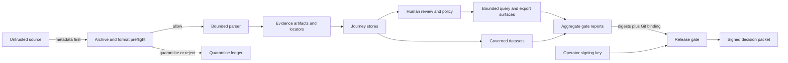

# V3 Journey Threat Model

This document models security and privacy threats for the v3 longitudinal
Journey, from untrusted intake through release evidence. It is a design-level
assessment of the repository implementation, not a claim of clinical
validation, regulatory certification, deployment hardening, or safe autonomous
patient-care use.

No confirmed vulnerability was identified while producing this document. The
attacker stories below are hypotheses used to define controls and release
evidence. Report a suspected bypass under the private
[security disclosure policy](./disclosure-policy.md); never include real
sensitive data.

## 1. Overview

### Scope and review method

The in-scope system is the Journey path that receives source metadata and
records, normalizes them into evidence-linked artifacts, coordinates ingestion,
stores longitudinal state, protects reversible surrogate mappings, governs
review and export, serves bounded resource pages, and produces the v3 release
decision. Hosted infrastructure, an operator's identity provider, external
object-store policy, and downstream clinical decisions are outside this
repository-level review.

The architecture review was performed sequentially because an independent
reviewer was not available in this work session. It should therefore be treated
as first-party threat modeling and re-reviewed independently before a
production security sign-off.

### Component and source map

| Component | Security-relevant behavior | Source evidence |
| --- | --- | --- |
| Archive preflight | Classifies caller-supplied metadata without opening or extracting content; enforces bounded size, count, path, and expansion limits. | `openmed/interop/archive_safety.py:1-6`, `openmed/interop/archive_safety.py:40-44`, `openmed/interop/archive_safety.py:193-227` |
| Evidence adapters | Accept only controlled formats and coordinate conventions, reject duplicate/non-finite JSON, and bind locators to an artifact and source digest. | `openmed/interop/ingest/evidence_contracts.py:20-52`, `openmed/interop/ingest/evidence_contracts.py:112-116`, `openmed/interop/ingest/evidence_contracts.py:155-188` |
| Ingestion ledger | Defines manifest registration, leases, idempotent checkpoints, retries, cancellation, quarantine, and explicit promotion. | `openmed/interop/ingest/store.py:59-133` |
| Review workflow | Uses controlled, value-free transitions; verifies a chronological transition chain; rejects unsafe extension keys. | `openmed/clinical/review_transitions.py:21-43`, `openmed/clinical/review_transitions.py:147-216` |
| Reversible-surrogate vault | Uses caller-owned 32-byte key material, authenticated AES-SIV envelopes, no plaintext temporary file, and atomic encrypted writes. | `openmed/core/surrogate_vault_crypto.py:50-61`, `openmed/core/surrogate_vault_crypto.py:72-123`, `openmed/core/surrogate_vault_crypto.py:184-234` |
| Governed datasets | Defaults to value-free projections, rejects vault material, requires explicit context for identified values, and records input license constraints. | `openmed/structured/datasets/governed.py:1-7`, `openmed/structured/datasets/governed.py:411-444`, `openmed/structured/datasets/governed.py:464-510` |
| Journey resource service | Applies role, purpose, consent, export, and field policy; limits page size; prevents terminal non-success states from carrying resources; binds cursors to query and snapshot. | `openmed/service/journey_resources.py:320-404`, `openmed/service/journey_resources.py:480-544`, `openmed/service/journey_resources.py:587-624`, `openmed/service/journey_resources.py:744-807` |
| Release gate | Validates an exact manifest, binds HEAD and tag to a pinned commit, verifies frozen input digests, evaluates mandatory gates and licenses, and signs the decision packet. | `openmed/eval/journey_release.py:488-555`, `openmed/eval/journey_release.py:699-735`, `openmed/eval/journey_release.py:965-1043`, `openmed/eval/journey_release.py:1046-1142` |

### Effective resources

These are the resources that cross a trust boundary or materially affect a
security decision. “Effective” means the data or authority actually consumed by
the implementation, not merely a deployment diagram label.

| Resource | Owner or origin | Consumed by | Security property |
| --- | --- | --- | --- |
| Archive-member metadata | Untrusted caller | Archive preflight | No extraction before allow; structural hazards reject; resource hazards quarantine. |
| Clinical source records | Authorized data custodian | Format adapter and parser | Bounded parsing; no source values in value-free receipts. |
| Artifact, locator, and source digests | Evidence adapter | Journey store and downstream consumers | Artifact binding, coordinate convention, integrity, and provenance. |
| Job manifests, leases, checkpoints, and quarantine records | Ingestion coordinator | Durable ledger backend | Replay safety, exclusive work ownership, explicit promotion. |
| Store and object permissions | Deployment operator | Configured persistence backend | Tenant isolation, durability, backups, and recovery; deployment responsibility. |
| Surrogate-vault key | Caller or secret manager | Optional integrity extra | Exactly 32 bytes supplied out of band; never serialized in the envelope. |
| Review packet and policy digest | Review service | Review state store and release evidence | Controlled transition chain, expiry, provenance, and value-free auditability. |
| Query policy, consent state, and cursor | Authorized caller and policy layer | Journey resource service | Minimum-necessary response, query-bound pagination, no resources on terminal failure. |
| Dataset license terms and export authorization | Data custodian | Governed dataset builder/exporter | Distribution posture, explicit identified export, digest-only receipt. |
| Frozen gate reports and license catalog | Release owner | Release gate | Freshness, metric completeness, digest integrity, redistribution checks. |
| Git commit and release tag | Repository maintainer | Release gate | Candidate identity; both must resolve to the pinned full commit. |
| Release signing key | Release operator | Release gate | At least 32 bytes, supplied via environment or regular key file; authorizes evidence integrity only. |
| Signed decision packet | Release gate | Human or automation reviewer | Deterministic `READY` or `NOT_READY`; no deployment credential or promotion command. |

### Data flow and trust boundaries

Boundary changes occur at untrusted intake, parser execution, evidence
normalization, persistence, secret access, worker coordination, human review,
query serving, export, and release signing. Promotion is a separate operational
boundary: a valid packet does not authorize deployment.

## 2. Threat Model, Trust Boundaries, and Assumptions

### Protected assets and security objectives

Protected assets include clinical source content; patient, encounter, and
evidence identifiers; offsets and coordinates; correction and conflict history;
consent and authorization policy; review decisions; model, vocabulary, and data
artifacts; encryption and signing keys; governed dataset definitions; and
release evidence.

The required objectives are:

- confidentiality: raw source values, vault material, credentials, and real
  patient data do not enter logs, metrics, traces, exceptions, fixtures, or
  release packets;
- integrity: evidence coordinates, provenance, review history, dataset custody,
  release inputs, Git identity, and signed decisions cannot change silently;
- availability: malformed or adversarial inputs cannot create unbounded archive,
  parsing, pagination, retry, or release-gate work;
- authorization: identity linkage, review, identified export, and serving remain
  constrained by purpose, role, consent, namespace, policy, and explicit human
  action;
- safety: ambiguity remains typed as `unknown`, `conflict`, `unsupported`,
  `denied`, or `failure` instead of being converted into a successful result.

### Attacker starting capabilities

The model assumes an attacker may:

- submit malformed, oversized, recursive, misleadingly named, or internally
  inconsistent source metadata and files through an authorized intake surface;
- control ordinary request fields, pagination cursors, filters, and requested
  export fields, but not grant themselves a new role;
- replay previously observed requests, manifests, packets, or stale artifacts;
- replace or mutate files in a workspace they can already write, including a
  race between evidence review and release-gate execution;
- supply a malicious or incorrectly licensed model, dataset, tokenizer,
  vocabulary, or aggregate report when the release owner accepts that input;
- observe value-free error codes, counts, sizes, timing, and signed release
  packets available to their current role.

### Attacker non-capabilities

Unless a specific story states otherwise, the attacker cannot:

- read process memory, a secret manager, the signing key, or the caller-owned
  vault key;
- modify the installed OpenMed code, trusted operating system, Git executable,
  or the release-gate process after it starts;
- bypass deployment authentication or storage ACLs outside this repository;
- forge SHA-256 preimages, HMAC-SHA256 signatures, or AES-SIV authentication;
- compel a human reviewer or release operator to approve a known blocker;
- turn a signed decision packet into deployment authority without a separate,
  deployment-specific promotion action.

### Assumptions and open questions

The following assumptions are required and must be resolved by each deployment:

- The identity provider, tenant boundary, TLS termination, database ACLs,
  backups, and secret-manager policies are configured outside this library.
- The release operator controls the manifest, Git checkout, tag, signing key,
  and output directory. The gate cannot protect a host already controlled by
  the attacker.
- Upstream aggregate reports are honestly measured. The gate validates schema,
  freshness, consistency, and digest custody, not the truth of an instrumented
  benchmark it did not observe.
- External FHIR, OMOP, terminology, device, and implementation-guide validators
  remain necessary for the exact downstream environment.
- HMAC uses shared-secret trust. Environments that require verifier separation
  should wrap or replace it with an approved asymmetric signing service without
  weakening the packet contract.
- Synthetic fixtures and bounded evaluations cannot represent every language,
  institution, scanner, parser, device, workflow, or population.
- Authentication and policy adapters must fail closed when caller identity,
  consent, purpose, or role cannot be established.

## 3. Attack Surface, Mitigations, and Attacker Stories

The priorities below indicate review urgency, not confirmed findings. Every
story is a hypothesis until reproduced against a supported version. A suspected
privacy or integrity bypass must follow private disclosure rather than a public
issue.

| Priority | Surface and attacker story | Existing mitigation | Evidence or remaining work |
| --- | --- | --- | --- |
| P0 | **Clinical-value exfiltration:** an authorized caller manipulates fields, consent, cursor, or a terminal error to retrieve values outside minimum necessary access. | Controlled role/purpose/consent/export/field policy; bounded pages; denied, empty, failure, and unsupported pages cannot carry resources; cursor digest binds the complete query and snapshot. | Source: `openmed/service/journey_resources.py:480-544`, `openmed/service/journey_resources.py:587-624`, `openmed/service/journey_resources.py:744-807`. Deployment authentication and tenant ACLs remain external. |
| P0 | **Release-packet forgery or substitution:** an attacker changes a frozen report, swaps a tag, runs from another checkout, or edits a decision after review. | Exact manifests, SHA-256 input verification, HEAD and tag binding, canonical packet digest, HMAC over every packet field, regular-file signing key check. | Source: `openmed/eval/journey_release.py:371-418`, `openmed/eval/journey_release.py:965-1043`, `openmed/eval/journey_release.py:1211-1223`. Protect host and signing-key custody. |
| P0 | **Reversible-surrogate disclosure:** an attacker obtains a serialized vault, tampers with it, guesses keys, or induces plaintext persistence. | Caller-owned exact-length key, derived AES-SIV key, authenticated associated data, plaintext serialized only in memory, atomic encrypted write, generic authentication failure. | Source: `openmed/core/surrogate_vault_crypto.py:50-61`, `openmed/core/surrogate_vault_crypto.py:72-123`, `openmed/core/surrogate_vault_crypto.py:184-234`. Deterministic encryption leaks equality of complete mappings by design. |
| P1 | **Archive traversal or resource exhaustion:** a source claims harmless metadata but contains traversal, links, excessive entries, or explosive expansion. | Metadata-only preflight, hard upper bounds, stable reason codes, structural reject, resource quarantine, explicit caller-owned review before extraction. | Source: `openmed/interop/archive_safety.py:1-6`, `openmed/interop/archive_safety.py:99-111`, `openmed/interop/archive_safety.py:193-227`. Content parser must consume the decision before extraction. |
| P1 | **Evidence-coordinate confusion:** an integration mixes Unicode, byte, table, page, pixel, or DICOM coordinates, or attaches a locator to another artifact. | Controlled coordinate conventions, strict source formats, source digest, artifact-ID equality, unique locator IDs, exact-field parsing. | Source: `openmed/interop/ingest/evidence_contracts.py:20-52`, `openmed/interop/ingest/evidence_contracts.py:155-188`. Boundary conversion correctness remains adapter-specific. |
| P1 | **Replay, lease theft, or partial recovery:** a worker retries after timeout, reuses stale ownership, or duplicates an external effect. | Durable manifest registration, exclusive leases, input-digest checkpoint identity, typed retries/cancellation, quarantine, and explicit promotion. | Source: `openmed/interop/ingest/store.py:59-133`. Every backend and external side effect still requires integration-level replay and recovery tests. |
| P1 | **Review-chain manipulation:** a caller skips a required state, reorders events, injects identity or clinical text into extensions, or replays an expired decision. | Fixed transition graph, opaque IDs, chronological chain validation, provenance fingerprint, controlled reason codes, unsafe extension-key rejection, digest-bound persistence. | Source: `openmed/clinical/review_transitions.py:21-43`, `openmed/clinical/review_transitions.py:147-216`, `openmed/clinical/review_transitions.py:287-360`. Role separation is deployment policy. |
| P1 | **Identified dataset export or license bypass:** a caller requests values without authorization, includes vault material, or redistributes a prohibited input. | Value-free default, vault-key rejection, explicit identified-export context, non-empty digest-bound license constraints, and release catalog blockers for restricted bundled or training assets. | Source: `openmed/structured/datasets/governed.py:1-7`, `openmed/structured/datasets/governed.py:411-444`, `openmed/structured/datasets/governed.py:464-510`, `openmed/eval/journey_release.py:1105-1142`. Legal interpretation of supplied terms remains the operator's responsibility. |
| P1 | **False identity linkage:** partially matching records are treated as one patient and widen disclosure. | Namespace and policy controls, typed ambiguity/conflict states, evidence custody, and human review are architectural requirements; the release gate blocks non-success states and high-risk review gaps. | Release behavior: `openmed/eval/journey_release.py:1046-1086`. Resolver-specific calibration and independent population validation remain required. |
| P2 | **Aggregate-report deception:** a syntactically valid report contains fabricated benchmark results or omits adverse cases. | Exact per-gate metric fields, positive sample requirements, zero-blocker metrics, age limit, performance-distribution checks, input digests, and signed outcome. | Source: `openmed/eval/journey_release.py:699-735`, `openmed/eval/journey_release.py:1046-1102`. Independent reproduction and retained producer logs are still needed for high-assurance releases. |
| P2 | **Exception laundering:** a maintainer uses a free-form, expired, pending, high, or critical exception to force readiness. | Controlled exception fields and dispositions; expired or unaccepted exceptions block; high and critical exceptions are non-waivable. | Source: `openmed/eval/journey_release.py:1176-1193`. Organizational approval identity is not encoded in the current packet. |
| P2 | **Path escape or symlink swap:** a manifest points outside the repository or traverses a symlink to read an unintended file. | Portable relative paths, component-by-component symlink rejection, resolved-path containment, regular-file check, and digest comparison. | Source: `openmed/eval/journey_release.py:1013-1043`, `openmed/eval/journey_release.py:1196-1208`. Run on a protected checkout to reduce time-of-check/time-of-use exposure. |
| P3 | **Promotion confusion:** automation treats `READY` as permission to deploy into a regulated or production environment. | The packet is evidence only and carries no deployment command or credential; promotion remains a separate authorized action. | Preserve this separation in every CI/CD integration and require explicit environment authorization. |

### Release invariants and response

- Every mandatory gate appears exactly once and must report `success`.
- Critical leakage, invalid evidence, broken provenance, migration failures,
  non-idempotence, unresolved high-risk review, and high/critical security
  findings remain blockers.
- Critical and high exceptions cannot waive a blocker.
- Packets contain digests, counts, controlled codes, and bounded performance
  metadata, not clinical values or local frozen-input paths.
- Network access is unnecessary after explicitly requested assets are present.
- Restricted assets remain user supplied or isolated out of process.
- Signing establishes packet integrity; it does not establish clinical efficacy
  and does not authorize promotion.

On gate failure, preserve the signed `NOT_READY` packet and hashed aggregate
reports under access control. Do not copy source values into an issue or log.
Repair the underlying control, regenerate the affected evidence on the same or
a new tagged candidate, and rerun the complete gate. Never edit a packet in
place. See the [v3 Journey release gate](../release/v3.0-journey-release-gate.md)
for the machine-readable contract.

## 4. Severity Calibration

Severity follows the repository policy: CVSS v4.0 where applicable plus a
privacy-impact override. Privacy-impacting defects are never rated below High
(`SECURITY.md:103-115`).

| Severity | Journey examples | Required response |
| --- | --- | --- |
| Critical | Real PHI/PII disclosure; a reliable redaction bypass on real data; recovery of surrogate originals without the key; forged signed Journey release evidence accepted as valid. | Stop affected release or service path, preserve value-free evidence, rotate exposed keys, and report privately immediately. No exception may waive the release blocker. |
| High | Systematic identifier false-negatives under a documented profile; signing, vault, database, or service credentials written into an artifact; authorization bypass exposing protected values; cross-tenant Journey access. | Block release, disable the affected path if deployed, contain credentials, and use private vulnerability reporting. A privacy-impacting issue cannot be downgraded below High. |
| Medium | Limited-condition integrity or availability failure without direct identifier exposure; bounded parser exhaustion; dependency code execution reachable only under non-default configuration; review metadata tamper with no privilege or data effect. | Block the affected gate when the release metric covers it, remediate on the supported release line, and add a synthetic regression test. |
| Low | Defense-in-depth weakness with no direct identifier exposure, authority gain, evidence forgery, or practical availability impact. | Track as hardening work, document assumptions, and verify it cannot combine with another weakness into a higher-severity path. |

Security scope and private-reporting requirements are defined in
`SECURITY.md:64-88`; concrete repository severity examples are defined in
`SECURITY.md:103-115`. A release-gate `NOT_READY` result is not itself a
vulnerability. Conversely, a `READY` result cannot downgrade a demonstrated
security or privacy defect.
