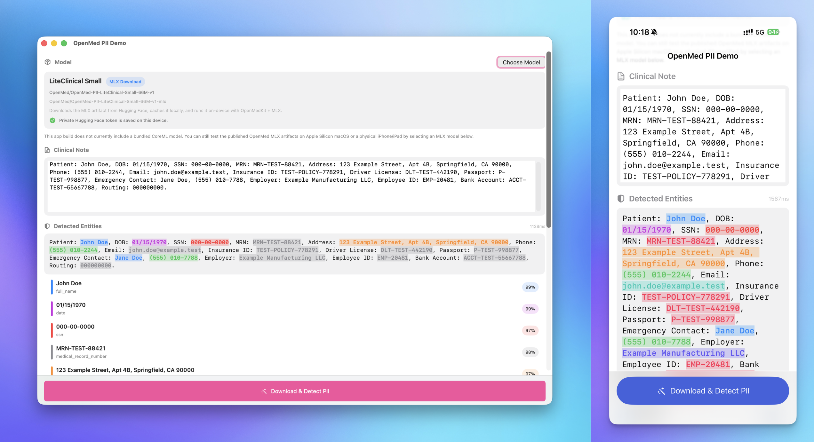

# OpenMed PII Demo (SwiftUI)

A minimal SwiftUI app demonstrating on-device PII detection using OpenMed's CoreML model. Runs on both **macOS** and **iOS**.



## Quick Start (Demo Mode)

The app works immediately in **demo mode** with mock entity detection — no model download needed:

1. Open `swift/OpenMedDemo/` in Xcode (File > Open)
2. Select the `OpenMedDemo` scheme
3. Choose a target: **My Mac** or **iPhone Simulator**
4. Run (Cmd+R)

You'll see highlighted PII entities (names, dates, phone numbers, SSNs) in the sample clinical note.

## Adding a Real CoreML Model

To switch from demo mode to real on-device inference:

### Step 1: Convert the model (Python)

```bash
# From the openmed repo root
pip install -e ".[coreml]"
python -m openmed.coreml.convert \
    --model OpenMed/OpenMed-PII-SuperClinical-Small-44M-v1 \
    --output swift/OpenMedDemo/OpenMedPII.mlpackage
```

This produces `OpenMedPII.mlpackage` and `OpenMedPII_id2label.json`.

### Step 2: Add to Xcode project

1. Drag `OpenMedPII.mlpackage` into the Xcode project navigator
2. Rename `OpenMedPII_id2label.json` to `id2label.json` and add it too
3. Ensure both files have **Target Membership** checked for `OpenMedDemo`

### Step 3: Run

The app auto-detects the bundled model and switches from demo mode to real inference.

## Architecture

```
OpenMedDemoApp.swift     — App entry point
ContentView.swift        — Main UI with:
  - TextEditor for clinical note input
  - "Detect PII Entities" button
  - Highlighted text view (color-coded by entity type)
  - Entity list with labels and confidence scores
  - Inference timing display
```

## Entity Color Coding

| Entity Type | Color |
|-------------|-------|
| NAME | Blue |
| DATE | Purple |
| PHONE | Green |
| SSN | Red |
| ADDRESS | Orange |

## Using OpenMedKit (Production)

For production apps, use the `OpenMedKit` Swift package instead of the inline inference code:

```swift
import OpenMedKit

let openmed = try OpenMed(
    modelURL: Bundle.main.url(forResource: "OpenMedPII", withExtension: "mlmodelc")!,
    id2labelURL: Bundle.main.url(forResource: "id2label", withExtension: "json")!
)
let entities = try openmed.analyzeText("Patient John Doe, SSN 123-45-6789")
```
